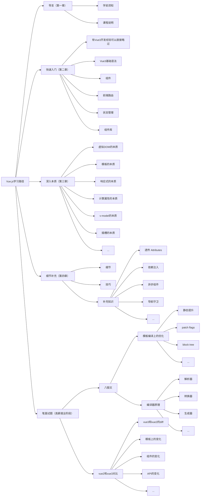

# P1S02L02：课程说明

---

## 1 内容深度

- 开发层面毕业：能胜任任何开发场景的开发。
- 深入理解原理（着重介绍思想）：
  - 响应式原理
  - 模板是如何编译
  - 编译器分为几个部分
  - 组件是如何工作
  - 渲染器又是如何渲染的
  - `diff` 算法是如何比较的
  - ....
- 不深入探讨源码：源码解读需要架构层面的知识——
  - `monorepo`
  - 工程化方案
  - 类型库选型
  - 设计模式
  - 前端工具链
  - 测试框架
  - ....

## 2 讲解方式

核心：**抓大放小、渐进式讲解**。

抓大放小：核心内容打穿打透、细枝末节后续补充（如某个常见需求的实现方法、某个新增特性的学习、某个不太常用的功能……详见第四章《细节补充》）。

渐进式：先快速入门，再窥探本质。入门阶段强化 `Vue` 的核心概念，以能上手干活为目标。

深入本质：即第三章《深入本质》相关内容，学完后能从容应对高薪岗位中的各种复杂度。

## 3 内容结构

