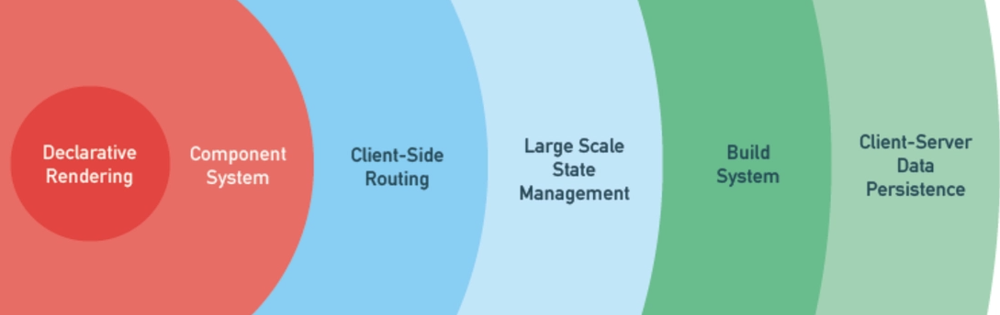

# P2S01L03：Vue 基础知识介绍

---

## 1 关于渐进式的理解

`Vue` 可以根据项目需要逐步扩展功能边界：

- 仅作为模板引擎
- 仅使用组件系统
- 后期引入路由机制
- （项目上一定规模后）引入状态管理
- 增加构建系统
- 引入 `C/S` 模式下的数据持久层
- ……

渐进式迭代是所有成熟的商业化产品的基本特征。任何大型项目的升级迁移都不可能一蹴而就。

## 2 关于响应式

不同于 `jQuery` 需要手动操作 `DOM`，`Vue` 和 `React` 均实现了 **数据驱动**，但彼此的实现方式有所不同（设计哲学的差异）：

- `Vue`：通过 **响应式** 实现
- `React`：通过 **手动触发视图的更新** 来实现 

## 3 关于组件化开发

**组件化开发** 是现代前端开发的又一个重要特征。**组件** 是对 `DOM` 结构的一种抽象，每个组件都有自身的结构（`HTML`）、样式（`CSS`）和行为（`JavaScript`）。

**组件** 旨在实现最大程度的代码复用。

## 4 关于 Vue 的模板语法

这也算是 `Vue` 的一个特色（`React` 则使用 `JSX`）。这对于后端开发者十分亲切：

早在后端为主、前后端未分离的时候，不同的语言存在不同的模板引擎——

|   语言    | 模板引擎                                                     |
| :-------: | ------------------------------------------------------------ |
|  `Java`   | *`JSP`、`Thymeleaf`、`Velocity`、`Freemarker`*               |
|   `PHP`   | *`Smarty`、`Twig`、`HAML`、`Liquid`、`Mustache`、`Plates`*   |
| `Python`  | *`pyTenjin`、`Tornado.template`、`PyJade`、`Mako`、`Jinja2`* |
| `Node.js` | *`Jade`、`Ejs`、`art-template`、`handlebars`、`mustache`、`swig`、`doT`* |

`Vue` 除了普通的 `HTML` 拼接外，也有自身独有的插值、循环、分支等模板语法（几乎所有模板引擎都具备）。

早期学习 `NodeJS` 完全照搬 `Java`、`PHP` 那套模式进行；如今 `NodeJS` 更多是作为 `BFF` 层（`Backend for Fontend`）。

> [!tip]
>
> `DeepSeek` 对 **BFF 层** 的详细解释
>
> > 【提问】
> > 看到一句话：早期学习 `NodeJS` 完全照搬 `Java`、`PHP` 那套模板引擎的模式进行（`Ejs`、`art-template` 等等）；如今的 `NodeJS` 更多是作为 `BFF` 层（`Backend for Fontend`）。
> > 这里的 `BFF` 层解释一下
>
> `DeepSeek`：
>
> 这句话非常精准地概括了 `Node.js` 在 `Web` 开发领域中角色的演变。下面对 **BFF层** 进行详细解释：
>
> ### 1. 核心定义：什么是 BFF？
>
> **BFF** 是 **Backend for Frontend**（服务于前端的后端）的缩写。
>
> 这个概念最早由技术社区（特别是 **Phil Calçado** 在 `SoundCloud` 的实践中）提出。它的核心思想是：**不再为所有前端设备（Web、iOS、Android、小程序等）提供一个统一的、大而全的后端 API，而是为每一种前端（或每一类前端）单独创建一个后端服务。**
>
> 这个专门的后端服务，就是 `BFF` 层。
>
> ---
>
> ### 2. 为什么会出现 BFF？
>
> 你提到的那句话展示了 `Node.js` 角色的转变，这正是 `BFF` 产生的背景：
>
> -   **早期（模板引擎时代）：** 那时候是“后端主导”的 `MVC` 模式。`Node.js`（通过 `Express` 等框架）直接读取数据库，在服务器端用 `Ejs`、`art-template` 把数据塞进 `HTML` 里，生成完整的页面返回给浏览器。此时，**Node.js 就是完整的后端**。
>
> -   **现在（BFF时代）：** 随着移动互联网的发展，前端场景变得复杂：有浏览器（`PC` 端）、手机浏览器（`H5`）、`iOS/Android App`、小程序等。如果所有的前端都去调同一个“大后端 `API`”，会出现问题：
>     -   **数据冗余：** `App` 的屏幕小，可能只需要用户名和头像，但后端接口却把用户的订单列表、详细资料全部返回，浪费流量。
>     -   **多次请求：** 一个网页可能需要同时调用“用户 `API`”、“商品 `API`”、“评论 `API`”才能展示完整页面，导致前端加载慢。
>     -   **业务耦合：** 后端的微服务拆分得很细，前端直接面对这些细碎的微服务会非常痛苦。
>
> 于是，**BFF层** 应运而生。`Node.js` 凭借其异步非阻塞（`I/O` 密集型能力强）和与前端同样的 `JavaScript` 语言（上下文切换成本低）的优势，成为了 `BFF` 层的绝佳选择。
>
> ---
>
> ### 3. BFF 层充当了什么角色？
>
> `BFF` 层既不是传统意义上的前端（不负责渲染 `UI`），也不是传统意义上的后端（不负责核心业务逻辑和数据库持久化）。它是一个 **“中间层适配器”**。
>
> 它的主要职责可以概括为 **“聚合”** 与 **“裁剪”**：
>
> 1.  **数据聚合（Composition）：**
>     -   假设前端页面需要展示“订单详情+商品信息+卖家昵称”。
>     -   如果没有 `BFF`，前端需要发三个请求。
>     -   有了 `BFF`，前端只发 **一个请求** 给 `BFF`。`BFF` 在后端同时调用“订单服务”、“商品服务”、“用户服务”，把三份数据拼在一起，再一并返回给前端。
>
> 2.  **数据裁剪（裁剪与适配）：**
>     -   **移动端 App** 的 `BFF` 可能只返回：`{名字、价格、图片}`。
>     -   **PC 端网页** 的 `BFF` 可能返回：`{名字、价格、图片、详细参数、用户评价、相关推荐}`。
>     -   `BFF` 针对不同端的特性，只返回该端真正需要的数据，过滤掉无用字段。
>
> 3.  **协议转换与路由：**
>     -   后端可能是 `RPC`（远程过程调用）协议，`BFF` 将其转换为前端的 `HTTP/JSON` 协议。
>     -   处理跨域请求、静态资源托管、简单的缓存逻辑。
>
> ### 4. 一个直观的比喻：BFF 就像“餐厅的服务员”
>
> 为了方便理解，可以把整个系统比作餐厅：
>
> -   **厨房（核心后端/微服务）：** 负责做菜（处理核心业务逻辑、操作数据库）。厨房很忙，只管把菜做好，不管谁吃、怎么吃。
> -   **顾客（前端）：** 坐在餐桌上，只想对着一个服务员点菜，不想直接去厨房窗口找不同的厨师（微服务）。
> -   **服务员（BFF层）：**
>     -   **聚合：** 顾客说“我要一份儿童套餐”。服务员需要去告诉甜品师拿冰淇淋、告诉热菜师傅做汉堡、告诉配菜师拿小玩具，最后把这些东西放在一个盘子里端给顾客。
>     -   **裁剪：** 如果顾客是儿童（移动端），服务员少放点辣椒；如果是成人（`PC` 端），可以推荐搭配啤酒。
>
> 在这个比喻中，**Node.js** 扮演的就是这个 **“服务员”** 的角色。它不懂怎么做菜（不直接操作数据库），但它最懂眼前的这位“顾客”（前端）需要什么。
>
> ### 5. BFF 的优缺点
>
> **优点：**
>
> -   **提升前端性能：** 减少 `HTTP` 请求次数，数据更精简。
> -   **前后端彻底解耦：** 后端微服务接口怎么变，`BFF` 层兜底，只要 `BFF` 返回给前端的格式不变，前端就不需要改代码。
> -   **前端更自主：** 前端团队可以维护 `BFF` 层，自己决定需要什么数据格式，无需频繁向后端催接口。
>
> **缺点：**
>
> -   **引入复杂性：** 架构中多了一层，就需要多维护一套代码，增加了部署和监控的节点。
> -   **响应延迟：** `BFF` 层本身需要网络调用去聚合数据，如果处理不当（串行请求），反而会拖慢响应速度（所以 `BFF` 里通常需要用 `Promise.all` 等并发请求）。
>
> ### 总结
>
> 你提到的那句话，正是指 `Node.js` 从 **“全栈渲染后端”**（负责生成页面 `HTML`）演变成了 **“数据网关”**（负责为前端聚合和裁剪 `API`）。如今的 `BFF` 层，主要目的是 **把前端从复杂的后端服务调用中解放出来，让前端更专注于界面交互，让后端更专注于业务逻辑。**

## 5 Vue 的相关技术栈

- `Vue`

  - 基础语法
  - 组件以及组件之间通信

- `vue-router`

- `Pinia`

- 组件库：

  - `ElementPlus`：https://element-plus.org/zh-CN/，[GitHub](https://github.com/element-plus/element-plus)

  - `NaiveUI`：https://www.naiveui.com/zh-CN/os-theme，[GitHub](https://github.com/tusen-ai/naive-ui)

  - `VarletUI`：https://varletjs.org/#/zh-CN/index，[GitHub](https://github.com/varletjs/varlet)

  - `iView`：https://www.iviewui.com/，[GitHub](https://github.com/view-design/ViewUIPlus)

    …

- `Vite`：伴随 `Vue3` 发布推出的构建工具，主要解决 `Webpack` 构建的诸多痛点，通过向本地服务器发请求的方式获取模块文件，从而大幅提升构建效率；

- `Vitest`：早期用于平替 `Jest` 的、`Vue` 语境下的单元测试框架；

- `Vue Test Utils`：测试 `Vue` 组件的工具库；

- `Nuxt.js`：基于 `Vue` 的高级框架，用于构建 `SSR` 服务端渲染模式的应用、或者基于静态站点生成（`SSG`）模式的应用；是一个基于 `Vue.js` 的、旨在提供卓越开发体验的、全栈式应用框架。

  …

本章主要讲解前四个技术栈：`Vue`、`vue-router`、`Pinia`、`ElementPlus` 组件库（使用面最广）。