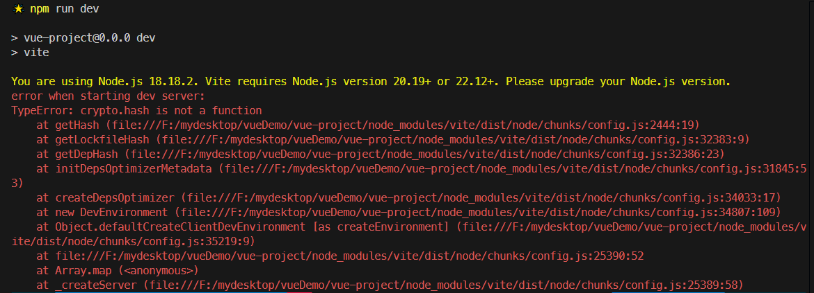
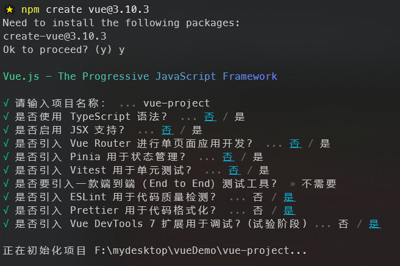
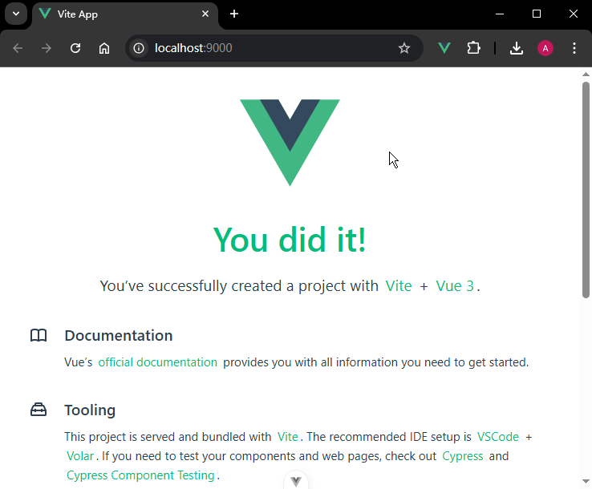

# P2S02L04：Vue 3 工程的搭建

---


## 1 准备工作

搭建工程所需的包管理器依旧选择 `npm`（此外还有 `pnpm`、`yarn`、`bun`）。

- `NodeJS`：`v18.18.2`
- `npm`：`9.8.1`
- `Vue`：`v3.4.23`（目前最新版为 `v3.5.29`，对 `NodeJS` 要求较高：`^20.19.0 || >=22.12.0`）
- 脚手架 `create-vue` 版本：`3.10.3`

> [!tip]
>
> 版本与视频保持一致，学完再与最新版对齐。


## 2 工程搭建

官方文档：https://vuejs.org/guide/quick-start.html

具体操作：

```bash
npm create vue@latest
```

实测报错：`node` 版本过低，无法运行最新脚手架创建的 `Vue3` 工程：



解决方案：指定具体的脚手架版本（视频中为 `3.10.3`）：

```bash
npm create vue@3.10.3
```

实测截图（已支持中文显示）：




## 3 项目结构

项目结构如下：

- **.vscode**：该文件夹通常包含 `VS Code` 的配置文件，用来设置代码格式化、主题样式等。
- **node_modules**：项目所需的所有 `node package` 包。当运行 `npm install` 或 `yarn` 时，`package.json` 中列出的所有依赖都会被安装到该文件夹下。
- **public**：用来存放 **静态资源** 的文件夹（即不会经过构建工具处理），例如 `favicon` 图标文件。
- **src**：源码文件夹，开发工作的主目录，通常包含 `Vue` 组件、`JavaScript` 文件、样式文件等。
  - `assets`：静态资源目录，但在打包时 **会被构建工具处理**；
  - `components`：组件目录，存放各种功能组件；
  - `App.vue`：根组件；
  - `main.js`：入口 `JS` 文件
- **.eslintrc.cjs**：`ESLint` 的配置文件，用于检查代码错误和风格问题，`cjs` 是基于 `CommonJS` 模块化标准的配置文件的扩展名。
- **.gitignore**：`Git` 的配置文件，用于设置无需加入版本控制的文件或文件夹。
- **.prettierrc.json**：`Prettier` 的配置文件，`Prettier` 是一个代码格式化工具。
- **index.html**：（:star:）项目的入口 `HTML` 文件，`Vite` 将利用它来处理应用的加载。
- **jsconfig.json**：`JavaScript` 的配置文件，用于**告诉 `VS Code` 如何处理 `JavaScript` 代码**，例如设置路径别名。
- **package-lock.json**：锁定安装时的包的版本，确保其他人在 `npm install` 时，大家的依赖能保持一致。
- **package.json**：定义了项目所需的各种模块以及项目的配置信息（例如项目的名称、版本、许可证等）。
- **README.md**：项目的说明文件，通常包含项目介绍、使用方法、贡献指南等。
- **vite.config.js**：`Vite` 的配置文件，用于定制 `Vite` 的构建和开发服务等。


## 4 VSCode 插件

- **Vue VSCode Snippets**：可快速生成 `Vue` 代码的模板；
- **Vue (Official)**
  - 在 `Vue2` 时期，大家接触更多的是 `Vetur`，该插件主要是对 `Vue` 单文件组件提供高亮，语法支持和检测功能；
  - 后面随着 `Vue3` 版本的发布，`Vue` 官方团队推荐使用 `Volar` 插件，该插件覆盖了 `Vetur` 所有的功能，并且支持 `Vue3` 版本，还支持 `TypeScript` 的语法检测；
  - 但是现在，无论是 `Vetur`、`Volar` 还是 `TypeScript Vue Plugin` 均已成为历史，目前官方推出了 `Vue - Official`（已更名为 `Vue (Official)`），它将前述插件的所有功能都涵盖了。

## 5 Vite

官网：https://vitejs.dev/

官方推荐的构建工具，显著提升开发体验。

`Vite` 之所以能够提升开发体验，是因为它的工作原理和 `Webpack` **完全不同**。`Vite` 压根儿就不打包，而是通过 **请求本地服务器** 的方式来获取文件。

常用的配置如下：

1. **base**：用于设置项目的基础路径。这对于部署到非根目录的项目特别有用。

2. **server**：配置开发服务器的选项，例如——

   - 端口号（`port`）

   - 自动打开浏览器（`open`）

   - 跨源资源共享（`cors`）

   - 代理配置（`proxy`）

     …

3. **build**：包含构建过程的配置，例如——

   - 输出目录（`outDir`）

   - 生产环境源码地图（`sourcemap`）

   - 压缩（`minify`）

   - 分块策略（`rollupOptions`）

     …

4. **css**：用于配置 `CSS` 相关选项，如预处理器配置、模块化支持等。

5. **esbuild**：可以自定义 `ESBuild` 的配置，例如指定 `JSX` 的工厂函数和片段。

6. **optimizeDeps**：用于预构建依赖管理，可以指定需要预构建的依赖，以加速冷启动时间。

7. **define**：允许你定义在源码中全局可用的常量替换。

8. **publicDir**：设置公共静态资源目录，默认为 `public`。


## 6 实测备忘

开发模式运行时支持多种快捷命令：

```shell
Shortcuts
  press r + enter to restart the server
  press u + enter to show server url   
  press o + enter to open in browser   
  press c + enter to clear console     
  press q + enter to quit
```

安全退出使用 `q + enter`。

尝试变更端口号、启动后自动打开浏览器：

```js
// vite.config.js:
// https://vitejs.dev/config/
export default defineConfig({
  // -- snip --
  server: {
    port: 9000,
    open: true
  }
})
```

实测截图：



