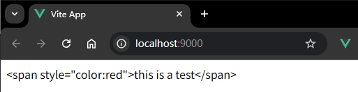
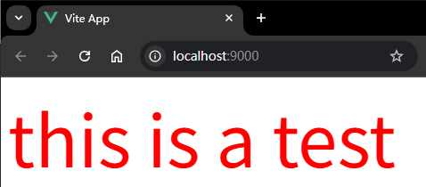
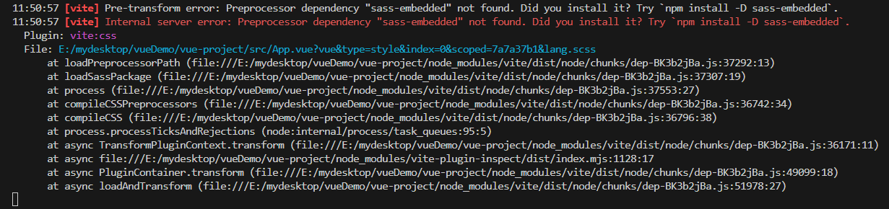
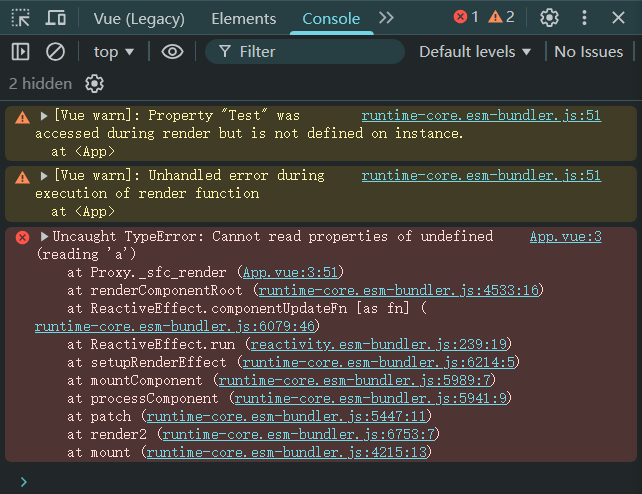
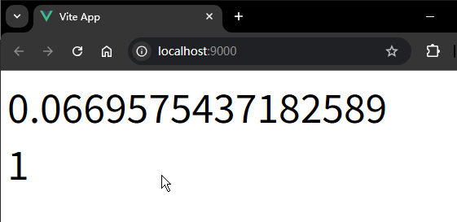

# P2S03L05：Vue 3 中的模板语法

---


> [!tip]
>
> 这里没有像禹神那样剖析 `setup` 语法糖的由来，感觉略显突兀。


所谓模板，是 `Vue` 中构建视图的地方。

`Vue 3` 模板的写法基本上和 `HTML` 一模一样，上手并无难度；之所以被称之为 **模板（template）**，就是因为它类似之前的模板引擎，提供了一些不同于纯 `HTML` 的特性。


## 1 文本插值

可以在模板里面使用一对大括号（双大括号、猫须语法），括号内部就可以绑定动态的数据。

```vue
<template>
  <div>{{ name }}</div>
</template>

<script setup>
const name = 'Steve'
</script>

<style lang="scss" scoped></style>
```


## 2 按 HTML 解析内容

有些时候，变量的值对应的是一段 `HTML` 代码，而普通的文本插值只会将其原封不动地输出。例如：

```vue
<template>
  <div>{{ htmlCode }}</div>
</template>

<script setup>
const htmlCode = '<span style="color:red">this is a test</span>'
</script>

<style lang="scss" scoped></style>
```

渲染结果：



如果想要让上面的 `HTML` 字符串以 `HTML` 的形式渲染出来，需要使用 `v-html` 指令。

**指令** 是带有 `v-` 前缀的特殊属性。`Vue` 提供了一部分内置指令，开发者还可以自定义指令。

`Vue` 中所有内置的指令：https://cn.vuejs.org/api/built-in-directives.html

用法：

```vue
<template>
  <div v-html="htmlCode"></div>
</template>

<script setup>
const htmlCode = '<span style="color:red">this is a test</span>'
</script>

<style lang="scss" scoped></style>
```

实测效果：



> [!tip]
>
> **【实测备忘】手动添加 Sass 依赖配置**
>
> 实测时在 `style` 标签添加任意 `CSS` 样式后编译报错：
>
> ```scss
> div {
> font-size: 5em;
> }
> ```
>
> 报错信息：
>
> ```markdown
> [plugin:vite:css] Preprocessor dependency "sass-embedded" not found. Did you install it? Try `npm install -D sass-embedded`.
> ```
>
> 
>
> 原因：从 `Vite 3.0` 开始，处理 `.scss` 文件的方式有了变化，因此导致了该报错。
>
> 按提示安装 `sass-embedded` 后，又出现编译警告：
>
> ```markdown
> Deprecation [legacy-js-api]: The legacy JS API is deprecated and will be removed in Dart Sass 2.0.0.
> 
> More info: https://sass-lang.com/d/legacy-js-api
> ```
>
> 原因：当前项目使用的 `Sass`（版本高于 `1.79.0`）正在调用一个将被废弃的旧版 `API`，并提醒你尽快迁移到新版 `API`。简单来说，工具链（`Vite` + `sass-embedded`）需要更新配置，以跟上 `Sass` 官方的现代化步伐。
>
> 通过以下 `vite` 配置消除警告：
>
> ```js
> // vite.config.js:
> export default defineConfig({
>   // +++ 新增以下 css 配置块 +++
>   css: {
>     preprocessorOptions: {
>       scss: {
>         api: 'modern-compiler' // 关键配置：告诉 Vite 使用新版 Sass API
>       }
>     }
>   }
> })
> ```
>
> 警告消失。


## 3 绑定属性

`Vue` 的核心思想是将模板中所有的内容都通过数据来控制，除了普通文本以外，`HTML` 元素属性也应该由数据来控制，这就是所谓的 **属性绑定**。

例如：

```vue
<template>
  <div v-bind:id="id">hello</div>
</template>

<script setup>
const id = 'my-id'
</script>

<style lang="scss" scoped></style>
```

属性的动态绑定用得非常的多，因此有一种简写形式，直接用一个冒号（`:`）表示该属性是动态绑定的：

```vue
<template>
  <div :id="id">hello</div>
</template>

<script setup>
const id = 'my-id'
</script>

<style lang="scss" scoped></style>
```

对于 **Vue 3.4 以上版本**，如果动态绑定的属性和数据同名，则还可以简写为：

```vue
<template>
  <div :id>hello</div>
</template>

<script setup>
const id = 'my-id'
</script>

<style lang="scss" scoped></style>
```


在 `HTML` 中，有一类属性是比较特殊的，就是布尔类型属性，例如 `disabled`，针对这一类布尔属性，绑定的数据不同，会有不同的表现：

- 如果所绑定的数据是 **真值** 或者 **空字符串**，该布尔值属性 **会存在**
- 如果所绑定的数据是假值（`null` 和 `undefined`），该布尔值属性会 **被忽略**


有时，如果想要绑定多个属性，那么这个时候可以直接绑定成一个对象：

```vue
<template>
  <div v-bind="attrObj">hello</div>
</template>

<script setup>
const attrObj = {
  id: 'container',
  class: 'wrapper'
}
</script>

<style lang="scss" scoped></style>
```


## 4 使用 JS 表达式

目前为止，模板可以绑定数据，但是目前数据是什么，模板中就渲染什么。

但是实际上模板中是可以对要渲染的数据进行一定处理的，通过 `JavaScript` 表达式来进行处理。

```vue
<template>
  <div>{{ number + 1 }}</div>
  <div>{{ ok ? '晴天' : '雨天' }}</div>
  <div>{{ message.split('').reverse().join('') }}</div>
  <div :id="`list-${id}`">{{ id + 100 }}</div>
</template>

<script setup>
const number = 1
const ok = true
const message = 'hello'
const id = 1
</script>

<style lang="scss" scoped></style>
```

这里有一个关键点，就是你要区分什么是 **表达式**，什么是 **语句**：

```vue
<!-- 这是一个语句，而非表达式 -->
{{ var a = 1 }}
<!-- 条件控制也不支持，请使用三元表达式 -->
{{ if (ok) { return message } }}
```

有一个简单的判断方法：**看是否能够写在 return 后面**。如行，则为表达式；否则为语句。

例如函数调用，其实就是一个表达式：

```js
return test();
```

```vue
{{ test() }}
```


## 5 模板沙盒化

模板中可以使用表达式，这些表达式都是沙盒化的，沙盒的意义主要在于安全：在模板中能够访问到全局对象，但是由于沙盒的存在，对能够访问到的全局对象进行了限制，只能访问 [部分的全局对象](https://github.com/vuejs/core/blob/main/packages/shared/src/globalsAllowList.ts#L3)：

```js
const GLOBALS_ALLOWED =
  'Infinity,undefined,NaN,isFinite,isNaN,parseFloat,parseInt,decodeURI,' +
  'decodeURIComponent,encodeURI,encodeURIComponent,Math,Number,Date,Array,' +
  'Object,Boolean,String,RegExp,Map,Set,JSON,Intl,BigInt,console,Error,Symbol'
```

例如：

```vue
<template>
  <div>{{ Math.random() }}</div>
</template>

<script setup></script>

<style lang="scss" scoped></style>
```

但是如果是不在上述列表中的，则无法访问到：

```vue
<template>
  <div>{{ Math.random() }}</div>
  <div>{{ Test.a }}</div>
</template>

<script setup>
window.Test = {
  a: 1
}
</script>

<style lang="scss" scoped></style>
```

这里尝试让 `window` 挂载一个新的全局对象，然后在模板中进行访问，但是报错了：`Cannot read properties of undefined (reading 'a')`



若确需在 `window` 挂载一个全局对象供模板访问，可以使用 `app.config.globalProperties`，例如：

```js
// main.js
// import './assets/main.css'

import { createApp } from 'vue'
// 引入了根组件
import App from './App.vue'

// 挂载根组件
const app = createApp(App)

// 在这里新增全局对象属性
app.config.globalProperties.Test = {
  a: 'Hello, Global Object!'
}

app.mount('#app')
```

实测截图：

