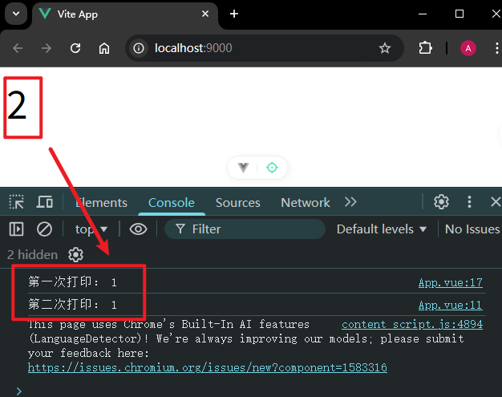
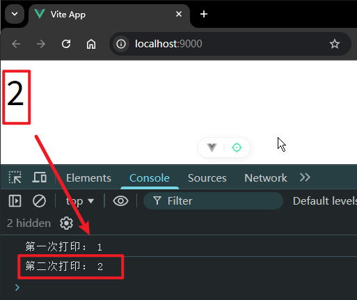

# P2S04L06：响应式基础（一）

---


## 1 ref 的用法

可以使用 `ref` 创建一个响应式的数据：

```vue
<template>
  <div>{{ name }}</div>
</template>

<script setup>
import { ref } from 'vue'
// 现在的 name 就是一个响应式数据
let name = ref('Bill')
console.log(name)
console.log(name.value)
setTimeout(() => {
  name.value = 'Tom'
}, 2000)
</script>

<style lang="scss" scoped></style>
```

`ref` 返回的响应式数据是一个对象，我们需要通过 `.value` 访问到内部具体的值。

`template` 模板中之所以不需要 `.value`，是因为在模板会对 `ref` 类型的响应式数据 **自动解包**。

`ref` 可以持有任意类型的值：对象、数组、普通类型的值、`Map`、`Set`…

参数为对象时：

```vue
<template>
  <div>{{ Bill.name }}</div>
  <div>{{ Bill.age }}</div>
</template>

<script setup>
import { ref } from 'vue'
// 现在的 name 就是一个响应式数据
let Bill = ref({
  name: 'Biil',
  age: 18
})
setTimeout(() => {
  Bill.value.name = 'Biil2'
  Bill.value.age = 20
}, 2000)
</script>

<style lang="scss" scoped></style>
```

数组的例子：

```vue
<template>
  <div>{{ arr }}</div>
</template>

<script setup>
import { ref } from 'vue'
// 现在的 name 就是一个响应式数据
let arr = ref([1, 2, 3])
setTimeout(() => {
  arr.value.push(4, 5, 6)
}, 2000)
</script>

<style lang="scss" scoped></style>
```

第二个点，`ref` 所创建的响应式数据是具备深层响应式（`deep conversion`），这一点主要体现在值是对象时（包括存在嵌套对象的情况）：

```vue
<template>
  <div>{{ Bill.name }}</div>
  <div>{{ Bill.age }}</div>
  <div>{{ Bill.nested.count }}</div>
</template>

<script setup>
import { ref } from 'vue'
// 现在的 name 就是一个响应式数据
let Bill = ref({
  name: 'Biil',
  age: 18,
  nested: {
    count: 1
  }
})
setTimeout(() => {
  Bill.value.name = 'Biil2'
  Bill.value.age = 20
  Bill.value.nested.count += 2
}, 2000)
</script>

<style lang="scss" scoped></style>
```


## 2 shallowRef 的用法

如果想要放弃深层次的响应式，可以使用 `shallowRef`，通过 `shallowRef` 所创建的响应式，不会将对象的每一层键值对深度递归为响应式数据，而仅仅只会将 `.value` 访问到的值转为响应式：

```js
const state = shallowRef({ count: 1});
// 这个操作不会触发响应式更新
state.value.count += 2;
// 只针对 .value 值的更改会触发响应式更新
state.value = { count: 2}
```

例如：

```vue
<template>
  <div class="app">
    <div>{{ Bill.name }}</div>
    <div>{{ Bill.age }}</div>
    <div>{{ Bill.nested.count }}</div>
  </div>
</template>

<script setup>
import { shallowRef } from 'vue'

let Bill = shallowRef({
  name: 'Biil',
  age: 18,
  nested: {
    count: 1
  }
})

setTimeout(() => {
  Bill.value.name = 'Gates'
  Bill.value.age = 28
  Bill.value.nested.count += 3
  console.log('1st update')
}, 2000)

setTimeout(() => {
  Bill.value = {
    name: 'Gates',
    age: 38,
    nested: {
      count: 10
    }
  }
  console.log('2nd update')
}, 4000)
</script>

<style lang="scss" scoped>
.app {
  font-size: 3em;
}
</style>
```


## 3 关于响应式数据和 DOM 更新之间的不同步

响应式数据的更新，带来了 `DOM` 的自动更新，但是这个 `DOM` 的更新 **并非是同步的**。这意味着当响应式数据发生修改后立即获取 `DOM` 值，拿到的是视图更新前的 `DOM` 数据：

```vue
<template>
  <div id="container">{{ count }}</div>
</template>

<script setup>
import { ref, onMounted } from 'vue'
let count = ref(1),
  container = null

onMounted(() => {
  container = document.getElementById('container')
  console.log('第一次打印：', container.innerText)
})

setTimeout(() => {
  count.value = 2 // 修改响应式状态
  console.log('第二次打印：', container.innerText)
}, 2000)
</script>

<style lang="scss" scoped>
#container {
  font-size: 3em;
}
</style>
```

实测结果：



如果想要获取最新的 `DOM` 数据，可以使用 `nextTick`，这是 `Vue` 提供的一个工具方法，会等待下一次的 `DOM` 更新，从而方便后面能够拿到最新的 `DOM` 数据：

```vue
<template>
  <div id="container">{{ count }}</div>
</template>

<script setup>
import { ref, onMounted, nextTick } from 'vue'
let count = ref(1)
let container = null

onMounted(() => {
  container = document.getElementById('container')
  console.log('第一次打印：', container.innerText)
})

setTimeout(async () => {
  count.value = 2
  await nextTick()
  console.log('第二次打印：', container.innerText)
}, 2000)
</script>

<style lang="scss" scoped>
#container {
  font-size: 3em;
}
</style>
```

实测结果：



如果不用 `async await`，那么就是通过回调的形式：

```js
setTimeout(() => {
  count.value = 2 // 修改响应式状态
  // 等待下一个 DOM 更新周期
  nextTick(() => {
    // 这个时候再打印就是最新的值了
    console.log('第二次打印：', container.innerText)
  })
}, 2000)
```

当然还是推荐使用 `async await`，看上去代码的逻辑更加清晰一些。

