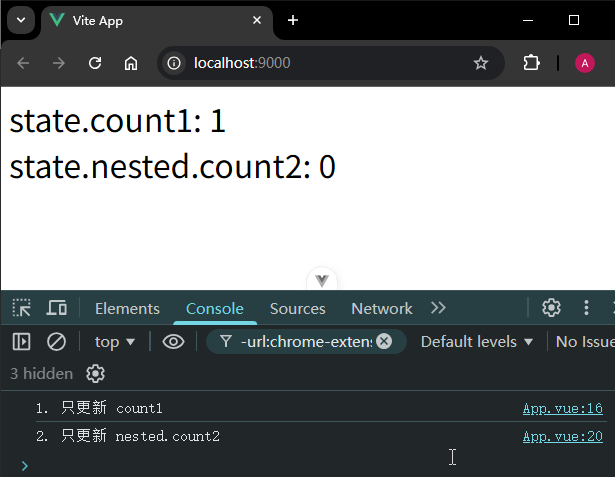
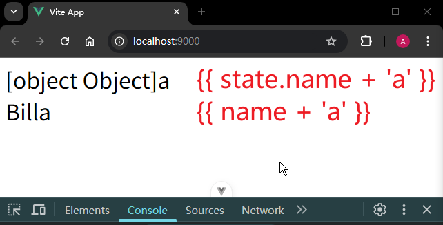
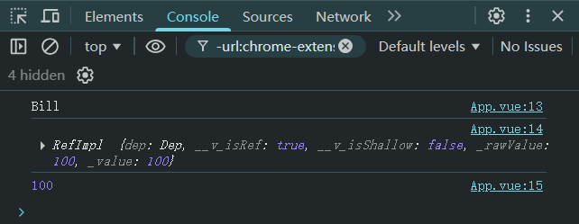
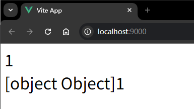

# P2S05L07：响应式基础（二）

---


## 1 reactive 的用法

`reactive` 通常将一个对象转为 **响应式对象**：

```vue
<template>
  <div>{{ state.count1 }}</div>
  <div>{{ state.nested.count2 }}</div>
</template>

<script setup>
import { reactive } from 'vue'
const state = reactive({
  count1: 0,
  nested: {
    count2: 0
  }
})
setTimeout(()=>{
  state.count1++
  state.nested.count2 += 2;
},2000);
</script>

<style lang="scss" scoped></style>
```

注意：`reactive()` 修饰的对象无须通过 `.value` 访问对应的值。

`Vue` 中的响应式底层是通过 `Proxy API` 来实现的，但是这个 `Proxy API` 只能对 **对象** 进行拦截，无法对 **原始值** 进行拦截。

这里就会产生一个问题：如果用户想要把一个原始值转为响应式，该怎么办？

此时有两种设计方案：

1. 让用户自己处理，用户需要将自己想要转换的原始值包装为对象，然后再使用 `reactive API`（:x:）
2. 框架层面来处理，多提供一个 `API`，这个 `API` 可以帮助用户简化操作，将原始值也能转为响应式数据（:white_check_mark:）

`ref` 的背后其实也调用了 `reactive API`

- 原始值：`Object.defineProperty`
- 复杂值：`reactive API`


`reactive` 还有一个相关的 `API`：`shallowReactiveAPI`，是浅层次的转换，不会深层次去转换成响应式：

```vue
<template>
  <div>{{ state.count1 }}</div>
  <div>{{ state.nested.count2 }}</div>
</template>

<script setup>
import { shallowReactive } from 'vue'
const state = shallowReactive({
  count1: 0,
  nested: {
    count2: 0
  }
})
setTimeout(()=>{
  state.count1++
},2000);
setTimeout(()=>{
  state.nested.count2++
},4000)
</script>

<style lang="scss" scoped></style>
```

实测效果：



> [!tip]
>
> 实测 `shallowReactive` 的用法时，错将浅层属性和深层属性的更新放到一起，容易引起误会：
>
> ```vue
> <template>
>   <div id="container">
>     <div>object.count: {{ obj.count }}</div>
>     <div>object.nested.count: {{ obj.nested.count }}</div>
>   </div>
> </template>
> 
> <script setup>
> import { shallowReactive } from 'vue'
> 
> let obj = shallowReactive({
>   count: 0,
>   nested: {
>     count: 0
>   }
> })
> 
> setTimeout(() => {
>   obj.count++
>   obj.nested.count++
>   console.log('1st update')
> }, 2000)
> 
> setTimeout(() => {
>   obj.nested.count = 3
>   console.log('2nd update')
> }, 4000)
> </script>
> ```
>
> 实测效果（`nested.count` 在首次更新时也一并更新了）：
>
> 
>
> 出现错觉的原因：**`nested.count` 能更新，不是因为它是响应式的，而是因为 `obj.count++` 触发了组件重新渲染！**
>
> 过程分解：
>
> 1. **`obj.count++`** ✅ 触发响应式更新 → 组件重新渲染
> 2. **重新渲染时**，`Vue` 重新读取模板中的所有值
> 3. **此时读取 `obj.nested.count`**，而它已经是修改后的 `2` 了
>
> 关键点：
>
> - `nested.count = 2` 这个修改 **本身不会触发更新**
> - 是 `obj.count++` 触发的重新渲染，"顺便"把新值展示出来了。


## 2 ref() 和 reactive() 在使用上的细节

> [!important]
>
> **最佳实践**
>
> 尽量使用 `ref` 来作为声明响应式数据的主要 `API`。


### 2.1. reactive 的局限性

1. 使用 `reactvie` 创建响应式数据时，值的类型是有限的
   - 只能是对象类型（`object`、`array`、`map`、`set`）
   - 不能够是简单值（`string`、`number`、`boolean`）
2. （算是一个注意点）不能去替换响应式对象，否则会丢失响应式的追踪：

```js
let state = reactive({count : 0});
// 下面的这个操作会让上面的对象引用不再被追踪，从而导致上面对象的响应式丢失
state = reactive({count : 1})
```

3. 对解构操作不友好，当对一个 `reactvie` 响应式对象进行解构的时候，也会丢失响应式：

```js
let state = reactive({count : 0});
// 当进行解构的时候，解构出来的是一个普通的值
let { count } = state;
count++; // 这里也就是单纯的值的改变，不会触发和响应式数据关联的操作

// 另外还有函数传参的时候
// 这里传递过去的也就是一个普通的值，没有响应式
func(state.count)
```


### 2.2. ref 解包细节

所谓 `ref` 的解包（`ref unwrapping`），指的是自动访问 `value`，不需要再通过 `.value` 去获取值。例如模板中使用 `ref` 类型的数据，就会自动解包。

#### 1 ref 作为 reactvie 对象的属性

此时也会自动解包：

```vue
<template>
  <div></div>
</template>

<script setup>
import { ref, reactive } from 'vue'
const name = ref('Bill')
const state = reactive({
  name
})
console.log(state.name) // 这里会自动解包
console.log(name.value)
</script>

<style lang="scss" scoped></style>
```

但如果 `ref` 作为 `shallowReactive` 对象的属性，则 **不会** 自动解包：

```vue
<template>
  <div></div>
</template>

<script setup>
import { ref, shallowReactive } from 'vue'
const name = ref('Bill')
const state = shallowReactive({
  name
})
console.log(state.name.value) // 不会自动解包
console.log(name.value)
</script>

<style lang="scss" scoped></style>
```

> `DIY` 实测：
>
> ```vue
> <template>
>   <div>{{ state.name + 'a' }}</div>
>   <div>{{ name + 'a' }}</div>
> </template>
> 
> <script setup>
> import { ref, shallowReactive } from 'vue'
> let name = ref('Bill'),
>   state = shallowReactive({
>     name
>   })
> </script>
> 
> <style lang="scss" scoped>
> div { font-size: 2em; }
> </style>
> ```
>
> 最终效果：
>
> 


因为对象的属性是一个 `ref` 值，这也是一个响应式数据，因此 `ref` 的变化会引起响应式对象的更新：

```vue
<template>
  <div>
    <div>{{ state.name.value }}</div>
  </div>
</template>

<script setup>
import { ref, shallowReactive } from 'vue'
const name = ref('Bill')
const state = shallowReactive({
  name
})
setTimeout(() => {
  name.value = 'Tom'
},2000)
</script>

<style lang="scss" scoped></style>
```

【课堂练习】下面的代码：

1. 为什么 `Bill` 渲染出来有双引号？
2. 为什么 2 秒后界面没有渲染 `Smith` ？

```vue
<template>
  <div>{{ obj.name }}</div>
</template>

<script setup>
import { ref, shallowReactive } from 'vue'
const name = ref('Bill') // name 是一个 ref 值
const obj = shallowReactive({
  name
})
setTimeout(() => {
  obj.name = 'John'
  console.log('1st update finished')
}, 1000)
setTimeout(() => {
  name.value = 'Smith'
  console.log('2nd update finished')
}, 2000)
</script>

<style lang="scss" scoped>
div {
  font-size: 2em;
}
</style>
```

答案：

1. 因为使用的是 `shallowReactive`，`shallowReactive` 内部的 `ref` 是不会自动解包的（**实测时已经不会渲染双引号了**）
2. 1秒后，`obj.name` 被赋值为 `'John'` 这个普通字符串值，导致和原来的 `ref` 数据失去了联系。

如果想要渲染出 `Smith`，修改如下（`L7`）：

```js
import { ref, shallowReactive } from 'vue'
const name = ref('Bill') // name 是一个 ref 值
const obj = shallowReactive({
  name
})
setTimeout(() => {
  obj.name.value = 'John'
  console.log('1st update finished')
}, 1000)
setTimeout(() => {
  name.value = 'Smith'
  console.log('2nd update finished')
}, 2000)
```

下面再来看一个例子：

```vue
<template>
  <div>{{ obj.name.value }}</div>
</template>

<script setup>
import { ref, shallowReactive } from 'vue'
const name = ref('Bill');
const stuName = ref('John');

const obj = shallowReactive({name})

// 注意这句代码，意味着和原来的 name 这个 Ref 失去关联
obj.name = stuName;

setTimeout(()=>{
  name.value = 'Tom';
}, 2000)

setTimeout(()=>{
  stuName.value = 'Smith';
}, 4000)
</script>

<style lang="scss" scoped></style>
```


#### 2 在数组和集合里使用 ref

如果将 `ref` 数据作为 `reactvie` 数组或者集合的某个元素，此时也是 **不会自动解包的**

```js
// 下面这些是官方所给的例子
const books = reactive([ref('Vue 3 Guide')])
// 这里需要 .value
console.log(books[0].value)

const map = reactive(new Map([['count', ref(0)]]))
// 这里需要 .value
console.log(map.get('count').value)
```

```vue
<template>
  <div></div>
</template>

<script setup>
import { ref, reactive } from 'vue'
const name = ref('Bill')
const score = ref(100)
const state = reactive({
  name,
  scores: [score]
})
console.log(state.name) // 会自动解包
console.log(state.scores[0]) // 不会自动解包
console.log(state.scores[0].value) // 100
</script>

<style lang="scss" scoped></style>
```

实测结果：




#### 3 在模板中的自动解包（顶级 ref）

在模板里面，只有 **顶级** `ref` 才会自动解包。

```vue
<template>
  <div>
    <div>{{ count }}</div>
    <div>{{ object.id }}</div>
  </div>
</template>

<script setup>
import { ref } from 'vue'
const count = ref(0) // 顶级的 Ref 自动解包
const object = {
  id: ref(1) // 这就是一个非顶级 Ref 不会自动解包
}
</script>

<style lang="scss" scoped></style>
```

上面的例子，感觉非顶级的 `ref` 好像也能够正常渲染出来，仿佛也是自动解包了的。

但是实际情况并非如此。

```vue
<template>
  <div>
    <div>{{ count + 1 }}</div>
    <div>{{ object.id + 1 }}</div>
  </div>
</template>

<script setup>
import { ref } from 'vue'
const count = ref(0) // 顶级的 Ref 自动解包
const object = {
  id: ref(1) // 这就是一个非顶级 Ref 不会自动解包
}
</script>

<style lang="scss" scoped></style>
```

例如我们在模板中各自加 1 就会发现上面因为已经解包出来了，所以能够正常的进行表达式的计算。

但是下面因为没有解包，意味着 `object.id` **仍然是一个对象**，因此最终计算的结果为 `[object Object]1`：



因此要访问 `object.id` 的值，没有自动解包我们就手动访问一下 `value`：

```vue
<template>
  <div>
    <div>{{ count + 1 }}</div>
    <div>{{ object.id.value + 1 }}</div>
  </div>
</template>
```


