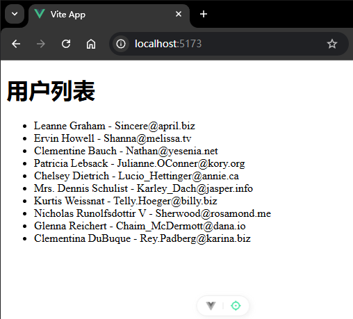

# P2S13L15：Vue 3 中的生命周期简介

---


## 1 理解什么是生命周期（:star:）

生命周期是组件（例如根组件 `App.vue`）从 **创建** 到 **最终销毁** 所经历的一系列过程。在这个过程中 `Vue` 设置了一些特殊的时间点，开发者可以在这些特殊的时间点设置一些函数，这样的函数称之为 **钩子函数（hooks）**。

必须把开发者设置的钩子函数执行完毕后，才能继续走后面的流程。

这就让开发者有机会在特定的时段 **执行自己的业务逻辑代码**。

完整的生命周期图如下：


## 2 快速入门

目前没有必要将上面所有的生命周期钩子函数都完全理解，先学习一个即可。

目前需要掌握的是 `mounted`。

`mounted` 时刻对应的钩子函数名为 `onMounted`；它会在完成了初始化渲染并且创建和插入了 `DOM` 节点后触发。这意味着在该时间节点，开发者可以访问真实的 `DOM` 元素：

```vue
<template>
  <div>
    <h1>用户列表</h1>
    <ul v-if="!loading">
      <li v-for="(user, index) in users" :key="index">{{ user.name }} - {{ user.email }}</li>
    </ul>
    <div v-if="loading">加载中...</div>
    <div v-if="error">出错啦！</div>
  </div>
</template>

<script setup>
import { ref, onMounted } from 'vue'

const users = ref([])
const loading = ref(false)
const error = ref(null)

onMounted(async () => {
  // 一般来讲，我们会在此生命周期钩子方法中请求数据
  loading.value = true
  try {
    const res = await fetch('https://jsonplaceholder.typicode.com/users')
    if (res.ok) {
      users.value = await res.json()
    } else {
      throw new Error('请求失败')
    }
  } catch (err) {
    error.value = err.message
  } finally {
    // 无论是出错也好，还是正常请求到了数据，都需要将 loading 状态改为 false
    loading.value = false
  }
})
</script>

<style scoped></style>
```

实测截图（实测代码详见 `L15_onMounted` 分支）：



完整的生命周期钩子方法：https://cn.vuejs.org/api/composition-api-lifecycle.html


## 3 Vue 2 中的生命周期

注意，`Vue3` 中是支持 `Vue2` 的生命周期方法的，毕竟之前 `Vue2` 的 **选项式 API** 的写法是作为一种 **代码风格** 继续存在于 `Vue3` 中的。

`Vue2` 以前那些生命周期方法和 `Vue3` 是 **共存的**，只不过名字有一些不一样，例如上面的 `mounted` 阶段对应的钩子方法——

- `Vue3` 名称：`onMounted`
- `Vue2` 名称：`mounted`

另外，二者的执行时机也略有不同：假设 `Vue2` 和 `Vue3` 同一个生命周期中设置了两种形式的钩子方法，`Vue3` 钩子方法的执行时机会 **早于** `Vue2` 的钩子方法：

```vue
<template>
  <div>Vue2 和 Vue3 钩子函数执行时机对比</div>
</template>

<script>
import { onMounted } from 'vue'
// 这里使用选项时API风格
export default {
  mounted() {
    console.log('执行Vue2的钩子函数')
  },
  setup() {
    // 使用setup函数
    onMounted(() => {
      console.log('执行Vue3的onMounted函数')
    })
  }
}
</script>

<style scoped></style>
```

上面的这个点稍微有一个印象即可。真实开发中是 **不可能两个版本的生命周期钩子方法混着使用的**。

