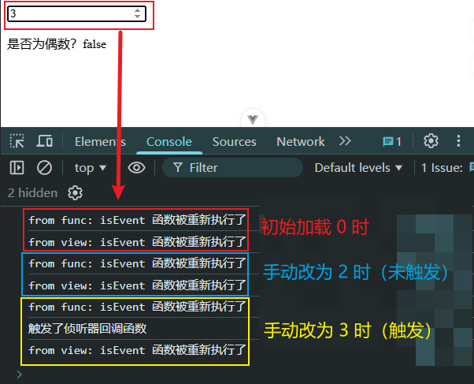
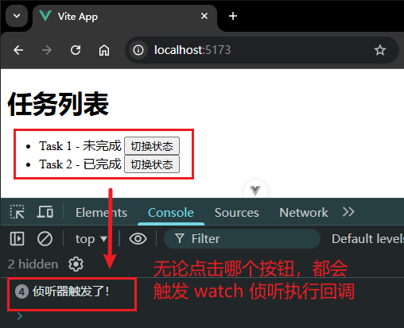
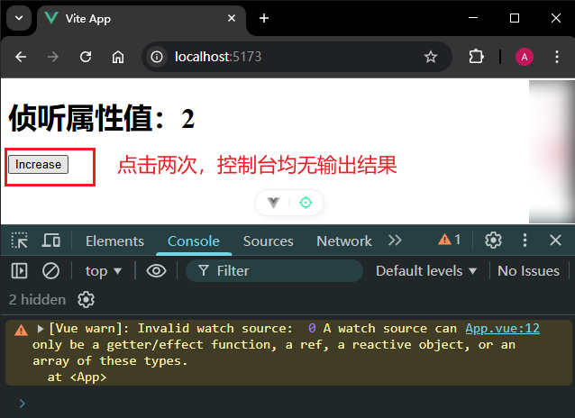
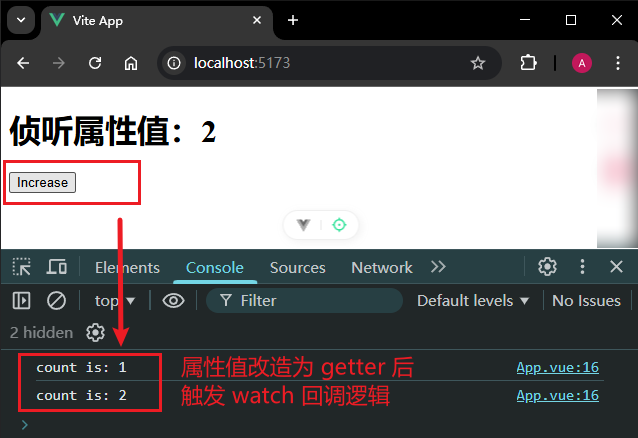
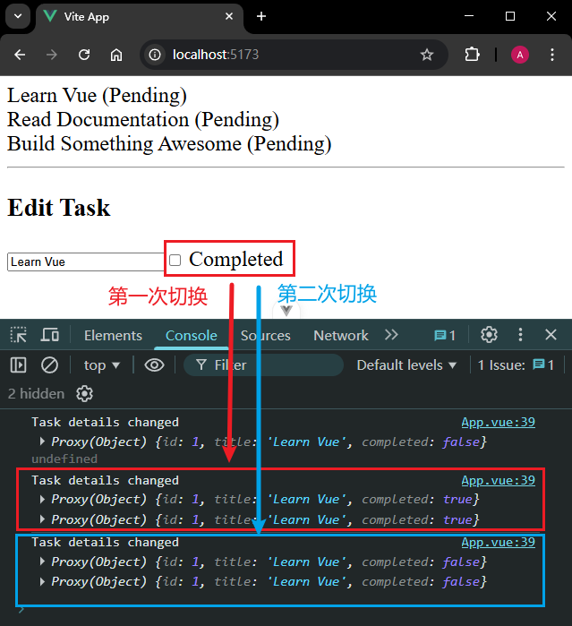

# P2S14L16：Vue3 中的侦听器（一）

---


> [!tip]
>
> `Vue3` 中的侦听器（`watch`）分为两类：
>
> - `watch`
> - `watchEffect`
>
> 本节介绍 `watch` 相关知识，下一节介绍 `watchEffect`。


侦听器与计算属性类似，都是依赖响应式数据。不过计算属性是在依赖的数据发生变化时进行二次计算，不会涉及副作用操作；侦听器则刚好相反，在依赖的数据发生变化时允许某些副作用操作（如更改 `DOM`、发送异步请求等）。


## 1 快速入门

```vue
<template>
  <div>
    <h1>智能机器人</h1>
    <div>
      <input v-model="question" placeholder="请输入问题" />
    </div>
    <div v-if="loading">正在加载中...</div>
    <div v-else>{{ answer }}</div>
  </div>
</template>

<script setup>
import { ref, watch } from 'vue'
const question = ref('') // 存储用户输入的问题，以 ？ 结束
const answer = ref('') // 存储机器人的回答
const loading = ref(false) // 是否正在加载中
// 侦听器所对应的回调函数，接收两个参数
// 一个是依赖数据的新值，一个是依赖数据的旧值
watch(question, async (newValue) => {
  if (newValue.endsWith('?')) {
    loading.value = true
    answer.value = '思考中....'
    try {
      const res = await fetch('https://yesno.wtf/api')
      const result = await res.json()
      answer.value = result.answer
    } catch (err) {
      answer.value = '抱歉，我无法回答您的问题'
    } finally {
      loading.value = false
    }
  }
})
</script>

<style scoped></style>
```

本例中，`watch` 就是一个 **侦听器**，负责侦听 `question` 这个 `ref` 状态的变化情况：每当 `ref` 状态发生变化，`Vue` 就会重新执行后面的回调函数。该回调函数先后接收两个参数：

- 新的状态值（`newValue`）
- 旧的状态值（`oldValue`）

再次强调：在该回调函数中，**支持副作用操作**。


## 2 watch 侦听器的几处细节

### 2.1 侦听的数据源类型

除了快速入门中演示的侦听 `ref` 类型的数据外，侦听器还支持其他类型的数据源，包括——

#### 1 计算属性

```vue
<template>
  <div>
    <input type="text" v-model="firstName" placeholder="first name" />
    <input type="text" v-model="lastName" placeholder="last name" />
    <p>全名：{{ fullName }}</p>
  </div>
</template>

<script setup>
import { ref, computed, watch } from 'vue'
const firstName = ref('John')
const lastName = ref('Doe')
const fullName = computed(() => `${firstName.value} ${lastName.value}`)

// 设置侦听器
watch(fullName, (newVal, oldVal) => {
  console.log(`new: ${newVal}, old: ${oldVal}`)
})
</script>

<style scoped></style>
```

#### 2 reactive 响应式对象

```vue
<template>
  <div>
    <input type="text" v-model="user.name" placeholder="name" />
    <input type="text" v-model="user.age" placeholder="age" />
    <p>用户信息：{{ user.name }} - {{ user.age }}</p>
  </div>
</template>

<script setup>
import { reactive, watch } from 'vue'
const user = reactive({
  name: 'John',
  age: 18
})

// 设置侦听器
watch(user, () => {
  console.log('触发了侦听器回调函数')
})
</script>

<style scoped></style>
```

#### 3 Getter 函数

```vue
<template>
  <div>
    <input type="number" v-model="count" />
    <p>是否为偶数？{{ isEven() }}</p>
    <div>count2: {{ count2 }}</div>
    <button @click="count2++">+1</button>
  </div>
</template>

<script setup>
import { ref, watch } from 'vue'
const count = ref(0)
const count2 = ref(0)

// 注意这个函数本身，是每次重新渲染的时候都会重新执行的
function isEven() {
  console.log('isEvent 函数被重新执行了')
  if (count2.value === 5) {
    return 'this is a test'
  }
  return count.value % 2 === 0
}
// 设置侦听器
// 这里侦听的是函数的返回值结果
// 如果函数返回值发生变化，就会触发侦听器回调函数
watch(isEven, () => {
  console.log('触发了侦听器回调函数')
})
</script>

<style scoped></style>
```

上例并未清晰定义何为 `getter` 函数。实测时改为如下版本，可清晰辨认两次执行的前后顺序：

```html
<template>
  <div>
    <input type="number" v-model="count" />
    <p>是否为偶数？{{ isEven('view') }}</p>
  </div>
</template>

<script setup>
import { ref, watch } from 'vue'
const count = ref(0)

// 注意这个函数本身，是每次重新渲染的时候都会重新执行的
function isEven(src = 'func') {
  console.log(`from ${src}: isEvent 函数被重新执行了`)
  return count.value % 2 === 0
}
// 设置侦听器
// 这里侦听的是函数的返回值结果
// 如果函数返回值发生变化，就会触发侦听器回调函数
watch(isEven, () => {
  console.log('触发了侦听器回调函数')
})
</script>
```

实测效果如下：



可以看到，`script` 中的函数执行 **总是先于** 视图中的函数执行，并且只在函数返回值变更时才会触发 `watch` 侦听。

> [!tip]
>
> **DIY 增补：JavaScript 语境下的 Getter 函数**
>
> MDN：https://developer.mozilla.org/en-US/docs/Web/JavaScript/Reference/Functions/get
>
> The **`get`** syntax binds an object property to a function that will be called when that property is looked up. It can also be used in [classes](https://developer.mozilla.org/en-US/docs/Web/JavaScript/Reference/Classes).
>
> ```js
> const obj = {
>   log: ["a", "b", "c"],
>   get latest() {
>     return this.log[this.log.length - 1];
>   },
> };
> 
> console.log(obj.latest);
> // Expected output: "c"
> ```
>
> `getter` 函数的语法：
>
> ```js
> { get prop() { /* … */ } }
> { get [expression]() { /* … */ } }
> ```
>
> 注意：`getter` 函数不能传入参数。
>
> - `prop`：要与给定函数绑定的属性名称。与对象初始化模块中的其他属性一样，`prop` 可以是字符串常量、数字常量或标识符。
> - `expression`：还可以使用表达式作为计算属性的名称，将其绑定到指定的函数上。
>
> `expression` 示例：
>
> ```js
> const expr = "foo";
> 
> const obj = {
>   get [expr]() {
>     return "bar";
>   },
> };
> 
> console.log(obj.foo); // "bar"
> ```
>
> `getter` 的删除方法：使用 `delete` 关键字（`L9`）：
>
> ```js
> const obj = {
>   log: ["example", "test"],
>   get latest() {
>     return this.log.at(-1);
>   },
> };
> console.log(obj.latest); // "test"
> 
> delete obj.latest;
> ```
>
> `getter` 还可以用作特征检测：
>
> ```js
> function isColorTypeSupported() {
>   let supported = false;
>   const obj = {
>     get colorType() {
>       supported = true;
>       return undefined;
>     },
>   };
>   document.createElement("canvas").getContext("2d", obj);
>   return supported;
> }
> ```


#### 4 多个数据源所组成的数组

```vue
<template>
  <div>
    <div>
      <input type="text" v-model="title" />
    </div>
    <div>
      <textarea v-model="description" cols="30" rows="10"></textarea>
    </div>
  </div>
</template>

<script setup>
import { ref, watch } from 'vue'
const title = ref('')
const description = ref('')
// 这里侦听的是多个数据源所组成的数组
// 数组里面任何一个数据发生变化，都会触发回调函数
watch([title, description], () => {
  console.log('侦听器的回调函数执行了')
})
</script>

<style scoped></style>
```


### 2. 侦听层次

侦听的层次问题主要针对的是 `reactive` 响应式对象：当侦听数据源为 `reactvie` 类型数据时，默认为 **深层次侦听**：即便是嵌套的属性值发生变化，侦听器的回调函数也会被触发：

```vue
<template>
  <div>
    <h1>任务列表</h1>
    <ul>
      <li v-for="task in tasks.list" :key="task.id">
        {{ task.title }} - {{ task.completed ? '已完成' : '未完成' }}
        <button @click="task.completed = !task.completed">切换状态</button>
      </li>
    </ul>
  </div>
</template>

<script setup>
import { reactive, watch } from 'vue'
const tasks = reactive({
  list: [
    { id: 1, title: 'Task 1', completed: false },
    { id: 2, title: 'Task 2', completed: true }
  ]
})

watch(tasks, () => {
  console.log('侦听器触发了！')
})
</script>

<style scoped></style>
```

实测结果：



可见，当侦听的对象一个是 `reactive` 型响应式数据时，`Vue` 是深层次侦听的。

> [!warning]
>
> **警告**
>
> 虽然本例演示的特性非常实用，但在用于大型数据结构时的资源开销也同样很大，因此一定要留意性能，**只在必要时使用**。


补充：当侦听的对象是一个 `reactive` 值时，不能直接侦听该响应式对象的属性值：

```vue
<template>
  <div>
    <h1>侦听属性值：{{ obj.count }}</h1>
    <button @click="obj.count++">Increase</button>
  </div>
</template>

<script setup>
import { reactive, watch } from 'vue'
const obj = reactive({ count: 0 })

// 错误，因为 watch() 得到的参数是一个 number
watch(obj.count, (count) => {
  console.log(`count is: ${count}`)
})
</script>
```

实测结果：



若确需侦听其属性值，可将属性值改造为一个 `Getter` 函数：

```vue
<template>
  <div>
    <h1>侦听属性值：{{ obj.count }}</h1>
    <button @click="obj.count++">Increase</button>
  </div>
</template>

<script setup>
import { reactive, watch } from 'vue'
const obj = reactive({ count: 0 })

// 错误，因为 watch() 得到的参数是一个 number
watch(
  () => obj.count,
  (count) => {
    console.log(`count is: ${count}`)
  }
)
</script>
```

实测结果：




### 3. 第三个参数

- 第一个参数：侦听的数据源
- 第二个参数：数据发生变化时要执行的回调函数
- 第三个参数：选项对象
  - `immediate`：`true | false`
    - 默认情况下，`watch` 的回调函数是懒执行的，即只在依赖数据发生变化时才会执行回调。
    - 当期望立即执行一次时（如请求一些初始化数据），就可以设置该配置项为 `true`。
  - `once`：`true | false`
    - 作用：侦听器的回调函数 **只执行一次**
  - `deep`：`true | false`
    - 作用：强制转换为深层次侦听器
    - 适用场景：当 `watch` 一个由计算属性或 `getter` 函数返回的对象时，该侦听就不是深层次侦听；此时可令 `deep` 为 `true`，手动改为深层次侦听。

`deep` 配置项示例：

给定一个任务列表数组 `tasks`，将其渲染到页面后，点击某个任务内容，可变更 `selectedId` 和 `selectedTask` 的状态。`selectedTask` 一旦被重新赋值，就会单独显示该任务信息，并通过一个复选框切换其 `completed` 的值：

```vue
<template>
  <div class="app">
    <div class="item" v-for="task in tasks" :key="task.id" @click="selectTask(task)">
      {{ task.title }} ({{ task.completed ? 'Completed' : 'Pending' }})
    </div>
    <hr />
    <div v-if="selectedTask">
      <h3>Edit Task</h3>
      <input v-model="selectedTask.title" placeholder="Edit title" />
      <label>
        <input type="checkbox" v-model="selectedTask.completed" />
        Completed
      </label>
    </div>
  </div>
</template>

<script setup>
import { reactive, computed, watch } from 'vue'

const tasks = reactive([
  { id: 1, title: 'Learn Vue', completed: false },
  { id: 2, title: 'Read Documentation', completed: false },
  { id: 3, title: 'Build Something Awesome', completed: false }
])

const selectedId = reactive({ id: null })

// 这是一个计算属性
const selectedTask = computed(() => {
  return tasks.find((task) => task.id === selectedId.id)
})

// 侦听的是一个 Getter 函数
// 该 Getter 函数返回计算属性的值
watch(
  () => selectedTask.value,
  (newVal, oldVal) => {
    console.log('Task details changed', newVal, oldVal)
  },
  { deep: true }
)

function selectTask(task) {
  selectedId.id = task.id
}
</script>

<style scoped>
.app {
  font-size: 1.5em;
}
.item {
  cursor: pointer;
}
</style>
```

默认情况下，变更 `selectTask.completed` 并不会触发对 `selectTask.value` 的侦听，因为 `completed` 是侦听对象的属性值，默认情况下不会开启深层次侦听。但是指定 `{deep: true}` 后，就能对其属性值进行深层次侦听了：

