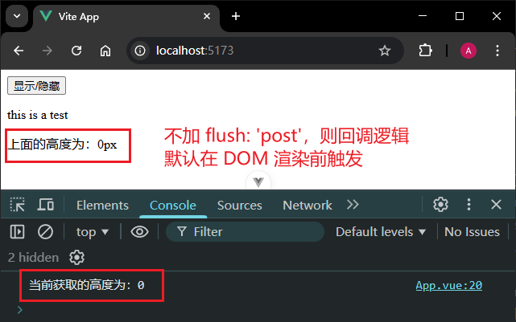
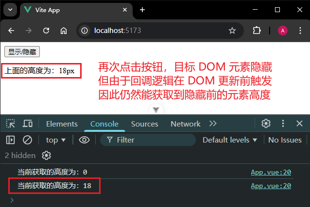
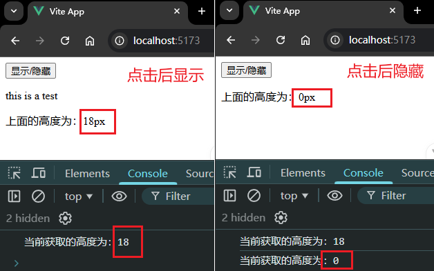
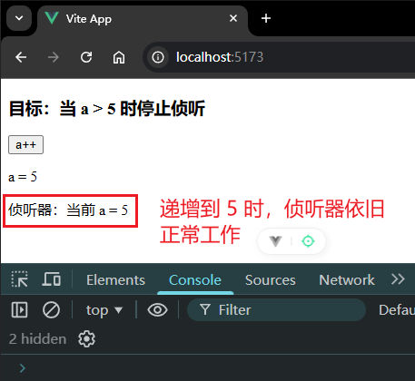
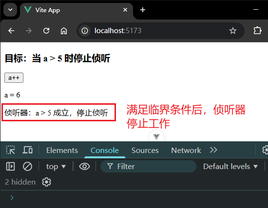
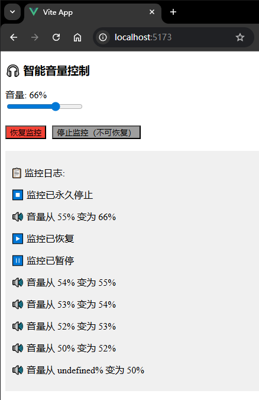

# P2L15L17：Vue3 中的侦听器（二）

---


## 1 watchEffect

`watchEffect` 相比 `watch` 能够自动跟踪回调里的响应式依赖：

`watch` 版本：

```js
const todoId = ref(1)
const data = ref(null)

watch(
  todoId, // 第一个参数需要显式的指定响应式依赖
  async () => {
    const response = await fetch(
      `https://jsonplaceholder.typicode.com/todos/${todoId.value}`
    )
    data.value = await response.json()
  },
  { immediate: true }
)
```

等效 `watchEffect` 版本：

```js
// 不再需要显式的指定响应式数据依赖
// 在回调函数中用到了哪个响应式数据，该数据就会成为一个依赖
watchEffect(async () => {
  const response = await fetch(
    `https://jsonplaceholder.typicode.com/todos/${todoId.value}`
  )
  data.value = await response.json()
})
```

如果只有一个依赖项，使用 `watchEffect` 的收益不大；但若涉及到多个依赖项，其好处就体现出来了。

`watchEffect` 相比 `watch` 还有一个特点：如果需要侦听一个嵌套的数据结构中的几个属性，那么 `watchEffect` 只会侦听回调中用到的属性，而不是递归侦听所有的属性：

```vue
<template>
  <div>
    <h1>团队管理</h1>
    <ul>
      <li v-for="member in team.members" :key="member.id">
        {{ member.name }} - {{ member.role }} - {{ member.status }}
      </li>
    </ul>
    <button @click="updateLeaderStatus">切换领导的状态</button>
    <button @click="updateMemberStatus">切换成员的状态</button>
  </div>
</template>

<script setup>
import { reactive, watchEffect } from 'vue'
const team = reactive({
  members: [
    { id: 1, name: 'Alice', role: 'Leader', status: 'Active' },
    { id: 2, name: 'Bob', role: 'Member', status: 'Inactive' }
  ]
})

// 有两个方法，分别是对 Leader 和 Member 进行状态修改
function updateLeaderStatus() {
  const leader = team.members.find((me) => me.role === 'Leader')
  // 切换状态
  leader.status = leader.status === 'Active' ? 'Inactive' : 'Active'
}

function updateMemberStatus() {
  const member = team.members.find((member) => member.role === 'Member')
  member.status = member.status === 'Active' ? 'Inactive' : 'Active'
}

// 添加一个侦听器
watchEffect(() => {
  // 获取到 leader
  const leader = team.members.find((m) => m.role === 'Leader')
  // 输出 leader 当前的状态
  console.log('Leader状态:', leader.status)
})
</script>
```

本例中，`watchEffect` 侦听的只有 `members` 数组中的第一项，因此回调逻辑只能通过第一个按钮触发；第二个按钮由于变更的是第二项的状态， 且并未写入 `watchEffect`，因此不触发侦听回调。


## 2 回调触发的时机

默认情况下，侦听器回调的执行时机是在：父组件更新 **之后**、所属组件的 `DOM` 更新 **之前** 被调用。

这意味着如果在回调函数中访问所属组件的 `DOM`，**拿到的是 DOM 更新之前的状态**。例如：

```vue
<template>
  <div>
    <button @click="show = !show">显示/隐藏</button>
    <div v-if="show" ref="divRef">
      <p>this is a test</p>
    </div>
    <p>上面的高度为：{{ height }}px</p>
  </div>
</template>

<script setup>
import { ref, watch } from 'vue'
const show = ref(false)
const height = ref(0) // 存储高度
const divRef = ref(null) // 获取元素

watch(show, () => {
  // 获取高度，将高度值给 height
  height.value = divRef.value ? divRef.value.offsetHeight : 0
  console.log(`当前获取的高度为：${height.value}`)
})
</script>
```

实测截图：



再次点击：



如果希望侦听器的回调逻辑在 `DOM` 更新后再调用，则要将第三参数中的 `flush` 选项设为 `'post'`：

```vue
<template>
  <div>
    <button @click="show = !show">显示/隐藏</button>
    <div v-if="show" ref="divRef">
      <p>this is a test</p>
    </div>
    <p>上面的高度为：{{ height }}px</p>
  </div>
</template>

<script setup>
import { ref, watch } from 'vue'
const show = ref(false)
const height = ref(0) // 存储高度
const divRef = ref(null) // 获取元素

watch(
  show,
  () => {
    // 获取高度，将高度值给 height
    height.value = divRef.value ? divRef.value.offsetHeight : 0
    console.log(`当前获取的高度为：${height.value}`)
  },
  { flush: 'post' }
)
</script>
```

实测效果：



> [!tip]
>
> **DIY 拓展：使用 watchPostEffect()**
>
> 本例在 `Vue 3.2+` 后也可以方便地使用 `watchPostEffect()`。它是[`watchEffect()`](https://cn.vuejs.org/api/reactivity-core#watcheffect) 使用 `flush: 'post'` 选项时的别名：
>
> ```vue
> <template>
>   <div>
>     <button @click="show = !show">显示/隐藏</button>
>     <div v-if="show" ref="divRef">
>       <p>this is a test</p>
>     </div>
>     <p>上面的高度为：{{ height }}px</p>
>   </div>
> </template>
> 
> <script setup>
> import { ref, watchPostEffect } from 'vue'
> const show = ref(false)
> const height = ref(0) // 存储高度
> const divRef = ref(null) // 获取元素
> 
> watchPostEffect(() => {
>   // 获取高度，将高度值给 height
>   height.value = divRef.value ? divRef.value.offsetHeight : 0
>   console.log(`当前获取的高度为：${height.value}`)
> })
> </script>
> ```
>
> 效果是一样的，只是侦听的对象不再是 `show`，而是 `height` 和 `divRef` 了。


## 3 停止侦听器

绝大多数情况是无需考虑侦听器如何停止的，设置在组件上的侦听器会在 **该组件被卸载时自动停止**。

但该自动停止机制仅适用于 **同步侦听器**；若为异步侦听器，即便该组件被销毁也不会自动停止：

```vue
<script setup>
import { watchEffect } from 'vue'

// 它会自动停止
watchEffect(() => {})

// ...这个则不会！
setTimeout(() => {
  watchEffect(() => {})
}, 100)
</script>
```

此时就要手动停止侦听器。

与 `setTimeout`、`setInterval` 类似，手动停止只需调用一下侦听器 **返回的函数** 即可：

```js
const unwatch = watchEffect(() => {})
// 手动停止
unwatch();
```

示例如下：

```vue
<template>
  <div>
    <h3>目标：当 a > 5 时停止侦听</h3>
    <button @click="a++">a++</button>
    <p>a = {{ a }}</p>
    <p>{{ message }}</p>
  </div>
</template>

<script setup>
import { ref, watch } from 'vue'
const a = ref(1) // 计数器
const message = ref('') // 消息
// 假设我们期望 a 的值到达一定的值之后，停止侦听
const unwatch = watch(
  a,
  (newVal) => {
    message.value = `侦听器：当前 a = ${a.value}`
    // 当值大于 5 的时候，停止侦听
    if (newVal > 5) {
      unwatch()
      message.value = `侦听器：a > 5 成立，停止侦听`
    }
  },
  { immediate: true }
)
</script>
```

实测结果：






## 4 Vue 3.5+ 对侦听器的精细控制

`Vue 3.5+` 新引入了 `stop`、`pause`、`resume` 方法，可对侦听器实现更精细的控制：

用法：

```js
const { stop, pause, resume } = watch(() => {})

// 暂停侦听器
pause()

// 稍后恢复
resume()

// 停止
stop()
```

示例（来自 `DeepSeek`）：

```vue
<template>
  <div>
    <h3>🎧 智能音量控制</h3>

    <div>
      <label>音量: {{ volume }}%</label><br />
      <input type="range" min="0" max="100" v-model.number="volume" />
    </div>

    <div style="margin-top: 20px">
      <button @click="toggleWatcher" :style="{ background: watcherActive ? '#4CAF50' : '#f44336' }">
        {{ watcherActive ? '暂停监控' : '恢复监控' }}
      </button>
      <button @click="stopWatcher" style="margin-left: 10px; background: #9e9e9e">
        停止监控（不可恢复）
      </button>
    </div>

    <div style="margin-top: 20px; padding: 10px; background: #f0f0f0">
      <p>📋 监控日志:</p>
      <p v-for="(log, index) in logs" :key="index">{{ log }}</p>
    </div>
  </div>
</template>

<script setup>
import { ref, watch } from 'vue'

const volume = ref(50)
const logs = ref([])
const watcherActive = ref(true)

// 创建一个可控制的侦听器
const { stop, pause, resume } = watch(
  volume,
  (newVal, oldVal) => {
    logs.value.unshift(`🔊 音量从 ${oldVal}% 变为 ${newVal}%`)

    // 护耳功能：超过80自动调低
    if (newVal > 80) {
      logs.value.unshift('⚠️ 音量过高！自动降至80%')
      volume.value = 80
    }
  },
  { immediate: true } // 立即执行一次
)

// 切换暂停/恢复
function toggleWatcher() {
  if (watcherActive.value) {
    pause()
    logs.value.unshift('⏸️ 监控已暂停')
  } else {
    resume()
    logs.value.unshift('▶️ 监控已恢复')
  }
  watcherActive.value = !watcherActive.value
}

// 完全停止（无法恢复）
function stopWatcher() {
  stop()
  watcherActive.value = false
  logs.value.unshift('⏹️ 监控已永久停止')
}
</script>

```

实测截图：


