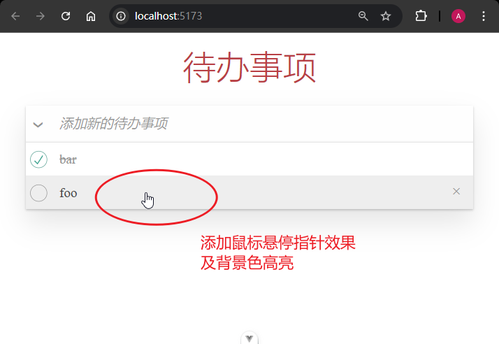

# P2S16L18：Vue 3 实战：待办列表（一）

---


> [!tip]
>
> 本节跳过了 `CSS` 样式设计环节，直接从模板的创建和交互逻辑入手，实现了待办事项的新增、勾选（及取消勾选）、删除当前项等功能点；编辑当前事项及下方功能区交互放到下一节。


## 1 要点梳理

:one: 使用 `HTML5` 语义化标签提高模板的可访问性。

:two: 使用 `localStorage` 缓存待办列表，既练习了 `watchEffect` 的用法，又能有效避免页面刷新后数据消失的问题。

:three: 本节漏掉一个功能点：勾选/取消全选框时的交互逻辑：应该新增一个响应式变量（如 `allChecked`），在初始加载时更新状态值，并在后续交互中侦听该状态值，一旦变更则同步到待办列表的所有记录中：

```js
// <input type="checkbox" id="toggle-all" class="toggle-all" v-model="allChecked" />
// 全选框及其切换
const allChecked = ref(false)
onMounted(() => (allChecked.value = todos.value.every((t) => t.completed)))
watch(allChecked, (checked) => todos.value.forEach((t) => (t.completed = checked)))
```

:four: 页面设计较为粗糙，未对所有 `label` 标签绑定复选框 `id`，且鼠标悬停时没有对应的样式切换：

```css
label[for]:hover {
  cursor: pointer;
  background-color: #aaaaaa34;
}
```

实测效果：



:five: 细节调整：全选框对应元素不应选中文本，否则容易干扰复选框的切换效果：

```css
.toggle-all + label {
  /* -- snip -- */
  user-select: none;
}
```


## 2 实测备忘

由于未能从零开始设计页面样式，导致实测过程中对某些样式类的添加缺乏深入理解，练习效果大打折扣。

实测时，将新增任务的触发时机调整为只按 <kbd>Enter</kbd> 键就能新增（按照视频中的 <kbd>Ctrl</kbd> + <kbd>Enter</kbd> 容易出现卡顿，原因不明）：

```html
<input type="text" class="new-todo" placeholder="添加新的待办事项" @keyup.enter="addTodo" />
<script setup>
// 添加 task
function addTodo({ target }) {
  const task = target.value.trim()
  if (task) {
    todos.value.push({
      id: Date.now(),
      title: task,
      completed: false
    })
    target.value = ''
  }
}
</script>
```

