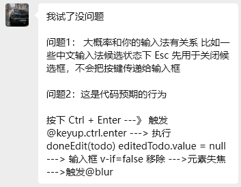
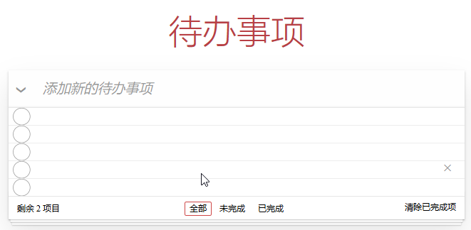
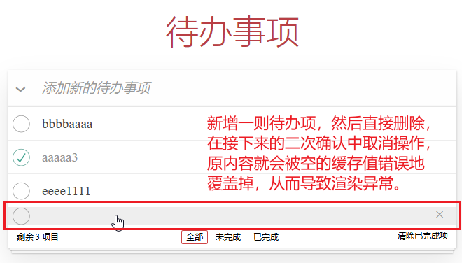

# P2S17L19：Vue 3 实战：待办列表（二）

---


> [!tip]
>
> 本节继续完善 `Todo-List` 待办事项页面的功能：
>
> - 双击编辑待办事项功能；
> - 编辑过程中按 <kbd>Esc</kbd> 取消编辑；
> - 下方功能区的快速筛选功能：选全、已完成、未完成、删除已完善事项。


## 1 要点梳理

### 1.1 双击编辑任务内容功能

原理：通过鼠标双击切换 `CSS` 样式类来控制可编辑文本框（`.edit`）和不可编辑区域（`.view`）的切换。

核心代码：

```html
<li
  class="todo"
  v-for="todo in filteredTodos"
  :key="todo.id"
  :class="{
    completed: todo.completed,
    editing: todo.id === editedId
  }"
>
  <div class="view">
    <input :id="todo.id" type="checkbox" class="toggle" v-model="todo.completed" />
    <label :for="todo.id" @dblclick="editTodo(todo)">{{ todo.title }}</label>
    <button class="destroy" @click="removeTodo(todo)"></button>
  </div>
  <input
    ref="editInput"
    type="text"
    class="edit"
    v-if="todo.id === editedId"
    v-model="todo.title"
    @keyup.enter="updateTodo(todo)"
    @keyup.escape="cancelTodo(todo)"
    @blur="updateTodo(todo)"
  />
</li>
```

> [!important]
>
> **关于 @keyup.escape 不生效的问题排查**
>
> 实测时，<kbd>Esc</kbd> 键的绑定逻辑始终不触发执行，原因一直没找到。直到求助美年达助教后才确定思路：<kbd>Esc</kbd> 键可能被劫持了。助教推测是输入法原因：
>
> 
>
> 经仔细排查，排除输入法劫持。随后联想到可能用到 <kbd>Esc</kbd> 键的所有第三方软件，最终锁定罪魁祸首 —— `Chrome` 浏览器插件 `Vimium C` —— 该插件使用 <kbd>Esc</kbd> 键作为退出 `insert mode` 的开关键，劫持了该键的默认行为，从而导致 `@keyup.escape` 钩子始终不触发执行。
>
> 解决办法：禁用该插件即可。


### 1.2 筛选条件与 URL 地址的联动

由于未使用 `VueRouter` 和任何子组件，本例通过不同超链接记录的 `href` 值切换地址栏的 `hash` 值，并通过注册 `hashchange` 事件完成筛选条件的切换：

```js
// 当前选中的筛选项（默认为全部）
const curr = ref('all')
window.addEventListener('hashchange', () => {
  let route = window.location.hash.replace(/#\/?/, '')
  if (route in filters) {
    curr.value = route
  } else {
    // console.log('not included', Date.now())
    window.location.hash = ''
    curr.value = 'all'
  }
})
```

不过上述代码仅切换了 `curr` 的值，只解决了工具栏中当前选中按钮的样式，想要同步切换待办事项列表，还需要修改列表渲染的数据源：从 `todos` 响应式变为 `filteredTodos`：

```js
const filters = {
  all: (todos) => todos.value,
  active: (todos) => todos.value.filter((t) => !t.completed),
  completed: (todos) => todos.value.filter((t) => t.completed)
}
const curr = ref('all')
const filteredTodos = computed(() => filters[curr.value](todos))
// <li class="todo" v-for="todo in filteredTodos" :key="todo.id">...</li>
```

实测时 `L2` 漏写了 `.value`，导致点击【全部】按钮后列表渲染异常：



> [!note]
>
> **注意**
>
> `filters` 的每个属性值都是一个包含具体筛选条件的处理函数，其函数返回值也应该时普通的 `JS` 数组，而非经过了 `ref` 响应式处理后的数组。


### 1.3 关于多个响应式变量的初始化问题

引入工具栏筛选条件后，还应该修改 `onMounted` 钩子，加入 `curr` 标记的初始化逻辑（`L5`）：

```js
// 全选框及其切换
const allChecked = ref(false)
onMounted(() => {
  allChecked.value = filteredTodos.value.every((t) => t.completed)
  onHashchange()
})
watch(allChecked, (checked) => filteredTodos.value.forEach((t) => (t.completed = checked)))

function onHashchange() {
  const route = window.location.hash.replace(/#\/?/, '')
  if (route in filters) {
    curr.value = route
  } else {
    // console.log('not included', Date.now())
    window.location.hash = ''
    curr.value = 'all'
  }
}
```

像这样在一个 `onMounted` 钩子书写多个变量的初始化逻辑，比在多个位置书写多个 `onMounted` 方法更有利于后期维护。

> [!tip]
>
> **最佳实践**
>
> **推荐在单个 onMounted 钩子内完成多个变量初始化逻辑的主要考量**：
>
> - 更好的代码组织和可读性
> - 更容易控制执行顺序和依赖关系
> - 统一的错误处理机制
> - 便于优化请求策略（串行/并行）
>
> 多个 `onMounted` 钩子容易导致代码逻辑分散，难以维护和调试。


## 2 实战备忘

:one: 如果不修正 <kbd>Esc</kbd> 键的劫持效应，则 `@keyup.escape` 钩子无法触发，只能借助 `@keyup.enter` 和 `@blur` 实现相关逻辑。

:two: 双击编辑时，在不修复 <kbd>Esc</kbd> 劫持的情况下，如果提交修改前的有效内容为空，则应 **优先处理该特殊情况**：此时缓存的原始内容还未被破坏（`L4`），一旦取消删除还能还原到修改前的状态：

```js
function updateTodo(todo) {
  // console.log('正在更新 todo：', todo)
  editedId.value = null
  if (!todo.title.trim()) {
    removeTodo(todo) // 先处理为空的情况，这样缓存的内容
  } else {
    titleCached = todo.title
  }
}

// 删除 todo
function removeTodo({ id }) {
  if (window.confirm('确认删除该待办事项吗？')) {
    todos.value = todos.value.filter((t) => t.id !== id)
  } else {
    // console.log('title cached:', titleCached)
    if (titleCached) {
      todos.value.find((t) => t.id === id).title = titleCached
      titleCached = ''
    }
  }
}
```

另外，取消删除后的处理逻辑仅在 **缓存值非空** 的情况下才有意义（`L17`），否则对于新增后直接删除的情况，取消删除会报错：



