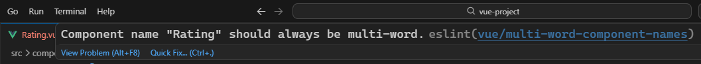
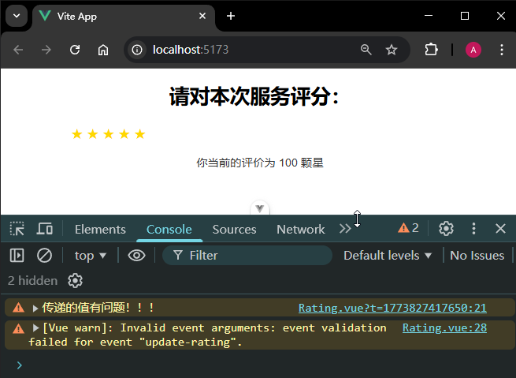

# P2S20L22：Vue3 中的自定义事件

---

自定义事件的核心思想：子组件向父组件传递数据。

应用场景：用于解决单向数据流机制中，子组件状态的反向更新问题：子组件可以通过自定义事件通知父组件，让父组件及时更新数据。


## 1 快速上手

以评分组件 `Rating.vue` 为例：

```vue
<template>
  <div class="rating-container">
    <span v-for="star in 5" :key="star" class="star" @click="setStar(star)">
      {{ rating >= star ? '★' : '☆' }}
    </span>
  </div>
</template>

<script setup>
import { ref } from 'vue'
const rating = ref(0) // 表示几颗星

const emits = defineEmits(['update-rating'])

function setStar(newStar) {
  rating.value = newStar
  // 我们需要将最新的星星状态的值传递给父组件
  // 触发父组件的 update-rating 事件
  emits('update-rating', rating.value)
}
</script>

<style scoped>
.rating-container {
  display: flex;
  font-size: 24px;
  cursor: pointer;
}

.star {
  margin-right: 5px;
  color: gold;
}

.star:hover {
  color: orange;
}
</style>
```

上述组件自行维护了一个评分状态 `rating`，如果父组件需要使用该状态作进一步渲染，则需要将 `rating` 的状态值传递给父组件，并触发父组件绑定的 `update-rating` 事件逻辑：

父组件 `App.vue`：

```vue
<template>
  <div class="app-container">
    <h1>请对本次服务评分：</h1>
    <Rating @update-rating="handleRating" />
    <p v-if="rating > 0">你当前的评价为 {{ rating }} 颗星</p>
  </div>
</template>

<script setup>
import { ref } from 'vue'
import Rating from './components/Rating.vue'
const rating = ref(0)

function handleRating(newRating) {
  // 更新父组件的数据就可以了
  rating.value = newRating
}
</script>

<style scoped>
.app-container {
  max-width: 600px;
  margin: auto;
  text-align: center;
  font-family: Arial, sans-serif;
}

p {
  font-size: 18px;
  color: #333;
}
</style>
```

父组件在引用子组件时，为子组件绑定了自定义事件（`update-rating`）。当子组件触发该事件时，父组件就会执行该事件所绑定的事件处理函数 `handleRating`。事件处理函数的形参就能够接收到子组件传递过来的数据。

> [!tip]
>
> **关于使用单个单词命名子组件时的报错**
>
> `VSCode` 的 `ESLint` 插件会自动检测子组件的命名情况，使用 `Rating` 会有如下警告：
>
> 
>
> 解决方案：
>
> - 改为多单词组合；
>
> - 修改 `ESLint` 规则：
>
>   ```js
>   /* eslint-env node */
>   require('@rushstack/eslint-patch/modern-module-resolution')
>   
>   module.exports = {
>     // -- snip --
>     rules: {
>       // 添加自定义规则
>       'vue/multi-word-component-names': 'off'
>     }
>   }
>   ```


## 2 自定义事件用法细节

组件模板中可以直接使用 `$emit` 触发自定义事件：

```vue
<span v-for="star in 5" :key="star" class="star" @click="$emit('update-rating', star)">
  {{ rating >= star ? '★' : '☆' }}
</span>
```

与 `props` 类似，自定义事件也支持自定义校验规则，主要针对子组件要传给父组件的值进行校验。

做法：自定义校验规则，需要先将编译器宏 `defineEmits` 的参数改为对象形式：对象的键为事件名，值为校验规则函数；该函数接收一个参数，表示触发自定义事件时要传给父组件的参数；函数返回值为一个布尔值，用来表示传递的值是否通过了校验：

```vue
<script setup>
const emit = defineEmits({
  // 没有校验
  click: null,

  // 校验 submit 事件
  submit: ({ email, password }) => {
    if (email && password) {
      return true
    } else {
      console.warn('Invalid submit event payload!')
      return false
    }
  }
})

function submitForm(email, password) {
  emit('submit', { email, password })
}
</script>
```

改造 `Rating.vue` 组件，通过自定义校验规则限定参数的值域：

```js
defineProps(['rating'])
const emits = defineEmits({
  'update-rating': (value) => {
    if (value < 1 || value > 5) {
      console.warn('传递的值有问题！！！')
      return false
    }
    return true
  }
})

function setStar(newStar) {
  // 我们需要将最新的星星状态的值传递给父组件
  // 触发父组件的 update-rating 事件
  emits('update-rating', 100)
}
```

实测结果：

