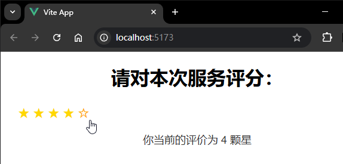
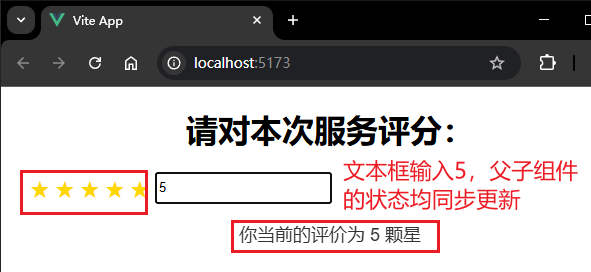
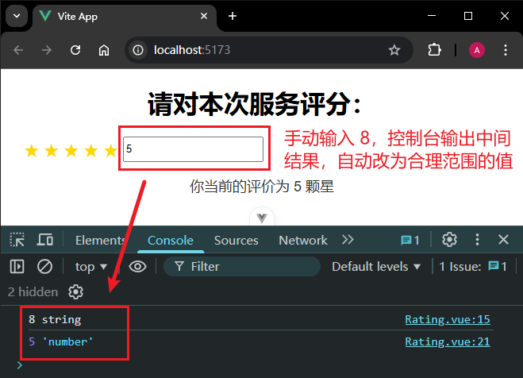

# P2S21L23：Vue3 中的 v-model 指令在组件父子通信中的应用

---


父子组件通信机制回顾：父传子通过 `props`；子传父通过 **自定义事件**。

`v-model` 是 `Vue` 的一个内置指令，除了用作 **表单元素的双向绑定** 外，还可以用在 **组件** 中，成为父子组件间的数据传输桥梁。


## 1 快速上手

`@/App.vue`：

```vue
<template>
  <div class="app-container">
    <h1>请对本次服务评分：</h1>
    <Rating v-model="rating" />
    <p v-if="rating > 0">你当前的评价为 {{ rating }} 颗星</p>
  </div>
</template>

<script setup>
import { ref } from 'vue'
import Rating from '@/components/Rating.vue'
// 这是父组件维护的数据
const rating = ref(0)
</script>

<style scoped>
@import '@/assets/app.css';
</style>
```

`@/components/Rating.vue`：

```vue
<template>
  <div class="rating-container">
    <span v-for="star in 5" :key="star" class="star" @click="updateRating(star)">
      {{ rating >= star ? '★' : '☆' }}
    </span>
  </div>
</template>

<script setup>
const rating = defineModel()

function updateRating(newValue) {
  rating.value = newValue
}
</script>

<style scoped>
@import '@/assets/rating.css';
</style>
```

实测效果（`7829381`）：



上述  `defineModel` 仍然是一个 **编译器宏**，并且是从 `v3.4` 才开始支持的。

`defineModel` 并没有破坏单向数据流的规则，其底层仍然是用的 `props` 和 `emits`。在进行编译时，编译器会将 `defineModel` 宏展开为：

- 一个名为 `modelValue` 的 `prop` 属性；
- 一个名为 `update:modelValue` 的自定义事件。

但在 `3.4` 版前，还得按如下形式书写：

```vue
<script setup>
// 接收父组件传递下来的 props
const props = defineProps(['modelValue'])
// 触发父组件的事件
const emit = defineEmits(['update:modelValue'])
</script>

<template>
  <input
    :value="props.modelValue"
    @input="emit('update:modelValue', $event.target.value)"
  />
</template>
```

由于 `v-model` 返回的是一个 `ref` 值，因此可以再次和子组件的表单元素进行双向绑定：

修改组件 `Rating.vue`，新增一个双向绑定的文本框（`L6`）：

```vue
<template>
  <div class="rating-container">
    <span v-for="star in 5" :key="star" class="star" @click="updateRating(star)">
      {{ rating >= star ? '★' : '☆' }}
    </span>
    <input type="text" v-model="rating" />
  </div>
</template>

<script setup>
const rating = defineModel()

function updateRating(newValue) {
  rating.value = newValue
}
</script>

<style scoped>
@import '@/assets/rating.css';
</style>

```

实测效果（`e166081`）：




## 2 相关用法细节

### 2.1 为 defineModel 设置简单的验证逻辑

```js
// 使 v-model 必填
const model = defineModel({ required: true })

// 提供一个默认值
const model = defineModel({ default: 0 })

// 指定类型
const model = defineModel({ type: String })
```


### 2.2 带参数的 v-model

父组件中：

```vue
<!-- 传递给子组件的状态是 bookTitle，而这里的 title 相当于是给当前的 v-model 命名 -->
<MyComponent v-model:title="bookTitle" />
```

子组件中：

```vue
<!-- MyComponent.vue -->
<script setup>
// 接收名为 title 的 v-model 绑定值
const title = defineModel('title')
</script>

<template>
  <input type="text" v-model="title" />
</template>
```

当绑定多个 `v-model` 时，就需要通过命名来区分不同的双向绑定值了：

```vue
<!-- 父组件传递多个 v-model 绑定值，这个时候就需要命名了 -->
<UserName
  v-model:first-name="first"
  v-model:last-name="last"
/>
```

注意子组件中传入 `defineModel` 编译器宏的参数为 **小驼峰命名**，而父组件的参数声明用的是 `kebab-case` 命名：

```vue
<script setup>
// 子组件通过命名来指定要获取哪一个 v-model 绑定值
const firstName = defineModel('firstName')
const lastName = defineModel('lastName')
</script>

<template>
  <input type="text" v-model="firstName" />
  <input type="text" v-model="lastName" />
</template>
```

要定义带命名参数的 `v-model` 的验证规则，只需将验证规则写成一个配置对象/并作为编译器宏 `defineModel` 的第二参数即可：

```js
const title = defineModel('title', { required: true })
const count = defineModel("count", { type: Number, default: 0 })
```


### 2.3 带修饰符的 v-model

父组件：

```vue
<MyComponent v-model.capitalize="myText" />
```

子组件可通过如下的解构赋值获取对应的修饰符：

```vue
<script setup>
const [model, modifiers] = defineModel()

console.log(modifiers) // { capitalize: true }
</script>

<template>
  <input type="text" v-model="model" />
</template>
```

修饰符获取成功后，具体功能需要子组件自行实现（定义 `setter` 方法）。

在子组件修改父组件数据的过程中，实现了特定功能的修饰符，本质上是对该过程施加了某种特定的限制或干预：

```vue
<script setup>
const [model, modifiers] = defineModel({
  set(value) {
    // 如果父组件书写了 capitalize 修饰符
    // 那么子组件在修改状态的时候，会走 setter
    // 在 setter 中就可以对子组件所设置的值进行一个限制
    if (modifiers.capitalize) {
      return value.charAt(0).toUpperCase() + value.slice(1)
    }
    return value
  }
})
</script>

<template>
  <input type="text" v-model="model" />
</template>
```

以星级评分为例：

父组件 `App.vue` 使用 `.number` 修饰符：

```vue
<template>
  <div class="app-container">
    <h1>请对本次服务评分：</h1>
    <Rating v-model.number="rating" />
    <p v-if="rating > 0">你当前的评价为 {{ rating }} 颗星</p>
  </div>
</template>

<script setup>
import { ref } from 'vue'
import Rating from '@/components/Rating.vue'
// 这是父组件维护的数据
const rating = ref(0)
</script>

<style scoped>
@import '@/assets/app.css';
</style>
```

子组件 `Rating.vue` 定义修饰符 `.number` 的具体功能：

```vue
<template>
  <div class="rating-container">
    <span v-for="star in 5" :key="star" class="star">
      {{ rating >= star ? '★' : '☆' }}
    </span>
    <input type="text" v-model="rating" />
  </div>
</template>

<script setup>
const [rating, { number }] = defineModel({
  required: true,
  // 这个就是一个 setter，回头子组件在修改值的时候，就会走这个 setter
  set(value) {
    console.log(value, typeof value)
    if (number) {
      value = isNaN(value) ? 0 : Number(value)
      value = Math.max(value, 0)
      value = Math.min(5, value)
    }
    console.log(value, typeof value)
    return value
  }
})
</script>

<style scoped>
@import '@/assets/rating.css';
</style>
```

效果验证（`649cfeb`）：

