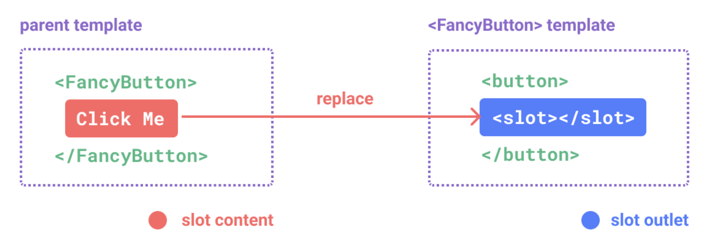
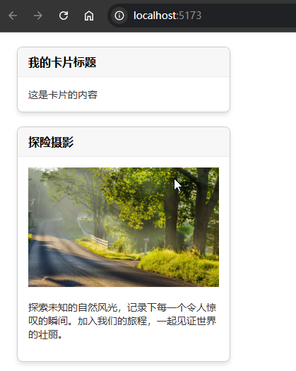
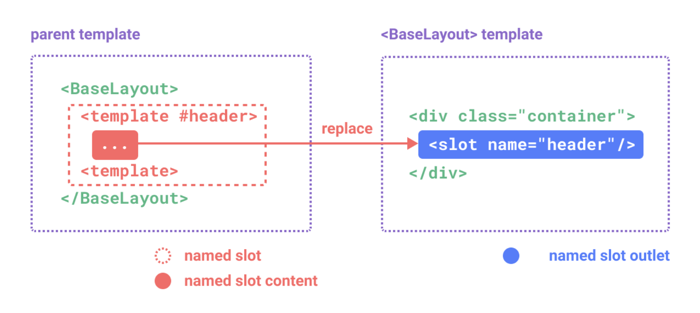
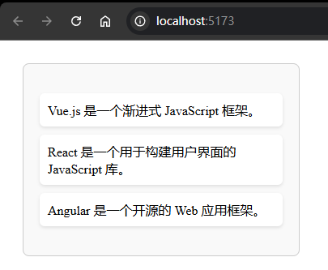

# P2S22L24：Vue3 中的插槽

---


> [!tip]
>
> 官方文档：[插槽 Slots](https://cn.vuejs.org/guide/components/slots.html)


当父组件需要向子组件传递模板内容时，此时 `props` 难以胜任，需要通过 **插槽** 来实现。

插槽的声明非常简单，书写子组件时加上 `slot` 标签即可；在父组件在引用子组件时，子组件元素标签之间书写的内容就会被插入到子组件声明 `slot` 的位置：




## 1 快速入门

定义子组件 `Card.vue` 如下：

```vue
<template>
  <div class="card">
    <!-- 卡片的头部 -->
    <div class="card-header">
      <!-- 具名插槽 -->
      <slot name="header"></slot>
    </div>
    <!-- 卡片的内容 -->
    <div class="card-body">
      <!-- 默认插槽 -->
      <slot></slot>
    </div>
  </div>
</template>

<script setup></script>

<style scoped>
@import '@/assets/card.css';
</style>
```

上述代码设置了两个 `slot` 插槽：一个名为 `header` 的 **具名插槽**；另一个为 **默认插槽**。

```vue
<template>
  <div>
    <Card>
      <!-- 中间的内容就会被放入到插槽里面 -->
      <template v-slot:header>我的卡片标题</template>
      这是卡片的内容
    </Card>
    <Card>
      <template v-slot:header>探险摄影</template>
      <div class="card-content">
        
        <p>探索未知的自然风光，记录下每一个令人惊叹的瞬间。加入我们的旅程，一起见证世界的壮丽。</p>
      </div>
    </Card>
  </div>
</template>

<script setup>
import Card from './components/Card.vue'
</script>

<style scoped>
@import '@/assets/app.css';
</style>
```

实测效果：



父组件在插入模板内容时，可以通过 `v-slot` 来指定要用到的插槽名称。如果没有指定，那么模板内容将会被插入默认插槽。


## 2 插槽相关细节

### 2.1 插槽默认内容的设置

可以在 `<slot>` 标签之间输入一些默认内容：当父组件没有提供具体的模板内容时，会渲染默认内容：

```vue
<slot>这是默认插槽的默认值</slot>
```


### 2.2 具名插槽

插槽是可以有名称的，这意味着可以设置多个插槽，而父组件可以根据不同的名称选择插槽。

父组件在指定名字时的格式：`v-slot:插槽名`

```vue
<template v-slot:header>探险摄影</template>
```

这里有一个简写，直接写成 `#插槽名`

```vue
<template #header>探险摄影</template>
```



另外，当组件同时接收默认插槽和具名插槽的时候，位于顶级的非 `template` 节点的内容会被放入到默认插槽里面。


### 2.3 动态插槽名

```vue
<template v-slot:[slotName]>探险摄影</template>
```

或者：

```vue
<template #[slotName]>探险摄影</template>
```


## 3 作用域

首先明确一点：

- 父组件模板中的表达式只能访问父组件作用域下的数据
- 子组件模板中的表达式只能访问子组件作用域下的数据

父组件：

```vue
<template>
  <div class="parent">
    <h1>父组件的标题</h1>
    <Card>
      <!-- 插槽内容可以访问父组件的数据 -->
      <template v-slot:default>
        <p>这是父组件的数据：{{ parentData }}</p>
        <!-- 以下行将会导致错误，因为试图在父组件中访问子组件的数据 -->
        <p>尝试访问子组件的数据：{{ childData }}</p>
      </template>
    </Card>
  </div>
</template>

<script setup>
import Card from '@/components/Card.vue'
import { ref } from 'vue'

// 父组件的数据
const parentData = ref('这是父组件的数据')
</script>

<style>
.parent {
  padding: 20px;
}
</style>
```

子组件：

```vue
<template>
  <div class="child">
    <h2>子组件的标题</h2>
    <!-- 这里的插槽将展示从父组件传递的内容 -->
    <slot></slot>
    <p>子组件数据：{{ childData }}</p>
    <p>尝试访问父组件数据：{{ parentData }}</p>
  </div>
</template>

<script setup>
import { ref } from 'vue'

// 子组件的数据
const childData = ref('这是子组件的数据')
</script>

<style>
.child {
  border: 1px solid #ccc;
  padding: 20px;
  margin-top: 20px;
}
</style>
```

有时，我们需要将子组件作用域下的数据通过 **插槽** 传递给父组件，这就涉及到 **作用域插槽**。

子组件：在设置插槽时，添加了一些动态属性：

```vue
<!-- <MyComponent> 的模板 -->
<div>
  <slot :text="greetingMessage" :count="1"></slot>
</div>
```

父组件：通过 `v-slot` 指令并将指令的值设置为 `slotProps`，就能获取到子组件传递过来的数据：

```vue
<MyComponent v-slot="slotProps">
  {{ slotProps.text }} {{ slotProps.count }}
</MyComponent>
```

如下图所示：


父组件在接收作用域插槽传递过来的数据时，也支持解构：

```vue
<MyComponent v-slot="{text, count}">
  {{ text }} {{ count }}
</MyComponent>
```


### 作用域插槽典型示例

下面是一个关于作用域插槽的实际使用场景——

子组件通过作用域插槽将数据传给父组件：

```vue
<template>
  <div class="list-container">
    <ul>
      <li v-for="item in items" :key="item.id">
        <!-- li 里面渲染什么内容我不知道，通过父组件在使用的时候来指定 -->
        <!-- 下面的插槽中，:item=item 就是将子组件的数据传递给父组件的插槽内容 -->
        <slot name="item" :item="item">{{ item.defaultText }}</slot>
      </li>
    </ul>
  </div>
</template>

<script setup>
import { ref } from 'vue'

// 子组件的数据，这个数据可能是通过请求得到的
const items = ref([
  { id: 1, name: 'Vue.js', defaultText: 'Vue.js 是一个渐进式 JavaScript 框架。' },
  { id: 2, name: 'React', defaultText: 'React 是一个用于构建用户界面的 JavaScript 库。' },
  { id: 3, name: 'Angular', defaultText: 'Angular 是一个开源的 Web 应用框架。' }
])
</script>

<style>
.list-container {
  max-width: 300px;
  background: #f9f9f9;
  border: 1px solid #ccc;
  padding: 20px;
  border-radius: 8px;
}

ul {
  list-style: none;
  padding: 0;
}

li {
  margin-bottom: 10px;
  background: #fff;
  padding: 10px;
  border-radius: 6px;
  box-shadow: 0 2px 4px rgba(0, 0, 0, 0.1);
}
</style>
```

父组件通过 `v-slot` 来接收子组件传递来的数据内容：

```vue
<template>
  <div class="app-container">
    <Card>
      <template v-slot="{ item }">
        <!-- 在父组件中来决定子组件的插槽内容 -->
        <h3>{{ item.name }}</h3>
        <p>{{ item.defaultText }}</p>
      </template>
    </Card>
  </div>
</template>

<script setup>
import Card from '@/components/Card.vue'
</script>

<style>
.app-container {
  padding: 20px;
}
</style>
```

实测效果：



关于上面的例子，官方还有一个叫法：**无渲染组件**

>一些组件可能只包括了逻辑而不需要自己渲染内容，视图输出通过作用域插槽全权交给了消费者组件。我们将这种类型的组件称为 **无渲染组件（*Renderless Component*）**。

