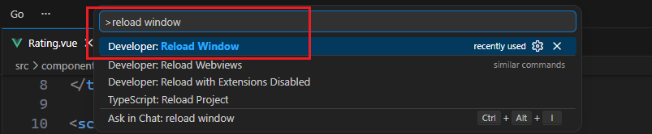
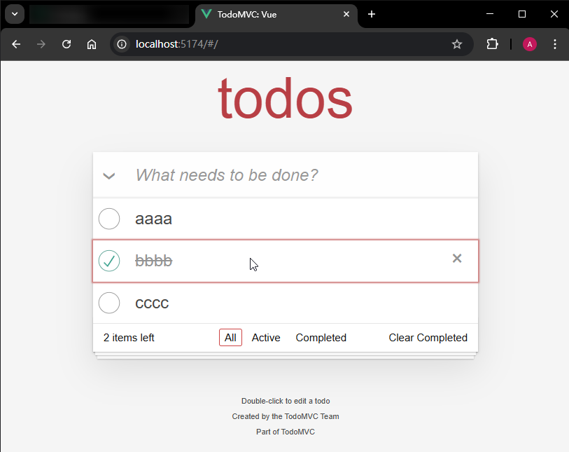
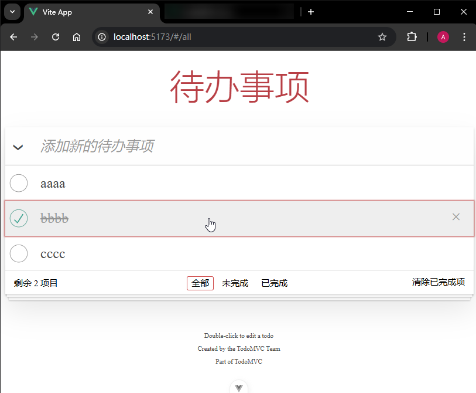
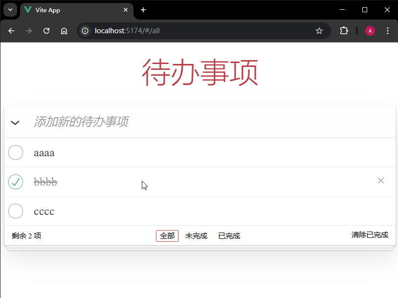

# P2S23L25：用组件化思想重构待办事项 Demo

---


> [!tip]
>
> **本节概要**
>
> 本节为实战练手课，目标是：
>
> 1. 重构为父子组件形式：将 `L19` 课完成的待办事项 `Demo` 按照 `Vue3` 组件的相关知识进行重构；
> 2. 熟悉 `Vue3` 全新的父子组件通信机制；
> 3. 复盘实操过程中的关键点。


## 1 要点梳理

### :one: 小技巧积累

纯键盘命令重启 `VSCode`：<kbd>Ctrl</kbd> + <kbd>Shift</kbd> + <kbd>P</kbd> :arrow_right: 执行命令 `Developer: Reload Window`：




### :two: 重构的原则

先易后难 —— 执行顺序为 `TodoHeader` :arrow_right: `TodoFooter` :arrow_right: `TodoList`（主区域）


### :three: 页头的重构

由于交互逻辑只涉及 **新增待办事项（addTodo）**。实测想到的是 `defineEmits` 宏，课件则使用 `v-model` 双向绑定 `todos`。

使用 `defineEmits` 宏建立子传父通道：

```js
// TodoHeader.vue
const emit = defineEmits(['new-todo'])
// 添加 task
function addTodo({ target }) {
  const task = target.value.trim()
  if (task) {
    emit('new-todo', {
      id: Date.now(),
      title: task,
      completed: false
    })
    target.value = ''
  }
}

// App.vue: <todo-header @new-todo="todo => todos.push(todo)" />
import TodoHeader from '@/components/TodoHeader.vue'
```

使用 `v-model` 双向绑定（工作量更小，推荐）：

```js
// TodoHeader.vue
const todos = defineModel('todos')
// 添加 task
function addTodo(event) {
  const value = event.target.value.trim()
  if (value) {
    todos.value.push({
      id: Date.now(),
      title: value,
      completed: false
    })
    event.target.value = '' // 清空输入框
  }
}

// App.vue: <Header v-model:todos="todos" />
import Header from '@/components/Header.vue'
```


### :four: 页脚的重构

页脚的重构和原视频差异较大：

- `hashchange` 事件的注册：由于筛选条件全部来自页脚，因此 `window` 上的 `hashchange` 事件注册逻辑应该放入子组件（视频则在父组件中）。

- `filters` 的处理：

  - `hashchange` 事件中的 `filters`：业务逻辑只用到 `filters` 的 `key`，且它们全部来自页脚 `a` 元素，因此直接改为常量形式（`L3`）：

  ```js
  function onHashchange() {
    const route = window.location.hash.replace(/#\/?/, '')
    if (['all', 'active', 'completed'].includes(route)) {
      curr.value = route
    } else {
      // console.log('not included', Date.now())
      window.location.hash = ''
      curr.value = 'all'
    }
  }
  ```

  - 其他位置的 `filters`：只保留任务列表的同步更新即可，这可以通过 `curr` 的双向绑定自动实现。

  - 删除已完成项中的 `filters`：直接修改双向绑定的 `todos` 即可，原父组件中的逻辑可以直接改造为基于 `todos` 的另一个计算属性：

    ```js
    const todos = defineModel('todos')
    
    const active = computed(() => todos.value.filter((t) => !t.completed))
    const remaining = computed(() => active.value.length)
    const hasCompleted = computed(() => todos.value.length > remaining.value)
    
    function removeCompleted() {
      if (window.confirm('确定要删除已完成事项吗？')) {
        todos.value = active.value
      }
    }
    ```

这样设计后，子组件 `TodoFooter` 的业务逻辑更加紧凑，只需绑定两个响应式状态即可：`todos` 和 `curr`。

又因为 `todos` 涉及修改，而 `curr` 只渲染不修改，因此 `todos` 按双向绑定处理，`curr` 则作为 `prop` 传入。


### :five: 主内容区域的重构

对照 `TodoMVC` 官网中的 `Vue3` 分支的 [源码](https://github.com/tastejs/todomvc)，发现了很多隐藏的 `Bug`：

- 官网版为全选复选框动态添加了 `disabled` 属性，用于在筛选结果为空时禁用全选功能；这也导致了另一个问题：一旦某个分类列表为空，将无法通过单击全选来恢复显示；
- 官方版不涉及本地缓存数据；课件版使用 `localStorage` 缓存 `todos`；
- 官方版没有考虑删除前的二次确认；课件版考虑了（更加合理）；
- 主内容区的列表 `label` 不能用 `for` 属性关联到该行的复选框，否则 **无法触发鼠标双击事件**；
- 官方实现是将正文区的 **列表项** 作为子组件（`TodoItem.vue`），让父组件上的模板量不致于过少；
- 样式文件 `todo.css` 中的 `.info` 样式类是给页面下方的使用说明设计的（模板内容在 `index.html` 中），课件代码没有收录；
- 全选控制的是总数据 `todos`，但设置 `disabled` 开关的是筛选后的 `filteredTodos`。
- 双击列表项显示编辑文本框后，获得焦点的两种方案：
  - 方案一：在模板上用 `ref` 关联一个响应式状态，然后在事件绑定逻辑中使用 `nextTick` 并调用 `DOM` 元素的 `.focus()` 方法；
  - 方案二：使用 `@vue:mounted="({ el }) => el.focus()"`
- `CSS` 细节补全：全选框被禁用后，对应的 `label` 元素设置 `cursor: not-allowed;`；恢复为可用状态后，改为 `cursor: pointer;`。


## 2 实测备忘

最终效果对比：

官方版：



`DIY` 实测版：



课件演示对照版：



:one: 具名 `v-model` 的声明：

```js
const todos = defineModel('todos')
```

:two: `Vue3` 版 `props` 传参：

```js
const props = defineProps(['curr'])
const filteredTodos = computed(() => filters[props.curr](todos))
```

:three: `Vue3` 版 `emit` 逆向传参：

```js
const emit = defineEmits(['new-todo'])
emit('new-todo', {
  id: Date.now(),
  title: task,
  completed: false
})
```

