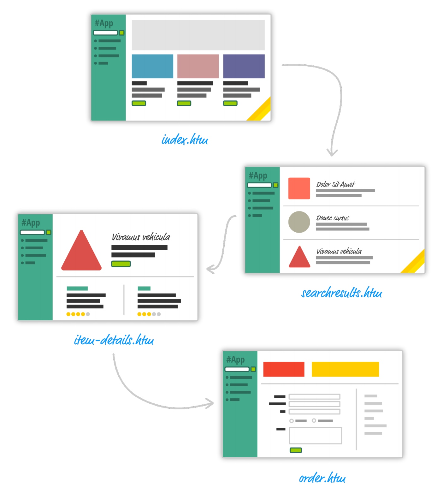
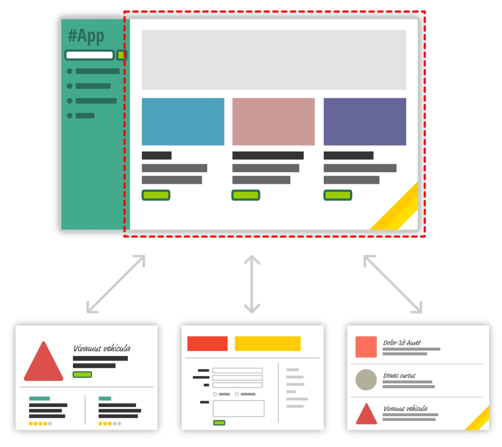
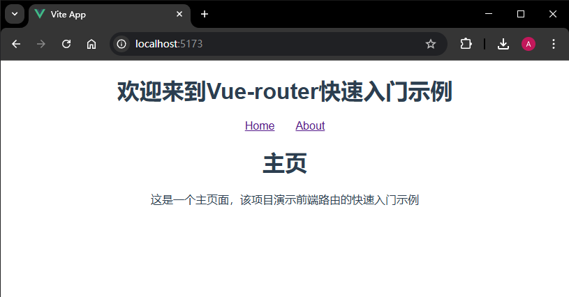
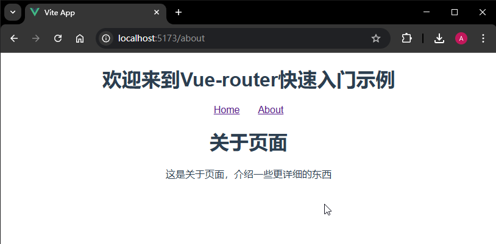
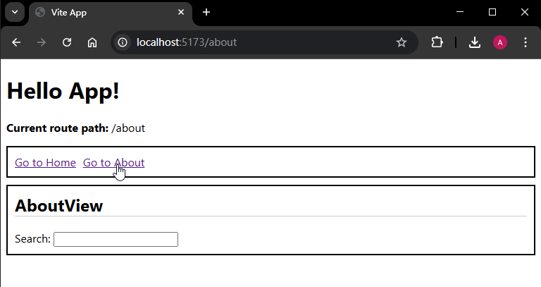
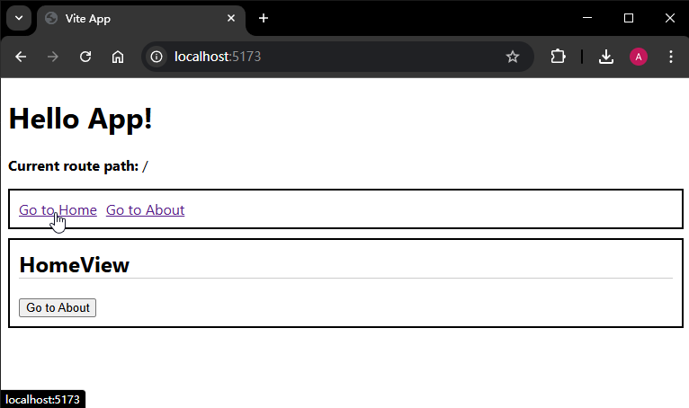

# P2S24L26：前端路由介绍（Vue 3 版）

---


> [!tip]
>
> `Vue` 生态中选择这三个最为重要的生态库来介绍：
>
> - 前端路由库
> - 状态管理库
> - 前端组件库


## 1 何为前端路由

在最早的多页应用时代，其实并不存在 **前端路由** 一说，那时的路由是后端（服务器端）考虑的问题，后端会根据不同的请求路由返回不同的页面：



此时的前端开发有两个特点：

- 整个项目的前后端代码是杂糅在一起的；
- 在多页应用时代，每切换一个页面，都需要重新请求服务器。

后面慢慢就到了 **单页应用** 时代，其特点是：只有一个 `HTML` 页面，以前视图的切换是整个 `HTML` 页面级的切换；而现在是页面上某个模块的切换：



上图中的模块其实对应的是 `Vue` 中的组件，该组件也称为 **页面级组件**。页面级组件需要和路由搭建一个映射关系，这就是 **前端路由**。

虽然有了前端路由，但是后端路由 **仍然存在**，只不过从之前的 **路由** 和 **页面** 的映射关系，演变为 **路由** 和 **数据接口** 之间的映射关系。


## 2 Vue 生态的前端路由

`Vue` 生态的前端路由是由 `Vue` 官方推出的，叫做 `Vue Router`。

> [!tip]
>
> `Vue Router` 官网：https://router.vuejs.org/zh/

首先需要安装该路由库：

```bash
npm install vue-router@4
```


### 快速入门

:one: 首先创建两个页面级组件 `Home.vue` 和 `About.vue`，均放入 `views` 目录；

:two: 在 `src` 下创建一个 `router` 目录，用于存放前端路由的配置；然后在该目录下面创建一个 `index.js`，其内容为具体的路由配置：

```js
// 前端路由配置文件
import { createRouter, createWebHistory } from 'vue-router'
// 页面组件
import Home from '../views/Home.vue'
import About from '../views/About.vue'

// 该方法会创建一个路由的实例
// 在创建路由实例的时候，可以传入一个配置对象
const router = createRouter({
  history: createWebHistory(), // 指定前端路由的模式，常见的有 hash 和 history 两种模式
  // 路由和组件的映射
  routes: [
    {
      path: '/', // 路由的路径
      name: 'Home',
      component: Home // 路由对应的组件
    },
    {
      path: '/about',
      name: 'About',
      component: About
    }
  ]
})
export default router
```

:three: 需要将该配置所导出的路由实例，在 `main.js` 入口文件中挂载到 `Vue` 的实例上：

```js
// main.js

// 引入路由实例
import router from '@/router'
// ...
// 挂载
app.use(router).mount('#app')
```

:four: 然后就可以在组件中使用了：

```vue
<template>
  <div id="app">
    <h1>欢迎来到Vue-router快速入门示例</h1>
    <nav>
      <!-- 该组件由 vue-router 这个库提供的 -->
      <router-link to="/">Home</router-link>
      <router-link to="/about">About</router-link>
    </nav>
    <!-- 由 vue-router 这个库提供的 -->
    <!-- 路由所匹配上的组件，会渲染到这个位置 -->
    <router-view />
  </div>
</template>

<script setup></script>

<style scoped>
#app {
  font-family: 'Avenir', Helvetica, Arial, sans-serif;
  text-align: center;
  color: #2c3e50;
}

nav a {
  padding: 15px;
}
</style>
```

上面会用到两个由 `vue-router` 库为我们提供的组件：

- `router-link`：指示具体的跳转路由路径；
- `router-view`：显示匹配的路由所对应的组件。

实测效果：





实测最新版 [官网示例](https://play.vuejs.org/#eNqFVttu20YQ/ZUpU0AyapGKekGhKorTIKhTpKlhp81D2QeKXImMl7vM7tKWIOjfc3aXN8l2YsM2Odczc2ZG3gdlUojwkw7mQVFWUhnaU6pYYtirqqIDrZUsaXRXs1EsGgMla8NUowkj/9qrrV+rS6oq9L6x6KKO8XMWC6Kw1mzs3f17KWthxqNncBudBedB4w5sC8PKisN/aQ0X+fPlJeNc2mTfLSK8OnHl/uBBGyXFZvm6VoqJBjFVicnni6jR0X5P3ztFuK45v4KSDgcXJvJxFiK5awNeO5TvCnFLRr6IgygOln9IPNOlLNki6vVPeiQrSDq3V/btgd8ianMuLC/Hsf4t2D1FjV2jXkRdY9Av38tH2fyLlVLtLgtt8Oe8Efq4Q5YnHZsdn7ZAl7oltRU0zLa024KO7DpJPwJS6IYNTS/oP1vK3vNCo2gEWBLBBCib92kP58dmro/Htn1ua/z/SSqFVMN6x3sbMIrovTRsTh/ZSDGqdSE2j/VqfEY5g8FaKpcyMcWq4IXZNUH8132B8TE5oyue7DZIK7KQ3gpKCBE5YZB5kcJVCtrJepQhX51wfhwE69Ag+MhWfXqbuJMmOu81BWpkSeYa1EUxO1uJxeLHHsNmX1ZK3mv04p/rdyHdMMghzGRal2ihQ3YUxZaLLjDkwGPpobvWU+7zQ50xHVqvRjJ/vH8OnicdjweseizY1g1NxtZJzVueMMHD2bJrr1NVVAaDfuLgKCyZyWWm5/6NaCM/SDcKaE0jQjsALvSLrsKq1vm4HSF3c6iZL/sb24/z0GbEy8nRmS1beDg5My9c1cagMxcp+L3FmncYTjfdGz5Y2aMl6SsmzUxtz1C/xpg91JA9fpP3dnjceJ93T08u9sludPZjdGSgG6isptVplqg0tzvVIPL7tGGDtiugV8KHCT/XTO3Cxu3lSxoBRNt2lDn2mt7XU6UYepSy8Z6cP0huMx/IzhAi+GH6BmVdg3vOeLJivLmtNy7mnBaFQDF0N7FTzUOjihJs+oxxQGWy5UxsTA7hbApu/RVuIx1z6jmZlEmFUywFWHWlxY1Cx0E3snHQc2PFcZAbU+l5FNWiut2E6HHUW1z8HE7DWZRhswbSkOly0qw3EsaB66yNfQGjKGN3RkquJ0lVPJXigeHFr8j0S59pqHuQryUDpRuNIVkXm5PC7agUnKm/K3tHjhuAMyjv/3Qyo2rWgU9zlt4+Iv+kt76MK8WA4I4NCjaJwhx69Zub92yL504JZmsO668or5mWvHbH0Jn9jjsO2AM7h/at4xFn9oN+szVM6LYoC7Qfbkfu66+U3sP9Mfxp0EVtdhynNdX2gxz/EZxj/grh/VZSZUzNaVZtCWCLjJ5Np9Pf3D1EuEJMVhKXppzT82m1dfIqyTKA7STIEguEpSU+n37Aj7+m3puzNT5Rh5b5bJi5D98DSNN0AGBOU3zPmgjB4QtAqIeC) 本地运行效果（`NodeJS`：`v25.8.0`，`vue-router`：`v5.0.4`，`tsc`：`v5.9.3`）：




