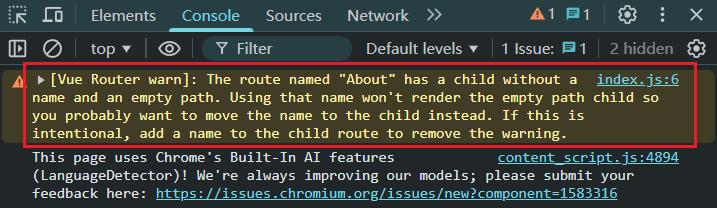
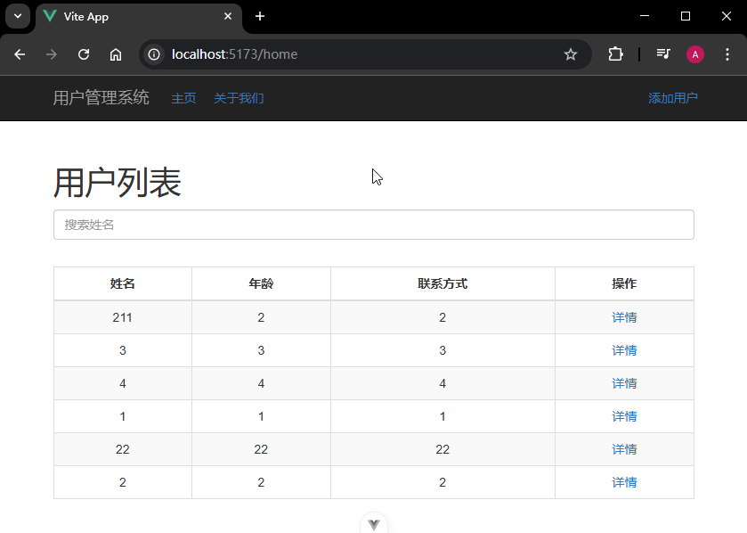
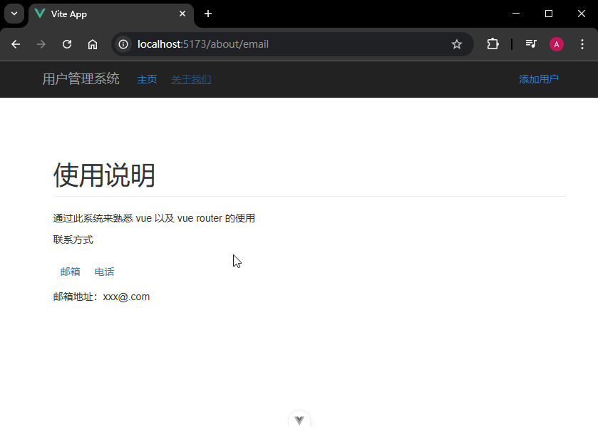

# P2S25L27：VueRouter 示例：用户管理页面（一）

---


本节主要练习 `Vue Router` 的补充用法：子路由、重定向。

由于没讲解过组件库，演示项目只用 `Bootstrap` 快速搭建，以免干扰 `Vue Router` 的功能演示；实测时使用动态导入进行重构。

作为补充，又到 `Bootstrap` 官网下载最新版示例项目进行巩固（基于 `vite` 构建）。


## 1 要点梳理

:one: `Bootstrap` 的导入：通过 `CDN` 放入 `index.html`；

:two: `Vue3` 在路由配置上的主要差异在于路由实例的创建方式上：

```js
// 前端路由配置文件
import { createRouter, createWebHistory } from 'vue-router'
import { routes } from '@/router/routes'
// 该方法会创建一个路由的实例
// 在创建路由实例的时候，可以传入一个配置对象
const router = createRouter({
  history: createWebHistory(), // 指定前端路由的模式，常见的有 hash 和 history 两种模式
  // 路由和组件的映射
  routes
})
export default router
```

:three: 项目使用 `json-server` 模拟后端 `API` 接口，并将其根地址设为 `axios` 的基础 `URL`（`L5`）：

```js
// ./src/api/request.js
import axios from 'axios'
// 创建 axios 实例
const request = axios.create({
  baseURL: 'http://localhost:3000',
  timeout: 5000
})
```

`json-server` 更多用法，详见文档：

- `GitHub`：https://github.com/typicode/json-server
- `NPM` 文档：https://www.npmjs.com/package/json-server


## 2 实测备忘

:one: 实测发现，视频中欲将 `/about` 重定向到 `/about/email` 的配置有警告信息：



原因：`path` 设为空字符串 `""` 后，必须再加一个 `name` 值。

解决方案一：添加 `name` 属性（`L13`）：

```js
{
  path: '/about',
  name: 'About',
  component: () => import('@/views/About.vue'),
  // 创建嵌套的路由
  children: [
    {
      path: 'email',
      component: () => import('@/views/Email.vue')
    },
    {
      path: '',
      name: 'DefaultAbout',
      redirect: '/about/email'
    }
  ]
}
```

解决方案二：直接从父节点 `About` 配置重定向（`L5`，推荐）：

```js
{
  path: '/about',
  name: 'About',
  component: () => import('@/views/About.vue'),
  redirect: '/about/email',
  // 创建嵌套的路由
  children: [
    {
      path: 'email',
      component: () => import('@/views/Email.vue')
    },
    {
      path: 'tel',
      component: () => import('@/views/Tel.vue')
    }
  ]
},
```


:two: 关于按需导入组件的配置，可以将分散在各个规则中的动态组件统一写到一处：

```js
const HomeAsync = () => import('@/views/Home.vue')
const AboutAsync = () => import('@/views/About.vue')
const EmailAsync = () => import('@/views/Email.vue')
const TelAsync = () => import('@/views/Tel.vue')
const AddAsync = () => import('@/views/AddOrEdit.vue')
const DetailAsync = () => import('@/views/Detail.vue')

export const routes = [
  {
    path: '/home', // 路由的路径
    name: 'Home',
    component: HomeAsync // 路由对应的组件
  },
  {
    path: '/about',
    name: 'About',
    component: AboutAsync,
    redirect: '/about/email',
  }
]
```

实测效果：






:three: 作为对照，`code` 文件夹还收录了最新的 `Bootstrap + Vite` 示例页，用到的版本如下：

- `node`：`v25.8.0`
- `Bootstrap`：`5.3.8`
- `vite`：`7.3.1`

最终效果：


