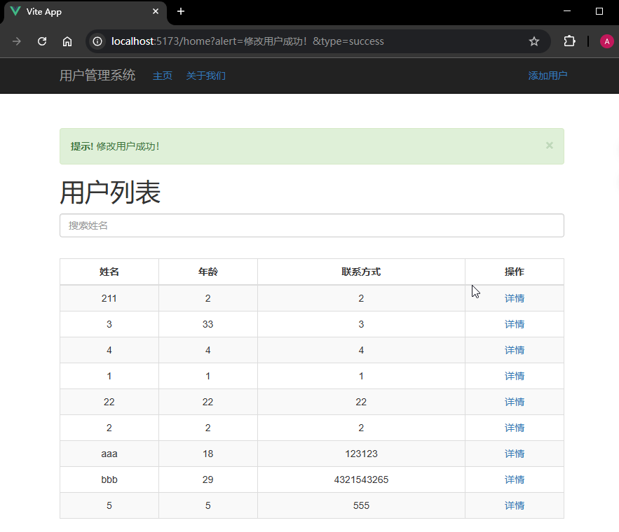

# P2S26L28：VueRouter 示例：用户管理页面（二）

---


本节基于上节实现的页面，进一步完善添加用户模块和编辑修改模块。

## 1 要点梳理


### 1.1 关于数据流

核心数据流：

- 新增用户 :arrow_right: 新增页面 :arrow_right: 保存 :arrow_right: 跳转列表页​
- 列表页 :arrow_right: 详情链接 :arrow_right: 跳转详情页​：
  - 返回 :arrow_right: 列表页
  - 修改 :arrow_right: 编辑页面 :arrow_right: 保存 :arrow_right: 跳转列表页​
  - 删除 :arrow_right: 二次确认 :arrow_right:
    - 确认删除：删除 :arrow_right: ​跳转列表页
    - 取消删除：停留在详情页


新增、编辑、删除操作通常可以携带操作结果到目标页面，并通过一个 `Alert` 组件渲染该操作结果：


### 1.2 关于 v-bind 绑定一个 props 对象

该组件需要两个 `prop` 属性：`alert` 和 `type`，分别对应操作结果的具体文字内容以及渲染的样式。绑定属性时直接传入一个 `props` 对象即可：

```vue
<template>
  <Alert v-if="showAlert" v-bind="alert" @close="closeAlert" />
</template>

<script setup>
import { useRoute } from 'vue-router'
const route = useRoute()

const alert = ref(null)
onMounted(async () => {
  // -- snip --
  if(route.query && route.query.alert && route.query.type) {
    alert.value = route.query
  }
})
</script>
```


### 1.3 关于下拉框的数据加载

本例中的下拉框没有使用 `value` 值：`<option value="1">item1</option>`，而是直接将 `option` 内部的文本作为选中的值。这样详情页就不用考虑字典值和字典标签的转换问题了（实际工作中很少这样简化）。


### 1.4 路由 name 的使用

实测尝试用路由实例的 `name` 属性进行跳转：

```js
router.push({
  path: '/home'
})
// 等效于
router.push({
  name: 'Home'
})
```


## 2 实测备忘

既然前面讲了尽量多用 `ref`，保存用户信息的响应式 `user` 就该统一用 `ref`：

```js
import { onMounted, ref } from 'vue'
const user = ref({
  name: '',
  age: '',
  phone: '',
  email: '',
  education: '本科',
  graduationschool: '',
  profession: '',
  profile: ''
})

onMounted(() => {
  if (id) {
    console.log('id:', id)
    getUserByIdApi(id)
      .then(({ data }) => Object.assign(user.value, data))
  }
})
```

最终效果：

