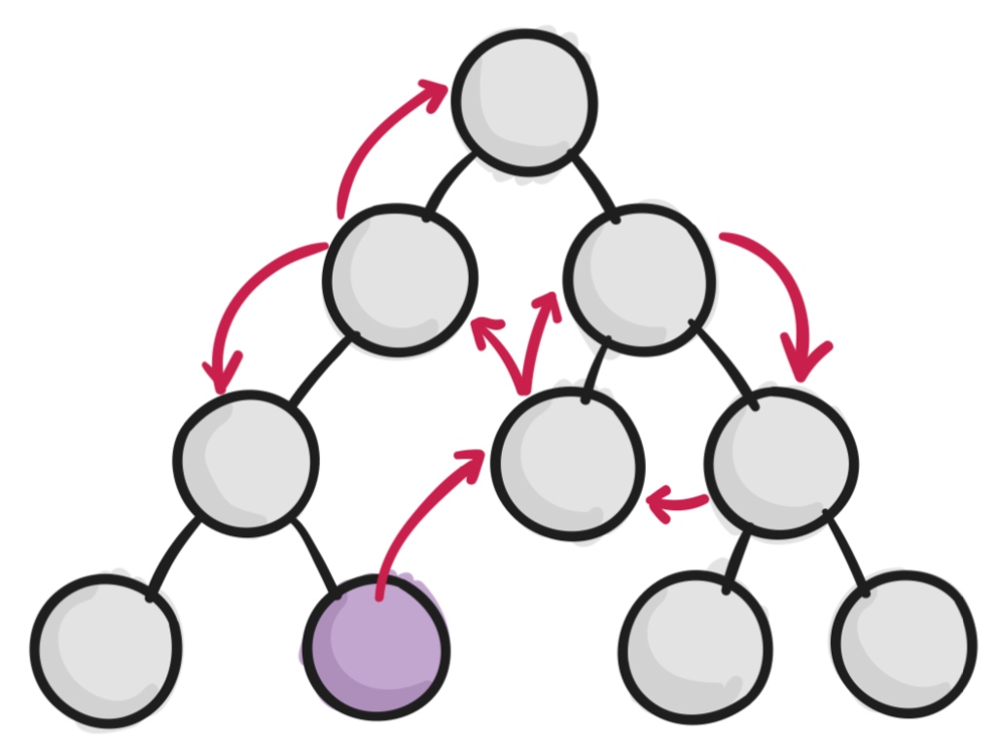
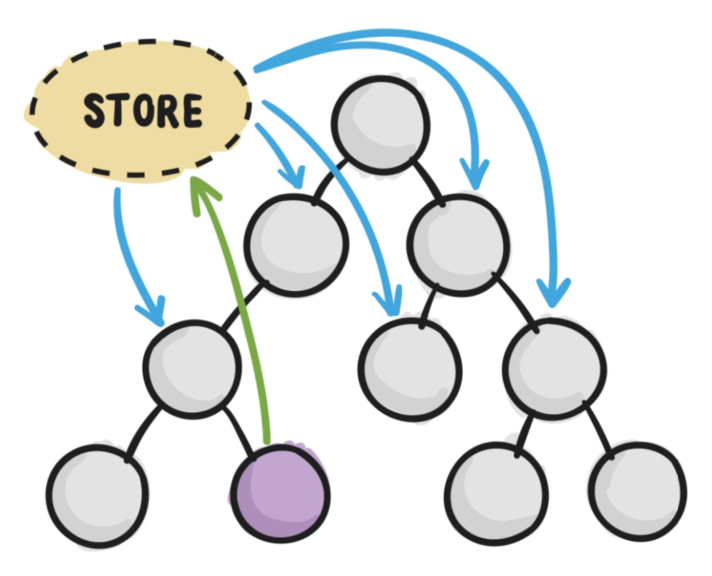
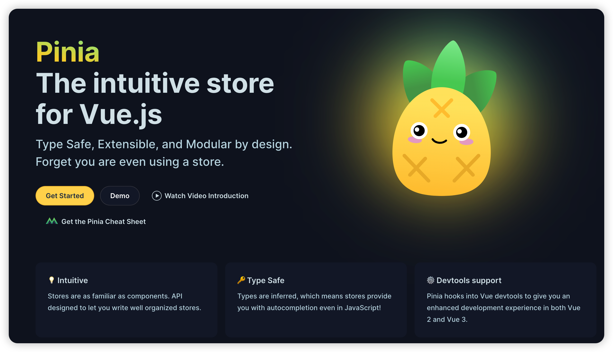
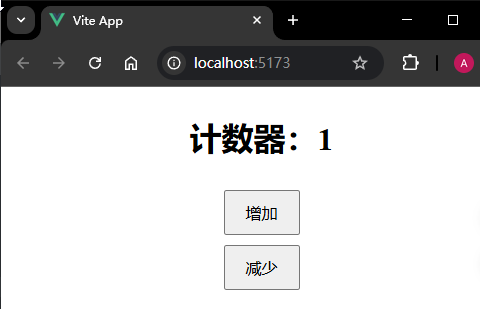

# P2S28L30：Vue3 中的状态管理 —— pinia

---


## 1 状态管理库基本介绍

状态管理库用于 **管理一个应用中组件的状态**。

传统方式组件之间传递状态：

- 父传子用 `props`
- 子传父用 `emit`

这种方式存在的问题：应用规模一旦变大，不同层级间组件的状态传递就会变得非常复杂：



状态管理库的解决方案：

在状态管理库中，会有一个统一的地方（即 **数据仓库**）管理所有的状态。如果组件间要进行状态传递，只需要起始组件将状态提交到该仓库，然后依赖该状态的组件从仓库获取最新状态即可——



## 2 Vue 生态的状态管理库

目前，`Vue` 生态官方所推荐的状态管理库是 `Pinia`，这是目前最新的状态管理库，用于替代以前的 `Vuex`，因此我们也将以 `Pinia` 为主进行介绍。

`Pinia` ，发音为 `/piːnjʌ/`，来源于西班牙语 `piña` 。意思为菠萝，表示与菠萝一样，由很多小块组成。在 `Pinia` 中，**每个 Store 都是单独存在**，一同进行状态管理。

`Pinia` 是由 `Vue.js` 团队成员开发，最初是在 2019 年 11 月左右作为 **一项实验性工作** 提出的，目的是为了使用 `Composition API` 重新设计 `Vuex`，探索 `Vuex` 下一次迭代会是什么样子。而 `Pinia` 在设计之初就倾向于同时支持 `Vue2` 和 `Vue3`，并且不强制要求开发者使用组合式 `API`。在探索的过程中，`Pinia` 实现了 `Vuex5` 提案的大部分内容，于是就直接取而代之了。

目前 `Vue` 官方已经宣布 `Pinia` 就是新一代的 `Vuex`，但是为了尊重作者本人，名字保持不变，仍然叫做 `Pinia`。

与之前的 `Vuex` 相比，`Pinia` 提供了更简单的 `API`，更少的规范，以及 `Composition-API` 风格的 `API` 。更重要的是，与 `TypeScript` 一起使用具有可靠的类型推断支持。

`Pinia` 官网地址：https://pinia.vuejs.org/



对比之前的 `Vuex`，`Pinia` 具有如下特点：

1. **mutations 不复存在**。只有 `state` 、`getters` 、`actions`；
2. `actions` 中支持 **同步** 和 **异步** 方法修改 `state` 状态；
3. 与 `TypeScript` 一起使用具有可靠的类型推断支持；
4. **不再有模块嵌套**，只有 `Store` 的概念，`Store` 之间可以相互调用；
5. **支持插件扩展**，可以非常方便地实现本地存储等功能；
6. 更加 **轻量**，压缩后体积只有 `2kb` 左右。


## 3 快速入门

第一步仍然是安装 `pinia`：

```bash
npm install pinia
```

然后在 `Vue` 应用中挂载 `pinia`：

```js
import { createApp } from 'vue'
// 引入了根组件
import App from './App.vue'
import { createPinia } from 'pinia'

// 挂载根组件
const app = createApp(App)
// 创建一个 pinia 的实例
const pinia = createPinia()

app.use(pinia).mount('#app')
```

接着创建数据仓库：在 `src` 目录下创建 `stores` 文件夹作为数据仓库目录，其中可包含多个数据仓库；每个数据仓库就是一个 `JS` 文件。

注意名字一般叫做 `useXXXStore`：

```js
import { defineStore } from 'pinia'

export const useCounterStore = defineStore('counter', {
  // 定义数据状态
  state: () => {
    return {
      count: 0
    }
  },
  // 定义了修改数据状态的两个方法
  actions: {
    increment() {
      this.count++
    },
    decrement() {
      this.count--
    }
  }
})
```

通过 `defineStore` 方法来创建一个数据仓库，该方法接收两个参数：

- 仓库名称
- 配置对象，在该配置对象里面就可以定义 `state`、`getters`、`actions`

最后就可以在组件中，使用数据仓库里面的状态：

```vue
<template>
  <div class="counter">
    <h1>计数器：{{ count }}</h1>
    <button @click="incCounter">增加</button>
    <button @click="decCounter">减少</button>
  </div>
</template>

<script setup>
import { computed } from 'vue';
import { useCounterStore } from '@/stores/useCounterStore.js'
// 获取数据仓库
const counterStore = useCounterStore()

const count = computed(() => counterStore.count)
const incCounter = computed(counterStore.increment)
const decCounter = computed(counterStore.decrement)
</script>

<style scoped>
.counter {
  display: flex;
  flex-direction: column;
  align-items: center;
  gap: 10px;
}
button {
  padding: 10px 20px;
  font-size: 16px;
  cursor: pointer;
}
</style>
```


## 2 实测备忘

实测效果：



将 `pinia` 状态变更 `API` 放入 `computed` 减少曝光：

```js
import { computed } from 'vue';
import { useCounterStore } from './stores/useCounterStore.js'
// 获取数据仓库
const counterStore = useCounterStore()
const incCounter = computed(counterStore.increment)
const decCounter = computed(counterStore.decrement)
```

