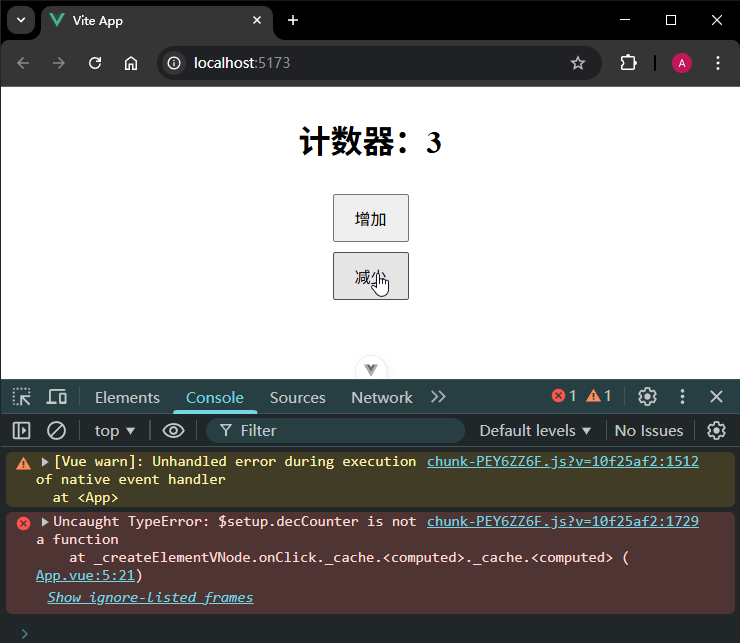

# P2S29L31：pinia 状态管理实战——任务管理器

---


## 1 要点梳理

本节按 `TodoList` 仿写了一个任务管理页面，支持新增、修改、删除功能，进一步强化 `pinia` 在状态管理方面的应用（模拟异步操作）。

基本思路：

在多层子组件的嵌套结构中使用 `pinia` 可以快速读写公共状态。

`getters` 的用法：类似 `computed` 计算属性——

```js
export const useTaskStore = defineStore('taskStore', {
  // 状态
  state: () => ({
    tasks: [], // 任务列表 {title: 'xxx', completed: false}
    loading: false // 加载状态
  }),
  // getter 其实就是对上面的状态做二次计算
  // 类似于组件里面的 computed
  getters: {
    // 完成的任务
    completedTasks: (state) => state.tasks.filter((task) => task.completed),
    // 未完成的任务
    pendingTasks: (state) => state.tasks.filter((task) => !task.completed),
    // 任务总数
    taskCount: (state) => state.tasks.length,
    // 完成的任务数量
    completedTaskCount: (state) => state.tasks.filter((task) => task.completed).length
  },
}
```

由于不存在 `mutations`，同步变更和异步变更都可以放到 `actions`：

```js
actions: {
  async fetchTasks() {
    this.loading = true
    const tasks = await fetchTasksFromServer()
    this.tasks = tasks
    this.loading = false
  },
}
```

更多用法可以参考 `Pinia` 推出视频课程：[Mastering Pinia](https://www.bilibili.com/video/BV1ZdEbzGEjL)


## 2 实测备忘

`Counter` 计数器案例中，使用 `Composition-API` 定义 `store`：

```js
import { defineStore } from 'pinia'
import { ref } from 'vue'

export const useCounterStore = defineStore('counter', () => {
  const counter = ref(0)

  function increment() {
    counter.value++
  }

  const decrement = () => counter.value--

  return {
    counter, increment, decrement
  }
})
```

导入到组件中使用时，错误地放到 `computed` 函数：

```js
import { computed } from 'vue';
import { useCounterStore } from './stores/useCounterStore.js'
// 获取数据仓库
const store = useCounterStore()
const count = computed(() => store.counter)
const incCounter = computed(store.increment)
const decCounter = computed(store.decrement)
```

实测发现：递增不报错，递减报错：



原因：`computed` 函数必须传入一个回调函数（即 `getter`），且该函数要依赖其他响应式状态、并经过二次计算得到一个具体的值。上述写法的返回值永远是 `undefined`，无论是 `incCounter` 还是 `decCounter` 都是 `RefImpl` 类型的值，最好不好作为事件处理函数来调用。

正确写法为：

```js
import { computed } from 'vue';
import { useCounterStore } from './stores/useCounterStore.js'
// 获取数据仓库
const store = useCounterStore()
const count = computed(() => store.counter)
const incCounter = store.increment
const decCounter = store.decrement
```

