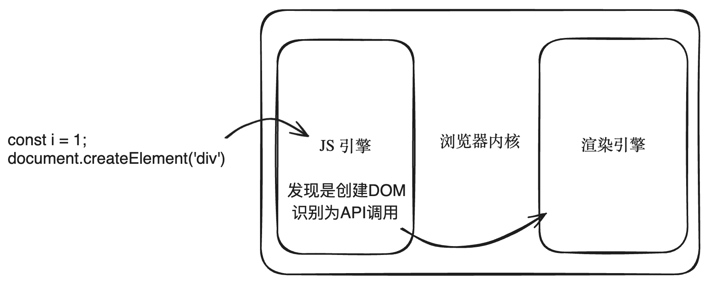
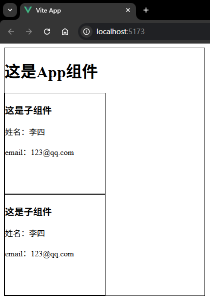
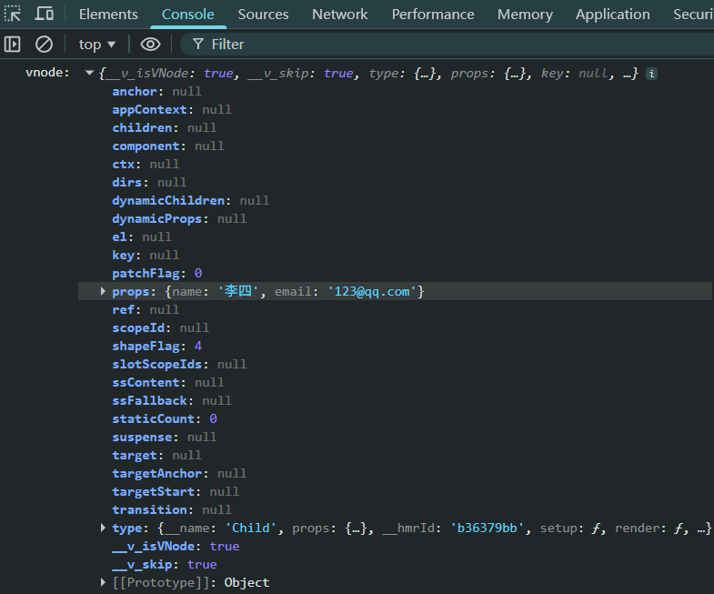
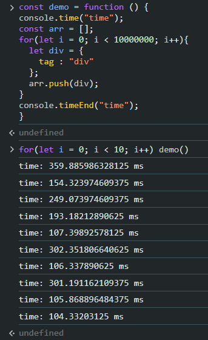
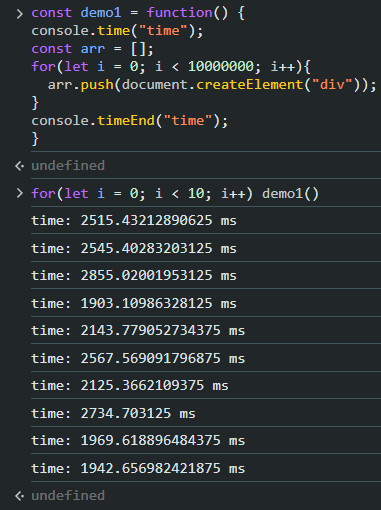
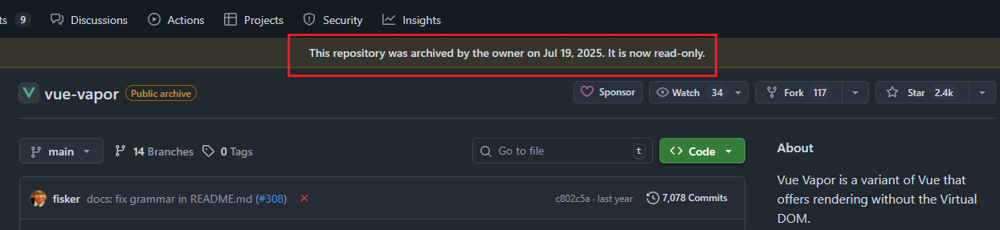

# P3S02L34：虚拟 DOM 的本质

---

> [!tip]
>
> **内容提要**
>
> - `DOM` 的工作原理
> - 虚拟 `DOM` 的本质
> - 为什么要需要虚拟 `DOM`


## 1 DOM 的工作原理

思考一个问题：我们写的代码是 `JS` 代码，但浏览器引擎是 `C++` 写的：

```js
const div = document.createElement("div");
```

浏览器引擎（`C++`）是如何处理这段 `JS` 代码的？

先介绍一个概念：`Web Interface Definition Language`，`WebIDL`，翻译成中文即【`Web` 接口定义语言】。它用于定义浏览器和 `JS` 之间的通信机制；换言之，是用于定义浏览器（`C++` 实现）所提供的一些功能（本地功能）如何能够被 `JS` 调用。

通过 `WebIDL`，**浏览器开发者** 可以描述哪些类、哪些方法能被 `JS` 访问、以及这些方法应该如何映射到 `JS` 中的对象和方法。

假设有如下 `WebIDL` 定义，用于创建 `DOM` 元素：

```web-idl
interface Document {
    Element createElement(DOMString localName);
};
```

这里就定义了一个 `Document` 接口，该接口内部有一个 `createElement` 方法，用于创建 `DOM` 元素。

接下来 **浏览器开发者** 基于 `C++` 来实现上述接口：

```c++
class Document {
public:
  	// 实现了上面的接口，定义了具体如何来创建 DOM 元素
    Element* createElement(const std::string& tagName) {
        return new Element(tagName);
    }
};
```

接下来的步骤非常重要，需要生成 **绑定代码（绑定层）**；它绑定了 `JS` 如何调用这个 `C++` 方法：

```c++
// 这个绑定代码是由 WebIDL 编译器自动生成
// 这就是 JS 到 C++ 的绑定
// 换句话说，这段绑定代码决定了 JS 开发者可以调用哪些方法来调用上面的 C++ 方法
void Document_createElement(const v8::FunctionCallbackInfo<v8::Value>& args) {
    v8::Isolate* isolate = args.GetIsolate();
    v8::HandleScope handle_scope(isolate);
    Document* document = Unwrap<Document>(args.Holder());

    v8::String::Utf8Value utf8_value(isolate, args[0]);
    std::string localName(*utf8_value);

    Element* element = document->createElement(localName);
    v8::Local<v8::Value> result = WrapElement(isolate, element);
    args.GetReturnValue().Set(result);
}
```

之后，绑定代码需要在 `JS` 引擎中注册：

```c++
// 将上面的绑定代码注册到 JS 引擎
void RegisterDocument(v8::Local<v8::Object> global, v8::Isolate* isolate) {
    v8::Local<v8::FunctionTemplate> tmpl = v8::FunctionTemplate::New(isolate);
    tmpl->InstanceTemplate()->Set(isolate, "createElement", Document_createElement);
    global->Set(v8::String::NewFromUtf8(isolate, "Document"), tmpl->GetFunction());
}
```

最后，**Web 开发者** 在进行开发时就可以在 `JS` 文件中书写如下代码：

```js
const i = 1;
document.createElement("div");
```

首先是 `JS` 引擎来执行 `JS` 代码——

- 第一句是 `JS` 引擎完全能搞定的。
- 第二句 `JS` 引擎发现要创建 `DOM` 节点，会将其识别为一个 `API` 调用，然后向浏览器底层（渲染引擎）发出请求；随后由浏览器底层（即渲染引擎）负责创建该 `DOM` 元素；创建完毕后，还需要给最初的调用端返回一个结果。所谓 **最初的调用端**，也就是 `JS` 代码中调用 `DOM API` 的地方。

如下图所示：



平时我们所指的真实 `DOM`，究竟是在指什么？

答：指的就是浏览器底层已经调用过 `C++` 对应的 `API` 了。

例如，在 `JS` 层面执行：

```js
document.appendChild("div");
```

则浏览器底层在调用对应的 `C++` 代码时，还会涉及浏览器重新渲染的相关内容（回流、重绘等），这又是一个很大的话题。


## 2 虚拟 DOM 的本质

虚拟 `DOM` 的概念最初是由 `React` 团队提出的：

>虚拟 `DOM` 是一种 **编程概念**。在这个概念里， `UI` 以一种理想化的、或者说【虚拟的】表现形式被保存于内存中。

理论上，无论用什么样的结构，只要将文档的结构展示出来，该结构就是一种虚拟 `DOM`。理论归理论，实际上也只有 **`JS` 对象** 能胜任这项工作。

在 `Vue` 中，可以通过一个名叫 `h` 的函数（全称 `hyperscript`），调用该函数就会返回虚拟 `DOM`。

`h` 函数是 `Vue` 渲染函数的一个 `API` 接口，详见 `Vue` 官方文档：[渲染函数 API 之：h() 函数](https://cn.vuejs.org/api/render-function.html#h)。

下面是一个简单的示例：

子组件 `Child.vue`：

```vue
<template>
  <div class="child-container">
    <h3>这是子组件</h3>
    <p>姓名：{{ name }}</p>
    <p>email：{{ email }}</p>
  </div>
</template>

<script setup>
defineProps({
  name: String,
  email: String
})
</script>

<style scoped>
.child-container {
  width: 200px;
  height: 200px;
  border: 1px solid;
}
</style>
```

然后在父组件 `App.vue` 用虚拟 `DOM` 直接渲染（`L5`）：

```vue
<template>
  <div class="app-container">
    <h1>这是App组件</h1>
    <Child name="李四" email="123@qq.com" />
    <component :is="vnode" />
  </div>
</template>

<script setup>
import { h } from 'vue'
import Child from '@/components/Child.vue'
const vnode = h(Child, {
  name: '李四',
  email: '123@qq.com'
})
console.log('vnode:', vnode)
</script>

<style scoped>
.app-container {
  width: 400px;
  border: 1px solid;
}
</style>
```

实测效果：



控制台输出结果：



上述示例可以得出一个结论：**虚拟 `DOM` 的本质就是普通的 `JavaScript` 对象**。


## 3 为什么要用虚拟 DOM

先来回顾早期的开发模式。

在最早期阶段，前端是通过手动操作 `DOM` 节点来编写代码的。

例如创建节点：

```js
// 创建一个新的 <div> 元素
var newDiv = document.createElement("div");
// 给这个新的 <div> 添加一些文本内容
var newContent = document.createTextNode("Hello, World!");
// 把文本内容添加到 <div> 中
newDiv.appendChild(newContent);
// 最后，把这个新的 <div> 添加到 body 中
document.body.appendChild(newDiv);
```

更新节点：

```js
// 假设我们有一个已存在的元素 ID 为 'myElement'
var existingElement = document.getElementById("myElement");
// 更新文本内容
existingElement.textContent = "Updated content here!";
// 更新属性，例如改变样式
existingElement.style.color = "red";
```

删除节点：

```js
// 假设我们要删除 ID 为 'myElement' 的元素
var elementToRemove = document.getElementById("myElement");
// 获取父节点
var parent = elementToRemove.parentNode;
// 从父节点中移除这个元素
parent.removeChild(elementToRemove);
```

插入节点：

```js
// 创建新节点
var newNode = document.createElement("div");
newNode.textContent = "这是新的文本内容";
// 假设我们想把这个新节点插入到 ID 为 'myElement' 的元素前面
var referenceNode = document.getElementById("myElement");
referenceNode.parentNode.insertBefore(newNode, referenceNode);
```

上述代码如果从编程范式的角度看，属于 **命令式编程**。这种编程的性能一定是最高的。

这意味着，假如要创建一个 `div` 的 `DOM` 节点，没有什么比 `document.createElement("div")` 的性能还要高。

虽然性能是最高的，但在实际开发中，开发者往往倾向于更加便捷的方式：

```html
<div id="app">
  <!-- 需求：往这个节点内部添加一些其他的节点 -->
</div>
```

如果采用传统的操作 `DOM` 节点的方式：

```js
// 获取 app 节点
var app = document.getElementById("app");

// 创建外层 div
var messageDiv = document.createElement("div");
messageDiv.className = "message";

// 创建 info 子 div
var infoDiv = document.createElement("div");
infoDiv.className = "info";

// 创建 span 元素并添加到 infoDiv
var nameSpan = document.createElement("span");
nameSpan.textContent = "张三";
infoDiv.appendChild(nameSpan);

var dateSpan = document.createElement("span");
dateSpan.textContent = "2024.5.6";
infoDiv.appendChild(dateSpan);

// 将 infoDiv 添加到 messageDiv
messageDiv.appendChild(infoDiv);

// 创建并添加 <p>
var p = document.createElement("p");
p.textContent = "这是一堂讲解虚拟DOM的课";
messageDiv.appendChild(p);

// 创建 btn 子 div
var btnDiv = document.createElement("div");
btnDiv.className = "btn";

// 创建 a 元素并添加到 btnDiv
var removeBtn = document.createElement("a");
removeBtn.href = "#";
removeBtn.className = "removeBtn";
removeBtn.setAttribute("_id", "1");
removeBtn.textContent = "删除";
btnDiv.appendChild(removeBtn);

// 将 btnDiv 添加到 messageDiv
messageDiv.appendChild(btnDiv);

// 将构建的 messageDiv 添加到 app 中
```

如果使用 `innerHTML` 的方式：

```js
var app = document.getElementById("app");

app.innerHTML += `
  <div class="message">
    <div class="info">
      <span>张三</span>
      <span>2024.5.6</span>
    </div>
    <p>这是一堂讲解虚拟DOM的课</p>
    <div class="btn">
      <a href="#" class="removeBtn" _id="1">删除</a>
    </div>
  </div>`;
```

虽然第一种方式性能最高，但是真写起来，`Web` 开发者的 **心智负担也很高**。

因此 `Web` 开发者往往选择第二种写法：虽然性能要差一些，但是心智负担也没那么高，写起来轻松一些。

> [!important]
>
> **思考：为什么第二种性能要差一些？差在哪里？**
>
> 原因很简单，第二种方式涉及到了 **两个层面** 的计算：
>
> 1. 解析字符串（`JS` 层面）
> 2. 创建对应的 `DOM` 节点（`DOM` 层面）
>
> 实际上使用虚拟 `DOM` 也涉及到两个层面的计算：
>
> 1. 创建 `JS` 对象（虚拟 `DOM`，属于 `JS` 层面）
> 2. 根据 `JS` 对象创建对应的 `DOM` 节点（`DOM` 层面）

这里我们不需要考虑同属于 `JS` 层面的计算，去深究解析字符串和创建 `JS` 对象到底谁快谁慢。我们只需要知道存在不同层面的计算：`JS` 层面的计算和 `DOM` 层面的计算，而两者的执行速度是完全不同的。

`JS` 层面创建一千万个对象：

```js
console.time("time");
const arr = [];
for(let i = 0; i < 10000000; i++){
  let div = {
    tag : "div"
  };
  arr.push(div);
}
console.timeEnd("time");
```

上述代码平均耗时在几百毫秒左右。实测截图：



`DOM` 层面创建一千万个对象：

```js
console.time("time");
const arr = [];
for(let i = 0; i < 10000000; i++){
  arr.push(document.createElement("div"));
}
console.timeEnd("time");
```

上述代码平均耗时在几千毫秒左右。实测截图：



至此，我们完全了解了 `JS` 层面的计算和 `DOM` 层面的计算，速度完全不一样。

接下来我们来看一下虚拟 `DOM` 真正解决的问题。

实际上无论使用虚拟 `DOM` 还是 `innerHTML`，在初始化时的性能是相差无几的。虚拟 `DOM` 发挥威力的时候，实际上是在 **更新的时候**。

来看一个例子（详见 `demo` 代码文件夹）：

```html
<body>
  <button id="updateButton">更新内容</button>
  <div id="content"></div>
  <script src="script.js"></script>
</body>
```

```js
// 通过 innerHTML 来更新 content 里面的内容
document.addEventListener("DOMContentLoaded", function () {
  const contentDiv = document.getElementById("content");
  const updateButton = document.getElementById("updateButton");

  updateButton.addEventListener("click", function () {
    const currentTime = new Date().toTimeString().split(" ")[0]; // 获取当前时间
    contentDiv.innerHTML = `
        <div class="message">
            <div class="info">
                <span>张三</span>
                <span>${currentTime}</span>
            </div>
            <p>这是一堂讲解虚拟DOM的课</p>
            <div class="btn">
                <a href="#" class="removeBtn" _id="1">删除</a>
            </div>
        </div>`;
  });
});
```

在上面的例子中，我们使用的是 `innerHTML` 来更新，这里涉及到的计算层面如下：

1. 销毁所有旧的 `DOM`（`DOM` 层面）
2. 解析新的字符串（`JS` 层面）
3. 重新创建所有 `DOM` 节点（`DOM` 层面）

如果使用虚拟 `DOM`，那么只涉及两个层面的计算：

1. 使用 `diff` 计算出更新的节点（`JS` 层面）
2. 更新必要的 `DOM` 节点（`DOM` 层面）

因此，总结一下，平时所说的虚拟 `DOM` **快**，是有前提的：

- 首先看和谁进行比较：
  - 如果是和原生 `JS` 的 `DOM` 操作比，那么虚拟 `DOM` 的性能肯定 **更低** 而非更高，因为多了一层计算；
- 其次，即便同 `innerHTML` 进行比较：
  - 初始化渲染的时候两者之间的差距 **并不大**；
  - 虚拟 `DOM` 是在 **更新的时候** 相比 `innerHTML` 性能更高。

最后总结一句话：

> 使用虚拟 `DOM` 是为了防止组件在 **重渲染** 时导致的性能恶化。


## 4 进一步思考

对虚拟 `DOM` 进行更深层次的思考：虚拟 `DOM` 还有哪些好处？

1. 跨平台性

虚拟 `DOM` 实际上是增加了一个 **抽象层**，相当于和原本的底层 `DOM` 操作进行解藕。这其实就是设计原则里面的 **依赖倒置原则**：

>高层模块不应依赖于低层模块（实际的底层 `DOM` 操作）的实现细节，两者都应依赖于 **抽象（虚拟DOM层）**。
>
>`DeepSeek` 补充：
>
>跨平台性只是表象，依赖倒置原则在这里的本质是：**通过引入虚拟 DOM 这个“抽象”，反转了依赖方向**。原本高层（业务）依赖低层（`DOM`），变成了高层和低层都依赖虚拟 `DOM`。这使得低层（渲染引擎）变成了可插拔的【插件】，从而实现了 **跨平台性** 与 **解耦**。

加一层的好处在于，底层模块是可以随时替换的。使用抽象层（即虚拟 `DOM` 层）来描述 `UI` 的结构，后续可以通过 **不同的渲染引擎** 来进行渲染，而不仅仅局限于浏览器平台。


2. 框架更加灵活

`React V15` 升级到 `React V16` 后，架构层面有了非常大的变化，从 `Stack` 架构升级到了 `Fiber` 架构，`React` 内部实际上发生了翻天覆地的变化；但是对开发者的入侵是极小的，开发者基本上感受不到变化，仍然可以使用以前的开发方式进行开发。

因为 `React` 有虚拟 `DOM` 这个中间层，就将开发者的代码和框架内部的架构解藕了。架构的变化只依赖于不同的虚拟 `DOM`，在版本升级后，开发者的代码会被编译为对应结构的虚拟 `DOM`。


目前有一些新的框架：`Svelte`、`Solid.js` 这一类框架提出了 **无虚拟 DOM** 的概念。这类框架 **直接将组件编译为命令式代码**，而不是在运行时通过比较虚拟 `DOM` 来更新真实 `DOM`。因此在 **性能** 方面一定是优于基于虚拟 `DOM` 实现的框架的。

包括 `Vue` 目前也在积极推出无虚拟 `DOM` 版本，简称【蒸汽模式】：https://github.com/vuejs/core-vapor

> [!tip]
>
> `DeepSeek` 增补：
>
> 关于笔记中 **无虚拟 DOM 一定优于虚拟 DOM** 的说法，在实际场景中需要限定条件：
>
> - **对于静态部分多、动态更新路径明确的应用**，编译时策略确实可以消除运行时 `diff` 开销。
> - 但在动态内容极其复杂、或需要频繁变更组件树结构的场景下，虚拟 `DOM` 的 **可控性与跨平台抽象** 依然是工程上的有效权衡。
>
> `Vue` 选择“可选模式”而非“彻底替换”，也是出于这种实用主义——让开发者根据场景在 **性能** 与 **抽象便利性** 之间做选择，而不是将二者对立。


无虚拟 `DOM` 框架的现状（`2024-04`）：

1. 由于组件被直接编译为命令式代码，代码的跨平台性略显不足；
2. 相关生态稍显稚嫩。


## 5 DIY 增补内容


学习本节时，上述仓库已停止维护：



原因：目前 `Vue` 的 `Vapor Mode`（蒸汽模式）已进入 **实质性的落地阶段**：**Vapor Mode 的开发已转移至 Vue 核心仓库**——

- 仓库地址：[vuejs/core](https://github.com/vuejs/core)
- 关键分支：`vapor` 分支（包含最新 `Vapor` 相关代码）
- 首个集成版本：`Vue v3.6.0-alpha.1` 已于 2025 年 7 月发布，`Vapor Mode` 作为正式 `feature` 被纳入。

根据官方发布信息，`Vapor Mode` 的定位是：

- **100% 可选**，不影响现有项目；
- **仅支持 `<script setup>` + Composition API**，不支持 `Options API`；
- 目标性能：与 `Solid`、`Svelte 5` 在第三方基准测试中 **处于同一水平**。

以下是最新公开的性能数据（来自官方 alpha 版本说明）：
|         指标          | 传统 VDOM 模式 |  Vapor 模式  |    提升    |
| :-------------------: | :------------: | :----------: | :--------: |
|  Hello World 包体积   |    22.8 kB     |    7.9 kB    | **⬇️ 65%**  |
| 首屏渲染（1万条列表） |     127ms      |     43ms     | **⬇️ 66%**  |
|       内存占用        |  48 字节/对象  | 16 字节/对象 | **⬇️ 67%**  |
|     高频更新性能      |   1000 次/秒   |  3000 次/秒  | **⬆️ 3 倍** |

*数据来源：`Vue 3.6 alpha` 发布说明及 `VueConf 2025` 公开演讲*

### 设计哲学：取舍与定位

`Vue` 团队没有用 `Vapor Mode` 完全替代传统模式，而是采用 **可选共存** 的策略，原因在于：

1. **传统模式的优势**：
    - **开发灵活性**：运行时虚拟 `DOM` 能够处理任意动态结构，支持递归、动态组件、运行时模板等。
   - **生态兼容性**：海量的 `UI` 库、插件都基于虚拟 `DOM` 构建，无缝兼容。
   - **跨平台抽象**：虚拟 `DOM` 层天然支持不同渲染目标（`DOM`、`Native`、`Canvas`）。
2. **Vapor Mode 的优势**：
   - **极致性能**：适合高频更新、大型列表、低端设备等场景。
   - **更小体积**：减少首屏加载时间，适合移动端或微前端场景。
   - **编译时优化潜力**：未来可配合更多编译时优化（如预编译、树摇）。

因此，`Vue` 的建议是：
- **新项目**：如果追求极致性能且不需要 `Options API` 或特殊内置组件，可以全量使用 `Vapor Mode`。
- **现有项目**：按需为高压力组件开启 `Vapor` 模式（通过 `<script setup vapor>`），逐步迁移。
- **混合场景**：使用互操作插件，`Vapor` 组件和传统组件可以共存。

---

-EOF-