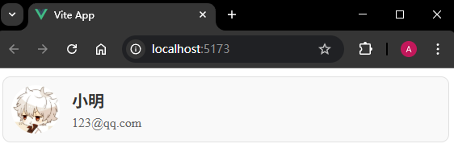
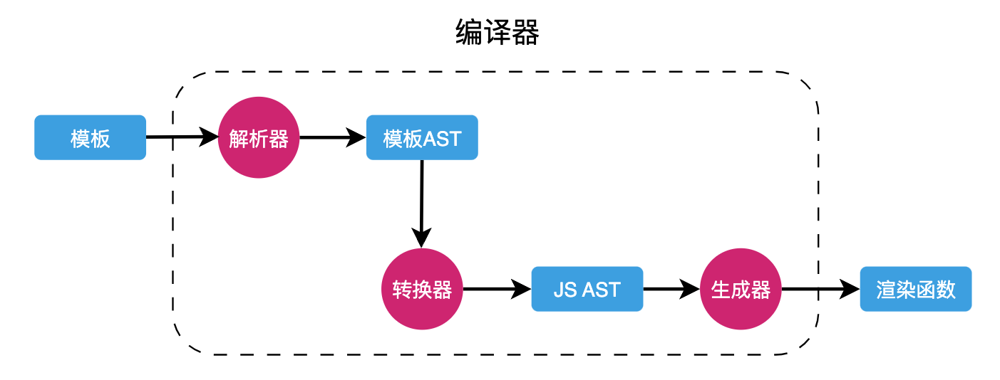
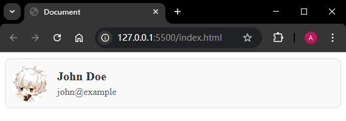
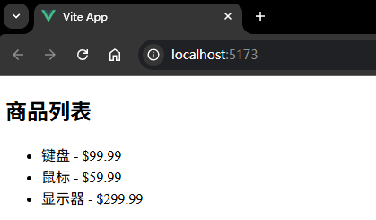
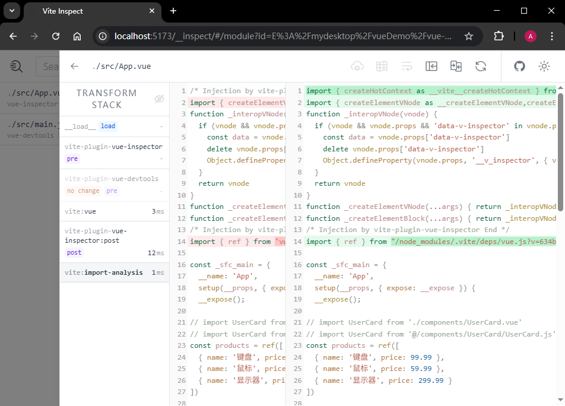

# P3S03L35：Vue 模板的本质

---

> **内容提要**
>
> - 渲染函数
> - 模板编译
> - 编译的时机


## 1 渲染函数

渲染函数（`h`）调用后会返回虚拟 `DOM` 节点。

详见文档：https://cn.vuejs.org/api/render-function.html#h

实际上，`Vue` 里的单文件组件会被一个 **模板编译器** 编译；编译后的结果并不存在什么模板，而是会把模板编译为 **渲染函数** 的形式。

这意味着我们完全可以使用纯 `JS` 来书写组件，文件的内部直接调用渲染函数来描述组件视图。

以 `P2S19L21` 课的 `UserCard` 组件为例，完全按纯 `JS` 形式改写如下：

```js
import { defineComponent, h } from 'vue'
import styles from './UserCard.module.css'
export default defineComponent({
  name: 'UserCard',
  props: {
    name: String,
    email: String,
    avatarUrl: String
  },
  setup(props) {
    // 下面我们使用了渲染函数的形式来描述了原本在模板中所描述的视图结构
    return () =>
      h('div', { class: styles.userCard }, [
        h('img', {
          class: styles.avatar,
          src: props.avatarUrl,
          alt: 'User avatar'
        }),
        h('div', { class: styles.userInfo }, [
          h('h2', props.name), h('p', props.email)
        ])
      ])
  }
})
```

对应的 `CSS` 样式如下（按 `CSS` 模块构建，样式类需改为 **驼峰式命名**）：

```css
.userCard {
  display: flex;
  align-items: center;
  background-color: #f9f9f9;
  border: 1px solid #e0e0e0;
  border-radius: 10px;
  padding: 10px;
  margin: 10px 0;
}

.avatar {
  width: 60px;
  height: 60px;
  border-radius: 50%;
  margin-right: 15px;
}

.userInfo h2 {
  margin: 0;
  font-size: 20px;
  color: #333;
}

.userInfo p {
  margin: 5px 0 0;
  font-size: 16px;
  color: #666;
}
```

甚至也可以使用 `Vue 2` 经典的 `Options API` 语法来改写：

```js
import styles from './UserCard.module.css'
import { h } from 'vue'
export default {
  name: 'UserCard',
  props: {
    name: String,
    email: String,
    avatarUrl: String
  },
  render() {
    return h('div', { class: styles.userCard }, [
      h('img', {
        class: styles.avatar,
        src: this.avatarUrl,
        alt: 'User avatar'
      }),
      h('div', { class: styles.userInfo }, [
        h('h2', this.name), h('p', this.email)
      ])
    ])
  }
}
```

实测效果：



注意：

- `Vue2` 版实现中，获取 `prop` 属性值须使用 `this`；
- 上述代码中的渲染函数 `h` 原本是以回调函数的参数形式传入 `Vue2` 的渲染函数的；这里使用的是 `Vue3`，因此 `h` 只能从 `'vue'` 中导入。

可见，`Vue` 之所以提供模板的方式，是为了让开发者在描述视图时更加轻松。`Vue` 在运行时本身是不需要什么模板的，它只需要 **渲染函数**，以及调用这些渲染函数后所得到的 **虚拟 DOM**。

作为一个框架的设计者，必须思考：**是要框架少做一些，让用户的心智负担更重一些；还是要框架多做一些，让用户的心智负担更少一些。**


## 2 模板的编译

`SFC` 中所书写的模板对于模板编译器来讲，**就是普通的字符串**。

例如模板内容：

```vue
<template>
	<div>
  	<h1 :id="someId">Hello</h1>
  </div>
</template>
```

对于模板编译器而言，上述内容仅仅是一串字符串：

```js
'<template><div><h1 :id="someId">Hello</h1></div></template>'
```

模板编译器需要对上述字符串进行操作，最终生成的结果如下：

```js
function render(){
  return h('div', [
    h('h1', {id: someId}, 'Hello')
  ])
}
```

模板编译器在编译模板字符串时，是一点一点转换而来的，整个过程如下：



- 解析器：负责将模板字符串解析为对应的模板 `AST`；
- 转换器：负责将模板 `AST` 转换为 `JS AST`；
- 生成器：将 `JS AST` 生成最终的渲染函数。

每一个部件都依赖于上一个部件的执行结果。

示例：假设有如下模板：

```vue
<div>
	<p>Vue</p>
  <p>React</p>
</div>
```

这对于模板编译器而言就是一段字符串：

```js
"<div><p>Vue</p><p>React</p></div>"
```

解析器首先对该字符串进行解析（利用编译原理中的 **有限状态机** 机制），得到一个一个 `token`，大致结构如下：

```js
[
  {"type": "tag","name": "div"},
  {"type": "tag","name": "p"},
  {"type": "text","content": "Vue"},
  {"type": "tagEnd","name": "p"},
  {"type": "tag","name": "p"},
  {"type": "text","content": "React"},
  {"type": "tagEnd","name": "p"},
  {"type": "tagEnd","name": "div"}
]
```

此外，解析器还需要根据所得到的 `token` 来生成抽象语法树（即模板 `AST`）

转换后的模板 `AST` 如下：

```js
{
  "type": "Root",
  "children": [
    {
      "type": "Element",
      "tag": "div",
      "children": [
        {
          "type": "Element",
          "tag": "p",
          "children": [
              {
                "type": "Text",
                "content": "Vue"
              }
          ]
        },
        {
          "type": "Element",
          "tag": "p",
          "children": [
              {
                "type": "Text",
                "content": "React"
              }
          ]
        }
      ]
    }
  ]
}
```

至此，解析器工作完毕。

接着转换器登场，它将上一步得到的模板 `AST` 转换为 `JS AST`：

```js
{
  "type": "FunctionDecl",
  "id": {
      "type": "Identifier",
      "name": "render"
  },
  "params": [],
  "body": [
      {
          "type": "ReturnStatement",
          "return": {
              "type": "CallExpression",
              "callee": {"type": "Identifier", "name": "h"},
              "arguments": [
                  { "type": "StringLiteral", "value": "div"},
                  {"type": "ArrayExpression","elements": [
                        {
                            "type": "CallExpression",
                            "callee": {"type": "Identifier", "name": "h"},
                            "arguments": [
                                {"type": "StringLiteral", "value": "p"},
                                {"type": "StringLiteral", "value": "Vue"}
                            ]
                        },
                        {
                            "type": "CallExpression",
                            "callee": {"type": "Identifier", "name": "h"},
                            "arguments": [
                                {"type": "StringLiteral", "value": "p"},
                                {"type": "StringLiteral", "value": "React"}
                            ]
                        }
                    ]
                  }
              ]
          }
      }
  ]
}
```

最后，**生成器** 根据上一步得到的 `JS AST`，生成具体的 `JS` 代码：

```js
function render () {
  return h('div', [h('p', 'Vue'), h('p', 'React')])
}
```

下面是一个模板编译器大致的工作流程：

```js
function compile(template){
  // 1. 解析器
  const ast = parse(template)
  // 2. 转换器：将模板 AST 转换为 JS AST
  transform(ast)
  // 3. 生成器
  const code = generate(ast)
  
  return code;
}
```


## 3 编译的时机

整体上分两种情况：

1. 运行时编译；
2. 预编译；


### 3.1 运行时编译

以下示例代码直接通过 `CDN` 的方式引入 `Vue`：

```html
<!DOCTYPE html>
<html lang="en">
  <head>
    <meta charset="UTF-8" />
    <meta name="viewport" content="width=device-width, initial-scale=1.0" />
    <title>Document</title>
    <style>
      .user-card {
        display: flex;
        align-items: center;
        background-color: #f9f9f9;
        border: 1px solid #e0e0e0;
        border-radius: 10px;
        padding: 10px;
        margin: 10px 0;
      }
      .avatar {
        width: 60px;
        height: 60px;
        border-radius: 50%;
        margin-right: 15px;
      }
      .user-info h2 {
        margin: 0;
        font-size: 20px;
        color: #333;
      }
      .user-info p {
        margin: 5px 0 0;
        font-size: 16px;
        color: #666;
      }
    </style>
  </head>
  <body>
    <!-- 书写模板 -->
    <div id="app">
      <user-card :name="name" :email="email" :avatar-url="avatarUrl" />
    </div>

    <template id="user-card-template">
      <div class="user-card">
        
        <div class="user-info">
          <h2>{{ name }}</h2>
          <p>{{ email }}</p>
        </div>
      </div>
    </template>

    <script src="https://unpkg.com/vue@3/dist/vue.global.js"></script>
    <script>
      const { createApp } = Vue;

      const UserCard = {
        name: "UserCard",
        props: {
          name: String,
          email: String,
          avatarUrl: String,
        },
        template: "#user-card-template",
      };

      const App = {
        components: {
          UserCard,
        },
        data() {
          return {
            name: "John Doe",
            email: "john@example",
            avatarUrl: "./yinshi.jpg",
          };
        },
      };
      createApp(App).mount("#app");
    </script>
  </body>
</html>
```

实测效果：



上述示例涉及模板代码及模板的编译，此时的模板编译就是在 **运行时** 进行的。


### 3.2 预编译

预编译发生在工程化环境下。

所谓预编译，指的是工程打包过程中就完成了模板的编译工作，浏览器拿到的是打包后的代码，是 **完全没有模板** 的。

这里推荐一个插件：`vite-plugin-inspect`（详见 [NPM 文档](https://www.npmjs.com/package/vite-plugin-inspect)）

安装该插件后在 `vite.config.js` 配置文件中简单配置一下：

```js
// vite.config.js
import Inspect from 'vite-plugin-inspect'

export default {
  plugins: [
    Inspect()
  ],
}
```

之后就可以在 http://localhost:5173/__inspect/ 里面看到每一个组件编译后的结果。

实测效果：



各模块编译情况：



---

-EOF-

