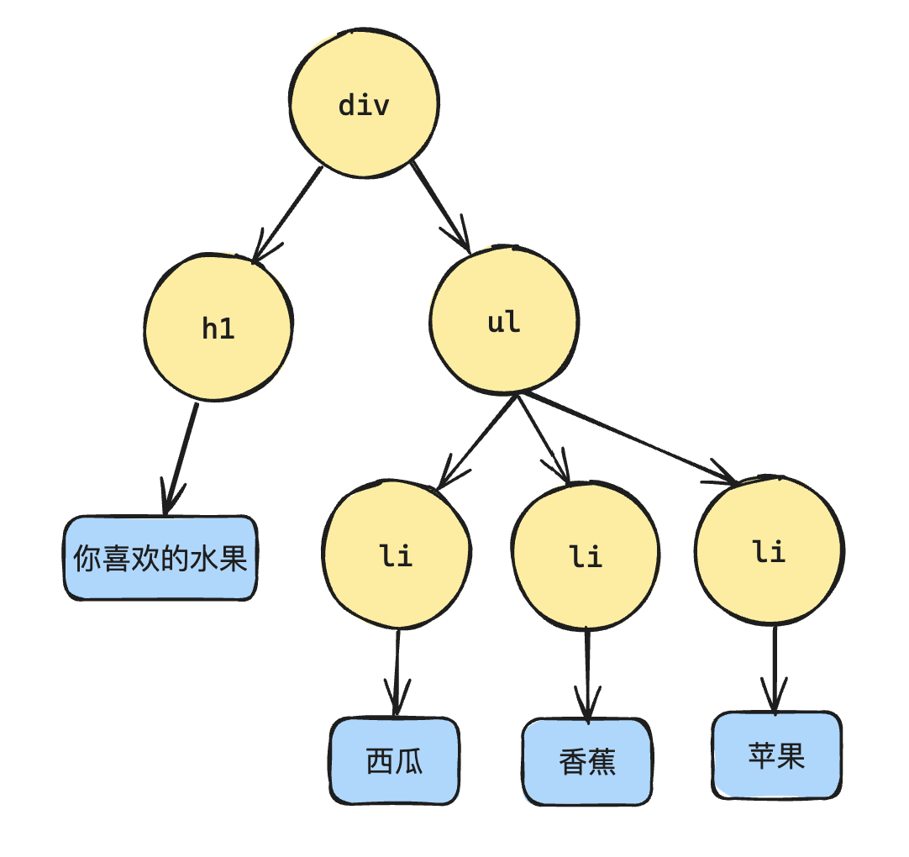
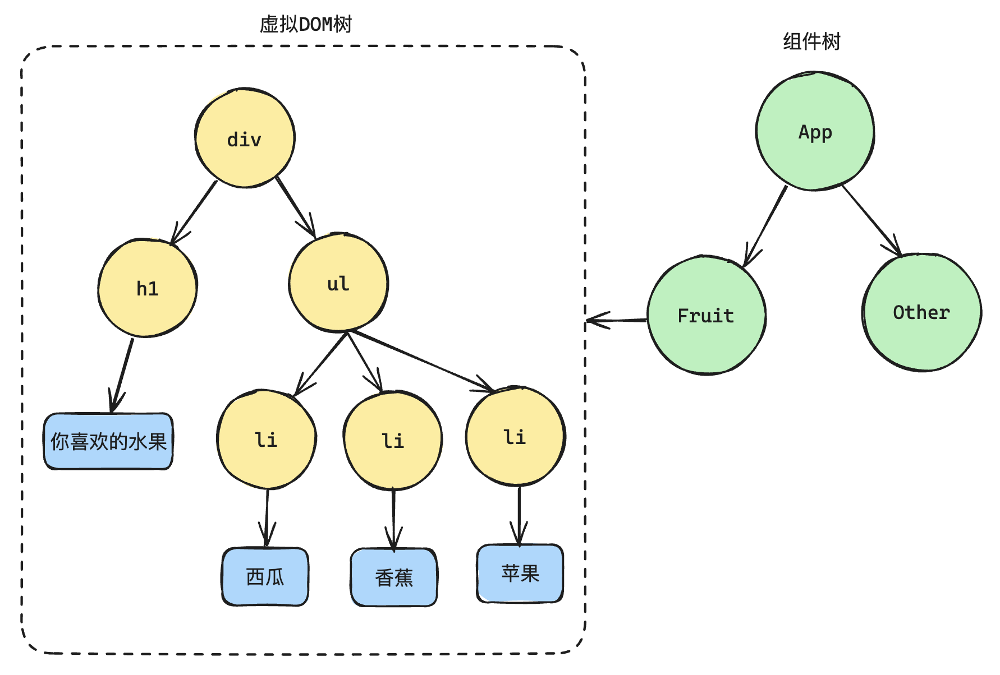
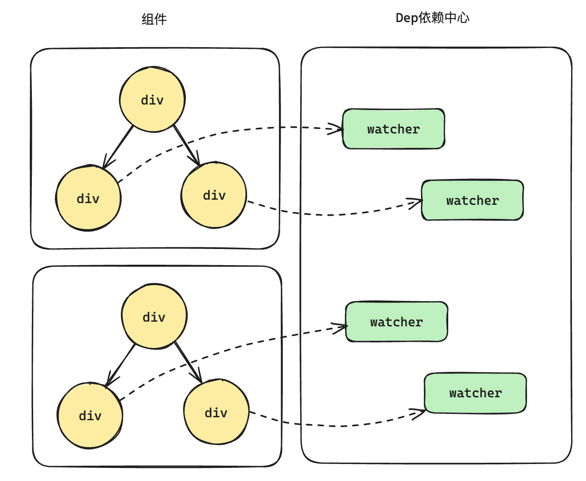
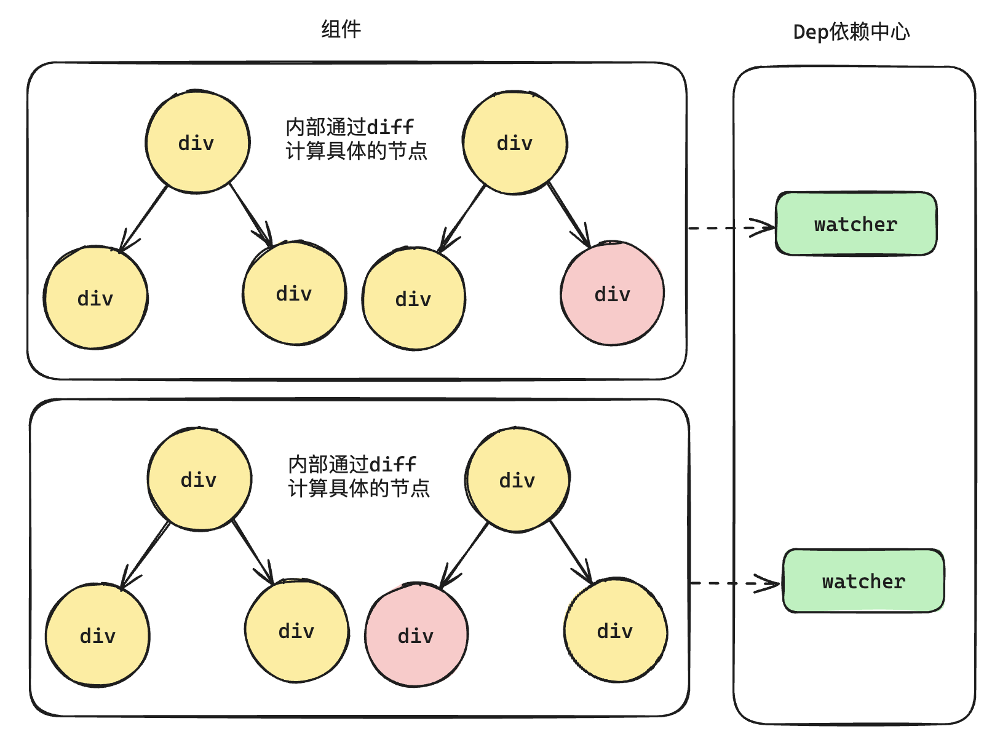

# P3S04L36：组件树和虚拟 DOM 树

---

在最早期的时候，大家接触到的树就是 `DOM` 树：

```html
<div>
	<h1>你喜欢的水果</h1>
  <ul>
    <li>西瓜</li>
    <li>香蕉</li>
    <li>苹果</li>
  </ul>
</div>
```

上面的 `HTML` 结构就会形成一个 `DOM` 树结构：



实际上，组件的本质就是 **对一组 DOM 进行复用**。

假设将上述 `DOM` 结构封装成一个 `Fruit` 组件，该组件就导入其他组件里，组件和组件之间就形成了树结构，这就是 **组件树**；而每个组件的背后，对应的是一组 **虚拟 DOM**，虚拟 `DOM` 的背后又是真实 `DOM` 的映射：



接下来明确定义：

- 组件树：指一个一个组件所形成的树结构。
- 虚拟 `DOM` 树：在这里特指 **某一个组件内部的** 虚拟 `DOM` 数据结构，**并非整个应用的虚拟 DOM 结构**。

理解清楚上面的概念，有助于理解为什么 `Vue` 中既有响应式，又有虚拟 `DOM` 以及 `diff` 算法。

回顾 `Vue 1.x` 以及 `Vue 2.x` 的响应式：

- `Object.defineProperty`
- `Dep` 依赖中心：相当于观察者模式中的 **发布者**。
- `Watcher`：相当于观察者模式中的 **观察者**。

但是在 `Vue 1.x` 时没有虚拟 `DOM`，模板中每引用一个响应式数据，就会生成一个 `watcher`：

```vue
<template>
  <div class="wrapper">
    <!-- 模版中每引用一次响应式数据，就会生成一个 watcher -->
    <!-- watcher 1 -->
    <div class="msg1">{{ msg }}</div>
    <!-- watcher 2 -->
    <div class="msg2">{{ msg }}</div>
  </div>
</template>

<script>
export default {
  data() {
    return {
      // 和 dep 一一对应，和 watcher 的关系为：一对多
      msg: 'Hello Vue 1.0'
    }
  }
}
</script>
```

- 优点：能够精准知道哪个数据发生了变化。
- 缺点：当应用足够复杂时，一个应用会包含大量组件，导致一个组件对应多个 `watcher`，这样的设计是非常消耗资源：



于是从 `Vue 2.0` 版本起引入了虚拟 `DOM`。`Vue 2.0` 的响应式有一个非常大的变动：将 `watcher` 的粒度放大到了 **组件级别**，一个组件对应一个 `watcher`。但这样也会带来一些新的问题：以前能够精准知道哪一个节点需要更新，现在 `watcher` 只知道是哪个组件要更新，组件内部具体是哪个节点更新是无从得知的。此时虚拟 `DOM` 就派上用场了，通过对虚拟 `DOM` 进行 `diff` 计算，就能知道组件内部具体是哪一个节点更新：



`Vue3` 的响应式在架构层面上面是没有改变的，仍然是 **响应式 + 虚拟 DOM**

- 响应式：精确到组件级别，能够知道哪一个组件更新了。不过 `Vue3` 的响应式基于 `Proxy`；
- 虚拟 `DOM`：通过 `diff` 算法计算哪一个节点需要更新，不过 `diff` 算法也不再是 `Vue2` 中的 `diff` 算法，算法方面也有更新。

---

-EOF-