# P2S07S39：Vue 响应式的本质

---


> [!tip]
>
> 本节重点阐释上节课提到的两个概念——
>
> - 依赖收集：所谓的依赖收集，其实就是收集一些函数。之所以提前收集，是为了在数据发生变化时，需要重新执行这些函数。
> - 派发更新：所谓的派发更新，就是通知被收集的函数：现在数据已更新，你们需要重新执行一遍。


## 1 Vue 响应式中的数据的含义

【当数据发生变换会通知一些函数重新执行】，这里的【数据】指的就是 **响应式数据**。

具体到 `Vue` 中指的是通过以下途径得到的数据：

- `ref`
- `reactive`
- `props`
- `computed`

上述方式所得到的数据，就是响应式数据。


## 2 Vue 响应式中的依赖的含义

问：谁和谁之间存在依赖关系？

答：**响应式数据** 和 **函数** 之间有依赖关系。**当函数在运行期间用到了响应式数据，就可以说：二者之间存在依赖**。

怎么理解这里的 **用到** ？

**所谓用到，是指函数在运行期间出现了 “读取其数据成员时触发了【读取拦截】的相关逻辑”，这样才算是用到**。

完整表述：**函数在运行期间，出现了读取响应式数据被拦截的情况，我们就称之为两者之间产生了依赖，这个依赖（也就是一个对应关系）是会被收集的，方便响应式数据发生变化时重新执行对应的函数**。

> [!tip]
>
> **DIY 改进版**
>
> > 当一个被 `Vue` 追踪的副作用函数在执行时，如果它同步读取了响应式数据的属性，就会触发该属性的读取拦截器，从而在框架内部建立起 **数据 → 副作用函数** 的依赖关系。这个关系会被收集起来，当数据变化时，`Vue` 就能找到这些函数并重新执行。


### 习题强化：响应式依赖（8 个）

判定下列数据和函数是否存在响应式依赖：

```js
// demo1
var a;
function foo() {
  console.log(a);
}
// 不存在依赖关系，因为 a 不是响应式数据
```

```js
// demo2
import { ref } from 'vue'
var a = ref(1);
function foo() {
  console.log(a);
}
// 不存在依赖关系，虽然用到了响应式数据，但是没有出现读取拦截的情况
```

```js
// demo3
import { ref } from 'vue'
var a = ref(1);
function foo() {
  console.log(a.value);
}
// 存在依赖关系，函数 foo 依赖了 value 属性
```

```js
// demo4
import { ref } from 'vue'
var a = ref({ b: 1 });
const k = a.value;
const n = k.b;
function foo() {
  a;
  a.value;
  k.b;
  n;
}
// 存在两个依赖关系：
// foo 依赖 a 的 value 属性
// foo 依赖 k 的 b 属性
```

```js
// demo5
import { ref } from 'vue'
var a = ref({ b: 1 });
const k = a.value;
const n = k.b;
function foo() {
  a;
  k.b;
  n;
}
// 存在依赖关系：函数 foo 依赖 k 的 b 属性
```

```js
// demo6
var a = ref({ b: 1 });
const k = a.value;
const n = k.b;
function foo() {
  a;
  a.value.b
  n;
}
// 存在依赖关系
// 函数 foo 依赖 a 的 value 属性以及 b 属性
```

```js
// demo7
var a = ref({ b: 1 });
const k = a.value;
const n = k.b;
function foo() {
  function fn2(){
    a;
    a.value.b
    n;
  }
  fn2();
}
// 有依赖关系
// 函数 foo 依赖 a 的 value 属性以及 b 属性
```

注意：**只需判断在函数的运行期间，是否存在对数据成员读取操作行为的拦截，即可；只要存在这类拦截，则该函数就和该响应式数据存在依赖关系**。

**但如果在函数的运行期间存在异步代码，那么之后的代码统统不看了**：

```js
// demo8
var a = ref({ b: 1 });
const k = a.value;
const n = k.b;
async function foo() {
  a;
  a.value; // 产生依赖，依赖 value 属性
  await 1;
  k.b; // 没有依赖，因为它是异步后面的代码
  n;
}
```

> [!tip]
>
> **DIY 深挖：为什么不看了？**
>
> 示例：
>
> ```js
> import { reactive } from 'vue'
> const state = reactive({ count: 0 });
> 
> effect(() => {
>  // 1. 函数执行
>  console.log(state.count); 
>  // 2. 读取 state.count
>  // 3. 由于 state 是 Proxy，这个“读取操作”被拦截器捕获
>  // 4. 拦截器发现当前有 effect 在执行，于是记录：这个 effect 依赖了 count
> });
> ```
>
> 上述代码如果将 `state.count` 写在 `setTimeout` 或 `Promise` 里（异步逻辑），虽然读取了响应式数据，但由于读取发生时，外层的 `effect` 函数已经执行完毕，当前没有“被监控的函数”在栈中，因此也不会收集到依赖。


## 4 深入理解 Vue 响应式依赖关系中的函数

`Vue` 响应式依赖关系中的函数 **必须是被监控的函数**，即通过以下方式处理过的函数：

- `effect`：这是 `Vue3` 源码内部的底层实现（后期会介绍）
- `watchEffect`
- `watch`
- `render`（组件渲染函数）

总结：**只有被监控的函数在其同步代码运行期间，与满足下列条件的响应式数据才会建立依赖关系：**

- **响应式数据成员的读取操作被拦截**

**依赖关系建立后，一旦响应式数据发生变化，对应的函数逻辑才会重新执行**。


### 习题强化：响应式依赖（14 个）

以下 14 套习题手动构造了响应式数据和副作用函数的各种组合。利用手动变更响应式数据，测试函数逻辑是否会同步触发，以进一步强化对 **响应式依赖** 相关概念的理解。

#### 代码重构说明

由于响应式依赖中的函数必须是被监控函数，而经 `watchEffect` 处理后的函数，会在初始注册时自动执行函数体中的逻辑。为了排除首次执行对观测结果的干扰，原课件使用了 `setTimeout` 从时间上进行区分：立即触发的日志内容是初始注册导致的；`0.5s` 后的输出内容才是 `Vue` 派发更新后输出的：

```js
// demo1
import { ref, watchEffect } from "vue";
const state = ref({ a: 1 });
const k = state.value;
const n = k.a;
watchEffect(() => {
  // 首先判断依赖关系
  console.log("运行");
  state; // 没有依赖关系产生
  state.value; // 会产生依赖关系，依赖 value 属性
  state.value.a; // 会产生依赖关系，依赖 value 和 a 属性
  n; // 没有依赖关系
});
setTimeout(() => {
  state.value = { a: 3 }; // 要重新运行
}, 500);
```

实测情况：

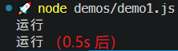

为排除初始注册函数的多余输出，构建如下自定义模块 `utils/checkEffect.js`：

```js
import { watchEffect } from "vue"

const logBuilder = (initMsg, msg) => {
  let first = true
  return () => {
    if(first) {
      first = false
      initMsg && console.log(initMsg);
    } else {
      console.log(msg);
    }
  }
}

const skipFirst = logBuilder('(初始加载 effect, 非派发更新)', '执行了派发更新')

export const checkEffect = fn => 
  watchEffect(() => {
    skipFirst()
    fn()
  })
```

重构测试代码 `demos/demo1.js`：

```js
// demo1
import { ref } from 'vue'
import { checkEffect } from '../utils/checkEffect.js'

const state = ref({ a: 1 })
const k = state.value
const n = k.a
// 监控函数
checkEffect(() => {
  // 首先判断依赖关系
  state // 没有依赖关系产生
  state.value // 会产生依赖关系，依赖 value 属性
  state.value.a // 会产生依赖关系，依赖 value 和 a 属性
  n // 没有依赖关系
})

// 测试更新
state.value = { a: 3 } // 要派发更新
```

然后运行测试命令 `node demos/demo1.js`，实测结果：

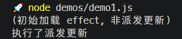

如果不想输出第一次运行的日志，可以将 `skipFirst` 修改为：

```js
const skipFirst = logBuilder(void(0), '执行了派发更新')
```

实测效果：


#### 习题1

依赖了某个成员，后续也变更了该成员状态，则派发更新：

```js
// demo1
import { ref } from 'vue'
import { checkEffect } from '../utils/checkEffect.js'

const state = ref({ a: 1 })
const k = state.value
const n = k.a
// 监控函数
checkEffect(() => {
  // 首先判断依赖关系
  state; // 没有依赖关系产生
  state.value; // 会产生依赖关系，依赖 value 属性
  state.value.a; // 会产生依赖关系，依赖 value 和 a 属性
  n; // 没有依赖关系
})

// 测试更新
state.value = { a: 3 } // 要派发更新
```

实测结果：

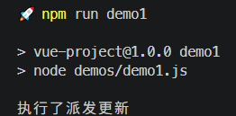


#### 习题2

仅读取属性，或者赋相同的基本类型值，都不会派发更新：

```js
// demo2
import { ref } from "vue";
import { checkEffect } from "../utils/checkEffect.js";

const state = ref({ a: 1 });
const k = state.value;
const n = k.a;
checkEffect(() => {
  state;
  state.value; // value
  state.value.a; // value a
  n;
});

state.value; // 不会重新运行
state.value.a = 1; // 不会重新运行
```

实测结果：

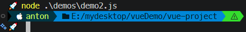


#### 习题3

函数读取了 `Proxy` 对象的成员，数据后续又变更了该成员状态，则会派发更新：

```js
// demo3
import { ref } from "vue";
import { checkEffect } from "../utils/checkEffect.js";

const state = ref({ a: 1 });
const k = state.value;
const n = k.a;
checkEffect(() => {
  state;
  state.value; // value
  state.value.a; // value、a
  n;
});

k.a = 2; /* 这里相当于是操作了 proxy 对象的成员 a
            因此派发了更新 */
// 若注释掉 L12 的 state.value.a 则不会派发更新
```

实测结果：


#### 习题4

仅修改响应式数据成员基本类型值的副本，不会派发更新：

```js
// demo4
import { ref } from "vue";
import { checkEffect } from "../utils/checkEffect.js";

const state = ref({ a: 1 });
const k = state.value;
let n = k.a;
checkEffect(() => {
  state;
  state.value;
  state.value.a;
  n;
});

n++; // 不会派发更新
// k.a++; // 会派发更新
```

实测结果：

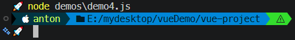

但是 `k.a++` 是对响应式成员的状态变更，因此会派发更新：

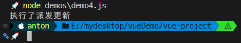


#### 习题5

目标函数依赖了 `value` 属性以及 `Proxy` 实例的 `a` 属性，因此变更 `a` 的状态会派发更新：

```js
// demo5
import { ref } from "vue";
import { checkEffect } from "../utils/checkEffect.js";

const state = ref({ a: 1 });
const k = state.value;
let n = k.a;
checkEffect(() => {
  state;
  state.value;
  state.value.a;
  n;
});

state.value.a = 100; // 会派发更新
```

实测结果：

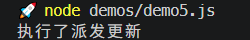

#### 习题6

函数虽然依赖了 `value` 属性和 `Proxy` 对象的 `a` 属性，但后续的状态变更并不涉及这两个属性，因此不派发更新：

```js
// demo6
import { ref } from "vue";
import { checkEffect } from "../utils/checkEffect.js";

let state = ref({ a: 1 });
const k = state.value;
let n = k.a;
checkEffect(() => {
  state;
  state.value;
  state.value.a;
  n;
});

state = 100; // 不要重新运行
```

实测结果：

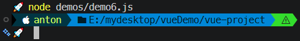

#### 习题7

虽然依赖了 `value` 属性，但变更的是 `value` 属性下的 `a` 属性的状态，因此不派发更新：

```js
// demo7


const state = ref({ a: 1 });
const k = state.value;
const n = k.a;
checkEffect(() => {
  state;
  state.value; // value 会被收集
  n;
});

state.value.a = 100; // 不会派发更新
```

实测结果：

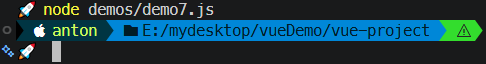

#### 习题8

由于 `ref` 默认的深度拦截机制，函数将同时依赖 `value` 属性和 `a` 属性（`L9`），因此对 `value` 的状态变更会同步派发更新：

```js
// demo8
import { ref } from "vue";
import { checkEffect } from "../utils/checkEffect.js";

let state = ref({ a: 1 });
const k = state.value;
const n = k.a;
checkEffect(() => {
  state.value.a; // value 和 a 被收集
});

state.value = {}; // 会派发更新
```
实测结果：

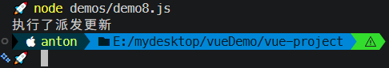

> [!tip]
>
> 如果 `L12` 改为 `state.value = {a: 1};`，则由于引用地址的不同，也会派发更新：
>
> 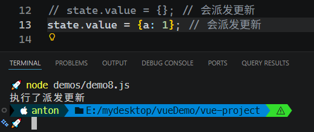


#### 习题9

根据深度绑定机制，函数对 `a` 属性的赋值操作只依赖了 `a` 之前的 `value` 属性，因此对 `a` 的状态变更并不会派发更新：

```js
// demo9
import { ref } from "vue";
import { checkEffect } from "../utils/checkEffect.js";

const state = ref({ a: 1 });
checkEffect(() => {
  state.value.a = 2; // 注意这里的依赖仅仅只有 value 属性
});

state.value.a = 100; // 不会派发更新
// state.value = {}; // 会派发更新
```

实测结果：

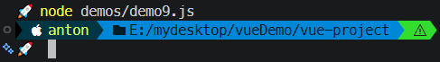

> [!tip]
>
> 但如果变更 `value` 属性的状态，则会派发更新：
>
> 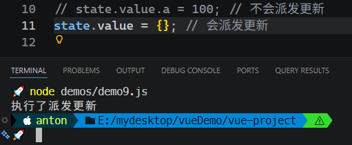


#### 习题10

通过 `state.value` 或 `k` 来变更 `Proxy` 对象的 `a` 属性状态都会派发更新：

```js
// demo10
import { ref } from "vue";
import { checkEffect } from "../utils/checkEffect.js";

let state = ref({ a: 1 });
const k = state.value;
const n = k.a;
checkEffect(() => {
  state;
  state.value.a; // value、a
  n;
});

Promise.resolve()
  .then(() => (state.value.a = 2))
  .then(() => (k.a = 3))
  .then(() => (k.a = 2));
```

实测结果：

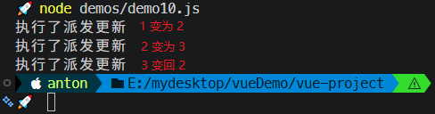

但如果注释掉 `L16`，`L17` 相对于 `L15` 并没有形成实际意义上的变更，因此 `L17` 不会派发更新：

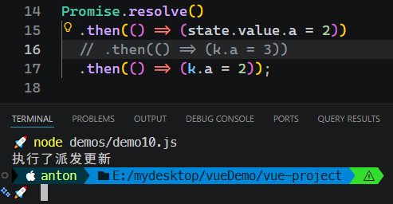

> [!note]
>
> **注意：Vue 默认的批量更新机制**
>
> 如果变更部分全部写为同步逻辑：
>
> ```js
> // Promise.resolve()
> //   .then(() => (state.value.a = 2))
> //   .then(() => (k.a = 3))
> //   .then(() => (k.a = 2));
> 
> state.value.a = 2
> k.a = 3
> k.a = 2
> ```
>
> 则最终只打印一条派发更新日志，对应最后一次成功触发的状态变更（即代码中的 `L8`、截图中的 `L21`）：
>
> 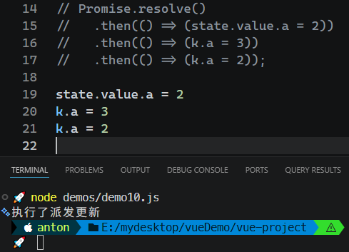
>
> 这是因为 `Vue` 的 `watchEffect` 默认使用 **异步调度**（微任务），在一次同步代码的执行过程中，多次修改同一响应式属性，只会产生一个更新任务。
>
> 要取消默认行为，强制同步逻辑的每次变更都派发更新，则可在 `watchEffect()` 方法中添加 `{flush: 'sync'}` 配置（代价是丢失性能优势）：
>
> 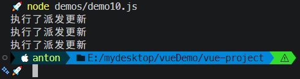
>
> 此时再注释掉 `k.a = 3` 这一行，最后一句因为对比第一句没有实质上的状态变更，因此只派发第一次更新：
>
> 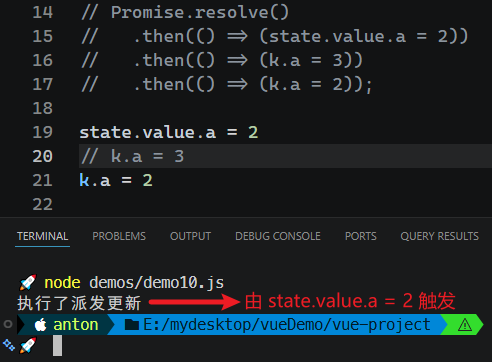
>
> 怎样求证是 `L19` 派发的更新而不是 `L21` 呢？在原函数加入一句打印即可（`L5`）：
>
> ```js
> checkEffect(() => {
>   state;
>   state.value.a; // value、a
>   n;
>   console.log(state.value.a);
> });
> ```
>
> 再次验证：
>
> 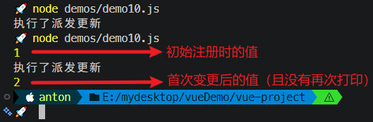


#### 习题11

```js
// demo11
import { ref } from "vue";
import { checkEffect } from "../utils/checkEffect.js";

let state = ref({ a: 1 });
const k = state.value;
const n = k.a;
checkEffect(() => {
  state.value.a; // 会收集 value 和 a
});

Promise.resolve()
  .then(() => (state.value = { a: 1 })) // 变更 value 的状态，会派发更新
  .then(() => (k.a = 3)); // 本行不会派发更新，因为前面修改了 state.value，不再是同一个代理对象
```

点评：由于 `k` 指向的 `Proxy` 对象在 `L13` 后已经被替换，因此后续对 `k.a` 属性的变更不再派发更新。

实测结果：

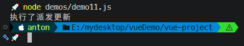


#### 习题12

```js
// demo12
import { ref } from "vue";
import { checkEffect } from "../utils/checkEffect.js";

let state = ref({ a: 1 });
const k = state.value;
const n = k.a;
checkEffect(() => {
  state.value.a; // 收集依赖 value 及 a 
});

Promise.resolve()
  .then(() => (state.value = { a: 1 }))  // 派发更新
  .then(() => (state.value.a = 2));  // 派发更新
```

实测结果：

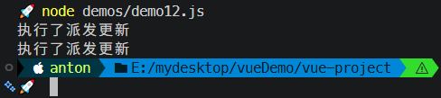

#### 习题13

```js
// demo13
import { ref } from "vue";
import { checkEffect } from "../utils/checkEffect.js";

let state = ref({ a: 1 });
const k = state.value;
const n = k.a;
checkEffect(() => {
  state.value.a; // 深度拦截 value 和 a 属性
});

Promise.resolve()
  .then(() => (state.value = { a: 1 })) // 派发更新
  .then(() => (state.value.a = 1)); // 不派发更新，因为值没有变化
```

实测结果：

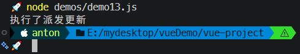

#### 习题14

```js
// demo14
import { ref } from "vue";
import { checkEffect } from "../utils/checkEffect.js";

let state = ref({ a: 1 });
const k = state.value;
checkEffect(() => {
  state.value.a; // value、a
  k.a; // 返回的 proxy 对象的 a 成员
});

Promise.resolve()
  .then(() => (state.value = { a: 1 }))
  .then(() => (state.value.a = 4))
  .then(() => (k.a = 3));
```

点评：虽然 `k` 引用的 `Proxy` 对象在 `L14` 之后被替换为其他对象了，但原函数依旧会收集 `k` 中的 `a` 属性，因此 `L16` 依旧会派发更新：

实测结果：

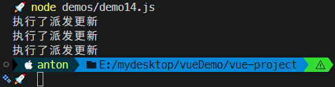


## 5 小结

在这节课的最后，我们再对响应式的本质做一个完整的总结：

**<u>所谓响应式，背后其实就是函数和数据的一组映射，当数据发生变化，会将该数据对应的所有函数全部执行一遍。当然这里的数据和函数都是有要求的。数据是响应式数据，函数是被监控的函数。</u>**

**<u>收集数据和函数的映射关系在 Vue 中被称之为依赖收集，数据变化通知映射的函数重新执行被称之为派发更新。</u>**

什么时候会产生依赖收集？

**<u>只有被监控的函数，在它的同步代码运行期间，读取操作被拦截的响应式数据，才会建立依赖关系，建立了依赖关系之后，响应式数据发生变化，对应的函数才会重新执行</u>**。

> [!tip]
>
> **DIY 补充说明**
>
> 上述依赖收集的触发时机在表述上不太通顺。借助 `DeepSeek` 重新组织语言如下：
>
> **为什么是“拦截”？**
>
> 在现代前端框架（如 `Vue 3` 或 `React` 的细粒度响应式方案）中，【响应式数据】本质上是被 **代理** 过的对象（比如 `Proxy`）。
>
> 当我们说【拦截】时，具体指的是：
>
> - 当你 **读取**（`get`）这个对象的属性时，会触发一个 **拦截器**（`trap`）。
> - 这个拦截器不只是返回值，它还会执行一段额外的逻辑：**“记录下当前是谁在读取我”**。
>
> **重新组织语言**
>
> 原文想表达的真实含义是：
>
> > **在监控函数执行期间，当代码试图读取一个响应式数据（即 Proxy 对象）时，这个“读取操作”会被 Proxy 的 get 拦截器捕获，从而将当前正在执行的函数（副作用）与这个数据关联起来。**
>
> 如果把这句话说得更通顺一些，可以理解为：
>
> > **只有当被监控的函数在执行过程中，触发了响应式数据的“读取拦截”时，才会建立依赖关系。**
> >
> > 或者：
> >
> > **依赖收集发生的条件是：当一个被监控的函数正在执行时，其同步代码中执行了对响应式数据的“读取”操作。此时，该数据的读取拦截器会捕获这次访问，并将当前函数记录为依赖。**

---

-EOF-