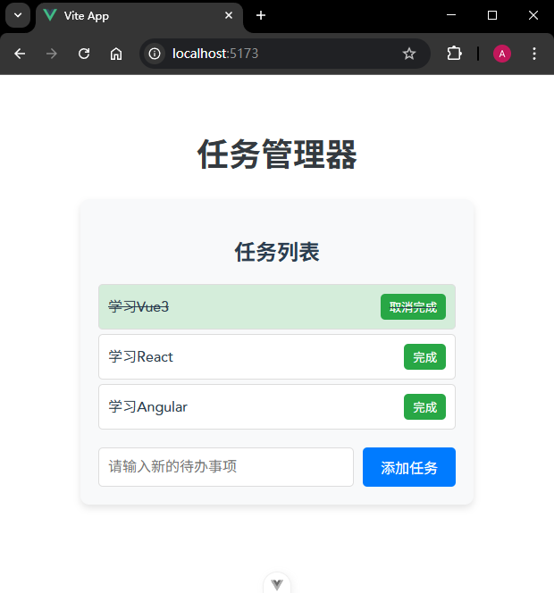

# P3S08L40：Vue 响应式与组件渲染的关系

---

回顾上节内容：

- 模板的本质：即 `render` 渲染 **函数**。该函数执行之后，会返回虚拟 `DOM`——一种用来描述真实 `DOM` 的数据结构。
- 响应式的本质：当数据发生变化时，依赖该数据的 **函数** 重新运行。


## 1 关于响应式数据与 render 函数的关系

假设 `render` 函数运行期间用到了响应式数据会怎样？

答：此时 `render` 函数会依赖该响应式数据，并在该数据发生变化时，重新运行关联的 `render` 函数，进而得到新的虚拟 `DOM` 结构。然后渲染器会根据新的虚拟 `DOM` 结构去更新真实的 `DOM` 结构，在视觉感官上看到的则是界面的变化。

>[!tip]
>
>这里说的重新运行 `render` 函数其实还不太准确，在源码层，重新运行的是 `updateComponent` 方法，而该方法的内部调用了 `render` 函数。


## 2 再探模板编译

`App.vue`：

```vue
<template>
  <div>{{ name }}</div>
  <div>{{ age }}</div>
</template>

<script setup>
import { ref } from 'vue'
let name = ref('Bill')
let age = ref(18)
</script>
```

上述模板包含两个用 `ref` 定义的响应式数据，它们在模板中会自动解包 `value` 值，相当于读取了 `vlaue` 属性的值，进而触发该属性的读取拦截逻辑；这样，响应式数据就会与模板对应的渲染函数相关联，形成依赖关系。

建立依赖关系后，响应式数据的变化就会导致渲染函数（被监控函数）的重新执行，于是得到新的虚拟 `DOM`，从而让 `UI` 更新。

以下是通过 `vite-plugin-inspect` 插件得到的编译分析结果，可进一步验证上述说法：


在 `setup` 函数定义的响应式数据，会转变成一个名为 `__returned__` 的对象上的访问器属性（例如 `get name()` 和 `set name(v)`）。当对这些属性进行读写访问时就会触发相应的拦截逻辑。

在渲染函数 `_sfc_render` 中，`setup` 函数返回的对象（响应式数据）可由 `$setup` 参数访问，具体通过 `$setup.name` 和 `$setup.age` 读取访问器属性，进而触发读取拦截，最终和渲染函数建立起依赖关系。


## 3 Vue 实现精准更新的底层逻辑

前面介绍过，**Vue 的更新是组件级别的**：通过响应式就能知道具体是哪个组件更新了。

因为响应式数据是和 `render` 函数相关联的，而 `render` 函数对应的是整个组件的结构；响应式状态一旦变更，`render` 函数就会重新执行，生成新的虚拟 `DOM` 结构。

若要知晓具体是哪一个节点更新，就需依靠 `diff` 算法了。

- `Vue2`：双端 `diff`
- `Vue3`：快速 `diff`（性能大幅优化，甚至赶超 `React`）


## 4 Vue 实现数据共享的底层逻辑

`Vue` 可以轻松实现数据共享，其底层逻辑是：**只需要将响应式数据单独提取出来（导出），然后让多个组件依赖该响应式数据。一旦该响应式数据的状态变更，依赖该数据的组件就会自然地重新运行 render 函数，再由渲染器渲染出新的 DOM 结构**。

例如下列简版 `store`：

```js
import { reactive } from 'vue'

export const store = reactive({
  todos: [
    {
      id: 1,
      text: '学习Vue3',
      completed: false
    },
    {
      id: 2,
      text: '学习React',
      completed: false
    },
    {
      id: 3,
      text: '学习Angular',
      completed: false
    }
  ],
  addTodo(todo) {
    this.todos.push(todo)
  },
  toggleTodo(id) {
    const todo = this.todos.find((todo) => todo.id === id)
    if (todo) {
      todo.completed = !todo.completed
    }
  }
})
```

> 完整示例代码详见本节配套代码 `code/raw/vue-project`。

实测效果：




## 5 关于 Pinia 的作用

`Pinia` 是官方推荐的、经过了完善测试的状态管理工具库，相比纯手动开发能提供更多附加价值：

- 开发工具的支持
- 模块的热替换（`HMR`）
- 插件机制（后续详解）
- 自动补全
- `SSR`

而且相较于单纯的响应式数据，`Pinia` 的语义表达也更胜一筹：

- 一个单独抽出的 `reactive` 对象，从语义上看可能指代任何事物；
- 一个 `Pinia` 对象，从语义上看即代表一个全局共享数据的仓库。

这样也能在一定程度上降低开发者的心智负担，提高代码的可读性。

---

-EOF-