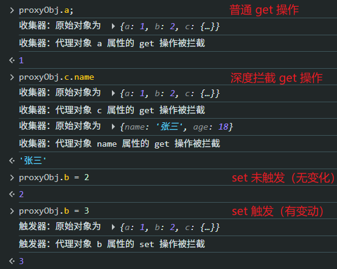
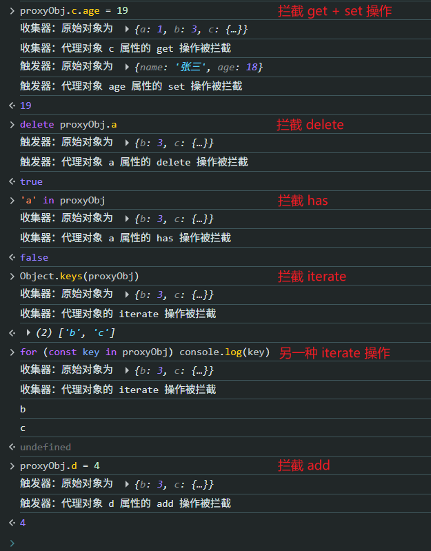

# P3S09L41：纯手动实现 Vue 响应式系统（一）

---

> [!tip]
>
> **内容概要**
>
> 从本节开始，我们将基于 `Vue` 的响应式原理仿写一套简易的响应式系统。本节为第一部分，主要搭建基本结构，覆盖 `JS` 对象的常见操作。


## 1 实现响应式的核心要点

要手动实现一个响应式系统，需要考虑的核心功能点有两个：

1. 数据读写的监听
2. 数据与函数的关联

只要实现了这两个部分，整个响应式系统也就基本成型了。


### 1.1 数据读写的监听

- 数据：在 `JS` 中，能够拦截读写的方式，无非 `Object.defineProperty` 和 `Proxy` 两种，这两个方法都是针对对象而言的，因此这里只对 **对象型数据** 的相关操作进行监听；
- 读写：监听读写的说法还略显宽泛和模糊，更细粒度的常见操作还包括：
  - 获取属性：读取
  - 设置属性：写入
  - **新增属性：写入**
  - **删除属性：写入**
  - **是否存在某个属性：读取**
  - **遍历属性：读取**


### 1.2 拦截后的处理逻辑

针对不同的行为，被拦截后的处理逻辑也不同。总体讲可分为两大类：

- 收集器：针对 **读取** 行为，负责收集依赖，即建立数据和函数之间的依赖关系；
- 触发器：针对 **写入** 行为，负责触发数据所关联的所有函数的重新执行。

于是得到如下各操作与处理逻辑间的对应关系：

- 获取属性：收集器（获取）
- 设置属性：触发器（设置）
- 新增属性：触发器（新增）
- 删除属性：触发器（删除）
- 是否存在某个属性：收集器（从属）
- 遍历属性：收集器（遍历）

简言之：**但凡涉及属性的访问，则执行对应的收集器中的处理逻辑；涉及属性的设置（新增、删除等），则执行对应的触发器中的处理逻辑**。


## 2 实测备忘

:one: 由于未使用任何构建工具，导入 `JS` 模块时应书写完整的相对路径（包括 `.js` 后缀）：

```js
// handlers/behavior/getHandler.js
import { reactive } from "../../reactive.js";
import { isObject, TrackOperation } from '../../utils.js';
import { track } from '../../effect/track.js';

export function getHandler(target, key) {
    
    track(target, TrackOperation.GET, key);

    const res = Reflect.get(target, key);
    
    return isObject(res) 
        ? reactive(res)
        : res;
}
```

:two: 无论是收集器还是触发器，拦截后的处理逻辑尽量用 `Reflect` 反射 `API`（`L6`）：

```js
import { track } from "../../effect/track.js";
import { TrackOperation } from "../../utils.js";

export function ownKeysHandler(target) {
    track(target, TrackOperation.ITERATE);
    return Reflect.ownKeys(target);
}
```

:three: 将拦截情况放到浏览器控制台更容易观察结果（代码详见本节 `code/diy/reactive`）：



为此，需要新增一个 `index.html` 页面，导入 `JS` 入口文件 `index.js`：

```html
<!DOCTYPE html>
<html lang="en">
<head>
    <meta charset="UTF-8">
    <meta name="viewport" content="width=device-width, initial-scale=1.0">
    <title>DIY reactivity system</title>
</head>
<body>
    <h1>DIY reactivity system</h1>
    <script src="./index.js" type="module"></script>
</body>
</html>
```

更多测试情况：

