# P3S09L41：纯手动实现 Vue 响应式系统（二）

---

> [!tip]
>
> **内容提要**
>
> 本节主要对上一节自定义的响应式转化函数 `reactive()` 作进一步完善，重点补充待转换对象为 **数组** 时的几个边界条件。


## 1 要点梳理

### 1.1 完善 reactive 实现

当一个 **数组对象** 作为 `target` 参数传入 `reactive` 时，情况比普通 `JS` 对象略显复杂。实施改造前，先对原版实现作如下改进：

- 如果参数并非 `JS` 对象，则直接返回该参数；
- 如果参数之前已经处理过，则通过缓存逻辑返回上一次的处理结果。

:one: 对于非对象型参数，直接返回参数本身：

```js
// 对象判定逻辑
import { handlers } from "./handlers/index.js";
import { isObject } from './utils.js';

export function reactive(target) {
  
  // filter non-object target
  if(!isObject(target)) {
    return target;
  }
  
  return new Proxy(target, {
    ...handlers
  });
}
```

:two: 对于已经转换过的代理对象，直接返回原来的处理结果（构造一个缓存对象 `proxyMap`）：

```js
import { handlers } from "./handlers/index.js";
import { isObject } from './utils.js';

const proxyMap = new WeakMap();

export function reactive(target) {
  
  // filter non-object target
  if(!isObject(target)) {
    return target;
  }

  // check proxy cache
  if(proxyMap.has(target)) {
    return proxyMap.get(target);
  }

  const proxy = new Proxy(target, {
    ...handlers
  });

  // cache proxy
  proxyMap.set(target, proxy);

  return proxy;
}
```

> [!tip]
>
> **使用 WeakMap 作缓存的原因**
>
> - **`Map`**：对键是 **强引用**。只要 `proxyMap` 这个 `Map` 对象还存在，其中的 `target` 对象就永远不会被垃圾回收（`GC`），即使程序中已经没有其他地方再使用这个 `target` 了；
> - **`WeakMap`**：对键是 **弱引用**。如果一个 `target` 对象除了 `WeakMap` 中的键以外，没有任何其他引用，那么这个 `target` 可以被 `GC` 正常回收，同时 `WeakMap` 中对应的条目也会自动消失。


### 1.2 对数组拦截逻辑的优化

若 `target` 参数为一个数组对象，情况会比普通 `JS` 对象略显复杂。本节将基于常见的数组操作进行讨论。

首先搭建测试用例：

```js
// index.js
import { reactive } from "./reactive.js";

const obj = window.obj = {
  a: 1,
  b: 2,
  c: {
    name: "张三",
    age: 18,
  },
};

const arr = [1, obj, 3]

const proxyArr = window.proxyArr = reactive(arr);
```

测试目标：检查数组型参数被转化为响应式数据后，依赖收集器和触发器是否正常工作，并且收集的依赖是否正确。

:one: 读取一个数组元素

```js
proxyArr[0]
```

控制台实测结果：

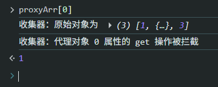

:two: 读取数组的长度

```js
proxyArr.length
```

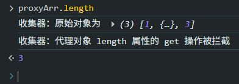

:three: 数组的遍历操作

先测试 `for-in` 遍历：

```js
for(let key in proxyArr) proxyArr[key]
```

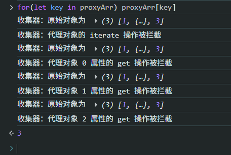

删除收集器 `track()` 对原对象的打印，简化收集到的依赖信息：

```js
// effect/track.js
export function track(target, type, key) {
    const attr = !!key ? ` ${key} 属性` : '';
    // console.log('收集器：原始对象为', target);
    console.log(`收集器：代理对象${attr}的 ${type} 操作被拦截`);
}
```

再次测试遍历操作：

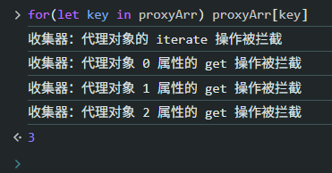

在测试普通 `for` 循环：

```js
for(let i = 0; i < proxyArr.length; i++) proxyArr[i]
```

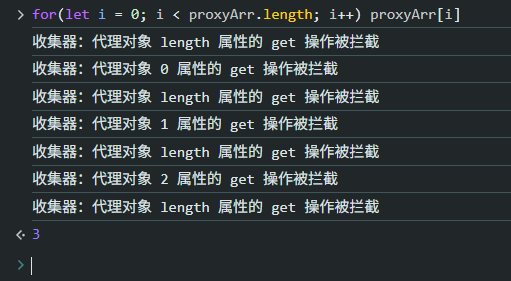

第二种写法（`DIY`）：

```js
for(let i = 0, len = proxyArr.length; i < len; i++) proxyArr[i]
```

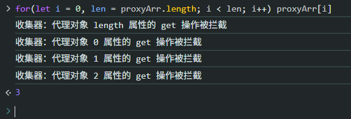


:four: 数组方法

测试 `includes()` 方法：

```js
proxyArr.includes(1)
```

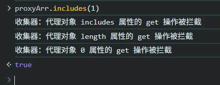

```js
proxyArr.includes(3)
```

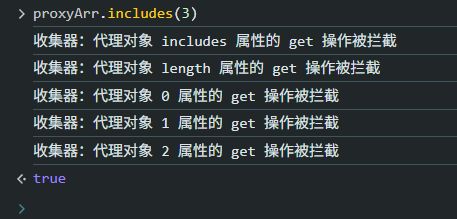

可见 `includes` 内部也执行了类似 `for` 循环的查找。


类似的还有 `indexOf` 及 `lastIndexOf` 方法：

```js
proxyArr.indexOf(1)
proxyArr.lastIndexOf(1)
```

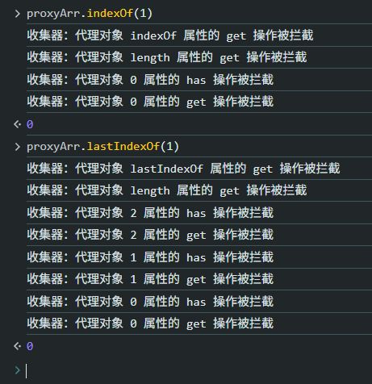

可见返回索引下标的操作每次迭代都包含一个 `has` 操作。


#### 1.2.1 优化1：查找对象型元素与预期不符

用 `includes`、`indexOf` 或 `lastIndexOf` 查找一个对象型元素时，结果与预期不符：

```js
proxyArr.includes(obj)
proxyArr.indexOf(obj)
proxyArr.lastIndexOf(obj)
```

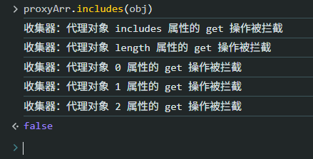

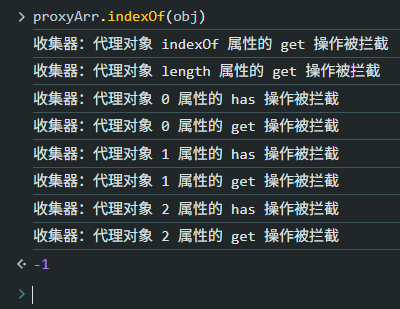

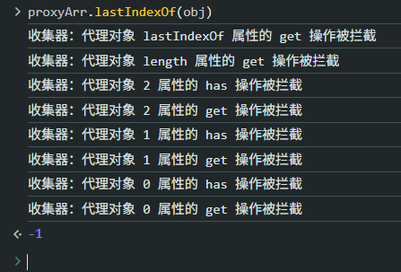

原因：对象型元素默认被递归代理成了响应式数据，而传入的是一个代理前的原对象，因此匹配失败。

解决方案：正常匹配失败后，按原对象再次匹配。

首先重写这三个方法：

```js
const arrayInstrumentations = {};
["includes", "indexOf", "lastIndexOf"].forEach((methodName) => {
  Reflect.set(arrayInstrumentations, methodName, function (...args) {
    const method = Reflect.get(Array.prototype, methodName);
    const res = method.apply(this, args);
    if (res === false || res === -1) {
      return method.apply(this[RAW], args);
    } else {
      return res;
    }
  });
});
```

其中的 `RAW` 是一个唯一标识，定义如下：

```js
// utils.js:
export const RAW = Symbol('raw');
```

再在收集器中拦截这三个属性（数组方法），返回自定义的版本：

```js
export function getHandler(target, key) {
  if (key === RAW) {
    return target;
  }

  track(target, TrackOperation.GET, key);

  // 发现如下方法就返回自定义版本
  if (Array.isArray(target) && arrayInstrumentations.hasOwnProperty(key)) {
    return Reflect.get(arrayInstrumentations, key);
  }

  const res = Reflect.get(target, key);

  return isObject(res) ? reactive(res) : res;
}
```

实测验证（达到预期）：

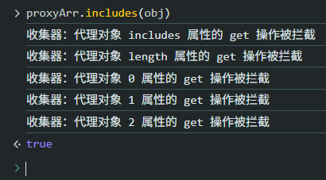

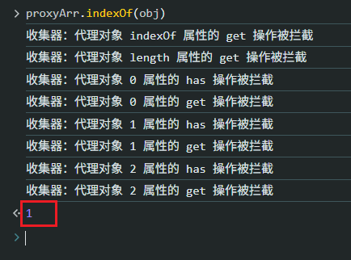

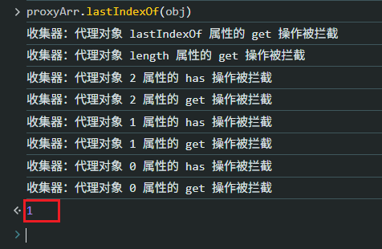


#### 1.2.2 优化2：数组长度的隐式变更

关于数组长度的改变，也会有一些问题。例如隐式改变数组长度，默认情况下并不会触发对 `length` 属性的 `set` 拦截：

```js
proxyArr[5] = 100
```

实测结果：

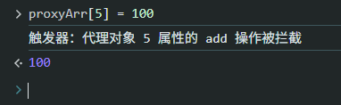

此时数组长度有 `3` 变为 `6`，但默认只拦截了 `add` 操作，`length` 属性的 `set` 操作并未拦截。

解决方案：手动比较数组长度，一旦有变动则触发 `set` 拦截逻辑。

```js
export function setHandler(target, key, value) {
  // 变更前
  const original = Reflect.get(target, key);

  const type = Reflect.has(target, key)
    ? TriggerOperation.SET
    : TriggerOperation.ADD;

  const oldLength = Array.isArray(target)
    ? Reflect.get(target, "length")
    : undefined;

  const res = Reflect.set(target, key, value);

  // 变更后
  if (isDifferent(original, value)) {
    trigger(target, type, key);

    // 数组隐式变更长度的特殊处理
    if (Array.isArray(target)) {
      const newLength = Reflect.get(target, "length");
      if (isDifferent(oldLength, newLength)) {
        trigger(target, TriggerOperation.SET, "length");
      }
    }
  }
  return res;
}
```

第 `L15` 解释：遇到数组长度隐式变更的情况，需要手动触发对 `length` 属性的 `set` 操作。

本地验证：

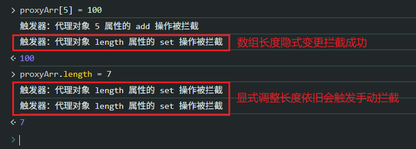

可以看到，长度的隐式变更拦截成功了，但显式变更会重复执行手动拦截，因此应该修正一下：

```js
    // 数组隐式变更长度的特殊处理
    if (Array.isArray(target)) {
      const newLength = Reflect.get(target, "length");
      if (isDifferent(oldLength, newLength)) {
        if (key !== "length") {
          trigger(target, TriggerOperation.SET, "length");
        }
      }
    }
```

最后，对于显式设置 `length` 还涉及数组元素新增和删除：新增情况下的拦截是正常的，但是在删除时，不会触发 `DELETE` 拦截，因此也需要手动触发：

```js
// 数组隐式变更长度的特殊处理
if (Array.isArray(target)) {
  const newLength = Reflect.get(target, "length");
  if (isDifferent(oldLength, newLength)) {
    if (key !== "length") { // 只在隐式变更长度时手动触发 length 的 SET 操作
      trigger(target, TriggerOperation.SET, "length");
    } else {
      for (let i = newLength; i < oldLength; i++) {
        trigger(target, TriggerOperation.DELETE, `${i}`);
      }
    }
  }
}
```

再次验证：

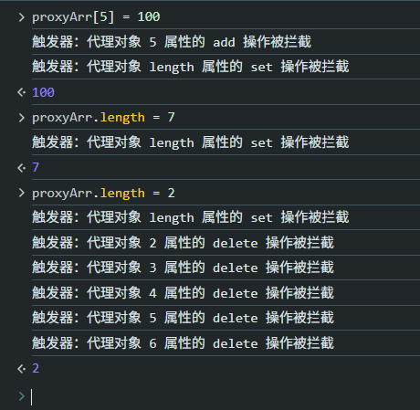


#### 1.2.3 优化3：自定义是否要收集依赖

当调用 `push`、`pop`、`shift` 等方法时，因为涉及 `length` 的变更，默认会触发对 `length` 属性的依赖收集，这可能并非我们的预期行为：

```js
proxyArr.push(4)
```

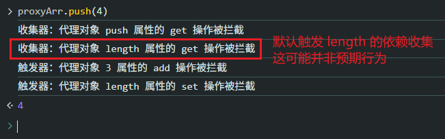

最好的改造方式是：由开发者自主决定是否开启依赖收集。

具体操作：

先在 `track` 模块添加两个开关：

```js
// effect/track.js
// 控制是否收集依赖
let shouldTrack = true;

export function pauseTracking() {
  shouldTrack = false;
}

export function resumeTracking() {
  shouldTrack = true;
}

export function track(target, type, key) {
  if (!shouldTrack) {
    return;
  }

  const attr = !!key ? ` ${key} 属性` : "";
  // console.log('收集器：原始对象为', target);
  console.log(`收集器：代理对象${attr}的 ${type} 操作被拦截`);
}
```

然后在 `getHandler` 重写需要主动控制 `length` 依赖收集的方法：

```js
import { pauseTracking, resumeTracking } from "../../effect/track.js";

// 以下方法由开发者自主控制是否启用对 length 的依赖收集
["push", "pop", "shift", "unshift", "splice"].forEach((methodName) => {
  Reflect.set(arrayInstrumentations, methodName, function (...args) {
    const method = Reflect.get(Array.prototype, methodName);
    pauseTracking();
    const res = Reflect.apply(method, this, args);
    resumeTracking();
    return res;
  });
});
```

实际验证（`length` 默认的依赖收集已被抑制）：

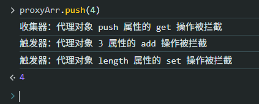


## 2 实测备忘

:one: 隐式变更数组长度：新旧两个长度必须分别写在 **赋值语句** 的一前一后：

```js
export function setHandler(target, key, value) {
  // 变更前
  const oldLength = Array.isArray(target)
    ? Reflect.get(target, "length")
    : undefined;

  const res = Reflect.set(target, key, value);

  // 变更后
  const newLength = Reflect.get(target, "length");
}
```

同理，动态判定操作类型是 `ADD` 还是 `SET` 也必须放在 **赋值语句之前**：

```js
export function setHandler(target, key, value) {
  // 变更前
  const type = Reflect.has(target, key)
    ? TriggerOperation.SET
    : TriggerOperation.ADD;
  
  const res = Reflect.set(target, key, value);

  // 变更后
  if (isDifferent(original, value)) {
    trigger(target, type, key);
    // -- snip --
  }
}
```


:two: 对于 `proxyArr.includes(obj)` 这句代码，拦截的是 `includes` 属性的 `get` 操作，应该返回一个 **方法实现（即函数）**；至于该函数通过传入什么参数来执行，并不受访问拦截的限制。


:three: 实现 `Proxy` 代理中的各种 `handlers` 处理逻辑时，应该尽量使用 `Reflect` 反射 `API` 访问原对象的各种属性。原因如下：

- 保持正确的 `this` 绑定：代理中的 `this` 应指向 `descriptor` 对象本身，而非 `target`；
- 避免无限递归：在 `set`、`deleteProperty`、`defineProperty` 等陷阱（`trap`）中，如果内部又通过代理对象直接修改属性，会再次触发同一个陷阱，导致无限递归；而使用 `Reflect API` 则不会；
- 保持与原始操作完全一致的行为：直接属性访问无法模拟所有元操作，例如 `delete` 操作的返回值；
- 正确处理原型链上的属性：直接读取 `target[prop]` 只会查找 `target` 自身的属性，而 `Reflect.get` 会按照原型链正常查找（就像普通属性访问一样），从而保证代理行为的透明性；


:four: 关于 `receiver`

`receiver` 是 `Proxy` 拦截逻辑（如 `get`、`set` 等）中的一个 **关键参数**，它代表 **最初被调用或操作发生的对象**——通常是代理对象本身，或者继承自该代理的对象。

| 陷阱方法                             | receiver 的含义                                              |
| :----------------------------------- | :----------------------------------------------------------- |
| `get(target, prop, receiver)`        | 读取属性时，**`this` 应该绑定到的对象**（通常是代理对象或继承了该代理的对象） |
| `set(target, prop, value, receiver)` | 赋值操作中，**最初接收赋值的对象**（用于决定原型链上的属性赋值行为） |

当一个属性是访问器属性（有 `getter` 或 `setter`）时，`getter`/`setter` 内部的 `this` 应该指向 **receiver**，而不是原始的目标对象 `target`。

典型示例：

```js
const parent = {
  _name: "Parent",
  get name() {
    return this._name;  // 这里的 this 应该是谁？
  }
};

const proxy = new Proxy(parent, {
  get(target, prop, receiver) {
    // ❌ 错误：target[prop] 会让 getter 内部的 this 指向 target（parent）
    // return target[prop];
    
    // ✅ 正确：Reflect.get 会使用 receiver 作为 getter 的 this
    return Reflect.get(target, prop, receiver);
  }
});

const child = Object.create(proxy);
child._name = "Child";

console.log(child.name);  // 期望输出 "Child"
// 如果不用 receiver，会输出 "Parent"
```

