# P3S11L43：图解 Effect 方法

---


> [!tip]
>
> 本节通过小步迭代的方式，逐步实现 `effect` 函数在关联响应式数据与函数方面的各个功能点。


## 1 初始设计

`effect` 方法的作用：将 **函数** 和 **数据** 关联起来。

回忆 `watchEffect`：

```js
import { ref, watchEffect } from "vue";
const state = ref({ a: 1 });
const k = state.value;
const n = k.a;
// 这里就会整理出 state.value、state.value.a
watchEffect(() => {
  console.log("运行");
  state;
  state.value;
  state.value.a;
  n;
});
setTimeout(() => {
  state.value = { a: 3 }; // 要重新运行传入 watchEffect 的回调函数，value 的写入操作变更了原来的状态
}, 500);
```

`effect` 函数的初始设计如下：

```js
// 原始对象
const data = {
  a: 1,
  b: 2,
  c: 3,
};
// 产生一个代理对象
const state = new Proxy(data, { ... });
effect(() => {
  console.log(state.a);
});
```

上述代码中，向 `effect` 方法传入的回调函数内部访问了 `state` 的成员 `a`；我们期望该成员 `a` 和这个回调函数建立响应式关联。

由于依赖成员 `a` 的回调函数可能不止一个，因此用 **集合** 来保存所有这些函数。这样一来，多次访问 `a` 成员的某个回调函数最多只被记入集合一次。然后再用一个全局的 `Map` 存放 `a` 成员到该集合的映射关系。

第一版 `effect` 函数实现如下：

```js
let activeEffect = null; // 记录当前的函数
const depsMap = new Map(); // 保存依赖关系

function track(target, key) {
  // 建立依赖关系
  if (activeEffect) {
    let deps = depsMap.get(key); // 根据属性值去拿依赖的函数集合
    if (!deps) {
      deps = new Set(); // 创建一个新的集合
      depsMap.set(key, deps); // 将集合存入 depsMap
    }
    // 将依赖的函数添加到集合里面
    deps.add(activeEffect);
  }
  console.log(depsMap);
}

function trigger(target, key) {
  // 这里面就需要运行依赖的函数
  const deps = depsMap.get(key);
  if (deps) {
    deps.forEach((effect) => effect());
  }
}

// 原始对象
const data = {
  a: 1,
  b: 2,
  c: 3,
};
// 代理对象
const state = new Proxy(data, {
  get(target, key) {
    track(target, key); // 进行依赖收集
    return target[key];
  },
  set(target, key, value) {
    target[key] = value;
    trigger(target, key); // 派发更新
    return true;
  },
});

/**
 *
 * @param {*} fn 回调函数
 */
function effect(fn) {
  activeEffect = fn;
  fn();
  activeEffect = null;
}

effect(() => {
  // 这里在访问 a 成员时，会触发 get 方法，进行依赖收集
  console.log(state.a);
  console.log('执行了函数');
});
state.a = 10;

```

上述实现的 **每个属性对应一个 Set 集合**，该集合里面是依赖该属性的函数；所有属性与其对应的依赖函数集合形成一个如下图所示的 `map` 结构：

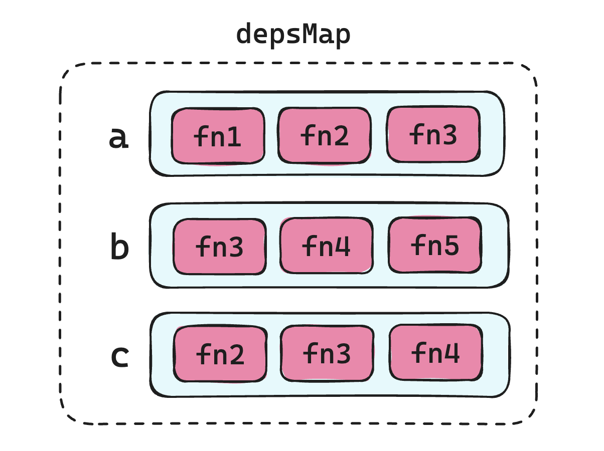

`activeEffect` 起到一个 **中间桥梁** 的作用：临时存储该回调函数，等依赖收集完成后，再将临时变量置空即可：


## 2 问题一：每次运行完回调函数，未能更新依赖关系

回调函数稍作修改就会发现问题：

```js
effect(() => {
  if (state.a === 1) {
    state.b;
  } else {
    state.c;
  }
  console.log("执行了函数");
});
```

第一次运行回调函数，实际发生的依赖收集情况如下（正常）：

```js
Map(1) { 'a' => Set(1) { [Function (anonymous)] } }
Map(2) {
  'a' => Set(1) { [Function (anonymous)] },
  'b' => Set(1) { [Function (anonymous)] }
}
执行了函数
```


一旦变更 `state.a` 的状态，例如执行 `state.a = 100`，则 `a` 的值被改为 `100`，此时的依赖关系也应该重新建立：

- 第一次运行：建立 `a`、`b` 依赖
- 第二次运行：建立 `a`、`c` 依赖

此时新的依赖关系本应变为：

```js
Map(1) { 'a' => Set(1) { [Function (anonymous)] } }
Map(2) {
  'a' => Set(1) { [Function (anonymous)] },
  'b' => Set(1) { [Function (anonymous)] }
}
执行了函数
Map(1) { 'a' => Set(1) { [Function (anonymous)] } }
Map(2) {
  'a' => Set(1) { [Function (anonymous)] },
  'c' => Set(1) { [Function (anonymous)] }
}
执行了函数
```

实际运行结果却是：

```js
Map(1) { 'a' => Set(1) { [Function (anonymous)] } }
Map(2) {
  'a' => Set(1) { [Function (anonymous)] },
  'b' => Set(1) { [Function (anonymous)] }
}
执行了函数
Map(2) {
  'a' => Set(1) { [Function (anonymous)] },
  'b' => Set(1) { [Function (anonymous)] }
}
Map(2) {
  'a' => Set(1) { [Function (anonymous)] },
  'b' => Set(1) { [Function (anonymous)] }
}
执行了函数
```

为什么重新执行回调函数没有更新依赖关系呢？

因为变更 `a` 的值将触发 **派发更新逻辑**，但新一轮收集依赖环节由于 `activeEffect` 为空无法更新依赖关系：

```js
function track(target, key) {
  if (activeEffect) {
    // ...
  }
}
```

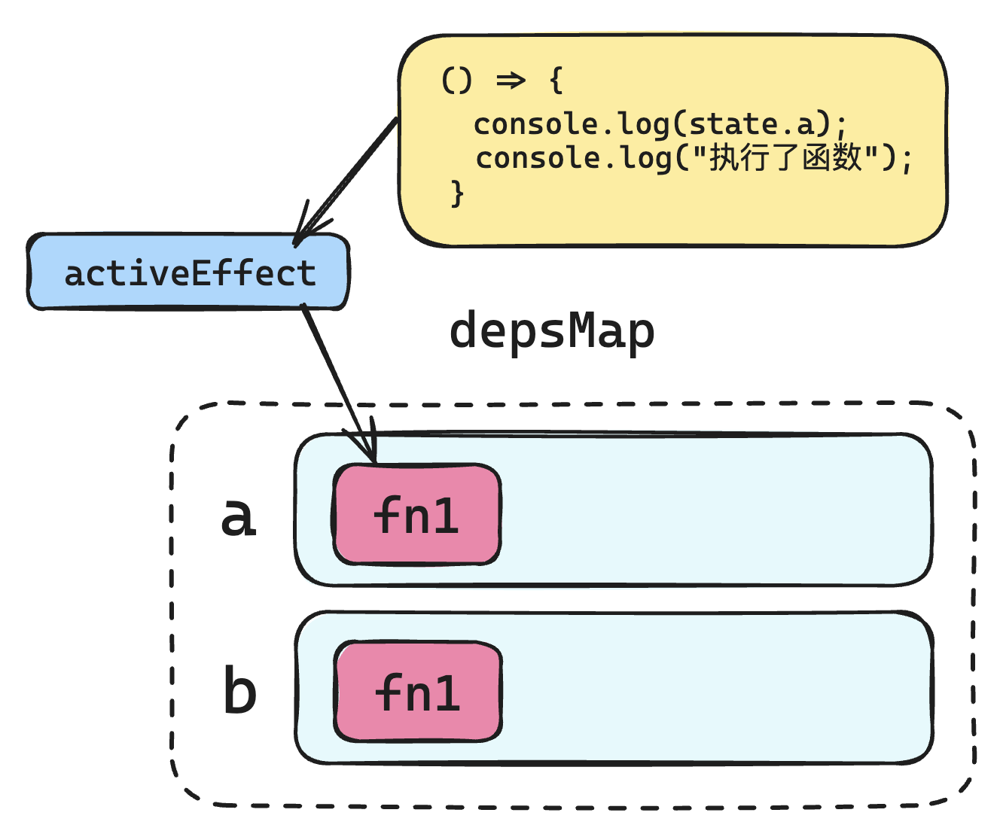

解决方案：**在收集依赖时，不仅要收集回调函数，更要将回调前后的 activeEffect 的状态管理逻辑包含进去**；也就是说，要将回调函数执行的上下文（即 `environment`）一并存入集合中：

```js
function effect(fn) {
  const environment = () => {
    activeEffect = environment;
    fn();
    activeEffect = null;
  };
  environment();
}
```

可以看到，此时 `activeEffect` 临时存放的不再是单一的回调函数，而是包含回调函数运行环境的 `environment` 函数；这样就能在回调函数执行前，让 `activeEffect`  始终非空，确保依赖关系重新确定：

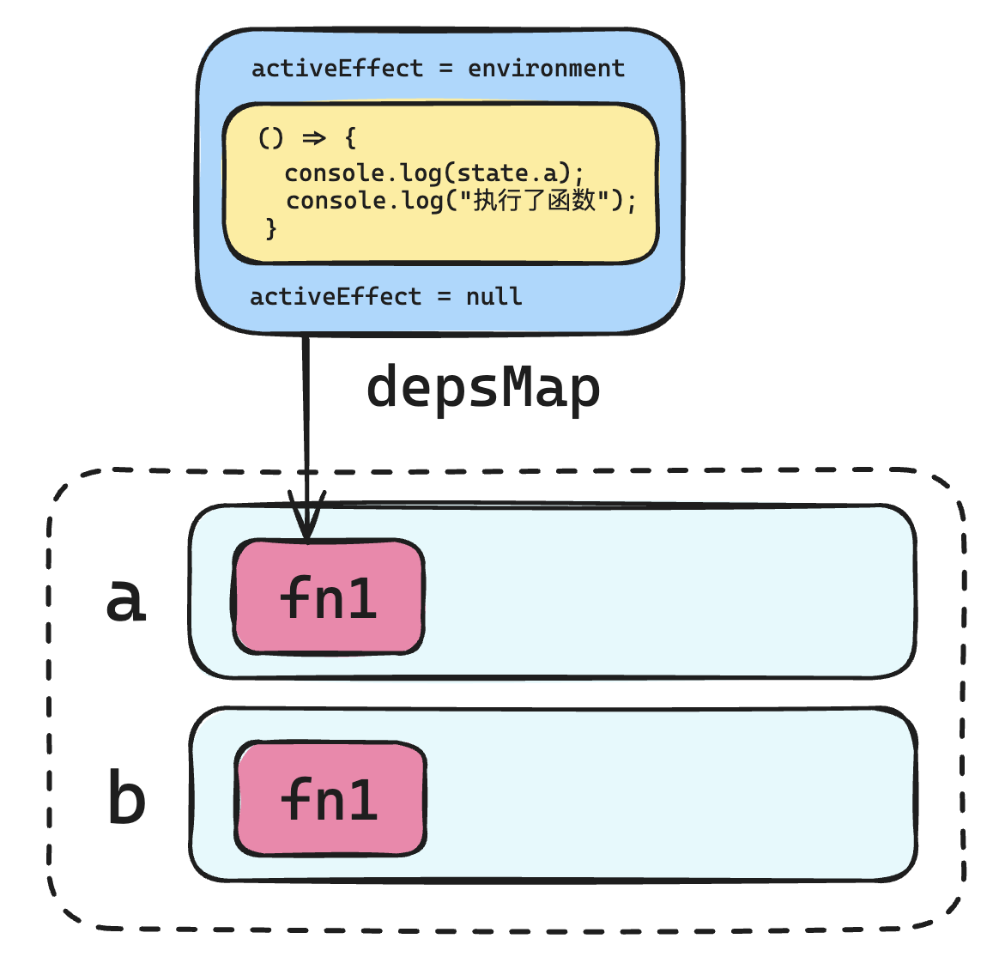

由于 `track` 中的 `activeEffect` 始终不为空，因此第一版的 `if` 语句也可以删掉（`6f490c2`）：

```js
// before:
function track(target, key) {
  // 建立依赖关系
  if (activeEffect) {
    let deps = depsMap.get(key); // 根据属性值去拿依赖的函数集合
    if (!deps) {
      deps = new Set(); // 创建一个新的集合
      depsMap.set(key, deps); // 将集合存入 depsMap
    }
    // 将依赖的函数添加到集合里面
    deps.add(activeEffect);
  }
  console.log(depsMap);
}

// after:
function track(target, key) {
  // 建立依赖关系
  let deps = depsMap.get(key); // 根据属性值去拿依赖的函数集合
  if (!deps) {
    deps = new Set(); // 创建一个新的集合
    depsMap.set(key, deps); // 将集合存入 depsMap
  }
  // 将依赖的函数添加到集合里面
  deps.add(activeEffect);
  console.log(depsMap);
}

// optimized:
function track(target, key) {
  // 建立依赖关系
  if(!depsMap.has(key)) {
    depsMap.set(key, new Set()); // 创建一个新的集合
  }
  let deps = depsMap.get(key); // 根据属性值去拿依赖的函数集合
  // 将依赖的函数添加到集合里面
  deps.add(activeEffect);
  console.log(depsMap);
}
```

实测情况：

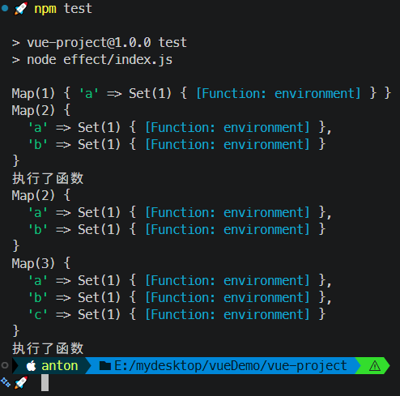

发现新问题：旧的依赖关系（`b` 属性）没有删除。


## 3 问题二：旧的依赖没有删除

解决方案：每次执行回调函数前，还要先调用了一个名为 `cleanup` 的方法，用于清除之前收集的依赖。

具体实现如下：

```diff
+ function cleanup(environment) {
+   let deps = environment.deps; // 拿到当前环境函数的依赖（是个数组）
+   if (deps.length) {
+     deps.forEach((dep) => {
+       dep.delete(environment);
+       if (dep.size === 0) {
+         for (let [key, value] of depsMap) {
+           if (value === dep) {
+             depsMap.delete(key);
+           }
+         }
+       }
+     });
+     deps.length = 0;
+   }
+ }

function effect(fn) {
  const environment = () => {
+   cleanup(environment); // 在运行副作用函数之前先进行清理，避免重复收集依赖
    activeEffect = environment;
    fn();
    activeEffect = null;
  };
+ environment.deps = []; // 用来存储当前环境函数的依赖
  environment();
}

function track(target, key) {
  // 建立依赖关系
  if(!depsMap.has(key)) {
    depsMap.set(key, new Set()); // 创建一个新的集合
  }
  let deps = depsMap.get(key); // 根据属性值去拿依赖的函数集合

  // 将依赖的函数添加到集合里面
  deps.add(activeEffect);
+ activeEffect.deps.push(deps); // activeEffect 和 deps 是多对多的关系
  console.log(depsMap);
}
```

具体结构如下图所示：

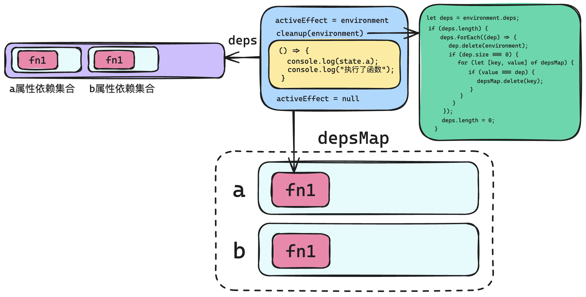

实测效果（满足要求，代码详见 `8ee7f59`）：

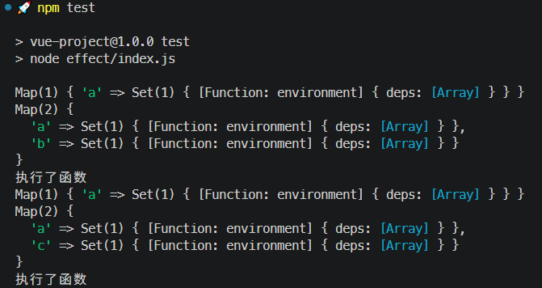

> [!tip]
>
> **优化 `cleanup` 逻辑**
>
> 课件中的 `cleanup` 逻辑通过遍历 `depsMap` 匹配集合为空的 `key`，其实可以在存入 `Set` 集合时带上 `key` 的信息（）：
>
> ```diff
> function track(target, key) {
>   // 建立依赖关系
>   if(!depsMap.has(key)) {
>     depsMap.set(key, new Set()); // 创建一个新的集合
>   }
>   let deps = depsMap.get(key); // 根据属性值去拿依赖的函数集合
> 
>   // 将依赖的函数添加到集合里面
>   deps.add(activeEffect);
> - activeEffect.deps.push(deps); // activeEffect 和 deps 是多对多的关系
> + activeEffect.deps.push({key, depSet: deps}); // activeEffect 和 deps 是多对多的关系
>   console.log(depsMap);
> }
> 
> function cleanup(environment) {
>   let deps = environment.deps; // 拿到当前环境函数的依赖（是个数组）
>   if (deps.length) {
>     deps.forEach(({key, depSet}) => {
>       depSet.delete(environment);
>       if (depSet.size === 0) { 
> -       for (let [key, value] of depsMap) {
> -         if (value === dep) {
> -           depsMap.delete(key);
> -         }
> -       }
> +       depsMap.delete(key);
>       }
>     });
>     deps.length = 0;
>   }
> }
> ```


## 4 问题三：多个依赖函数下的无限循环问题

```js
effect(() => {
  if (state.a === 1) {
    state.b;
  } else {
    state.c;
  }
  console.log("执行了函数1");
});
effect(() => {
  console.log(state.c);
  console.log("执行了函数2");
});
state.a = 2;
```

实测效果符合预期（`3e40df5`）：

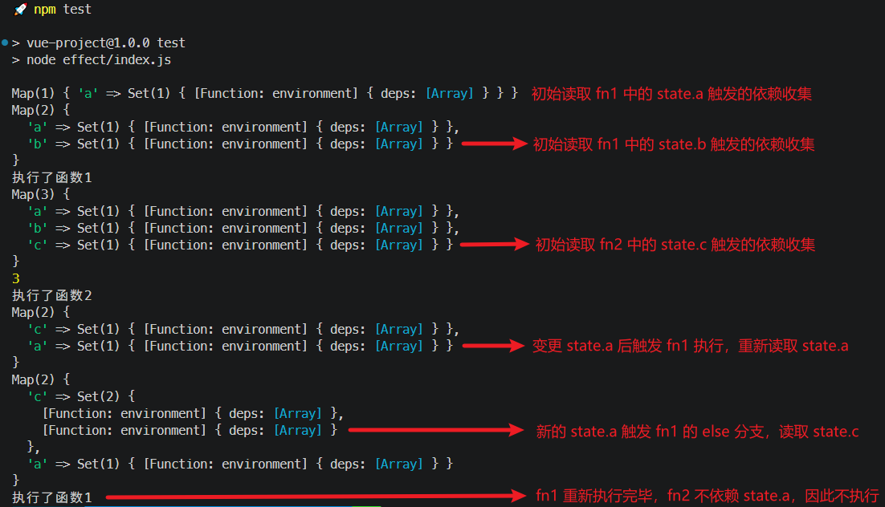

再次测试：

```js
effect(() => {
  if (state.a === 1) {
    state.b;
  } else {
    state.c;
  }
  console.log("执行了函数1");
});
effect(() => {
  console.log(state.a);
  console.log(state.c);
  console.log("执行了函数2");
});
state.a = 2;
```

实测发现，上述代码会陷入死循环。

原因：触发器在遍历 `a` 对应的依赖函数集合时，每执行完一次 `activeEnv` 函数，同时会向该集合添加新的元素，从而无法穷尽集合中的所有元素。

具体的执行流程（原课件的说法是错的）：

:one: 首次运行两个 `effect` 函数，内部会分别创建一个 `environment` 函数，分别标记为 `env1`、`env2`，最终 `depsMap` 存入的集合情况为：

```markdown
Map {
  a: Set(env1, env2)
  b: Set(env1)
  c: Set(env2)
}
```

:two: 修改 `state.a` 的值后，首先执行 `trigger` 触发器逻辑；然后找到 `a` 属性对应的依赖集合 `Set(env1, env2)`；最后遍历并执行 `env1`、`env2`（集合元素不分先后顺序）；但无论先执行哪一个（假设为 `env_i`），其执行过程 **都会修改原集合**（新增一个当前的 `env` 函数），导致遍历过程始终无法终止——

【情况一】先 `env1` 后 `env2`：

|      执行操作       | activeEffect | a 对应的 Set 集合 |
| :-----------------: | :----------: | :---------------: |
|     `env1` 开始     |      -       | `Set(env1, env2)` |
|   清理上轮 `env1`   |      -       |    `Set(env2)`    |
| 赋值 `activeEffect` |    `env1`    |    `Set(env2)`    |
|     运行 `fn1`      |    `env1`    | `Set(env2, env1)` |
|     `env1` 结束     |      -       | `Set(env2, env1)` |
|                     |              |                   |
|     `env2` 开始     |      -       | `Set(env2, env1)` |
|   清理上轮 `env2`   |      -       |    `Set(env1)`    |
| 赋值 `activeEffect` |    `env2`    |    `Set(env1)`    |
|     运行 `fn2`      |    `env2`    | `Set(env1, env2)` |
|     `env2` 结束     |      -       | `Set(env1, env2)` |

第一轮遍历后， `Set` 集合又新增了两个元素：`env1`、`env2`，因此陷入死循环。

【情况二】先 `env2` 后 `env1`：

|      执行操作       | activeEffect | a 对应的 Set 集合 |
| :-----------------: | :----------: | :---------------: |
|     `env2` 开始     |      -       | `Set(env1, env2)` |
|   清理上轮 `env2`   |      -       |    `Set(env1)`    |
| 赋值 `activeEffect` |    `env2`    |    `Set(env1)`    |
|     运行 `fn2`      |    `env2`    | `Set(env1, env2)` |
|     `env2` 结束     |      -       | `Set(env1, env2)` |
|                     |              |                   |
|     `env1` 开始     |      -       | `Set(env1, env2)` |
|   清理上轮 `env1`   |      -       |    `Set(env2)`    |
| 赋值 `activeEffect` |    `env1`    |    `Set(env2)`    |
|     运行 `fn1`      |    `env1`    | `Set(env2, env1)` |
|     `env1` 结束     |      -       | `Set(env2, env1)` |

最终效果和情况一相同，`Set` 集合永远无法穷举所有元素，最终陷入死循环。

综上，最终 `a` 的依赖集合始终无法穷尽，删除旧的 `environment` 又会添加新的 `environment`，每轮执行后的集合元素如下：

```diff
Map {
  a: Set(
-   env1,
-   env2,
+   env1,
+   env2
  )
}
```


解决方案：在 `trigger` 函数中，将需要遍历的依赖集合单独复制一份，避免在执行过程中修改集合本身：

```diff
function trigger(target, key) {
  // 这里面就需要运行依赖的函数
  const deps = depsMap.get(key);
- deps && deps.forEach((effect) => effect());
+ deps && new Set(deps).forEach((effect) => effect());
}
```

实测结果（`0bd7336`）：

```bash
npm test

> vue-project@1.0.0 test
> node effect/index.js

Map(1) { 'a' => Set(1) { [Function: environment] { deps: [Array] } } }
Map(2) {
  'a' => Set(1) { [Function: environment] { deps: [Array] } },
  'b' => Set(1) { [Function: environment] { deps: [Array] } }
}
执行了函数1
Map(2) {
  'a' => Set(2) {
    [Function: environment] { deps: [Array] },
    [Function: environment] { deps: [Array] }
  },
  'b' => Set(1) { [Function: environment] { deps: [Array] } }
}
1
Map(3) {
  'a' => Set(2) {
    [Function: environment] { deps: [Array] },
    [Function: environment] { deps: [Array] }
  },
  'b' => Set(1) { [Function: environment] { deps: [Array] } },
  'c' => Set(1) { [Function: environment] { deps: [Array] } }
}
3
执行了函数2
Map(2) {
  'a' => Set(2) {
    [Function: environment] { deps: [Array] },
    [Function: environment] { deps: [Array] }
  },
  'c' => Set(1) { [Function: environment] { deps: [Array] } }
}
Map(2) {
  'a' => Set(2) {
    [Function: environment] { deps: [Array] },
    [Function: environment] { deps: [Array] }
  },
  'c' => Set(2) {
    [Function: environment] { deps: [Array] },
    [Function: environment] { deps: [Array] }
  }
}
执行了函数1
Map(2) {
  'a' => Set(2) {
    [Function: environment] { deps: [Array] },
    [Function: environment] { deps: [Array] }
  },
  'c' => Set(1) { [Function: environment] { deps: [Array] } }
}
2
Map(2) {
  'a' => Set(2) {
    [Function: environment] { deps: [Array] },
    [Function: environment] { deps: [Array] }
  },
  'c' => Set(2) {
    [Function: environment] { deps: [Array] },
    [Function: environment] { deps: [Array] }
  }
}
3
执行了函数2
```


## 5 问题四：处理嵌套函数报错

当遇到嵌套的 `effect` 函数调用时情况又有所不同：

```js
effect(() => {
  effect(() => {
    state.a
    console.log("执行了函数2");
  });
  state.b;
  console.log("执行了函数1");
});
```

实测结果：

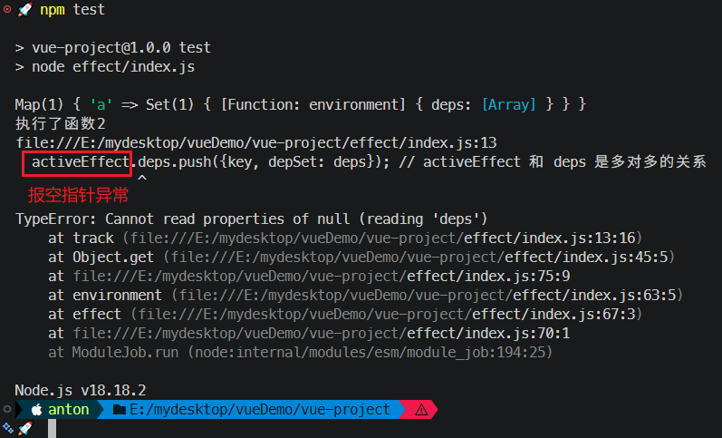

究其原因，是 `activeEffect` 在内层 `effect` 执行结束后提前复位了，但是外层 `effect` 还没结束，此时一旦触发外层函数的依赖收集就会报错：

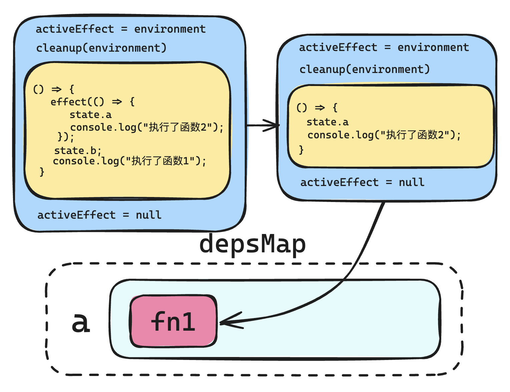

解决方案：引入函数执行栈的概念，每执行一次内层 `effect` 向执行栈推入当前的 `environment`；执行结束后弹出该 `environment` 函数，并让 `activeEffect` 赋值为新的栈顶 `environment`。

具体实现如下：

```diff
+ const effectStack = []; // 保存函数栈

function effect(fn) {
  const environment = () => {
    cleanup(environment); // 在运行副作用函数之前先进行清理，避免重复收集依赖
+   effectStack.push(environment);
    activeEffect = environment;
    fn();
-   activeEffect = null;
+   effectStack.pop();
+   activeEffect = effectStack[effectStack.length - 1];
  };
  environment.deps = []; // 用来存储当前环境函数的依赖
  environment();
}
```

实测效果（符合预期，详见 `bd12826`）：

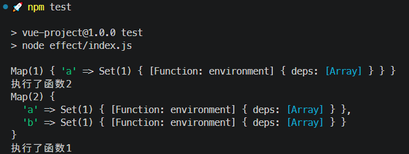


## 6 实测备忘

:one: 实测时与 `Vue3` 中的 `effect` 函数的源码对比，发现课件是源码逻辑的简化版本（变量名都保持一致）。查看位置：`node_modules\@vue\reactivity\dist\reactivity.cjs.js`

节选（`L450`）：

```js
function effect(fn, options) {
  if (fn.effect instanceof ReactiveEffect) {
    fn = fn.effect.fn;
  }
  const e = new ReactiveEffect(fn);
  if (options) {
    shared.extend(e, options);
  }
  try {
    e.run();
  } catch (err) {
    e.stop();
    throw err;
  }
  const runner = e.run.bind(e);
  runner.effect = e;
  return runner;
}
```


:two: 在 `DIY` 首版实现中，曾将 `activeEnv`（即 `activeEffect`）传入 `track()` 函数，以此减少一层作用域链检索。`track()` 函数的完整作用域链如下图所示：

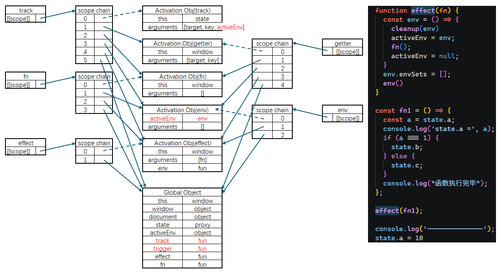

具体代码详见 `code/diy/effect/index1.js`。

---

-EOF-

