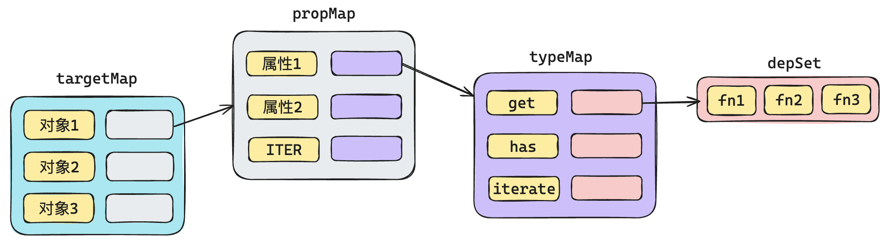
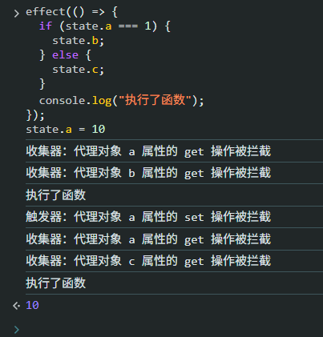
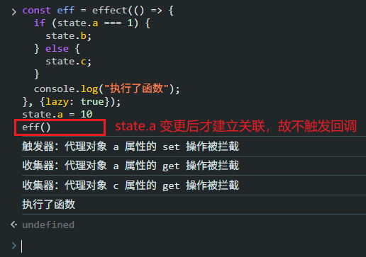
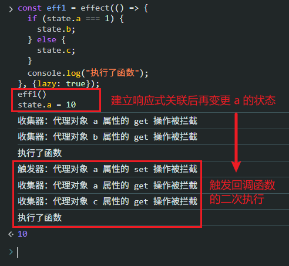
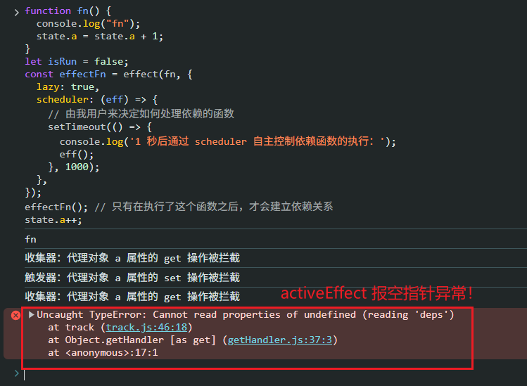
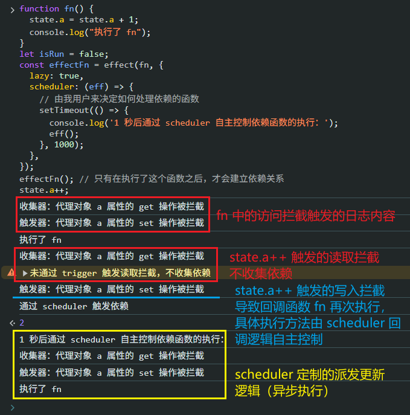

# P3S12L44：纯手动实现 Vue 响应式系统（三）

---


> [!tip]
>
> **本节概要**
>
> 综合前面演示过的响应式数据的基本结构、数组特殊情况的讨论、`effect` 函数的实现，完成手写响应式系统的最后一步：关联数据和函数。


## 1 依赖收集

将依赖收集环节捕获的依赖函数按照更精细的方式组织起来，分别按对象（`state`）、对象属性（`a`、`b` 等）、读取拦截的类型（`get`、`has` 等）进行分组，实现如下图所示的多级分组映射：




## 2 实现 Effect

这里直接给出 `Effect` 实现：

```js
/**
 * 用于记录当前活动的 effect
 */
export let activeEffect = undefined;
export const targetMap = new WeakMap(); // 用来存储对象和其属性的依赖关系
const effectStack = [];

/**
 * 该函数的作用，是执行传入的函数，并且在执行的过程中，收集依赖
 * @param {*} fn 要执行的函数
 */
export function effect(fn) {
  const environment = () => {
    try {
      activeEffect = environment;
      effectStack.push(environment);
      cleanup(environment);
      return fn();
    } finally {
      effectStack.pop();
      activeEffect = effectStack[effectStack.length - 1];
    }
  };
  environment.deps = [];
  environment();
}

export function cleanup(environment) {
  let deps = environment.deps; // 拿到当前环境函数的依赖（是个数组）
  if (deps.length) {
    deps.forEach((dep) => {
      dep.delete(environment);
    });
    deps.length = 0;
  }
}
```


## 3 改造 track

之前 `track` 仅仅只是简单的打印，那么现在就不能是简单打印了，而是进行具体的依赖收集。

注意：依赖收集时，需要按照上面的设计一层一层进行查找：

```js
export function track(target, type, key) {
  if (!shouldTrack) {
    return;
  }

  const attr = !!key ? ` ${key} 属性` : "";
  // console.log('收集器：原始对象为', target);
  console.log(`收集器：代理对象${attr}的 ${type} 操作被拦截`);

  if (!targetMap.has(target)) {
    targetMap.set(target, new Map());
  }
  let propMap = targetMap.get(target);

  // 处理 key 可能为 undefined 的情况，例如遍历操作
  if(type === TrackOperation.ITERATE) {
    key = ITERATE_KEY;
  }

  if (!propMap.has(key)) {
    propMap.set(key, new Map());
  }
  let typeMap = propMap.get(key);

  if (!typeMap.has(type)) {
    typeMap.set(type, new Set());
  }
  let depSet = typeMap.get(type);

  if (!depSet.has(activeEffect)) {
    depSet.add(activeEffect);
    activeEffect.deps.push(depSet);
  }
}
```


## 4 改造 trigger

`trigger` 的改造也很简单：按照设计的数据结构一层一层去找，汇总对应的依赖函数集合，然后全部执行一次。

首先，需要 **建立一个设置行为和读取行为之间的映射关系**。其作用是：知晓当前的 **设置操作** 可能会影响到哪些 **读取操作**（所谓影响，即设置操作前后的读取结果不一致）：

| SET 的细分类型 | 影响 GET | 影响 ITERATE | 影响 HAS | 原因                 |
| :------------: | :------: | :----------: | :------: | :------------------- |
|    **ADD**     |    ✅     |      ✅       |    ✅     | 添加属性改变对象结构 |
|   **DELETE**   |    ✅     |      ✅       |    ✅     | 删除属性改变对象结构 |
|    **SET**     |    ✅     |      ❌       |    ❌     | 只改值，不改结构     |

由此梳理出如下映射表：

```js
// 定义修改数据和触发数据的映射关系
const triggerTypeMap = {
  [TriggerOpTypes.SET]: [TrackOpTypes.GET],
  [TriggerOpTypes.ADD]: [
    TrackOpTypes.GET,
    TrackOpTypes.ITERATE,
    TrackOpTypes.HAS,
  ],
  [TriggerOpTypes.DELETE]: [
    TrackOpTypes.GET,
    TrackOpTypes.ITERATE,
    TrackOpTypes.HAS,
  ],
};
```

我们前面在建立映射关系的时候，是根据具体的 **读取行为** 来建立的映射关系，主要包括：

- `GET`
- `HAS`
- `ITERATE`

这些都是在获取成员信息，而依赖函数就是和这些获取信息的行为进行映射的。

因此在进行设置操作的时候，需要思考一下：**当前的设置，会涉及到哪些获取成员的行为**，然后才能找出该行为所对应的依赖函数。

具体实现：

```js
import { TriggerOperation, TrackOperation, ITERATE_KEY } from "../utils.js";
import { activeEffect, targetMap } from "./effect.js";

const TRIGGER_TYPE_MAP = {
  [TriggerOperation.SET]: [TrackOperation.GET],
  [TriggerOperation.ADD]: [
    TrackOperation.GET,
    TrackOperation.ITERATE,
    TrackOperation.HAS,
  ],
  [TriggerOperation.DELETE]: [
    TrackOperation.GET,
    TrackOperation.ITERATE,
    TrackOperation.HAS,
  ],
};

function collectEffects(target, type, key) {
  if (!targetMap.has(target)) {
    return;
  }
  const propMap = targetMap.get(target);

  const keys = [key];
  if ([TriggerOperation.ADD, TriggerOperation.DELETE].includes(type)) {
    keys.push(ITERATE_KEY);
  }

  const possibleTrackTypes = TRIGGER_TYPE_MAP[type]; // trigger -> track

  const collectDepSet = (set1, set2) => new Set([...set1, ...set2]);

  return keys
    .filter((k) => propMap.has(k))
    .map((k) => propMap.get(k)) // key -> typeMap
    .map((typeMap) =>
      possibleTrackTypes
        .filter((possible) => typeMap.has(possible)) 
        .map((trackType) => typeMap.get(trackType)) // trackType -> depSet
        .reduce(collectDepSet),
    )
    .reduce(collectDepSet);
}


/**
 * 触发器
 * @param {object} target 原始对象
 * @param {string} type 操作类型
 * @param {string} key 操作的属性
 */
export function trigger(target, type, key) {
  // console.log('触发器：原始对象为', target);
  console.log(`触发器：代理对象 ${key} 属性的 ${type} 操作被拦截`);

  const effects = collectEffects(target, type, key);
  if(!effects) {
    return;
  }

  effects
    .filter(e => e !== activeEffect)
    .forEach(effect => effect());
}
```

添加测试用例：

```js
// 测试文件
import { reactive } from "./reactive.js";
import effect from "./effect/effect.js";

const obj = window.obj = {
  a: 1,
  b: 2,
  c: {
    name: "张三",
    age: 18,
  },
};

const state = window.state = reactive(obj);

window.effect = effect;
```

然后启动 `Live Server`，在控制台输入下列内容：

```js
effect(() => {
  if (state.a === 1) {
    state.b;
  } else {
    state.c;
  }
  console.log("执行了函数");
});
state.a = 10
```

实测效果：



可以看到，初始注册回调函数时，收集依赖的是 `a` 和 `b`；变更 `a` 的值后，触发回调函数的第二次执行，此时收集依赖的是 `a` 和 `c`。


## 5 附加功能

### 5.1 懒执行

懒执行的含义：默认情况下，传入 `effect` 函数的回调函数会在初始注册时自动运行一次。开启懒执行模式后，回调函数的首次执行由用户自主决定。

实现方式：为 `effect` 函数新增一个配置参数 `options`。

具体实现（`c581aab`）：

```js
const defaults = {
  lazy: false,
  schedular: null
}

export default function effect(fn, options) {
  options = Object.assign({}, defaults, options);
  const env = () => {
    try {
      cleanup(env);
      effectStack.push(env);
      activeEffect = env;
      return fn();
    } finally {
      effectStack.pop();
      activeEffect = effectStack[effectStack.length - 1];
    }
  };
  env.deps = [];
  if(!options.lazy) {
    env(); 
  }
  return env;
}
```

添加测试用例：

```js
const eff = effect(() => {
  if (state.a === 1) {
    state.b;
  } else {
    state.c;
  }
  console.log("执行了函数");
}, {lazy: true});
state.a = 10
eff()
```

上述代码启用了懒执行机制，并且在响应式数据变更状态后才与回调函数建立关联，因此不会触发回调函数的第二次执行。

控制台实测截图：



如果 `L9` 与 `L10` 对调，则可以正常触发：




### 5.2 添加回调逻辑

设计初衷：让用户自主决定派发更新的具体逻辑，而不是直接触发依赖集合中的所有关联函数。

实现方式：在配置对象中传入一个回调函数 `scheduler`，并将依赖函数作为参数传入 `scheduler`，由用户来决定如何处理。

具体实现：

```diff
// effect.js:
const defaults = {
  lazy: false,
  scheduler: null
}

export default function effect(fn, options) {
+ options = Object.assign({}, defaults, options);
  const env = () => {
    // -- snip --
  };
  env.deps = [];
+ env.options = options;
  if(!options.lazy) {
    env(); 
  }
  return env;
}

// trigger.js:
export function trigger(target, type, key) {
  // console.log('触发器：原始对象为', target);
  console.log(`触发器：代理对象 ${key} 属性的 ${type} 操作被拦截`);

  const effects = collectEffects(target, type, key); // Set<effect>
  if(!effects) {
    return;
  }

  Array.from(effects)
    .filter(e => e !== activeEffect)
    .forEach(effect => {
-     effect()
+     if(effect.options && effect.options.scheduler) {
+       console.log('通过 scheduler 触发依赖');
+       effect.options.scheduler(effect);
+     } else {
+       effect()
+     }
    });
}
```

添加测试用例：

```js
function fn() {
  console.log("fn");
  state.a = state.a + 1;
}
let isRun = false;
const effectFn = effect(fn, {
  lazy: true,
  scheduler: (eff) => {
    // 由我用户来决定如何处理依赖的函数
    setTimeout(() => {
      console.log('1 秒后通过 scheduler 自主控制依赖函数的执行：');
      eff();
    }, 1000);
  },
});
effectFn(); // 只有在执行了这个函数之后，才会建立依赖关系
state.a++;
```

实测效果（`c71aef8`）：



发现 `Bug`：在控制台正常读取 `state.a` 属性时意外执行了依赖收集逻辑；依赖收集逻辑应该 **仅限在依赖函数中触发**，即通过 `trigger()` 方法拦截到回调函数中的读取操作后，才能正常收集（此时 `activeEffect` 非空）。

修复 `Bug`：

```diff
// track.js:
export function track(target, type, key) {
  if (!shouldTrack) {
    return;
  }

  const attr = !!key ? ` ${key} 属性` : "";
  console.log(`收集器：代理对象${attr}的 ${type} 操作被拦截`);

+ if(!activeEffect) {
+   console.warn('未通过 trigger 触发读取拦截，不收集依赖');
+   return;
+ }
  // -- snip --
}
```

再次测试（`22229ea`）：




## 6 实测备忘

:one: 实现 `scheduler` 回调功能时忘记将 `options` 配置对象赋给当前执行环境 `env` 本身，导致 `scheduler` 配置不生效。

:two: 视频只修复了 `activeEffect` 的空指针异常，却未给出解释。这里其实有必要明确依赖收集的触发时机：只有在通过触发器执行的依赖函数中拦截的读取操作才能进入依赖收集逻辑；控制台中的普通读取操作严禁收集依赖。

