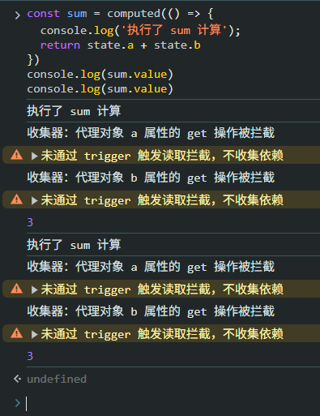
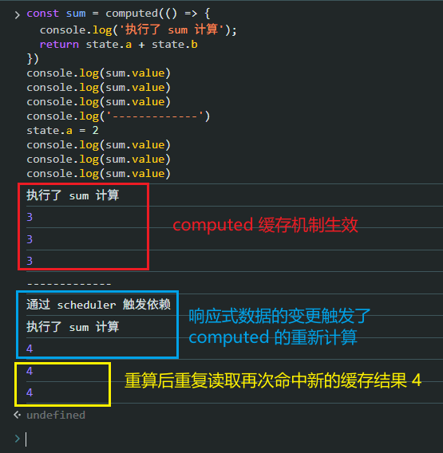
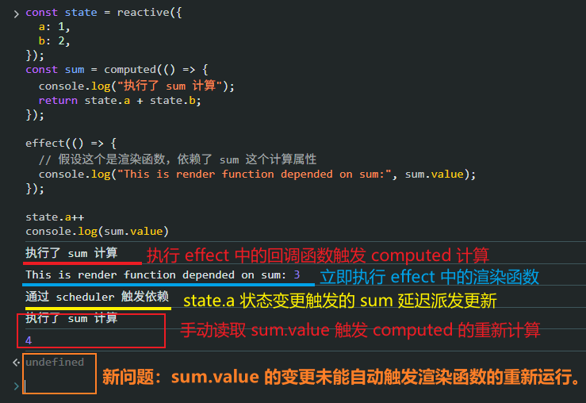
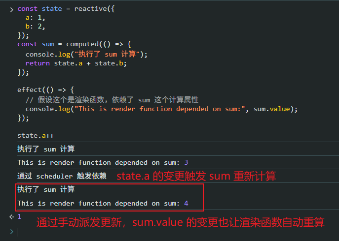
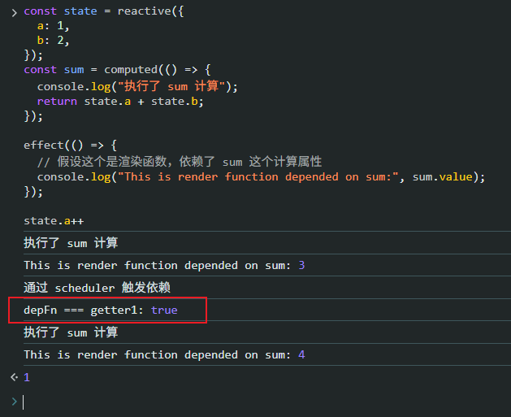

# P3S13L45：手写 computed

---


## 1 回顾 computed 的用法

首先回顾一下 `computed` 的基本用法：

`getter` 形式：

```js
const state = reactive({
  a: 1,
  b: 2
})

const sum = computed(() => {
  return state.a + state.b
})
```

`options` 形式：

```js
const firstName = ref('John')
const lastName = ref('Doe')

const fullName = computed({
  get() {
    return firstName.value + ' ' + lastName.value
  },
  set(newValue) {
    ;[firstName.value, lastName.value] = newValue.split(' ')
  }
})
```


## 2 实现 computed 方法

首先对参数作归一化处理：

```js
function normalizeParam(getterOrOptions) {
  let getter, setter;
  if (typeof getterOrOptions === "function") {
    getter = getterOrOptions;
    setter = () => {
      console.warn(`Computed property was assigned to but it has no setter.`);
    };
  } else {
    getter = getterOrOptions.get;
    setter = getterOrOptions.set;
  }
  return { getter, setter };
}
```

上述代码对传入 `computed` 的参数进行了归一化处理，无论传递的是函数还是配置对象，都统一转换为对象。

接下来要建立 **响应式数据** 与传入 `computed` 的 **依赖函数** 之间的依赖关系。


### 2.1 第一版实现

实现思路：将传入的 `getter` 函数直接运行一遍（有缺陷）。

首版实现（`402c10b`）：

```js
// computed.js:
export function computed(getterOrOptions) {
  const { getter, setter } = normalizeParam(getterOrOptions);
  return {
    get value() {
      return getter();
    },
    set value(newValue) {
      return setter(newValue);
    },
  };
}
```

添加测试用例：

```js
const sum = computed(() => {
  console.log('执行了 sum 计算');
  return state.a + state.b
})
console.log(sum.value)
console.log(sum.value)
```

实测结果：



可以看到，上述实现有个明显缺陷：`computed` 内部没有缓存机制，导致 `sum` 在其依赖的响应式数据没有任何变化的情况下也在重复计算 `getter` 函数。


### 2.2 第二版实现：新增缓存机制

通过 `dirty` 标记实现 `computed` 的缓存机制（具体代码详见 `95aaf70`）：

```js
import effect from "./effect/effect.js";

export function computed(getterOrOptions) {
  const { getter, setter } = normalizeParam(getterOrOptions);
  let cache, dirty = true;
  // 将 getter 传入 effect，getter 里面的响应式属性就会和 getter 建立依赖关系
  const getter1 = effect(getter, {
    lazy: true,
    scheduler(depFn) {
      // depFn(); // 此时无须立即执行依赖函数（即 getter）
      dirty = true;  // 等到下次读取 value 属性再执行
    }
  })
  return {
    get value() {
      if(dirty) {
        cache = getter1();
        dirty = false;
      }
      return cache;
    },
    set value(newValue) {
      return setter(newValue);
    },
  };
}
```

上述代码中——

- `get value()` 是一个 **访问器属性**，与 `Vue3` 计算属性的真实用法保持一致；当访问 `sum.value` 属性时，会根据当前是否为脏值来决定是否重新计算；
- `cache` 用于缓存计算的值；
- `dirty` 用于标记数据是否过期（即是否需要重新计算）。初始值设为 **过期** 以便立即执行一次计算，并通过 `cache` 缓存第一次的计算结果。
- `lazy` 配置设为 `true`，是因为计算属性只有在访问 `value` 值后才会进行计算。

重新设计测试用例：

```js
const sum = computed(() => {
  console.log('执行了 sum 计算');
  return state.a + state.b
})
console.log(sum.value)
console.log(sum.value)
console.log(sum.value)
console.log('-------------')
state.a = 2
console.log(sum.value)
console.log(sum.value)
console.log(sum.value)
```

实测效果（符合预期）：




### 2.3 第三版实现：让依赖计算属性的函数也能派发更新

目前为止，我们的计算属性貌似一切正常，但还漏掉一种适用场景：如果某个函数依赖了计算属性的结果（例如渲染函数），则计算属性的状态变更，也应该触发该依赖函数重新执行一遍才行：

```js
const state = reactive({
  a: 1,
  b: 2,
});
const sum = computed(() => {
  console.log("执行了 sum 计算");
  return state.a + state.b;
});

effect(() => {
  // 假设这个是渲染函数，依赖了 sum 这个计算属性
  console.log("This is render function depended on sum:", sum.value);
});

state.a++
console.log(sum.value)
```

实际执行结果如下：



从截图可以看到：`computed` 虽然可以通过手动读取 `sum.value` 重新计算，但 `effect` 中模拟的渲染函数并没有因为 `sum.value` 的状态变更而自动重新执行。换言之，`effect` 中的渲染函数并没有与响应式数据 `sum.value` 建立关联。

解决方案：让渲染函数（依赖函数）和计算属性的值手动建立依赖关系即可。

具体思路：每读取一次 `sum.value` 属性，就手动收集一次关于 `sum.value` 的依赖；后续 `sum.value` 状态变更会触发 `scheduler` 定制回调逻辑，再在该逻辑中手动触发一次关于 `sum.value` 的派发更新。

具体实现如下（详见 `3b782d3`）：

```diff
+import { track } from "./effect/track.js";
+import { trigger } from "./effect/trigger.js";
+import { TrackOperation, TriggerOperation } from "./utils.js";

export function computed(getterOrOptions) {
  const { getter, setter } = normalizeParam(getterOrOptions);
  let cache, dirty = true;
  // 将 getter 传入 effect，getter 里面的响应式属性就会和 getter 建立依赖关系
  const getter1 = effect(getter, {
    lazy: true,
    scheduler(depFn) {
      // depFn(); // 此时无须立即执行依赖函数（即 getter）
      dirty = true;  // 等到下次读取 value 属性再执行
+     trigger(getter1, TriggerOperation.SET, 'value'); // 通过 trigger 触发依赖，通知计算属性更新
    }
  })
  return {
    get value() {
+     track(getter1, TrackOperation.GET, 'value'); // 读取 value 属性时建立依赖关系
      if(dirty) {
        cache = getter1();
        dirty = false;
      }
      return cache;
    },
    set value(newValue) {
      return setter(newValue);
    },
  };
}
```

重新设计测试用例：

```js
const state = reactive({
  a: 1,
  b: 2,
});
const sum = computed(() => {
  console.log("执行了 sum 计算");
  return state.a + state.b;
});

effect(() => {
  // 假设这个是渲染函数，依赖了 sum 这个计算属性
  console.log("This is render function depended on sum:", sum.value);
});

state.a++
```

实测结果：




## 3 实测备忘

在第三版实现中，手动派发更新的 `trigger` 函数的第一参数既可以是 `effect` 函数的返回值 `getter1`，也可以是回调函数 `scheduler` 的参数 `depFn`，两者是同一个对象：

```diff
export function computed(getterOrOptions) {
  const getter1 = effect(getter, {
    lazy: true,
    scheduler(depFn) {
      // -- snip --
+     console.log('depFn === getter1:', depFn === getter1)
+     // trigger(getter1, TriggerOperation.SET, 'value'); // 通过 trigger 触发依赖，通知计算属性更新
      trigger(depFn, TriggerOperation.SET, 'value'); // 通过 trigger 触发依赖，通知计算属性更新
    }
  })
  return {
    // -- snip --
  };
}
```

实测截图（`4e8c590`）：


