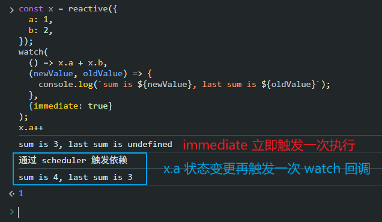
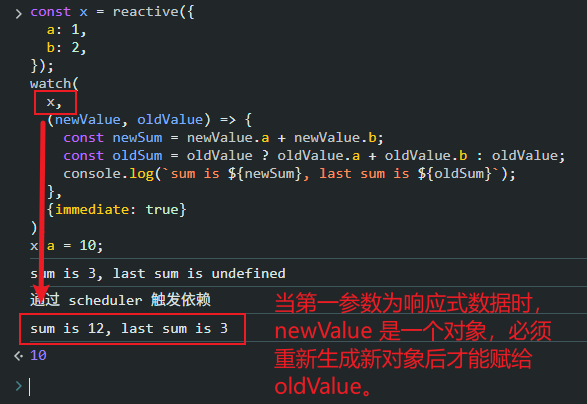

# P3S14L46：手写 Vue3 中的 watch 侦听函数

---


## 1 watch 用法回顾

```js
const x = reactive({
  a: 1,
  b: 2
})

// 单个 ref
watch(x, (newX) => {
  console.log(`x is ${newX}`)
})

// getter 函数
watch(
  () => x.a + x.b,
  (sum) => {
    console.log(`sum is: ${sum}`)
  }
)
```

总结：第一个参数中的响应式数据发生变化，就重新执行后面的回调函数。回调函数的参数列表中，会依次传入新的值和旧的值。

另外 `watch` 还接收第三个参数，是一个 **选项对象**，可以的配置的值有：

- `immediate`：立即执行一次回调函数
- `once`：只执行一次
- `flush`
  - `'post'`：在侦听器回调中能访问被 `Vue` 更新之后的所属组件的 `DOM`；
  - `'sync'`：在 `Vue` 进行任何更新之前触发。

`watch` 方法会返回一个函数，用于停止侦听：

```js
const unwatch = watch(() => {})

// ...当该侦听器不再需要时
unwatch()
```


## 2 实现 watch 方法

首先实现一个用于遍历对象属性的工具方法 `traverse`：

```js
function traverse(value, seen = new Set()) {
  // 检查 value 是否是对象类型，如果不是对象类型，或者是 null，或者已经访问过，则直接返回 value。
  if (typeof value !== "object" || value === null || seen.has(value)) {
    return value;
  }

  // 将当前的 value 添加到 seen 集合中，标记为已经访问过，防止循环引用导致的无限递归。
  seen.add(value);

  // 使用 for...in 循环遍历对象的所有属性。
  for (const key in value) {
    // 递归调用 traverse，传入当前属性的值和 seen 集合。
    traverse(value[key], seen);
  }

  // 返回原始值
  return value;
}
```

该方法用于递归遍历一个对象及其所有嵌套的属性，从而 **触发这些属性的依赖收集**。

该方法在 `watch` 函数中很重要，因为它确保了所有嵌套属性的依赖关系都能被追踪到，当它们变化时能够触发回调函数。

假设有一个深层嵌套的对象：

```js
const obj = {
  a: 1,
  b: {
    c: 2,
    d: {
      e: 3
    }
  }
};
```

则 `obj` 的整个遍历过程如下：

- 由于 `obj` 是对象，并且没有访问过，会将 `obj` 添加到 `seen` 集合里；
- 遍历 `obj` 的属性：
  - 访问 `obj.a` 是数字，会直接返回，不做进一步的处理；
  - 访问 `obj.b` 是对象，会进入 `traverse(obj.b, seen)`；
    - 由于 `obj.b` 是对象，并且未被访问过，将 `obj.b` 添加到 `seen` 集合中。
    - 遍历 `obj.b` 的属性：
      - 访问 `obj.b.c` 是数字，会直接返回，不做进一步的处理；
      - 访问 `obj.b.d`，会进入 `traverse(obj.b.d, seen)`；
        - 由于 `obj.b.d` 是对象，并且未被访问过，将 `obj.b.d` 添加到 `seen` 集合中；
        - 遍历 `obj.b.d` 的属性；
          - 访问 `obj.b.c.e` 是数字，会直接返回，不做进一步的处理。

上述遍历过程中，每访问一个属性（例如 `obj.b` 或 `obj.b.d`），都会触发依赖收集。这意味着当前活动的 `effect` 函数（即 `activeEffect` 全局变量）会被记录为这些属性的依赖。

接下来咱们仍然是进行参数归一化：

```js
/**
 * @param {*} source 
 * @param {*} cb 要执行的回调函数
 * @param {*} options 选项对象
 * @returns
 */
export function watch(source, cb, options = {}) {
  let getter;
  if (typeof source === "function") {
    getter = source;
  } else {
    getter = () => traverse(source);
  }
}
```

在上面的代码中，无论用户的 `source` 是传递什么类型的值，都转换为函数（这里没有考虑数组的情况）；

- `source` 本来就是 `getter` 函数：直接将 `source` 赋值给 `getter`；
- `source` 是一个 **响应式对象**：重构为一个关于该对象的 `getter` 函数，其中会调用 `traverse` 方法；

接下来定义两个变量，用于存储新旧两个值：

```js
let oldValue, newValue;
```

然后轮到 `effect` 函数登场了：

```js
const effectFn = effect(() => getter(), {
  lazy: true,
  scheduler: () => {
    newValue = effectFn();
    cb(newValue, oldValue);
    oldValue = newValue;
  },
});
```

这段代码，首先会运行 `getter` 函数（前面做了参数归一化，已经将 `getter` 转换为函数了），`getter` 里的响应式数据就会触发 **依赖收集**；当这些响应式数据发生变化时，就会执行触发器 **派发更新**。

因为这里传递了 `scheduler` 回调，因此在派发更新时，实际上执行的就是 `scheduler` 中的逻辑，也就是如下三行：

```js
newValue = effectFn();
cb(newValue, oldValue);
oldValue = newValue;
```

这三行代码的意思也非常明确：

- `newValue = effectFn()`：重新执行一次 `getter`，获取到新值，并将其赋给 `newValue`；
- `cb(newValue, oldValue)`：调用用户传入 `watch` 的回调函数，将新旧值传入该回调函数；
- `oldValue = newValue`：更新 `oldValue`。


剩下的内容就非常简单了。先把 `scheduler` 对应的函数逻辑提取出来备用：

```js
const job = () => {
  newValue = effectFn();
  cb(newValue, oldValue);
  oldValue = newValue;
};

const effectFn = effect(() => getter(), {
  lazy: true,
  scheduler: job
});
```

然后实现 `immediate` 配置，如下：

```js
if (options.immediate) {
  job();
} else {
  oldValue = effectFn();
}
```

`immediate` 的作用：**立即派发一次更新**；但如果没有配置 `immediate`，实际也会执行一次依赖函数，只不过算出来的值算作旧值，而非新值。

接下来执行取消侦听，其实也非常简单：

```js
return () => {
  cleanup(effectFn);
};
```

就是返回一个函数，函数里面调用 `cleanup` 将依赖清除掉即可。


只要前面响应式系统写好了，接下来的这些实现都非常简单。


最后再优化一下：添加 `flush` 配置项的 `post` 值的支持。`flush` 的本质就是指定调度函数的执行时机，当 `flush` 为 `'post'` 时，代表派发更新的函数调用需要将依赖函数放到一个微任务队列中，待 `DOM` 更新结束后再执行。

代码如下：

```diff
const effectFn = effect(() => getter(), {
  lazy: true,
  scheduler: () => {
-   job();
+   if (options.flush === "post") {
+     Promise.resolve().then(job);
+   } else {
+     job();
+   }
  },
});
```

完整代码如下：

```js
import { effect, cleanup } from "./effect/effect.js";

/**
 * @param {*} source 
 * @param {*} cb 要执行的回调函数
 * @param {*} options 选项对象
 * @returns
 */
export function watch(source, cb, options = {}) {
  let getter;
  if (typeof source === "function") {
    getter = source;
  } else {
    getter = () => traverse(source);
  }

  // 用于保存上一次的值和当前新的值
  let oldValue, newValue;

  // 这里的 job 就是要执行的函数
  const job = () => {
    newValue = effectFn();
    cb(newValue, oldValue);
    oldValue = newValue;
  };

  const effectFn = effect(() => getter(), {
    lazy: true,
    scheduler: () => {
      if (options.flush === "post") {
        Promise.resolve().then(job);
      } else {
        job();
      }
    },
  });

  if (options.immediate) {
    job();
  } else {
    oldValue = effectFn();
  }

  return () => {
    cleanup(effectFn);
  };
}

function traverse(value, seen = new Set()) {
  // 检查 value 是否是对象类型，如果不是对象类型，或者是 null，或者已经访问过，则直接返回 value。
  if (typeof value !== "object" || value === null || seen.has(value)) {
    return value;
  }

  // 将当前的 value 添加到 seen 集合中，标记为已经访问过，防止循环引用导致的无限递归。
  seen.add(value);

  // 使用 for...in 循环遍历对象的所有属性。
  for (const key in value) {
    // 递归调用 traverse，传入当前属性的值和 seen 集合。
    traverse(value[key], seen);
  }

  // 返回原始值
  return value;
}
```

`DIY` 版本：

```js
import effect, { cleanup } from "./effect/effect.js";

function traverse(target, seenSet = new Set()) {
  if (typeof target !== "object" || target === null || seenSet.has(target)) {
    return target;
  }

  seenSet.add(target);

  for (const key in target) {
    traverse(target[key], seenSet);
  }

  return target;
}

export function watch(source, cb, options = {}) {
  let getter = typeof source === "function" ? source : () => traverse(source);

  let oldValue, newValue;

  const job = (depFn) => {
    newValue = depFn();
    cb(newValue, oldValue);
    if (newValue && newValue instanceof Object) {
      oldValue = { ...newValue };
    } else {
      oldValue = newValue;
    }
  };

  const getter1 = effect(getter, {
    lazy: true,
    // scheduler: job,
    scheduler(depFn) {
      if (options.flush === "post") {
        Promise.resolve().then(() => job(depFn));
      } else {
        // flush: 'sync'
        job(depFn);
      }
    },
  });

  if (options.immediate) {
    job(getter1);
  } else {
    oldValue = getter1(); // 建立关联并赋初始值
  }

  return () => cleanup(getter1);
}
```


## 3 实测备忘

:one: 在实现 `traverse()` 函数时最先的条件判定成立后，应该返回原参数 `return target;`，首次尝试写成了 `return;` 导致测试失败；

:two: 课件中的 `scheduler` 回调其实省略了一个 `environment` 参数，亦即笔记中的 `effectFn`、`DIY` 实现中的 `depFn`（二者本质上是同一个对象，详见上节笔记末尾）。因此最好能使用该参数减少一部分闭包。

:three: `oldValue` 的更新需要单独讨论：手写版 `watch` 的第一个参数为 `getter` 函数、且返回的是一个基本类型的值时，可以直接 `oldValue = newValue`；但当第一参数为一个响应式数据时，`newValue` 就是一个 `Proxy` 代理对象，此时不能直接赋值，而应该重新生成一个对象，否则旧的值将被覆盖（对象型的值传的是地址）：

```diff
const job = (depFn) => {
  newValue = depFn();
  cb(newValue, oldValue);
- oldValue = newValue;
+ if (newValue && newValue instanceof Object) {
+   oldValue = { ...newValue };
+ } else {
+   oldValue = newValue;
+ }
};
```

附测试用例1：

```js
// getter 函数
const x = reactive({
  a: 1,
  b: 2,
});
watch(
  () => x.a + x.b,
  (newValue, oldValue) => {
    console.log(`sum is ${newValue}, last sum is ${oldValue}`);
  },
  {immediate: true}
);
x.a++
```

实测效果：



附测试用例2：

```js
const x = reactive({
  a: 1,
  b: 2,
});
watch(
  x,
  (newValue, oldValue) => {
    const newSum = newValue.a + newValue.b;
    const oldSum = oldValue ? oldValue.a + oldValue.b : oldValue;
    console.log(`sum is ${newSum}, last sum is ${oldSum}`);
  }, 
  {immediate: true}
);
x.a = 10;
```

实测效果：

