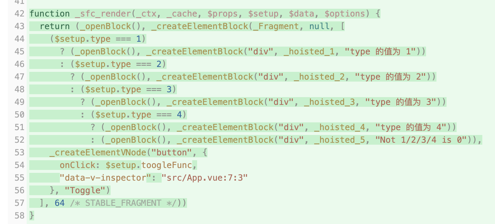
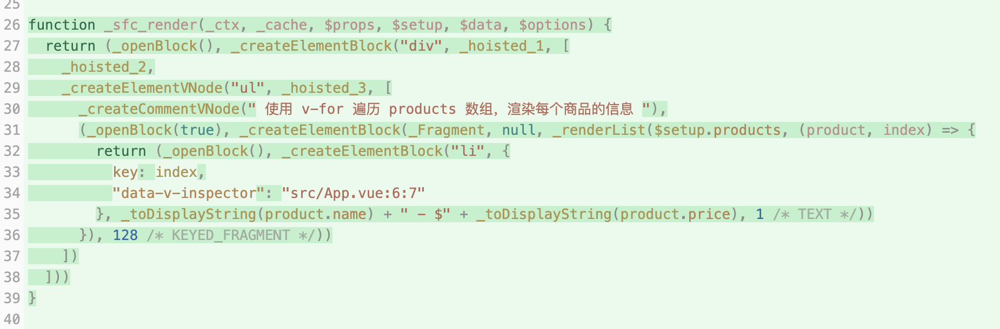
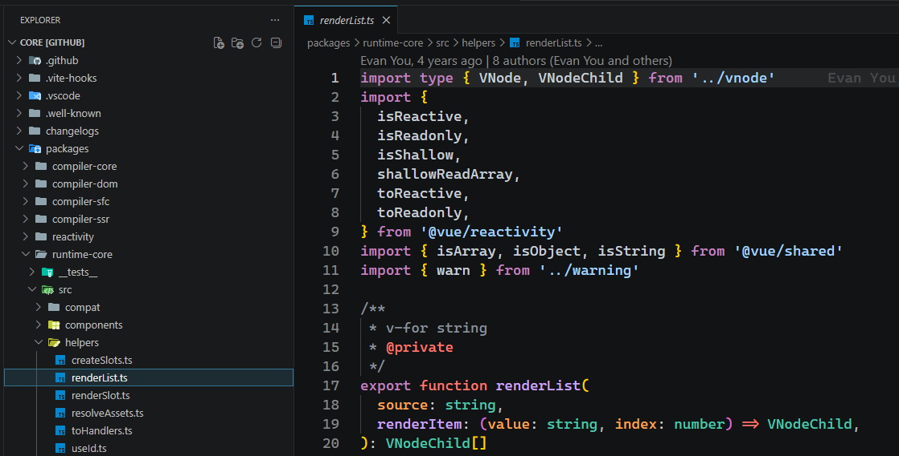
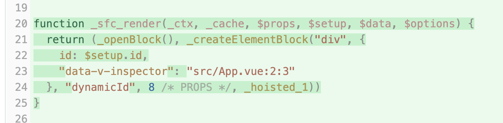
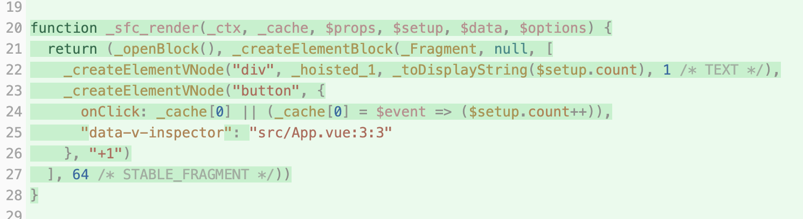

# P3S15L47：Vue 中的指令的本质

---


> [!tip]
>
> **内容提要**
>
> 复盘目前学过的 `Vue` 内置指令（:star: 为本节具体分析过的指令）：
>
> - `v-if`（:star:）
>
> - `v-show`
>
> - `v-for`（:star:）
>
> - `v-model`（详见下节内容）
>
> - `v-html`
>
> - `v-bind`（:star:）
>
> - `v-on`（:star:）
>
>   …
>
> 结合 `vite-plugin-inspect` 插件的编译结果来剖析指令的本质。


## 1 v-if 指令

```vue
<template>
  <div v-if="type === 1">type 的值为 1</div>
  <div v-else-if="type === 2">type 的值为 2</div>
  <div v-else-if="type === 3">type 的值为 3</div>
  <div v-else-if="type === 4">type 的值为 4</div>
  <div v-else>Not 1/2/3/4 is 0</div>
  <button @click="toogleFunc">Toggle</button>
</template>

<script setup>
import { ref } from 'vue'
const type = ref(1)
function toogleFunc() {
  type.value = Math.floor(Math.random() * 5)
}
</script>

<style scoped></style>
```

编译结果如下：



`v-if` 指令对应的是由三目运算符构成的不同分支。每次 `$setup.type` 值的状态变更都就会触发渲染函数重新执行，然后进入到对应的分支。


## 2 v-for 指令

```vue
<template>
  <div>
    <h2>商品列表</h2>
    <ul>
      <!-- 使用 v-for 遍历 products 数组，渲染每个商品的信息 -->
      <li v-for="(product, index) in products" :key="index">
        {{ product.name }} - ${{ product.price }}
      </li>
    </ul>
  </div>
</template>

<script setup>
import { ref } from 'vue'
const products = ref([
  { name: '键盘', price: 99.99 },
  { name: '鼠标', price: 59.99 },
  { name: '显示器', price: 299.99 }
])
</script>

<style scoped></style>
```

编译结果如下：



最终生成的渲染函数调用了一个名为 `renderList` 的内部方法。

> [!tip]
>
> `Vue` 源码仓库地址：`https://github.com/vuejs/core`
>
> `renderList` 在源码中的具体位置：`/packages/runtime-core/src/helpers/renderList.ts`
>
> 实测截图：
>
> 


## 3 v-bind 指令

```vue
<template>
  <div v-bind:id>dynamicId</div>
</template>

<script setup>
import { ref } from 'vue'
const id = ref('my-id')
</script>

<style lang="scss" scoped></style>
```

编译结果如下：



核心处理：将 `$setup.id` 的值作为 `div` 的 `id` 属性值。这里涉及响应式数据的读取操作拦截，一旦 `$setup.id` 的值发生变化，渲染函数就会重新执行，`div` 对应的属性也会随之变化。


## 4 v-on 指令

```vue
<template>
  <div>{{ count }}</div>
  <button v-on:click="count++">+1</button>
</template>

<script setup>
import { ref } from 'vue'
const count = ref(0)
</script>

<style lang="scss" scoped></style>
```

编译结果如下：



核心处理：为 `button` 元素注册了 `click` 事件，对应的事件处理函数为：

```js
$event => $setup.count++
```


通过上述几个示例，对比编译前后的结果，可以得出一个结论：

> `Vue` 最终编译出的渲染函数，根本不存在什么指令，只是 **不同的指令会被编译为不同的处理结果**。

