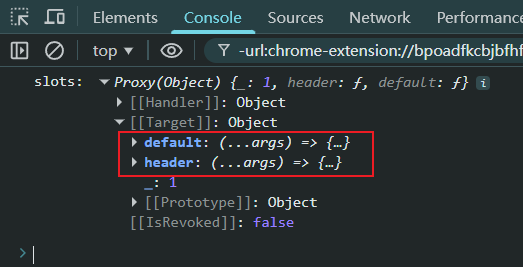
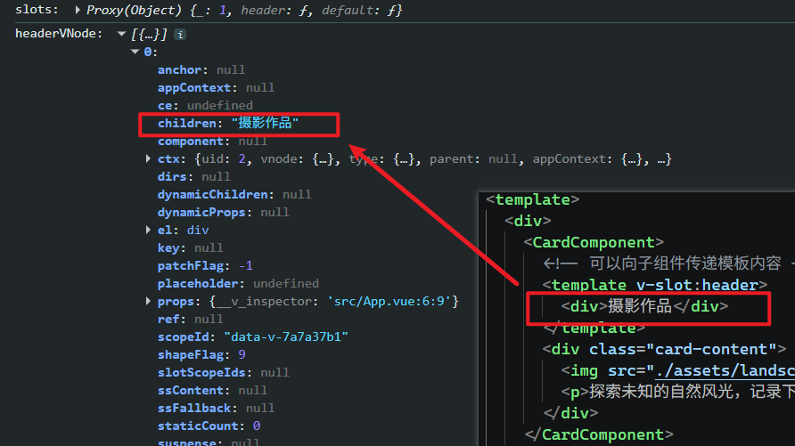
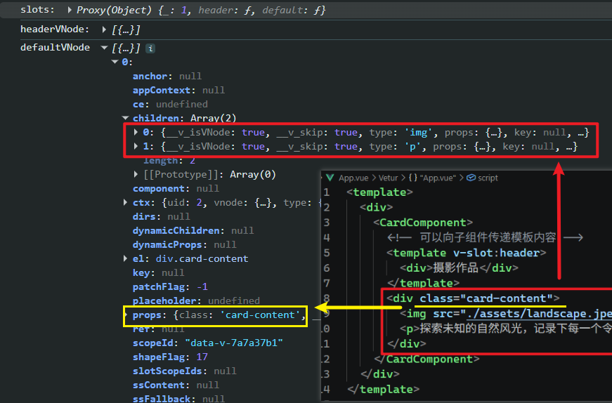
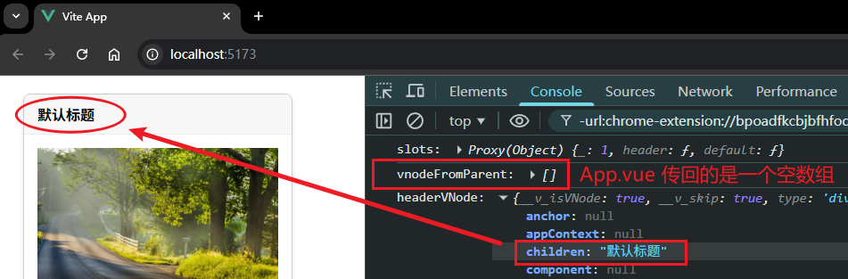

# P3S16L48：Vue 插槽的本质

---


## 1 复习插槽的核心概念

- 子组件：通过 `slot` 来设置插槽；
- 父组件：使用子组件时可以往 `slot` 插入模板内容。

插槽在 **用法层面** 的本质：**父组件向子组件传递模板内容**。

应该具备的认知——

- 默认插槽：拥有默认的一些内容；这里有两层含义——
  - `slot` 内部可放置默认的 `HTML` 内容；
  - 写在子组件标签内的内容、或者写在子组件中的 `<template #default></template>`、`<template></template>` 中的视图内容会替换掉上述默认内容。

- 具名插槽：为插槽命名，以免指代不明；
- 作用域插槽：子组件内的本地数据借助插槽反向传给父组件使用。


## 2 父组件传递内容的本质

以 `P2S22L24` 课介绍过过的卡片组件为例，最终传递的是一个像这样的对象：

```js
{
  default: function(){ ... },
  xxx: function(){ ... },
  xxx: function(){ ... },
}
```

具体到 `CardComponent` 组件，父组件传给子组件的是如下所示的对象（`a580690`）：

```jsx
{
  default: function(){
    // 注意返回值是对应结构的虚拟 DOM
    return (
    	<div class="card-content">
        
        <p>探索未知的自然风光，记录下每一个令人惊叹的瞬间。加入我们的旅程，一起见证世界的壮丽。</p>
      </div>
    )
  },
  header: function(){
    return (
    	<div>摄影作品</div>
    )
  }
}
```

结论：父组件向子组件传递的视图内容，本质上是一个或多个 **函数**：通过调用这些函数，能够得到对应结构的虚拟 `DOM`。


## 3 子组件设置插槽的本质

子组件设置插槽，本质上就是 **对父组件传递过来的函数进行调用**，以得到相应的虚拟 `DOM`：

```js
const slots = {
  default: function(){ ... },
  xxx: function(){ ... },
  xxx: function(){ ... },
}; // 该对象是父组件传递过来的对象
slots.default(); // 得到要渲染的虚拟 DOM 
slots.header(); // 得到要渲染的虚拟 DOM
slots.xxx(); // 得到要渲染的虚拟 DOM                   
```


## 4 观点验证

接下来对上述说法进行逐一验证。

总思路：用纯 `JavaScript` 手写组件 `CardComponent` 的形式来验证：

- 父传子：本质是传了若干渲染函数；
- 子组件设置插槽：本质是调用传来的渲染函数。

### 4.1 验证：父组件传入插槽的内容本质是渲染函数

新建样式文件 `src/components/CardComponent/styles.module.css`，将 `CardComponent.vue` 中的样式复制进去：

```css
.card {
  border: 1px solid #ccc;
  border-radius: 8px;
  box-shadow: 0 4px 6px rgba(0, 0, 0, 0.1);
  width: 300px;
  margin: 20px;
}

.card-header {
  background-color: #f7f7f7;
  border-bottom: 1px solid #ececec;
  padding: 10px 15px;
  font-size: 16px;
  font-weight: bold;
  border-top-left-radius: 8px;
  border-top-right-radius: 8px;
}

.card-body {
  padding: 15px;
  font-size: 14px;
  color: #333;
}
```

再新建 `JS` 文件 `src/components/CardComponent/index.js`，并仿照如下 `CardComponent.vue` 的模板结构，用 `Vue3` 的 `h` 函数重新实现一遍：

```html
<div class="card">
  <div class="card-header">
    <slot name="header">
      <div>默认标题</div>
    </slot>
  </div>
  <div class="card-body">
    <slot>
      <div>默认内容</div>
    </slot>
  </div>
</div>
```

改造后的 `index.js` 如下（无需实现 `slot` 标签中的内容）：

```js
import { defineComponent, h } from 'vue';
import styles from './CardComponent.module.css';

export default defineComponent({
  name: 'CardComponent',
  setup(_, { slots }) {
    console.log('slots:', slots);
    return () => {
      h('div', { class: styles.card }, [
        h('div', { class: styles['card-header']}),
        h('div', { class: styles['card-body']})
      ])
    }
  }
})
```

注意第 `L7` 行：在控制台直接打印 `setup()` 第二参数 `context` 内的 `slots` 对象，以便观察父组件传递过来的内容的实质。为此需要在 `App.vue` 引入改写后的组件：

```js
// App.js
import CardComponent from '@/components/CardComponent'
```

启动项目，实测控制台的打印结果（`932e509`）：



可见，`slots` 确实是一个以插槽名称为 `key` 键的对象（并且是一个 `Proxy` 代理对象）。


### 4.2 验证：子组件设置插槽的本质是调用渲染函数

思路：将传来的渲染函数执行一遍，并将结果放到对应的插槽中即可验证。

按照如下代码再次改造 `index.js`，将渲染函数 `slots.default` 和 `slots.header` 的返回值作为虚拟节点放入 `h` 函数（完整代码详见 `a832435`）：

```js
import { defineComponent, h } from 'vue'
import styles from './styles.module.css'

export default defineComponent({
  name: 'CardComponent',
  setup(_, { slots }) {
    console.log('slots:', slots)
    const headerVNode = slots.header()
    const defaultVNode = slots.default()
    console.log('headerVNode:', headerVNode)
    console.log('defaultVNode', defaultVNode)
    return () =>
      h('div', { class: styles.card }, [
        h('div', { class: styles['card-header'] }, headerVNode),
        h('div', { class: styles['card-body'] }, defaultVNode)
      ])
  }
})
```

实测传入 `header` 插槽的视图内容：



实测传入 `default` 插槽的视图内容：




### 4.3 边界条件：默认内容在 h 函数中的渲染

以 `header` 插槽为例，这其实是让 `h` 函数按条件渲染：若父组件确实传递了具体内容到 `header` 插槽，则启用传来的虚拟节点；否则使用默认节点。

判定条件：当未传递任何内容，执行渲染函数 `slots.header()` 将返回一个空数组。利用这一特点重构 `index.js`（代码详见 `3075d59`）：

```js
// App.vue: <template v-slot:header></template>

import { defineComponent, h } from 'vue'
import styles from './styles.module.css'

function getHeaderVNode(renderFn) {
  const vnodeFromParent = renderFn()
  console.log('vnodeFromParent:', vnodeFromParent);
  return vnodeFromParent.length === 0 ? h('div', null, '默认标题') : vnodeFromParent
}

export default defineComponent({
  name: 'CardComponent',
  setup(_, { slots }) {
    console.log('slots:', slots)
    const headerVNode = getHeaderVNode(slots.header)
    const defaultVNode = slots.default()
    console.log('headerVNode:', headerVNode)
    console.log('defaultVNode', defaultVNode)
    return () =>
      h('div', { class: styles.card }, [
        h('div', { class: styles['card-header'] }, headerVNode),
        h('div', { class: styles['card-body'] }, defaultVNode)
      ])
  }
})
```

实测效果：




### 4.4 作用域插槽在 h 函数中的实现

作用域插槽本质上是一个 **返回 VNode 虚拟节点的函数**，该函数接收一个参数（即作用域数据）。

先改造 `CardComponent.vue`：令其绑定一个本地的响应式数据 `title` 到插槽中：

```vue
<template>
  <div class="card">
    <div class="card-header">
      <!-- eslint-disable-next-line vue/valid-v-bind -->
      <slot name="header" :title>
        <div>默认标题</div>
      </slot>
    </div>
    <!-- snip -->
  </div>
</template>

<script setup>
import { ref } from 'vue';
const title = ref('这是从子组件传递的标题数据')
</script>
```

注意：新版 `Vue3` 已经支持 `:title` 的写法，之前必须写成 `:title="title"`。但 `VSCode` 的 `ESLint` 还不能识别该最新语法，因此需要在 `L4` 单独禁用检测。

这样改造后，`App.vue` 就能使用该作用域插槽反向传来的 `props` 数据了（支持解构赋值）：

```vue
<template>
  <div>
    <CardComponent>
      <template v-slot:header="{ title }">
        {{ title }}
      </template>
      <!-- snip -->
    </CardComponent>
  </div>
</template>
```

实测效果：


现在用 `h` 函数重新实现上述机制：将本地的 `title` 作为参数传入渲染函数 `slots.header` 即可：

```diff
import { defineComponent, h, ref } from 'vue'
import styles from './styles.module.css'

function getHeaderVNode(renderFn) {
- const vnodeFromParent = renderFn()
+ const title = ref('这是从子组件传递的标题数据')
+ const slotProps = { title: title.value }
+ const vnodeFromParent = renderFn(slotProps)
  console.log('vnodeFromParent:', vnodeFromParent)
  return vnodeFromParent.length === 0 ? h('div', null, '默认标题') : vnodeFromParent
}

export default defineComponent({
  name: 'CardComponent',
  setup(_, { slots }) {
    const headerVNode = getHeaderVNode(slots.header)
    console.log('headerVNode:', headerVNode)
    const defaultVNode = slots.default()
    return () =>
      h('div', { class: styles.card }, [
        h('div', { class: styles['card-header'] }, headerVNode),
        h('div', { class: styles['card-body'] }, defaultVNode)
      ])
  }
})
```

具体代码详见 `3a9d8ab`。
