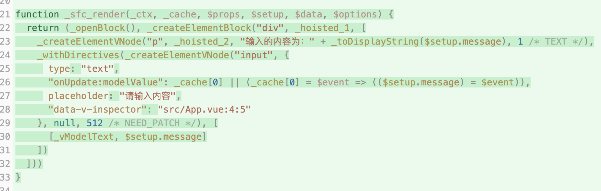
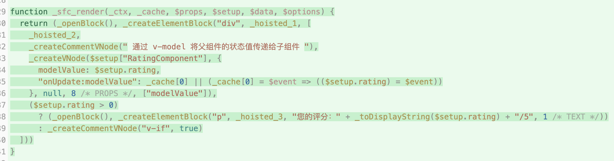
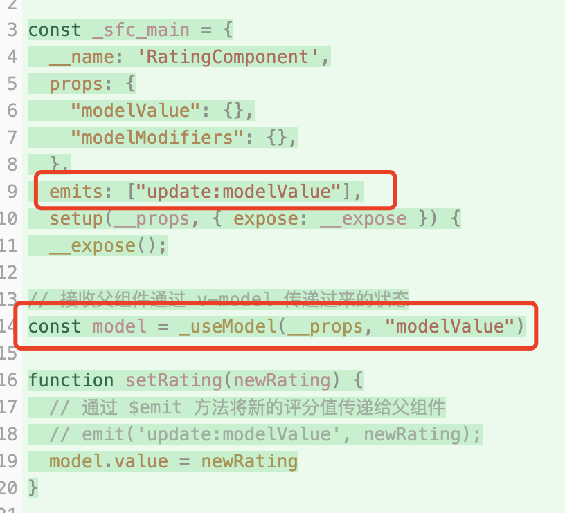
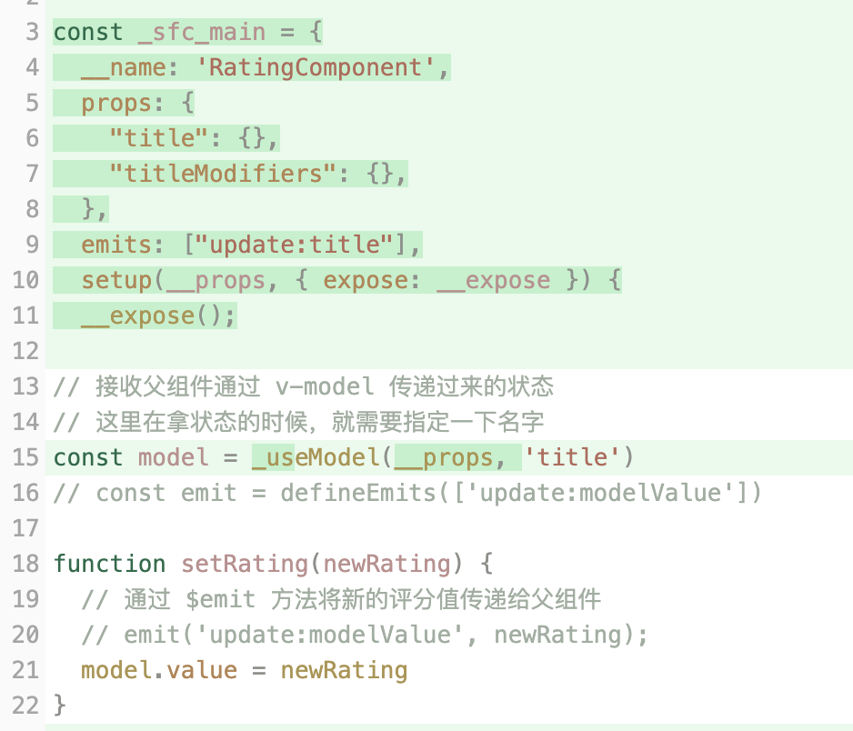

# P3S17L49：v-model 的本质

---


> [!tip]
>
> **DIY 学习建议**
>
> 可结合 `P2S15L17` 课笔记巩固 `v-model` 指令的相关基础知识。


`v-model` 的适用场景主要有两个：

1. 表单元素与响应式数据的双向绑定（代码详见 `example1`）；
2. 父子组件间的数据传递（代码详见 `example2`）。


## 1 与表单元素双向绑定

```vue
<template>
  <div>
    <p>输入的内容为：{{ message }}</p>
    <input type="text" v-model="message" placeholder="请输入内容" />
  </div>
</template>

<script setup>
import { ref } from 'vue'
const message = ref('Hello')
</script>
```

上述代码中，`input` 元素和响应式数据 `message` 实现了双向绑定：

- `input` 元素输入的值会影响 `message` 的值；
- 响应式数据 `message` 的改变也会影响 `input` 元素中的值。


## 2 父子组件间的双向绑定

父组件 `App.vue`：

```vue
<template>
  <div class="app-container">
    <h1>请给产品打分：</h1>
    <!-- 通过 v-model 将父组件的状态值传递给子组件 -->
    <RatingComponent v-model="rating"/>
    <p v-if="rating > 0">您的评分：{{ rating }}/5</p>
  </div>
</template>

<script setup>
import { ref } from 'vue'
import RatingComponent from '@/components/RatingComponent.vue'
const rating = ref(3) // 评分的状态值
</script>
```

子组件 `RatingComponent.vue`：

```vue
<template>
  <div class="rating-container">
    <span v-for="star in 5" :key="star" class="star" @click="setRating(star)">
      {{ model >= star ? '★' : '☆' }}
    </span>
  </div>
</template>

<script setup>
// 接收父组件通过 v-model 传递过来的状态
const model = defineModel()

function setRating(newRating) {
  // 通过 $emit 方法将新的评分值传递给父组件
  // emit('update:modelValue', newRating);
  model.value = newRating
}
</script>
```

小结：父组件通过 `v-model` 将自身的数据传递给子组件；子组件通过 `defineModel` 拿到父组件传递过来的数据。此时不仅可以使用该数据，还可以修改该数据。


## 3 v-model 的本质

第 `P2S21L23` 课快速入门中提到，`Vue` 在进行编译时，编译器会将 `defineModel` 宏展开为：

- 一个名为 `modelValue` 的 `prop` 属性；
- 一个名为 `update:modelValue` 的自定义事件。

下面通过 `vite-plugin-inspect` 插件的编译结果来验证上述说法。


### 3.1 与表单元素的双向绑定

首先分析第一个场景：与表单元素的双向绑定。编译结果如下：



从编译结果我们可以看出，`v-model` 会被展开为一个名为 `onUpdate:modelValue` 的自定义事件，该事件对应的事件处理函数为：

```js
$event => (($setup.message) = $event);
```

这就解释了为什么输入框输入值的时候，会影响对应的响应式数据。

而输入框的 `value` 本身又和 `$setup.message` 绑定，一旦 `$setup.message` 有变化，渲染函数就会重新执行，最终看到输入框的内容也发生了变化。


## 3.2 父子组件中的双向绑定

接下来分析第二个场景：在子组件上使用 `v-model`，编译结果如下：

`App.vue`：



这里会向子组件传递一个名为 `modelValue` 的 `prop`，`prop` 对应的值就是 `$setup.rating`，这正是父组件上的状态。

此外，父组件也向子组件传递了一个名为 `onUpdate:modelValue` 的自定义事件，该事件所对应的事件处理函数：

```js
// 该事件处理函数负责的事情：
// 就是将接收到的值更新组件本身的数据 rating
$event => ($setup.rating) = $event;
```

再来看子组件 `RatingComponent.vue` 的编译结果：



对于子组件，可以通过 `modelValue` 这个 `prop` 来拿到父组件传递过来的数据，并且可以在模板中使用该数据。

当数据更新时，会触发父组件传递来的自定义事件 `onUpdate:modelValue`，该事件的参数为新的状态值。

至此，你对官网的这句话：

>[!tip]
>
>**官方文档摘录**
>
>`defineModel` 是一个便利宏。编译器将其展开为以下内容：
>
>- 一个名为 `modelValue` 的 `prop`，本地 `ref` 的值与其同步；
>- 一个名为 `update:modelValue` 的事件，当本地 `ref` 的值发生变更时触发。
>
>来源：[组件 v-model 的底层机制](https://cn.vuejs.org/guide/components/v-model.html#under-the-hood)。

在子组件上使用 `v-model` 时，也可以使用 **具名的** `v-model`，此时展开的 `prop` 和自定义事件名称会有所不同：



- 展开的 `prop` 属性：由默认的 `modelValue` 变为自定义的 `title`
- 自定义事件名称：由默认的 `update:modelValue` 变为包含自定义 `prop` 名称的 `update:title`。

