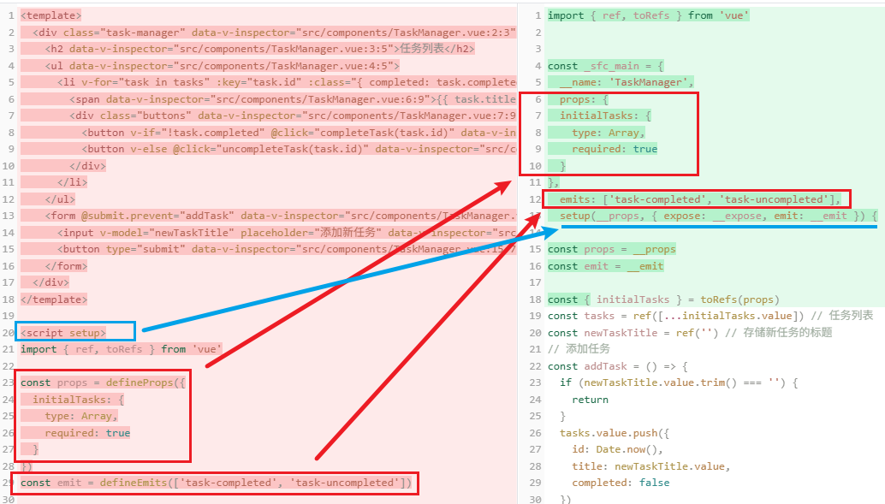

# P3S18L50：Vue3 中的 setup 语法标签

---

`setup` 语法标签，是目前 `Vue3` 最推荐的写法。

这种写法并非一蹴而就，而是一步一步演变而来的。


## 1 Vue2 经典写法

`Vue2` 时期采用的是 `Options API` 语法，这是一种经典写法。

`TaskManager.vue`（完整代码详见 `code/raw/demo1_vue2_classic`）：

```js
export default {
  name: 'TaskManager',
  props: {
    initialTasks: {
      type: Array,
      required: true,
      default: () => []
    }
  },
  data() {
    return {
      tasks: [...this.initialTasks],
      newTaskTitle: '' // 新任务标题
    }
  },
  methods: {
    // 新增任务
    addTask() {
      if (this.newTaskTitle.trim() === '') {
        return
      }
      // 添加新任务
      this.tasks.push({
        id: Date.now(),
        title: this.newTaskTitle,
        completed: false
      })
      this.newTaskTitle = '' // 清空输入框
    },
    // 标记任务已完成
    completeTask(id) {
      const task = this.tasks.find((task) => task.id === id)
      if (task) {
        task.completed = true
        this.$emit('task-completed', task)
      }
    },
    // 标记任务未完成
    uncompleteTask(id) {
      const task = this.tasks.find((task) => task.id === id)
      if (task) {
        task.completed = false
        this.$emit('task-uncompleted', task)
      }
    }
  }
}
```


## 2 Vue3 初期写法

`Vue3` 发布后，官方提出了 `Composition API` 风格。该风格能对组件的共有模块起到更好的组合式复用：

`Vue3` 早期的写法（完整代码详见 `code/raw/demo2_vue3_early`）：

```js
import { ref, toRefs } from 'vue'
export default {
  name: 'TaskManager',
  props: {
    initialTasks: {
      type: Array,
      required: true,
      default: () => []
    }
  },
  emits: ['task-completed', 'task-uncompleted'],
  setup(props, { emit }) {
    // setup是一个生命周期方法
    // 在该方法中书写数据以及函数
    const { initialTasks } = toRefs(props)
    const tasks = ref([...initialTasks.value]) // 任务列表
    const newTaskTitle = ref('') // 存储新任务的标题

    // 添加任务
    const addTask = () => {
      if (newTaskTitle.value.trim() === '') {
        return
      }
      tasks.value.push({
        id: Date.now(),
        title: newTaskTitle.value,
        completed: false
      })
      newTaskTitle.value = ''
    }
    // 完成任务
    const completeTask = (taskId) => {
      const task = tasks.value.find((task) => task.id === taskId)
      if (task) {
        task.completed = true
        // 触发自定义事件
        emit('task-completed', task)
      }
    }
    // 取消完成任务
    const uncompleteTask = (taskId) => {
      const task = tasks.value.find((task) => task.id === taskId)
      if (task) {
        task.completed = false
        // 触发自定义事件
        emit('task-uncompleted', task)
      }
    }

    // 最后需要返回一个对象
    // 该对象里面就包含了需要在模板中使用的数据以及方法
    return {
      tasks,
      newTaskTitle,
      addTask,
      completeTask,
      uncompleteTask
    }
  }
}
```

可见，早期的 `Vue3` 的 `CompositionAPI` 写法实际上也有 `Options API` 的影子，和 `Vue2` 的语法有一定的相似性，同样都是导出一个对象，最重要的特点是：对象中多了一个 `setup` 函数。

`setup()` 方法是一个 **新的生命周期钩子方法**。在该方法中，我们可以定义对应的数据和方法，并且在最后作为结果返回；在模板中可以使用返回的数据和方法。


## 3 defineComponent 写法

`defineComponent` 是 `Vue 3` 引入的一个 **辅助函数**，主要用于定义 `Vue` 组件，特别是在使用 **TypeScript 时可以更好地提供类型推断和校验**。

通过调用 `defineComponent()` 函数，我们可以：

1. 自动推断类型：减少显式类型注解，使代码更简洁；
2. 减少冗余：无需手动定义 `Props` 接口和响应式数据的类型；
3. 提高可读性：使代码更易读、更易维护。

等效写法如下（完整代码详见 `code/raw/demo3_defineComponent`）：

```js
import { defineComponent, toRefs, ref } from 'vue'
export default defineComponent({
  name: 'TaskManager',
  props: {
    initialTasks: {
      type: Array,
      required: true,
      default: () => []
    }
  },
  emits: ['task-completed', 'task-uncompleted'],
  setup(props, { emit }) {
    // setup是一个生命周期方法
    // 在该方法中书写数据以及函数
    const { initialTasks } = toRefs(props)
    const tasks = ref([...initialTasks.value]) // 任务列表
    const newTaskTitle = ref('') // 存储新任务的标题

    // 添加任务
    const addTask = () => {
      if (newTaskTitle.value.trim() === '') {
        return
      }
      tasks.value.push({
        id: Date.now(),
        title: newTaskTitle.value,
        completed: false
      })
      newTaskTitle.value = ''
    }
    // 完成任务
    const completeTask = (taskId) => {
      const task = tasks.value.find((task) => task.id === taskId)
      if (task) {
        task.completed = true
        // 触发自定义事件
        emit('task-completed', task)
      }
    }
    // 取消完成任务
    const uncompleteTask = (taskId) => {
      const task = tasks.value.find((task) => task.id === taskId)
      if (task) {
        task.completed = false
        // 触发自定义事件
        emit('task-uncompleted', task)
      }
    }

    // 最后需要返回一个对象
    // 该对象里面就包含了需要在模板中使用的数据以及方法
    return {
      tasks,
      newTaskTitle,
      addTask,
      completeTask,
      uncompleteTask
    }
  }
})
```

可以看出，`defineComponent` 仅仅只是一个辅助方法，和 `TS` 配合得更好。但是并没有从本质上改变初期 `Composition API` 的写法。


## 4 setup 标签写法

从 `Vue3.2` 版本开始正式引入 `setup` 语法糖，它 **简化了使用 Composition API 时的书写方式**，使得组件定义更加简洁和直观。

主要优化包括：

1. 简化书写：在传统的 `setup` 函数中，我们需要返回一个对象，其中包含需要在模板中使用的变量和方法；在 `<script setup>` 标签中，这一步被省略了，所有定义的变量和方法会自动暴露给模板使用，从而减少了样板代码。
2. 更好的类型推断：在 `<script setup>` 中所有定义的内容都是 **顶层变量**，`TypeScript` 的类型推断更加直观和简单。

```js
import { ref, toRefs } from 'vue'

const props = defineProps({
  initialTasks: {
    type: Array,
    required: true
  }
})
const emit = defineEmits(['task-completed', 'task-uncompleted'])

const { initialTasks } = toRefs(props)
const tasks = ref([...initialTasks.value]) // 任务列表
const newTaskTitle = ref('') // 存储新任务的标题
// 添加任务
const addTask = () => {
  if (newTaskTitle.value.trim() === '') {
    return
  }
  tasks.value.push({
    id: Date.now(),
    title: newTaskTitle.value,
    completed: false
  })
  newTaskTitle.value = ''
}
// 完成任务
const completeTask = (taskId) => {
  const task = tasks.value.find((task) => task.id === taskId)
  if (task) {
    task.completed = true
    // 触发自定义事件
    emit('task-completed', task)
  }
}
// 取消完成任务
const uncompleteTask = (taskId) => {
  const task = tasks.value.find((task) => task.id === taskId)
  if (task) {
    task.completed = false
    // 触发自定义事件
    emit('task-uncompleted', task)
  }
}
```

在 `setup` 语法糖中，没有了模板语法，定义的数据及方法能够直接在模板中使用。

另外，可通过 `defineProps` 获取到父组件传递过来的 `props`；通过 `defineEmits` 来触发父组件的事件。


### 4.1 关于编译器宏

究竟什么是 **宏** 呢？宏这个概念最初来自 `C` 语言。`C` 语言是编译型语言，在开始编译前，会对 **宏代码执行文本替换操作**，该过程也被称为 **预处理**。

例如，`C` 语言通过 `#define` 来定义宏：

```c
#define PI 3.14159
#define SQUARE(x) ((x) * (x))

int main() {
    double area = PI * SQUARE(5);
    return 0;
}
```

在编译开始前，会将 `PI` 替换为 `3.14159`；`SQUARE(5)` 替换为 `((5) * (5))`。

类比 `C` 语言，再来考察 `Vue3` 中的 `defineProps` 与 `defineEmits` 宏就简单多了。其中的宏代码后期也会被替换掉成 `Vue3` 的早期写法：

```js
export default {
  // ...
  props: {
    initialTasks: {
      type: Array,
      required: true,
      default: () => []
    }
  },
  emits: ['task-completed', 'task-uncompleted'],
  // ...
}
```

这一点可以从 `vite-plugin-inspect` 插件的编译分析中得到验证。

从插件的编译分析中，我们可以看出，`setup` 标签写法其实就是一个语法糖，方便开发者书写，在编译的时候最终会被编译为 `CompositionAPI` 早期的写法：




### 4.2 Vue3 不同版本在 expose 方法上的不同处理

**setup 虽说是一种语法糖，但在某些行为上的表现还是和原始的 Composition API 存在差异**，例如 `expose()` 方法。

先解释一下 `expose` 的用法：

>一般地，父组件管理父组件上的数据和方法，子组件管理子组件上的数据和方法。如果涉及到数据通信，则通过 `props` 的方式来传递。但如果一个组件通过 `ref` 获取到某个组件实例，在早期的 `Composition API` 中，可以获取到该组件内部所有的数据和方法。

为此，`Vue` 提供了一个名为 `expose()` 的方法，由组件自行决定：如果外部拿到我这个组件实例，我能暴露哪些成员给对方。

```js
export default {
  setup(props, { emit, expose }) {
    expose({
      // 要暴露的成员
    })
  }
}
```

新的 `setup` 标签语法发布后，新版 `Vue3` 的默认行为变为 **不向外部暴露任何的成员**。若想要暴露某个组件成员，可通过 `expose()` 方法对外公开，具体使用编译器宏 `defineExpose` 实现：

```js
defineExpose({
  // 要暴露的成员
})
```

