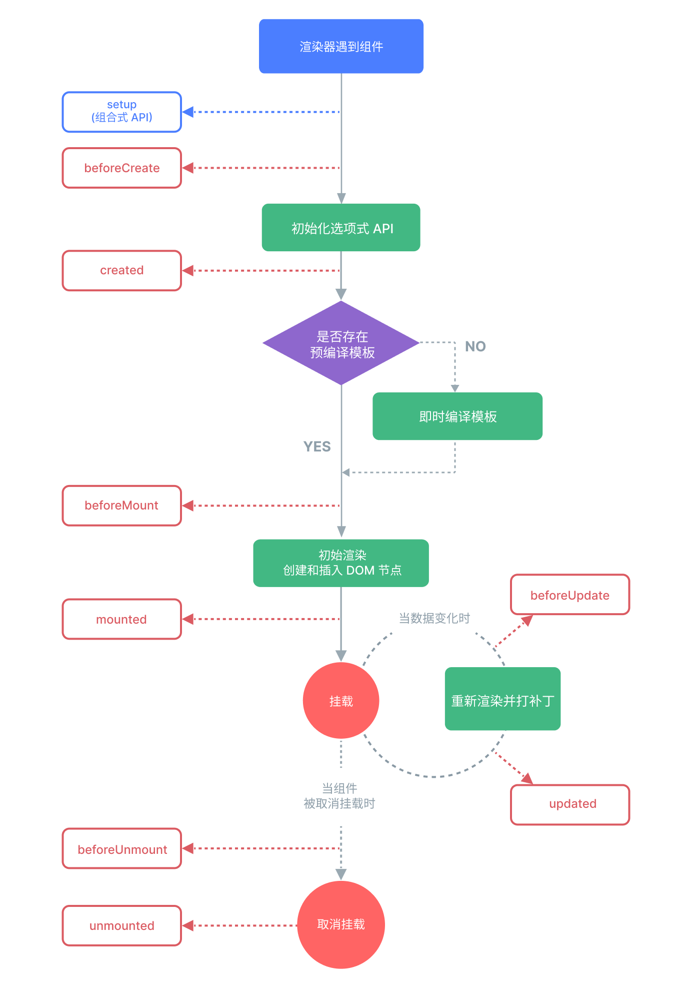
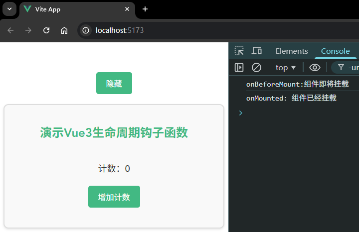
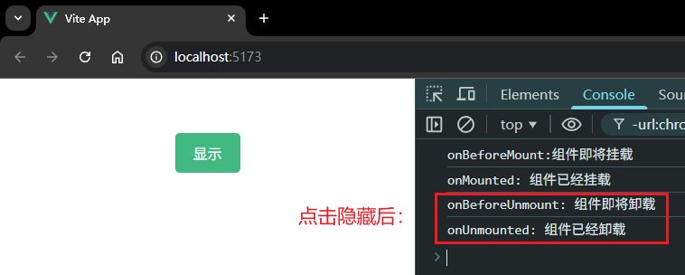
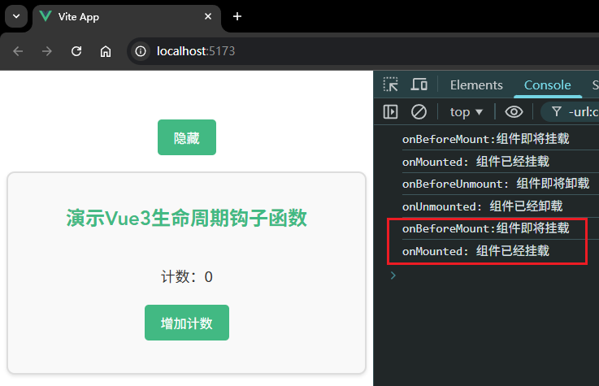
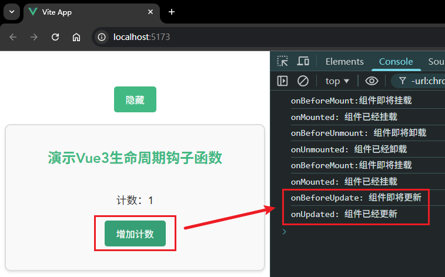
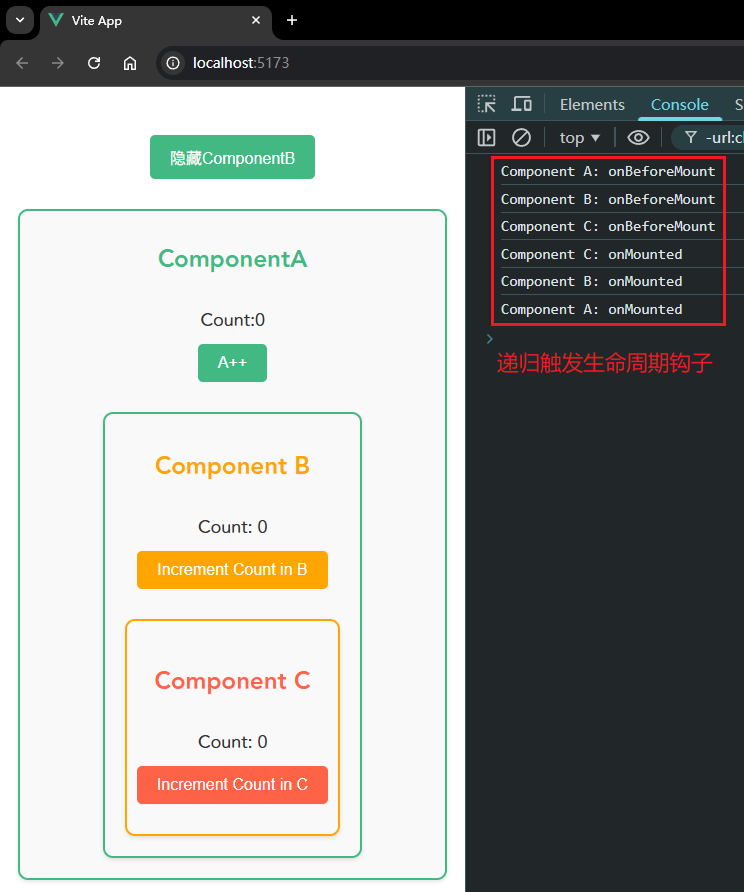
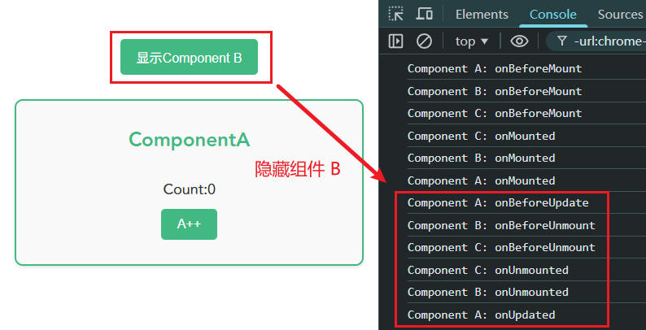
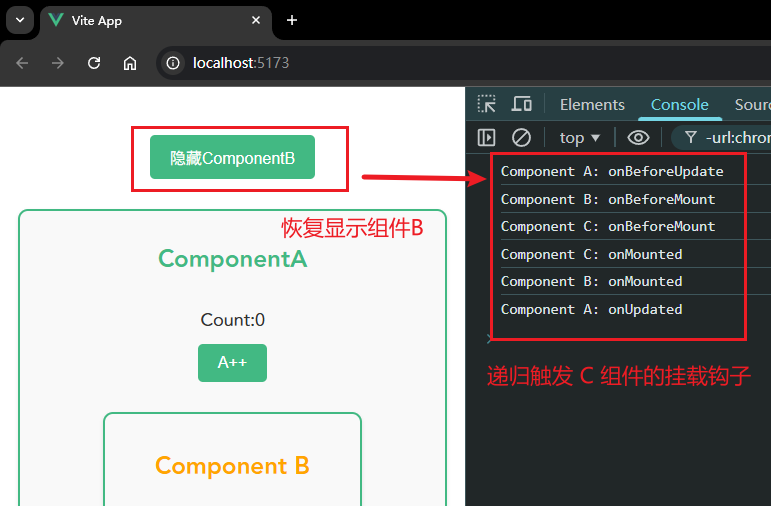
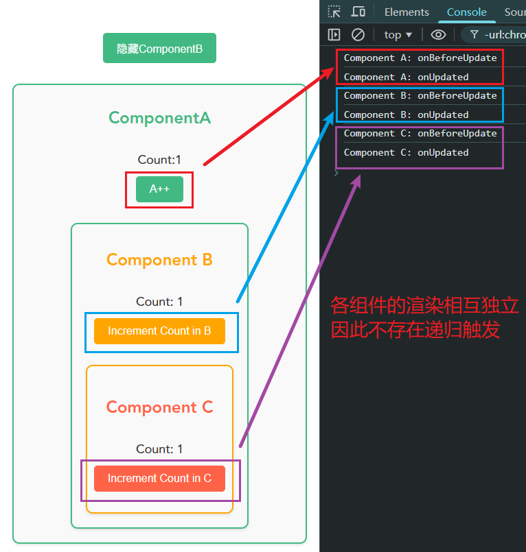

# P3S19L51：Vue3 中的组件生命周期

---

官方生命周期图：



## 1 完整生命周期

`Vue` 的完整生命周期可分为如下五个大的阶段：

1. 初始化选项式 `API`
2. 模板编译（模板 :arrow_right: 渲染函数）
3. 初始化渲染
4. 更新组件
5. 销毁组件


### 1.1 初始化选项式 API

当渲染器遇到一个组件时，首先 **初始化选项式 API**，并且在内部 **还会涉及组件实例对象的创建**。

在组件实例对象创建的前后，就对应着一组生命周期钩子函数：

- 组件实例创建前：`setup`、`beforeCreate`
- 组件实例创建后：`created`


### 1.2 模板编译

接下来会进入模板编译阶段，当模板编译结束后，会执行 `beforeMount` 钩子函数。


### 1.3. 初始化渲染

接下来是初始化渲染。到了这个阶段，意味着已经生成了真实的 `DOM`。

完成初始化渲染后会执行 `mounted` 生命周期方法。


### 1.4 更新组件

更新组件时对应另一组生命周期钩子方法：

- 更新前：`beforeUpdate`
- 更新后：`updated`


### 1.5 销毁组件

销毁组件时也对应一组生命周期钩子方法：

- 销毁前：`beforeUnmount`
- 销毁后：`unmounted`

一般会在销毁组件时完成一些 **清理工作**，例如清除计时器等。


注意：在 `Vue3` 中生命周期的钩子函数名和上面所介绍的生命周期略有不同：

|     生命周期阶段     |  Vue2 钩子名称  |   Vue3 钩子名称   |
| :------------------: | :-------------: | :---------------: |
| `beforeCreate` 阶段  | `beforeCreate`  |      `setup`      |
|    `created` 阶段    |    `created`    |      `setup`      |
|  `beforeMount` 阶段  |  `beforeMount`  |  `onBeforeMount`  |
|    `mounted` 阶段    |    `mounted`    |    `onMounted`    |
| `beforeUpdate` 阶段  | `beforeUpdate`  | `onBeforeUpdate`  |
|    `updated` 阶段    |    `updated`    |    `onUpdated`    |
| `beforeUnmount` 阶段 | `beforeDestroy` | `onBeforeUnmount` |
|   `unmounted` 阶段   |   `destoryed`   |   `onUnmounted`   |

`Vue2` 和 `Vue3` 的生命周期钩子方法 **是可以共存的**，这意味着在同一个组件中可以同时书写 `mounted` 和 `onMounted` 钩子，`Vue3` 的生命周期钩子函数的执行时机会比 `Vue2` 对应的生命周期钩子函数要 **早一些**，不过一般没人会这么写。


## 2 Vue 生命周期的本质

**所谓生命周期，其实就是在合适的时机调用用户设置的回调函数**。

首先需要了解 **组件实例** 和 **组件挂载** 的概念。

假设组件 `UserCard` 定义如下：

```js
export default {
  name: 'UserCard',
  props: {
    name: String,
    email: String,
    avatarUrl: String
  },
  data(){
    return {
      foo: 1
    }
  },
  mounted() {
    // ...
  },
  render() {
    return h('div', { class: styles.userCard }, [
      h('img', {
        class: styles.avatar,
        src: this.avatarUrl,
        alt: 'User avatar'
      }),
      h('div', { class: styles.userInfo }, [h('h2', this.name), h('p', this.email)])
    ])
  }
}
```

上述代码实际上是一个 **选项对象**（即配置对象），后续在渲染该组件时，某些配置信息会被挂载到组件实例上。

**组件实例本质上就是一个对象，该对象维护着组件运行过程中的所有信息**。例如：

- 注册到组件的生命周期钩子函数；
- 组件渲染的子树；
- 组件是否已经被挂载的标识；
- 组件自身的状态；

精简后的源码执行流程如下：

```js
function mountComponent(vnode, container, anchor) {
  // 获取选项对象
  const componentOptions = vnode.type;
  // 从选项对象上面提取出渲染函数 render 以及 data
  const { render, data } = componentOptions;

  // 创建响应式数据
  const state = reactive(data());

  // 定义组件实例，一个组件实例本质上就是一个对象，它包含与组件有关的状态信息
  const instance = {
    // 组件自身的状态数据，即响应式 data
    state,
    // 一个布尔值，用来表示组件是否已经被挂载，初始值为 false
    isMounted: false,
    // 组件所渲染的内容，即子树（subTree）
    subTree: null,
  };

  // 将组件实例设置到 vnode 上，用于后续更新
  vnode.component = instance;

  // 后面逻辑略...
}

```

以下是组件挂载的核心逻辑：

```js
function mountComponent(vnode, container, anchor) {
  // 前面逻辑略...
  
  effect(
    () => {
      // 调用组件的渲染函数，获得子树
      const subTree = render.call(state, state);
      // 检查组件是否已经被挂载
      if (!instance.isMounted) {
        // 初次挂载，调用 patch 函数第一个参数传递 null
        patch(null, subTree, container, anchor);
        // 重点：将组件实例的 isMounted 设置为 true，这样当更新发生时就不会再次进行挂载操作，
        // 而是会执行更新
        instance.isMounted = true;
      } else {
        // 当 isMounted 为 true 时，说明组件已经被挂载，只需要完成自更新即可，
        // 所以在调用 patch 函数时，第一个参数为【组件上一次渲染的子树】，
        // 意思是，使用新的子树与上一次渲染的子树进行打补丁操作
        patch(instance.subTree, subTree, container, anchor);
      }
      // 更新组件实例的子树
      instance.subTree = subTree;
    },
    { scheduler: queueJob }
  );
}
```

核心逻辑：根据组件实例的 `isMounted` 来判断该组件是否为初次挂载：

- 初次挂载：`patch` 的第一个参数为 `null`；`patch` 操作后会设置组件实例 `isMounted` 为 `true`；
- 非初次挂载：更新组件的逻辑，`patch` 的第一个参数是组件上一次渲染的子树，从而和新的子树进行 `diff` 计算。

**所谓生命周期，就是在合适的时机执行用户传入的回调函数**。

```js
function mountComponent(vnode, container, anchor) {
  const componentOptions = vnode.type;
  // 从组件选项对象中取得组件的生命周期函数
  const {
    render,
    data,
    beforeCreate,
    created,
    beforeMount,
    mounted,
    beforeUpdate,
    updated,
  } = componentOptions;
  
  // 拿到生命周期钩子函数之后，就会在下面的流程中对应的位置调用这些钩子函数

  // 在这里调用 beforeCreate 钩子
  beforeCreate && beforeCreate();

  const state = reactive(data());

  const instance = {
    state,
    isMounted: false,
    subTree: null,
  };
  vnode.component = instance;

  // 组件实例已经创建
  // 此时在这里调用 created 钩子
  created && created.call(state);

  effect(
    () => {
      const subTree = render.call(state, state);
      if (!instance.isMounted) {
        
        // 在这里调用 beforeMount 钩子
        beforeMount && beforeMount.call(state);
        
        patch(null, subTree, container, anchor);
        instance.isMounted = true;
        
        // 在这里调用 mounted 钩子
        mounted && mounted.call(state);
        
      } else {
        
        // 在这里调用 beforeUpdate 钩子
        beforeUpdate && beforeUpdate.call(state);
        
        patch(instance.subTree, subTree, container, anchor);
        
        // 在这里调用 updated 钩子
        updated && updated.call(state);
        
      }
      instance.subTree = subTree;
    },
    { scheduler: queueJob }
  );
}
```

关键点：上述代码中，首先从组件的选项对象中获取注册到组件上的生命周期函数，然后内部会在合适的时机调用它们。


## 3 嵌套结构下的生命周期

组件之间是可以进行嵌套的，从而形成一个组件树结构。那么当遇到多组件嵌套的时候，各个组件的生命周期是如何运行的呢？

实际上非常简单，就是一个 **递归的过程**。

假设：`A` 组件下面嵌套了 `B` 组件，那么渲染 `A` 的时候会执行 `A` 的 `onBeforeMount`，然后是 `B` 组件的 `onBeforeMount`，然后 `B` 正常挂载，执行 `B` 组件的 `mounted`，`B` 渲染完成后，接下来才是 `A` 的 `mounted`。执行顺序依次为：

1. 组件 A：`onBeforeMount`
2. 组件 B：`onBeforeMount`
3. 组件 B：`mounted`
4. 组件 A：`mounted`

倘若涉及到组件的销毁，也同样是递归的逻辑。


## 4 实测备忘

:one: 示例1：子组件的生命周期钩子函数用法。

页面初始加载：触发 `onBeforeMount` 和 `onMounted` 钩子：



从父组件隐藏子组件，先后触发子组件的 `onBeforeUnmount` 和 `onUnmounted` 钩子：



恢复显示子组件，先后触发子组件的 `onBeforeMount` 和 `onMounted` 钩子：



点击子组件内部的按钮，先后出发子组件的 `onBeforeUpdate` 和 `onUpdated` 钩子：




:two: 示例2：多级嵌套子组件的生命周期钩子函数触发顺序验证。

实测页面初始加载：



隐藏组件 `B` 的控制台打印情况：



再恢复组件 `B` 的渲染：



最后实测每个子组件单独的视图渲染：

