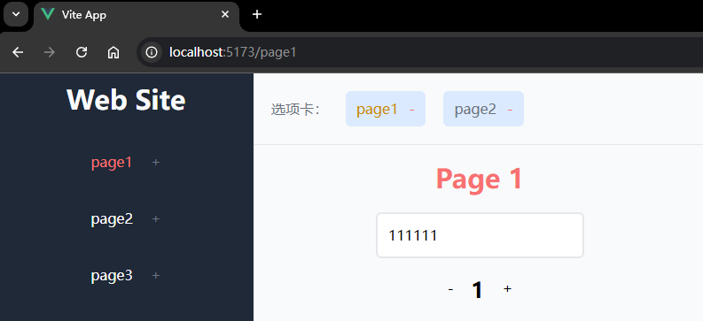
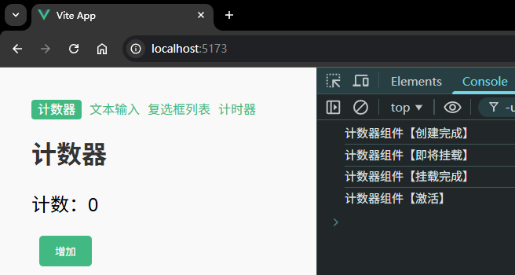

# P3S20L52：KeepAlive 内置组件的生命周期

---


## 1 KeepAlive 组件回顾

`keep-alive` 一词最初来自 `HTTP` 协议。在 `HTTP` 协议中，`KeepAlive` 被称为 **HTTP 持久连接（HTTP persistent connection）**，其作用是允许多个请求或响应共用一个 `TCP` 连接。

在没有 `KeepAlive` 的情况下，一个 `HTTP` 连接会在每次请求/响应结束后关闭；当下一次请求发生时，会重新建立 `HTTP` 连接。频繁地销毁、创建 `HTTP` 连接会带来额外的性能开销，于是 `KeepAlive` 诞生了。

`HTTP` 中的 `KeepAlive` 可以避免连接频繁地销毁/创建。与 `HTTP` 的 `KeepAlive` 类似，`Vue` 中的 `keep-alive` 组件也是用于 **对组件进行缓存，避免组件被频繁地销毁/重建**。

简单回忆一下 `keep-alive` 的用法：

```vue
<template>
	<Tab v-if="currentTab === 1">...</Tab>
	<Tab v-if="currentTab === 2">...</Tab>
	<Tab v-if="currentTab === 3">...</Tab>
</template>
```

上述代码根据变量 `currentTab` 值的不同，会渲染不同的 `<Tab>` 组件。当用户频繁切换 `Tab` 时，会导致不停地卸载并重建 `<Tab>` 组件。由此产生的性能开销问题，可以通过 `keep-alive` 组件来解决：

```vue
<template>
	<keep-alive>
  	<Tab v-if="currentTab === 1">...</Tab>
		<Tab v-if="currentTab === 2">...</Tab>
		<Tab v-if="currentTab === 3">...</Tab>	
  </keep-alive>
</template>
```

这样，无论怎样切换 `<Tab>` 组件，都不会发生频繁的创建和销毁，极大地优化了用户操作的响应性能，并且在大组件场景下优势尤为明显。

此外，`keep-alive` 还可以配置一些属性来控制一些细节：

- `include`：设置要缓存的组件，支持的书写方式有：**字符串、正则表达式、数组**；
- `exclude`：剔除缓存的组件，支持的书写方式与 `include` 相同；
- `max`：设置缓存组件的数量上限。如果缓存的实例数即将超过指定的最大数量，则最早未被访问的缓存实例将被销毁，以便为新的实例腾出空间。

更多用法，详见 `P2S27L29` 课笔记。


## 2 keep-alive 的生命周期

当某个组件挂载或卸载的时候，是会触发相关的生命周期钩子方法。

在示例二中，从组件 `A` 切换到组件 `B` 会依次触发（未引入 `keep-alive` 组件）：

- 组件 A `beforeUnmount`
- 组件 B `created`
- 组件 B `beforeMount`
- 组件 A `unmounted`
- 组件 B `mounted`

这将导致组件频繁的创建、销毁，性能上会损耗。

引入 `keep-alive` 之后，组件得以缓存，但也带来一个新的问题：无法确定某组件是否处于激活状态。遇到需要在组件激活时执行特定任务的场景，就会是因为组件被缓存而无法再次触发上述生命周期钩子方法。

为此，`Vue` 为 `keep-alive` 组件提供了两个专属的生命周期钩子方法：

- `onActivated`：首次挂载、或者组件激活时触发；
- `onDeactivated`：组件卸载、或者组件失活时触发。


## 3 实测备忘

:one: 示例一运行情况：



此时选项卡的数据来源由 `pinia` 中的 `pageNames` 统一管理。通过包裹 `<keep-alive>` 标签实现标签状态的缓存。

核心代码：

```html
<router-view v-slot="{ Component }">
  <keep-alive :include="pageNames">
    <component :is="Component" />
  </keep-alive>
</router-view>

<script setup>
import { usePageStore } from '@/store/usePageStore'
const { pageNames, addPage, removePage } = usePageStore()
</script>
```


:two: 示例二实测效果：


