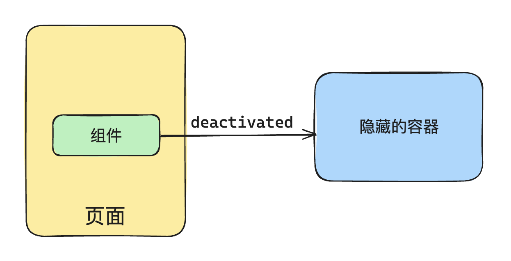
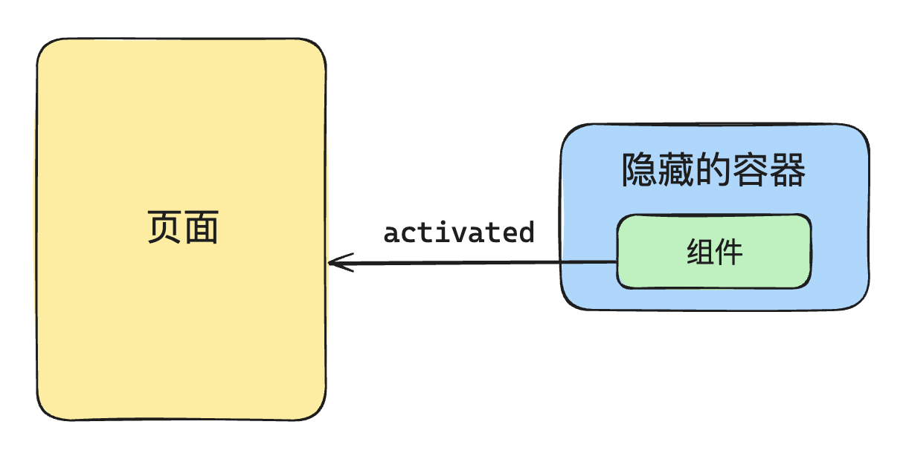

# P3S21L53：Vue 中的 KeepAlive 机制的本质

---


## 1 关于 keep-alive 的基础实现

`keep-alive` 组件的实现 **需要渲染器层面的支持**。当 `KeepAlive` 组件需要卸载其内部的某个组件时，不能真实卸载，否则该组件的当前状态就无法维持。

`KeepAlive` 采取的做法：将需要 `keep-alive` 的组件搬运到一个 **隐藏容器** 内，实现【假卸载】：



当启用了 `keep-alive` 机制的组件需要重新挂载时，只需从隐藏容器搬回原来的容器即可：



上述过程对应内部组件的两个生命周期：

- `activated`
- `deactivated`

实现一个最基本的 `keep-alive` 组件并不复杂：

```js
const KeepAlive = {
  // 这是 keepalive 组件独有的属性，用于标识这是一个 keepalive 组件
  __isKeepAlive: true,
  setup(props, { slots }) {
    // 这是一个缓存对象
    // key: vnode.type
    // value: vnode
    const cache = new Map()
    // 存储当前 KeepAlive 组件的实例
    const instance = currentInstance;
    // 从组件实例上解构出两个方法，这两个方法实际上是由渲染器注入的
    const { move, createElement } = instance.keepAliveCtx;
    
    // 创建隐藏容器
    const storageContainer = createElement("div");
    
    // 这两个方法在渲染器中会被调用
    // 作用：让组件在页面容器和隐藏容器间转移
    instance._deActivate = (vnode) => {
      move(vnode, storageContainer);
    };
    instance._activate = (vnode, container, anchor) => {
      move(vnode, container, anchor);
    };

    return () => {
      // 获取到默认插槽里面的内容
      let rawVNode = slots.default();
      
      // 如果不是对象，说明是非组件的虚拟节点，直接返回
      if (typeof rawVNode.type !== "object") {
        return rawVNode;
      }
      
      // 尝试从缓存查询出当前的组件
      const cachedVNode = cache.get(rawVNode.type);
      
      if (cachedVNode) {
        // 缓存命中：直接使用缓存的组件实例
        rawVNode.component = cachedVNode.component;
        // 并且挂上一个 keptAlive 属性
        rawVNode.keptAlive = true;
      } else {
        // 缓存未命中：加入缓存，方便下次使用
        cache.set(rawVNode.type, rawVNode);
      }
      
      // 接下来又挂了一个 shouldKeepAlive 属性
      rawVNode.shouldKeepAlive = true;
      
      // 将 KeepAlive 组件实例也添加到 vnode 上，以备渲染器后续使用
      rawVNode.keepAliveInstance = instance;
      
      return rawVNode;
    };
  },
};
```


## 2 内部组件和 KeepAlive 的特殊操作

**keep-alive 和渲染器是结合得比较深的**，`keep-alive` 组件 **本身并不会渲染额外内容**，其渲染函数最终 **只返回需要保留状态的组件**，这样的组件也称为【**内部组件**】。

`keep-alive` 组件会对这些内部组件添加一些标记属性，以便渲染器根据这些标记执行一些特定逻辑，例如：

:one: `keptAlive`：标识内部组件已被缓存，以便当内部组件重新渲染时，不被渲染器重新挂载，而是让其直接激活目标组件（`L20`）：

```js
// 渲染器内部代码片段
function patch(n1, n2, container, anchor) {
  if (n1 && n1.type !== n2.type) {
    unmount(n1);
    n1 = null;
  }

  const { type } = n2;

  if (typeof type === "string") {
    // 省略部分代码
  } else if (type === Text) {
    // 省略部分代码
  } else if (type === Fragment) {
    // 省略部分代码
  } else if (typeof type === "object" || typeof type === "function") {
    // component
    if (!n1) {
      // 如果该组件已启用状态保留，则渲染器不会重新挂载，而是调用_activate 来激活它
      if (n2.keptAlive) {
        n2.keepAliveInstance._activate(n2, container, anchor);
      } else {
        mountComponent(n2, container, anchor);
      }
    } else {
      patchComponent(n1, n2, anchor);
    }
    
  }
}
```


:two: `shouldKeepAlive`：该属性会被添加到 `vnode` 上，以便在渲染器卸载内部组件时，不会真正执行卸载，而是将其移动到隐藏容器内（`L8`）：

```js
// 渲染器代码片段
function unmount(vnode) {
  if (vnode.type === Fragment) {
    vnode.children.forEach((c) => unmount(c));
    return;
  } else if (typeof vnode.type === "object") {
    // vnode.shouldKeepAlive 是一个布尔值，用来标识该组件是否应该保留状态（KeepAlive）
    if (vnode.shouldKeepAlive) {
      // 对于需要保留状态的组件，不应该真实卸载，而应该调用其父组件，
      // 即 KeepAlive 组件实例的 _deActivate 函数使其失活
      vnode.keepAliveInstance._deActivate(vnode);
    } else {
      unmount(vnode.component.subTree);
    }
    return;
  }
  const parent = vnode.el.parentNode;
  if (parent) {
    parent.removeChild(vnode.el);
  }
}
```


:three: `keepAliveInstance`：该属性让内部组件持有 `KeepAlive` 组件的实例，以便让渲染器在某些场景下通过该属性来访问 `KeepAlive` 组件实例的 \_`deActivate()` 以及 \_`activate()` 方法。


## 3 关于 include 和 exclude

默认情况下，`keep-alive` 会对所有的内部组件状态进行缓存。

若只期望缓存特定组件，此时可以使用 `include` 和 `exclude` 属性：

```vue
<keep-alive include="TextInput,Counter">
  <component :is="Component" />
</keep-alive>
```

因此 `keep-alive` 组件需要定义相关的 `props` 来声明匹配规则：

```js
const KeepAlive = {
  __isKeepAlive: true,
  props: {
    include: RegExp,
    exclude: RegExp
  },
  setup(props, { slots }) {
    // ...
  }
};
```

在放入缓存前，需要先检查该组件是否满足匹配规则（`L17` 至 `L21`）：

```js
const KeepAlive = {
  __isKeepAlive: true,
  props: {
    include: RegExp,
    exclude: RegExp,
  },
  setup(props, { slots }) {
    // 省略部分代码...

    return () => {
      let rawVNode = slots.default();
      if (typeof rawVNode.type !== "object") {
        return rawVNode;
      }

      const name = rawVNode.type.name;
      if (
        name &&
        ((props.include && !props.include.test(name)) ||
          (props.exclude && props.exclude.test(name)))
      ) {
        return rawVNode;
      }

      // 进入缓存的逻辑...
    };
  },
};
```


## 4 关于 KeepAlive 中的缓存管理

假设当前的 `KeepAlive` 缓存机制实现如下：

```js
const cachedVNode = cache.get(rawVNode.type);
if (cachedVNode) {
  rawVNode.component = cachedVNode.component;
  rawVNode.keptAlive = true;
} else {
  cache.set(rawVNode.type, rawVNode);
}
```

按照上述缓存设计，只要未命中缓存，就会添加新的缓存。这将导致缓存不断增加，极端情况下会占用大量的内容。

为此，`keep-alive` 组件允许用户设置缓存的阀值：当组件缓存数量超过了指定阀值时会对缓存进行修剪：

```vue
<keep-alive :max="3">
  <component :is="Component" />
</keep-alive>
```

因此在设计 `keep-alive` 组件时，还需要新增一个名为 `max` 的 `prop` 属性：

```js
const KeepAlive = {
  __isKeepAlive: true,
  props: {
    include: RegExp,
    exclude: RegExp,
    max: Number
  },
  setup(props, { slots }) {
    // ...
  }
};
```

并且补充一个负责精简缓存的方法：

```ts
function pruneCacheEntry(key: CacheKey) {
  const cached = cache.get(key) as VNode
  
  // 中间逻辑略...
  
  cache.delete(key)
  keys.delete(key)
}
```

最后更新缓存的队列：

```ts
const cachedVNode = cache.get(key)
if (cachedVNode) {
  // 其他逻辑略...
 
  // 进入此分支，说明缓存队列里面存在目标组件，需要更新一下优先顺序
  
  // 保证当前这个在缓存中是最新的
  // 先删除，再添加即可
  keys.delete(key)
  keys.add(key)
} else {
  // 说明缓存未命中，说明是全新的，则先添加再精简
  keys.add(key)
  if (max && keys.size > parseInt(max as string, 10)) {
    // 进入此分支，说明当前添加进去的组件缓存已经超过了最大值，进行删除
    pruneCacheEntry(keys.values().next().value)
  }
}
```


- `keep-alive` 核心原理，就是将内部组件搬运到隐藏容器，以及从隐藏容器搬运回来。因为不涉及真实卸载，组件状态也得以保留；
- `keep-alive` 和渲染器是结合得比较深的，`keep-alive` 会给内部组件添加一些特殊标识，以备渲染器使用；后续渲染器在挂载/卸载组件时，会根据这些标识执行特定的操作。
- `include` 和 `exclude` 核心原理，就是对内部组件设置某些筛选（或滤除）条件，匹配筛选（或滤除）条件的组件才能执行后续的缓存逻辑；
- `max`：缓存状态前先检查缓存是否命中
  - 缓存命中：更新到队列最后（以免被优化）；
  - 缓存未命中：加入缓存，并检查是否超过最大阈值，超过了就需要进行修剪。