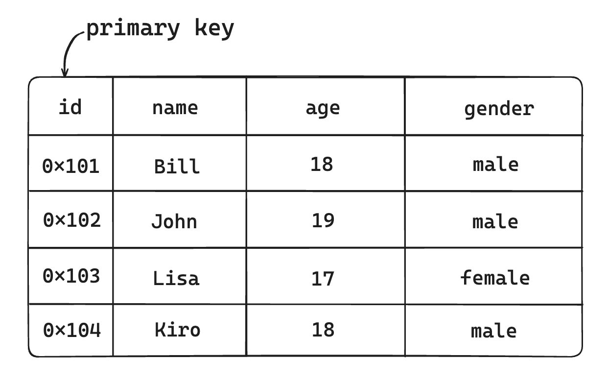
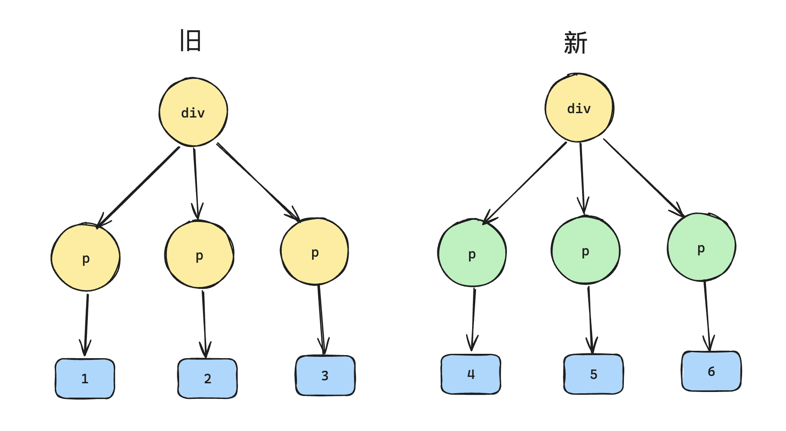
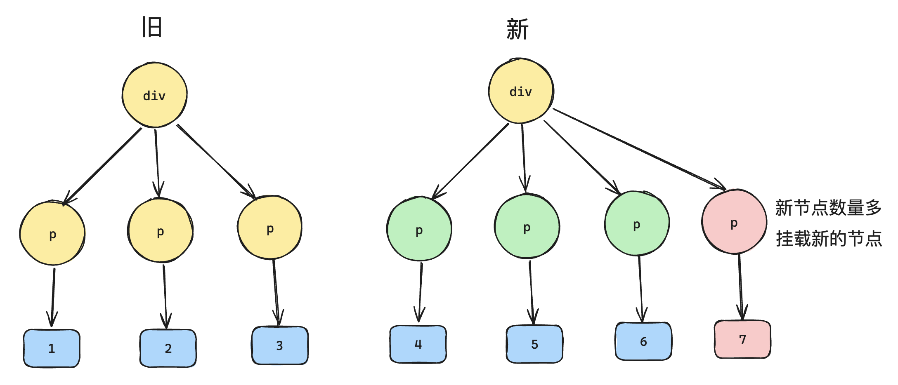
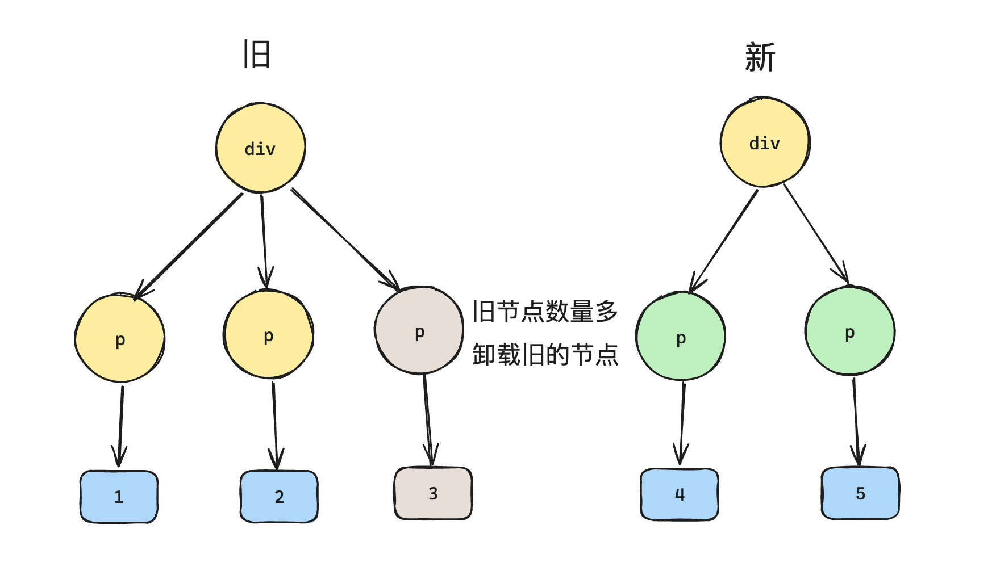
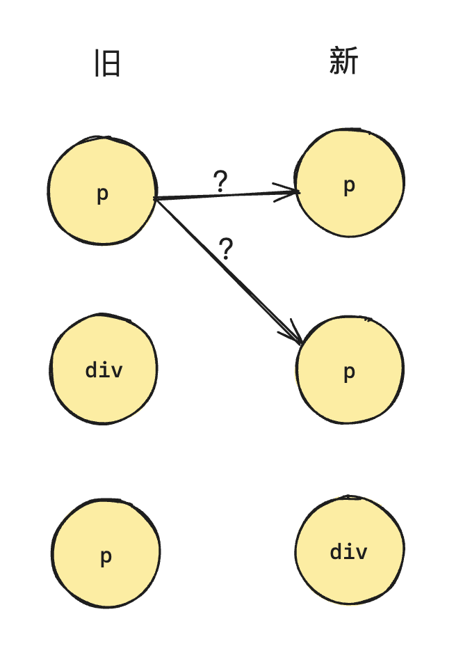
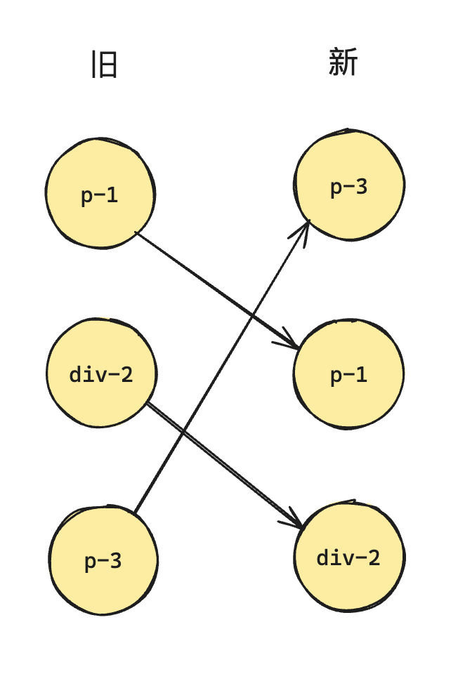
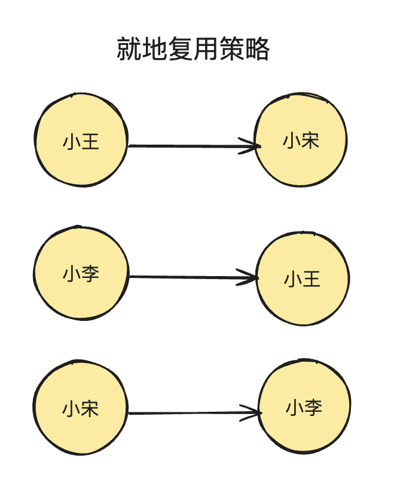
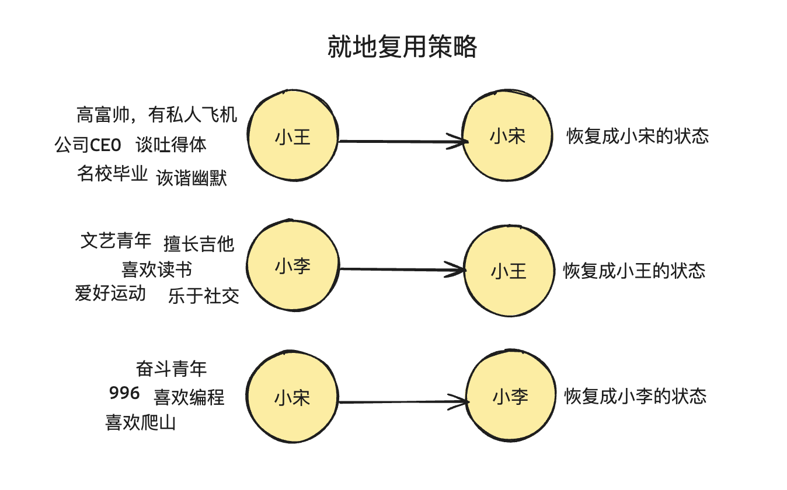
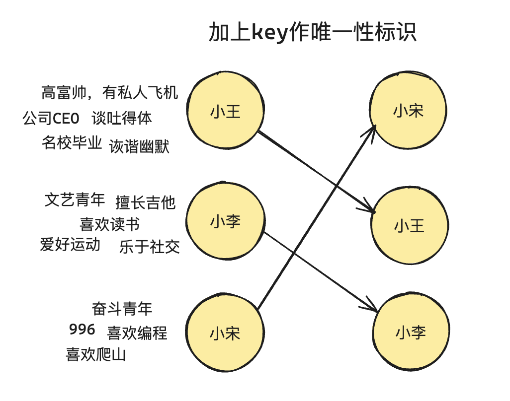

# P3S22L54：Vue 中的 key 的本质

---


## 1 类比关系型数据库

在关系型数据库中，有一个 **主键（Primary Key，即 PK）** 的概念。它与 `Vue` 中的 `key` 的概念类似：



在关系型数据库中，**主键用于标记这条数据的唯一性**，因此在上表中只有 `id` 这个字段能够作为主键，另外三个都不行。

为什么需要对一条数据做唯一性标识呢？主要是为了 **方便精准查找**。这就好比现实生活中的身份证号，所有人都是独一无二的，你名字可能相同、年龄、性别这些都可能相同，而身份证号则是每个人的唯一标识，能够精准找到这个人。

`Vue` 中的 `key` 也是同一个道理，其中的 `key` 也是用来做唯一标识，即 **虚拟节点 VNode 的唯一标识**。


## 2 如果不采用复用策略

假设更新前的虚拟 `DOM` 为：

```js
const oldVNode = {
  type: 'div',
  children: [
    {type: 'p', children: '1'},
    {type: 'p', children: '2'},
    {type: 'p', children: '3'},
  ]
}
```

```html
<div>
  <p>1</p>
  <p>2</p>
  <p>3</p>
</div>
```

更新后的虚拟 DOM 为：

```js
const newVNode = {
  type: 'div',
  children: [
    {type: 'p', children: '4'},
    {type: 'p', children: '5'},
    {type: 'p', children: '6'},
  ]
}
```

如果完全不采用复用策略，那么当更新子节点的时候，需要执行 6 次 `DOM` 操作：



- 卸载所有旧的子节点，需要三次 `DOM` 的删除操作；
- 挂载所有新的子节点，需要三次 `DOM` 的添加操作。

观察发现，`VNode` 的变化仅涉及 `p` 元素的子节点（文本节点），`p` 元素本身并没有任何变化。因此最理想的做法是更新这三个 `p` 元素的文本节点内容，这样只涉及三次 `DOM` 操作，性能提升一倍。


## 3 采用复用策略

如果 `VNode` 节点的更新考虑复用策略，则需要根据情况分别处理。

本节暂从 **节点类型** 和 **节点数量** 两个维度考察复用策略的具体实现：

| 复用策略 | 数量不变 |   数量改变   |
| :------: | :------: | :----------: |
| 类型不变 |  情况一  |    情况二    |
| 类型改变 |  情况三  | （暂不考虑） |


### 3.1 情况一：长度不变、类型也不变

此时只更新 `VNode` 的文本节点，伪代码如下：

```js
function patchChildren(n1, n2, container){
  if(typeof n2.children === 'string'){
    // 说明该节点的子节点就是文本节点
    // ...
  } else if(Array.isArray(n2.children)){
    // 说明该节点的子节点也是数组
    const oldChildren = n1.children; // 旧的子节点数组
    const newChildren = n2.children; // 新的子节点数组
    
    // 目前假设长度没有变化
    for(let i = 0; i < oldChildren.length; i++){
      // 对文本子节点进行更新
      patch(oldChildren[i], newChildren[i])
    }
  } else {
    // 其他情况
    // ...
  }
}
```


### 3.2 情况二：数量改变、类型不变

这里的 **数量** 即根节点下的直接子节点的个数。分两种情况：

- 如果新节点更多，则 **挂载新节点**：



- 如果新节点更少，则 **卸载多余的旧节点**：



对应的伪代码如下：

```js
function patchChildren(n1, n2, container){
  if(typeof n2.children === 'string'){
    // 说明该节点的子节点就是文本节点
    // ...
  } else if(Array.isArray(n2.children)){
    // 说明该节点的子节点也是数组
    const oldChildren = n1.children; // 旧的子节点数组
    const newChildren = n2.children; // 新的子节点数组
    
    // 存储一下新旧节点的长度
    const oldLen = oldChildren.length; // 旧子节点数组长度
    const newLen = newChildren.length; // 新子节点数组长度
    
    // 接下来先找这一组长度的公共值，也就是最小值
    const commonLength = Math.min(oldLen, newLen);
    
    // 先遍历最小值，把该处理的节点先跟新
    for(let i = 0; i < commonLength; i++){
      // 对文本子节点进行更新
      patch(oldChildren[i], newChildren[i])
    }
    
    // 然后接下来处理长度不同的情况
    if(newLen > oldLen){
      // 新节点多，那么就做新节点的挂载
      for(let i = commonLength; i < newLen; i++){
        patch(null, newChildren[i], container);
      }
    } else if(oldLen > newLen){
      // 旧节点多，做旧节点的卸载
      for(let i = commonLength; i < oldLen; i++){
        unmount(oldChildren[i]);
      }
    }
  } else {
    // 其他情况
    // ...
  }
}
```


### 3.3 情况三：类型改变、数量不变

例如：

```js
const oldVNode = {
  type: 'div',
  children: [
    {type: 'p', children: '1'},
    {type: 'div', children: '2'},
    {type: 'span', children: '3'},
  ]
}
```

```js
const newVNode = {
  type: 'div',
  children: [
    {type: 'span', children: '3'},
    {type: 'p', children: '1'},
    {type: 'div', children: '2'},
  ]
}
```

此时若按照已有设计，所有节点均无法复用，又回到最初的情况：需要 6 次 `DOM` 操作。

但是稍加观察就会发现，本例仅仅是元素标签移动了位置，因此最理想的情况是移动 `DOM` 节点即可，这样也能达到对 `DOM` 节点的复用。

问题来了：如何确定两个节点是同一个可相互复用的节点？

如果只比较 `VNode` 的 `type` 类型值，遇到多个同类型节点就会冲突：

```js
const oldVNode = {
  type: 'div',
  children: [
    {type: 'p', children: '3'},
    {type: 'div', children: '2'},
    {type: 'p', children: '1'},
  ]
}
```

```js
const newVNode = {
  type: 'div',
  children: [
    {type: 'p', children: '1'},
    {type: 'p', children: '3'},
    {type: 'div', children: '2'},
  ]
}
```

此时无法单凭节点类型实现一一映射：




### 3.4 引入 key 标识

`VNode` 中的 `key` 相当于给每一个虚拟节点发放唯一的身份证号，以此定位唯一的 `VNode` 节点：

```js
const oldVNode = {
  type: 'div',
  children: [
    {type: 'p', children: '3', key: 1},
    {type: 'div', children: '2', key: 2},
    {type: 'p', children: '1', key: 3},
  ]
}
```

```js
const newVNode = {
  type: 'div',
  children: [
    {type: 'p', children: '1', key: 3},
    {type: 'p', children: '3', key: 1},
    {type: 'div', children: '2', key: 2},
  ]
}
```



这样一来，当 `VNode` 的 `type` 属性和 `key` 属性都相同，则说明是同一映射，并且在新旧节点中都出现了，那么就可以进行 `DOM` 节点的复用。

>提问：如果不使用 `key`，在旧节点中找到一个类型相同的虚拟节点并复用该节点。这样设计有问题吗？

答：在没有 `key` 的情况下，`Vue` 内部采用的就是这样的复用策略。该策略被称为【就地更新】策略。该策略默认是高效的，**但仅仅保证了 DOM 节点的类型一致**，一旦节点本身还依赖 **子组件的状态或者临时的 DOM 状态**，就无法实现精准匹配，必须引入额外的处理逻辑来解决子组件状态的还原，或者临时 `DOM` 状态的还原。

例如：假设旧节点是三个男生，新节点也是三个男生：



如果只考虑是否是男生，然后简单的把名字变一下，这样的【就地复用】策略非常高效。

但很多时候原节点的状态都会依赖子组件的状态或临时的 `DOM` 状态：



此时的就地复用策略反而低效，因为还需要考虑 **子组件状态或者临时的 DOM 状态的恢复**。

此时最好的方式就是加上 `key`，让新旧节点能够精准匹配：




### 3.5 数组下标作 key 值的弊端

还有一点需要特别注意：**避免使用下标来作为节点的 key 值**。如果列表中的元素顺序发生变化，`Vue` 会复用错误的元素，导致不必要的 `DOM` 更新和渲染错误。

例如，当列表只执行插入或删除元素操作时，数组下标会让每个元素的 `key` 发生变化，让 `Vue` 无法正确识别元素，从而导致状态和数据的不一致：

```js
// 初始状态
[{ id: 1, text: 'Item 1' }, { id: 2, text: 'Item 2' }, { id: 3, text: 'Item 3' }]

// 删除第二个元素后的状态
[{ id: 1, text: 'Item 1' }, { id: 3, text: 'Item 3' }]
```

此时使用下标作 `key` 值，当删除第二个元素后，第三个元素的下标会从 `2` 变为 `1`，`Vue` 会误以为新旧第二个元素是同一个，从而更新出错。


## 4 小结

`key` 本质上就是给 `VNode` 节点做唯一性标识，算是 `VNode` 的一个身份证号。

特别是在渲染列表时。`key` 的作用主要有：

1. **高效的更新：** `key` 帮助 `Vue` 识别哪些元素是变化的、哪些是新的、哪些是需要被移除的；
   - 在没有 `key` 的情况下，`Vue` 会尽量复用已有元素，而不管它们的实际内容是否发生了变化，这可能导致不必要的更新或者错误的更新；
   - 使用 `key` 后，`Vue` 可以准确知晓元素的变化情况，从而高效更新 `DOM`；
2. **确保元素的唯一性**：只有这样，每个元素在列表中才能被唯一标识，在元素移动、插入或删除时不致于前后彼此混淆；
3. **提升渲染性能：** 使用 `key` 可以显著提升列表渲染的性能。因为 `Vue` 能通过 `key` 快速定位到需要更新的元素，无需重新渲染整个列表。在处理大型列表时，使用 `key` 还可以避免大量不必要的 `DOM` 操作，提升应用的响应速度。

