# P4S02L56：Vue3 中的属性透传

---


> [!tip]
>
> `Vue3` 属性透传官方文档：https://cn.vuejs.org/guide/components/attrs


透传 `attribute`：指的是传递给一个组件，却没有被该组件声明为 [props](https://cn.vuejs.org/guide/components/props.html) 或 [emits](https://cn.vuejs.org/guide/components/events.html#defining-custom-events) 的 `attribute` 属性，或者 `v-on` 事件监听器。最常见的例子就是 `class`、`style` 和 `id`。


## 1 快速上手

子组件 `A.vue`：

```vue
<template>
  <div>
  	<p>A组件</p>
  </div>
</template>
```

父组件 `App.vue`：

```vue
<template>
	<!-- 这些属性在A组件内部都没有声明为Props -->
  <A id="a" class="aa" data-test="test" />
</template>

<script setup>
import A from './components/A.vue'
</script>
```

最终渲染结果：

```html
<div id="app" data-v-app="">
  <!-- 这些属性在A组件内部都没有声明为Props -->
  <div id="a" class="aa" data-test="test">
    <p>A组件</p>
  </div>
</div>
```

实测效果（`00336e8`）：

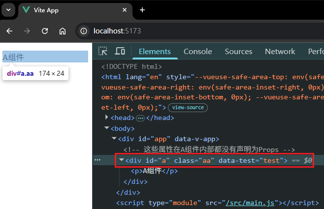


## 2 用法细节

### 2.1 对 class 和 style 的合并

:one: 如果一个子组件的根元素已经有了 `class` 或 `style` 属性（`attribute`），则它们会和从父组件上设置的值 **合并**：

```vue
<!-- App.vue -->
<template>
  <A id="a" class="aa" data-test="test" />
</template>

<!-- A.vue -->
<template>
  <div class="bb">
  	<p>A组件</p>
  </div>
</template>
```

最终子组件 `A.vue` 的根节点渲染的类名为 `class="bb aa"`（`d3da358`）：

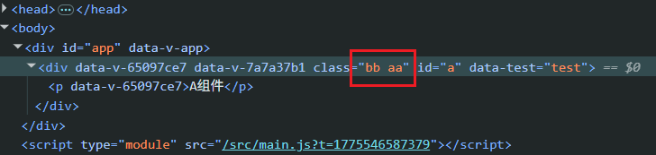


:two: 子组件上的同名属性 **会被忽略**，最终生效的是父组件上指定的值：

示例代码（`2af11bf`）：

```vue
<!-- App.vue -->
<template>
  <A id="outer" data-test="test-outer" />
</template>

<!-- A.vue -->
<template>
  <div id="inner" data-test="test-inner">
  	<p>A组件</p>
  </div>
</template>

<!-- Result -->
<div id="outer" data-test="test-outer">
  <p>A组件</p>
</div>
```

最终子组件 `A.vue` 的根节点渲染的 `id` 和 `data-test` 均以父组件中指定的值为准：

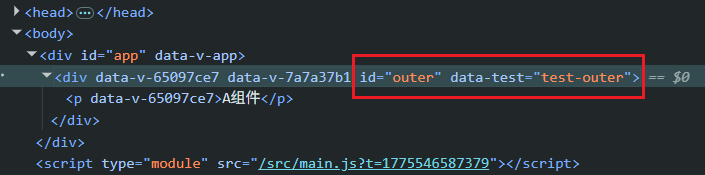

> [!tip]
>
> 如果父子组件对同一样式类设计了不同的样式，最终 **仍以父组件中的样式为准**（`705cbe9`）：
>
> ```vue
> <!-- App.vue -->
> <template>
>   <A class="a-container" />
> </template>
> 
> <!-- A.vue -->
> <template>
>   <div class="a-container">
>   	<p>A组件</p>
>   </div>
> </template>
> 
> <!-- Result -->
> <div id="outer" data-test="test-outer">
>   <p>A组件</p>
> </div>
> ```
>
> 实测效果：
>
> 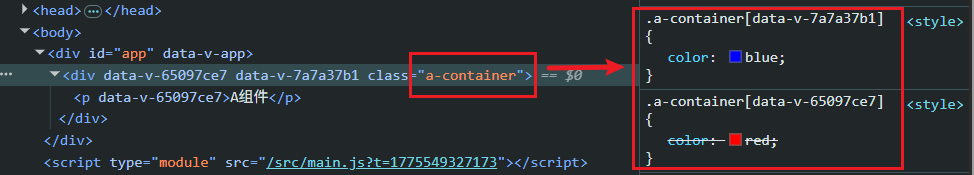


### 2.2 深层组件继承

:one: `App.vue` 使用 `A.vue`、`A.vue` 又使用 `B.vue`，且 `A.vue` 在根节点上直接渲染 `B.vue`：此时从透传属性（`attribute`）会 **继续透传** 到 `B.vue`：

```vue
<!-- App.vue -->
<template>
  <A class="box" />
</template>

<!-- A.vue -->
<template>
  <!-- 组件 A 直接渲染子组件 B -->
  <B />
</template>

<!-- B.vue -->
<template>
  <div class="b-container">
  	<p>B组件</p>
  </div>
</template>
```

上述代码中 `B` 组件充当了 `A` 组件的根节点，因此 `B` 最终获得了类名 `"box"`（`f544f8d`）：

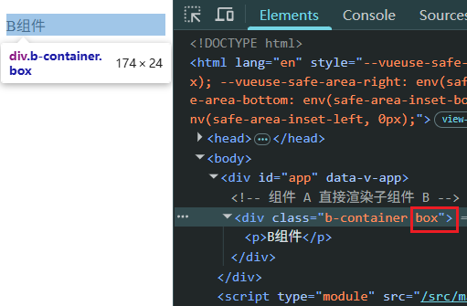


:two: ​在 `props` 或 `emits` 中声明过的 `attribute` 属性均不会继续深度透传。可以理解为 **这些属性被 A 组件消费了**：

【示例1】透传的属性中包含 `props` 属性：

```vue
<!-- App.vue -->
<template>
  <A class="box" foo="bar" baz="xyz" />
</template>

<!-- A.vue -->
<template>
  <!-- 组件 A 直接渲染子组件 B -->
  <B />
</template>
<script setup>
import B from './B.vue'
const props = defineProps(['foo'])
console.log('props:', props)
</script>

<!-- B.vue -->
<template>
  <div class="b-container">
  	<p>B组件</p>
  </div>
</template>
```

实测截图：

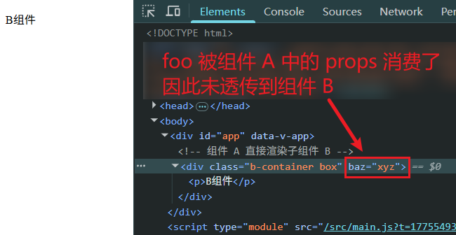

【示例2】 未在 `emits` 中声明的事件监听函数同样也会深度透传（`63d0aaf`）：

```vue
<!-- App.vue -->
<template>
  <A @click="clickHandler" />
</template>
<script setup>
import A from './components/A.vue'
const clickHandler = ({target}) => console.log('(App.vue) clicked target:', target)
</script>

<!-- A.vue -->
<template>
  <!-- 组件 A 直接渲染子组件 B -->
  <B />
</template>

<!-- B.vue -->
<template>
  <div class="b-container">
    <p>B组件</p>
  </div>
</template>
<style scoped>
.b-container {
  border: 10px solid black;
}
p {
  border: 10px solid grey;
}
</style>
```

上述代码会将 `click` 事件侦听函数 `clickHandler` 透传到 `A` 组件的根元素，即 `B` 组件的 `<div class="b-container">` 元素上，因此点击 `B` 组件的不同区域将得到不同的被点击元素：

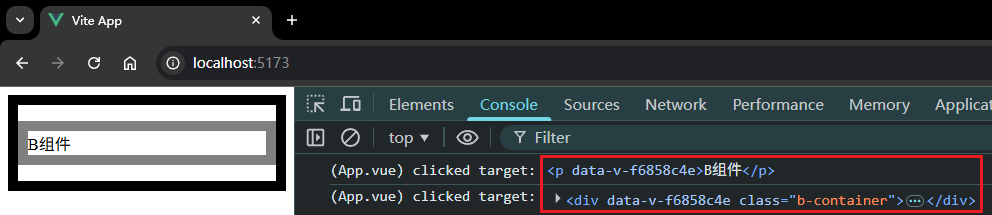

但只要在 `A` 组件显式声明 `click` 事件（即通过 `L9` 消费 `emits` 属性），经实测，即便没有执行 `L10` 来使用 `emits`，`B` 组件仍然无法得到透传的 `clickHandler`：

```vue
<!-- A.vue -->
<template>
  <!-- 组件 A 直接渲染子组件 B -->
  <B />
</template>

<script setup>
import B from './B.vue'
const emits = defineEmits(['click'])
// console.log(emits);
</script>
```

实测截图（`a345bf0`）：

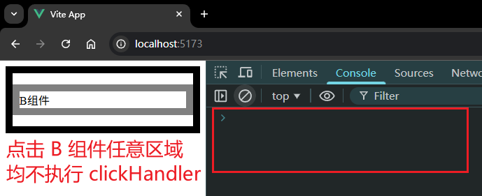


### 2.3 手动禁用属性透传

被透传的属性默认会透传到子组件的 **根元素** 上，想要透传到指定位置，可以先禁用默认行为：

从 `v3.3` 开始可以直接在 `<script setup>` 中使用 [`defineOptions`](https://cn.vuejs.org/api/sfc-script-setup.html#defineoptions) 宏（从此无需单独写到不带 `setup` 的 `script` 标签内）：

```html
<script setup>
defineOptions({
  inheritAttrs: false
})
// ...setup 逻辑
</script>
```

然后通过 `v-bind` 绑定 `$attrs` 手动指定具体位置：

```html
<div>
  <p v-bind="$attrs">A组件</p>
</div>
```

实测截图（`f198aab`）：

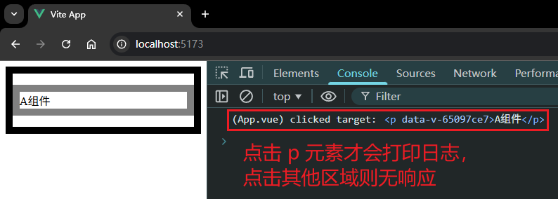


另外还需注意两点：

1. 和 `props` 不同，透传 `attributes` 在 `JS` 中 **保留原始大小写**：类似 `foo-bar` 的 `attribute` 需通过 `$attrs['foo-bar']` 来访问；
2. 类似 `@click` 这样的一个 `v-on` 事件监听器可通过 `$attrs.onClick` 访问。

第二条验证代码：

```vue
<!-- A.vue -->
<template>
  <div class="a-container">
    <p v-bind="$attrs">A组件</p>
    <p>{{ $attrs.onClick.toString() }}</p>
  </div>
</template>
```

实测截图（`7a02504`）：

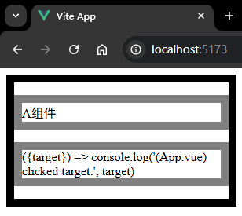


### 2.4 多根节点属性透传

存在多个根节点的子组件没有默认的 `attribute` 透传行为（`265754f`）：

```vue
<header>...</header>
<main>...</main>
<footer>...</footer>
```

此时 `Vue` 不确定将 `attribute` 透传给谁，所以会抛出一个警告：

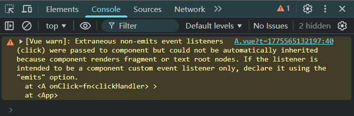

正确做法：通过 `$attrs` 显式绑定透传位置：

```vue
<header>...</header>
<main v-bind="$attrs">...</main>
<footer>...</footer>
```


### 2.5 在 JS 中访问透传属性

在 `<script setup>` 中可以使用 `API` 接口 `useAttrs` 来访问一个组件的所有透传属性（`attribute`）：

```vue
<!-- A.vue -->
<template>
  <h2>组件A</h2>
</template>

<script setup>
import { useAttrs } from 'vue'
const attrs = useAttrs()
console.log(attrs.onClick);
</script>
```

实测效果（`5eca545`）：

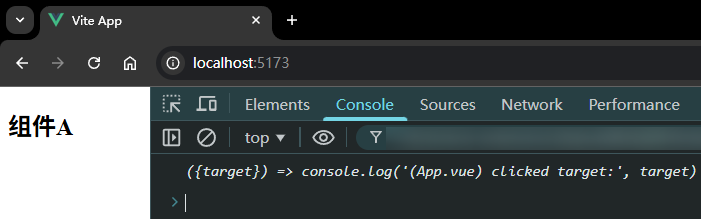

如果不使用 `<script setup>`，`attrs` 也可以作为 `setup()` 方法上下文对象（`ctx`）的一个属性进行读取（`97fe9a7`）：

```vue
<template>
  <h2>组件A</h2>
</template>

<script>
export default {
  setup(_, { attrs }) {
    console.log(attrs.onClick)
  }
}
</script>
```

实测效果：（与上图一致，略）。