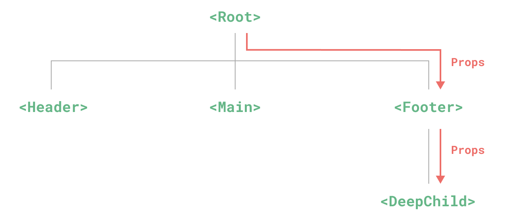
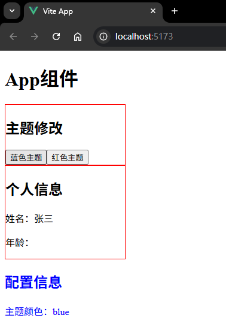

# P4S03L57：Vue3 中的依赖注入

---


> [!tip]
>
> `Vue` 依赖注入官方文档：https://cn.vuejs.org/api/composition-api-dependency-injection


`Props` 逐级传递存在的问题：



改用 `Pinia`：虽然也能解决该问题，但不是 `Vue` 原生功能。此时可以考虑 `Vue` 自带的 **依赖注入** 特性。


## 1 快速上手

整个依赖注入分为两个角色：

1. 提供方：负责 **提供数据**；
2. 注入方：负责 **接收数据**；

### 1.1 提供方

要提供数据，使用 `provide()` 方法：

```vue
<script setup>
import { provide } from 'vue'

// provide(数据名称, 实际数据)
provide('message', 'hello!')
</script>
```

`provide()` 方法接收的参数：

1. 数据对应的名称
2. 实际的数据


### 1.2 注入方

注入方使用 `inject()` 方法：

```vue
<script setup>
import { inject } from 'vue'

const message = inject('message')
</script>
```


## 2 相关用法细节

### 2.1. 非 setup 语法糖的用法

如果没有使用 `setup` 语法糖，需要 **确保 provide 和 inject 方法是在 setup 方法中同步调用的**：

```js
import { provide } from 'vue'

export default {
  setup() {
    provide(/* 注入名 */ 'message', /* 值 */ 'hello!')
  }
}
```

```js
import { inject } from 'vue'

export default {
  setup() {
    const message = inject('message')
    return { message }
  }
}
```

因为 `Vue` 的依赖注入机制需要在组件初始化期间 **同步建立** 依赖关系，以 **确保所有组件在渲染之前就已经获取到必要的依赖数据**。若在 `setup` 之外或异步调用，则无法保证。


### 2.2 全局依赖下的用法

```js
// main.js
import { createApp } from 'vue'

const app = createApp({})

app.provide(/* 注入名 */ 'message', /* 值 */ 'hello!')
```

此时应用内的所有组件中都可以注入该数据。


### 2.3 inject 默认值的用法

注入方可以提供一个默认值，与 `props` 的默认值类似：

```js
// 如果没有祖先组件提供 "message"
// value 会是 "这是默认值"
const value = inject('message', '这是默认值')
```


### 2.4 提供响应式数据

`provide()` 所提供的值 **可以是任意类型的值，包括响应式状态值**。

注意：

:one: 如果提供的是一个 `ref` 值，注入的也是该 `ref` 对象，**不会自动解包** 为其内部值；

:two: **最佳实践：尽可能将变更响应式状态的所有逻辑都保持在【提供方】组件中**：

```vue
<!-- 在供给方组件内 -->
<script setup>
import { provide, ref } from 'vue'

// 响应式数据
const location = ref('North Pole')
// 修改响应式数据的方法
function updateLocation() {
  location.value = 'South Pole'
}

provide('location', {
  location,
  updateLocation
})
</script>
```

```vue
<!-- 在注入方组件 -->
<script setup>
import { inject } from 'vue'
// 同时拿到响应式数据，以及修改该数据的方法
const { location, updateLocation } = inject('location')
</script>

<template>
  <button @click="updateLocation">{{ location }}</button>
</template>
```

:three: 使用 `readonly` 让提供的值只读：

```vue
<script setup>
import { ref, provide, readonly } from 'vue'

const count = ref(0)
provide('read-only-count', readonly(count))
</script>
```


### 2.5 使用 Symbol 作为数据名

大型应用最佳实践：使用 `Symbol` 作 `provide()` 方法的数据名，以避免潜在的命名冲突；并且推荐在一个单独的文件中导出这些 `Symbol` 名称：

```js
// keys.js
export const myInjectionKey = Symbol()
```

```js
// 在供给方组件中
import { provide } from 'vue'
import { myInjectionKey } from './keys.js'

provide(myInjectionKey, { /* 要提供的数据 */ });
```

```js
// 注入方组件
import { inject } from 'vue'
import { myInjectionKey } from './keys.js'

const injected = inject(myInjectionKey)
```


## 3 实战案例

整个应用程序在多个组件中共享一些全局配置（主题颜色、用户信息...）。

代码详见 `code/raw/demo`，实测效果：



实测备忘：全局注册时也可以链式调用，不必非要断开：

```js
// main.js:
// 创建全局配置信息对象
const globalConfig = reactive({
  themeColor: 'blue',
  user: {
    name: '张三',
    role: 'admin'
  }
})

// 更新主题颜色的方法
function changeThemeColor(color) {
  globalConfig.themeColor = color
}

createApp(App)
  .provide('globalConfig', globalConfig)
  .provide('changeThemeColor', changeThemeColor)
  .mount('#app')
```

