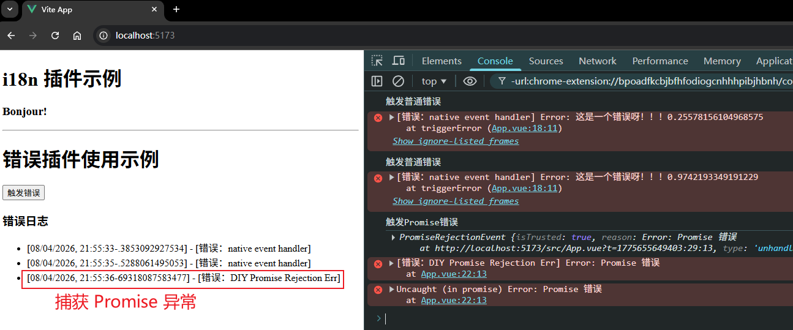
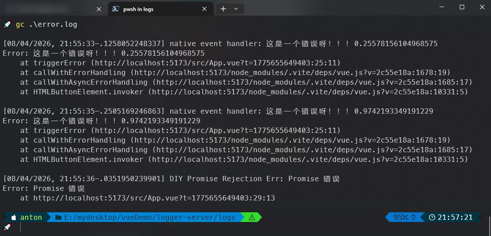

# P4S06L60：Vue3 的插件机制

---

> [!tip]
>
> `Vue` 插件官方文档：https://cn.vuejs.org/guide/reusability/plugins


## 1 概述

插件（`plugin`）是一种可选的独立模块，它可以添加特定功能或特性，而无需修改主程序的代码。

在 `Vue` 中使用插件：

```js
const app = createApp();
// 通过 use 方法来使用插件
app.use(router).use(pinia).use(ElementPlus).mount('#app')
```

在 `Vue` 中创建插件：

1. 插件可以是一个 **拥有 install 方法的对象**：

   ```js
   const myPlugin = {
     install(app, options) {
       // 配置此应用
     }
   }
   ```

2. 也可以直接是 **一个安装函数本身**：

   ```js
   const install = function(app, options){}
   ```

   安装方法接收两个参数：

   1. `app`：`Vue` 应用实例；

   2. `options`：额外选项，这是在使用插件时传入的额外配置信息，格式为：

      ```js
      app.use(myPlugin, {
        /* 可选的选项，会传递给 options */
      })
      ```

插件没有严格定义的使用范围，但是插件发挥作用的常见场景主要包括以下几种：

1. 通过 `app.component` 和 `app.directive` 注册一到多个全局组件或自定义指令；
2. 通过 `app.provide` 使一个资源注入进整个应用；
3. 向 `app.config.globalProperties` 中添加一些全局实例属性或方法；
4. 一个可能上述三种都包含了的功能库（例如 `vue-router`）

例如：自定义组件库时，通过 `install` 方法往当前应用注册所需组件：

```js
// 导入需要注册的自定义组件
import Button from './Button.vue';
import Card from './Card.vue';
import Alert from './Alert.vue';

const components = [Button, Card, Alert];

const myPlugin = {
  install(app, options){
    // 将所有引入的自定义组件批量注册到当前的应用里面
    components.forEach(comp => app.component(comp.name, comp));
  }
}

export default myPlugin;
```


## 2 实战案例

【案例需求1】实测 `Vue` 官网演示的自定义翻译插件 `i18n`。

核心代码：

```js
// ./src/plugins/i18n.js
export default {
  install(app, options) {
    app.config.globalProperties.$translate = (key) =>
      key.split('.').reduce((o, e) => (o ? o[e] : void 0), options)
  }
}
```


【案例需求2】在企业级应用开发中，经常需要一个 **全局错误处理和日志记录插件**，它能够帮助捕获和记录全局的错误信息，并提供一个集中化的日志记录机制。该插件的功能如下：

1. **捕获全局的 Vue 错误** 和 **未处理的 Promise 错误**；
2. 将错误信息 **记录到控制台** 或 **发送到远程日志服务器**（详见 `code/diy/logger-server`；运行 `node server.js` 启动；按 <kbd>Ctrl</kbd> + <kbd>C</kbd> 退出）；
3. 提供一个自定义 `Vue` 组件 `ErrLogger` 用于显示最近的错误日志。


实测效果（包含两个案例）：



远程日志服务器收集情况：




## 3 实测备忘

:one: 本节介绍的插件创建流程：

- 通过一个自定义的 `JS` 模块定义插件（使用自定义配置项、注册自定义组件等）；
- 然后在 `main.js` 注册该插件（通过 `app.use()` 方法）；
- 最后在 `App.vue` 中验证该插件功能（类似 `vue-router` 的使用）。

:two: 实测 `i18n` 插件时，定义 `$translate()` 函数忘记写 `return` 关键字了，导致页面始终不渲染翻译结果。

