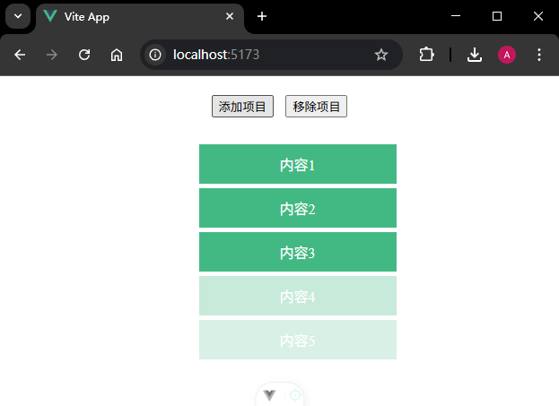
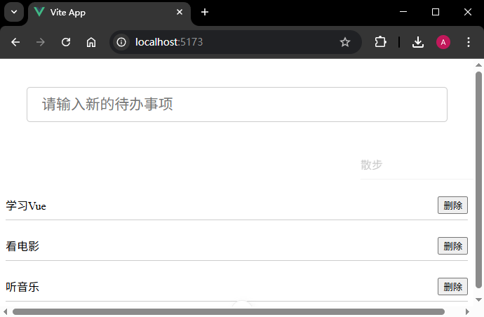

# P4S08L62：Vue 内置组件之：动画组件 TransitionGroup

---


> [!tip]
>
> `Vue` 官方文档：https://cn.vuejs.org/guide/built-ins/transition-group.html


`TransitionGroup` 仍然是 `Vue` 里面一个内置的组件，用于解决 **多个元素** 的过渡问题。


## 1 案例演示

下面的代码使用 `Transition` 为项目添加过渡效果，但是没有生效：

```vue
<template>
  <div class="container">
    <div class="btns">
      <button @click="addItem">添加项目</button>
      <button @click="removeItem">移除项目</button>
    </div>
    <Transition name="fade">
      <ul>
        <li v-for="item in items" :key="item" class="box">{{ item }}</li>
      </ul>
    </Transition>
  </div>
</template>

<script setup>
import { ref } from 'vue'

const items = ref(['内容1', '内容2', '内容3'])

const addItem = () => {
  items.value.push(`内容${items.value.length + 1}`)
}

const removeItem = () => {
  items.value.pop()
}
</script>

<style>
.container {
  text-align: center;
}
.btns button {
  margin: 1em 0.5em;
}
.box {
  background-color: #42b983;
  color: white;
  margin: 5px auto;
  padding: 10px;
  width: 200px;
}
.fade-enter-active,
.fade-leave-active {
  transition: opacity 1s;
}
.fade-enter-from,
.fade-leave-to {
  opacity: 0;
}
</style>
```

> [!tip]
>
> **提问：为什么过渡不生效？**
>
> 答：因为这里对项目的新增和移除都是针对的 `li` 元素，但是 `Transition` 下面是 `ul`，而 `ul` 是一直存在的。
>
> 并且 `Transition` 内 **只能有一个根元素**。如果存放多个根元素，会报错：
>
> ```markdown
> <Transition> expects exactly one child element or component.
> ```

此时要用 `TransitionGroup` 。代码重构如下：

```vue
<TransitionGroup name="fade" tag="ul">
  <li v-for="item in items" :key="item" class="box">{{ item }}</li>
</TransitionGroup>
```


## 2 用法细节

`TransitionGroup` 可以看作是升级版 `Transition`，它支持和 `Transition` 基本相同的 `props`、`CSS` 过渡 `class` 和 `JavaScript` 钩子监听器，但有以下几点区别： 

1. 默认情况下，**它不会渲染一个容器元素**。但可以通过传入一个名为 `tag` 的 `prop` 属性来指定一个容器元素。 
2. 过渡模式 `mode` 在这里 **不可用**，因为不再是在互斥的元素之间进行切换。 
3. 列表中的每个元素都必须有一个独一无二的 `key` 属性（`attribute`）。
4. `CSS` 过渡 `class` **会被应用在列表内的元素上**，而不是容器元素上。


## 3 实战案例

使用过渡效果优化待办事项的显示效果。

案例一实测效果（`code/raw/demo/src/App0.vue`）：



案例二实测效果（`code/raw/demo/src/App.vue`）：



---

-EOF-