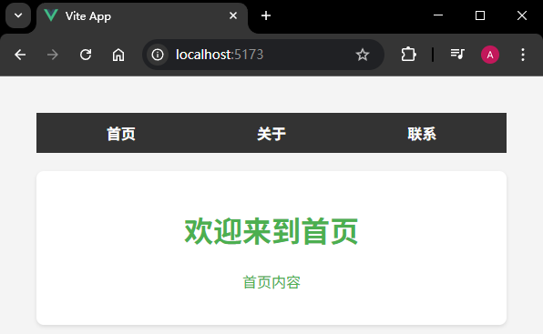
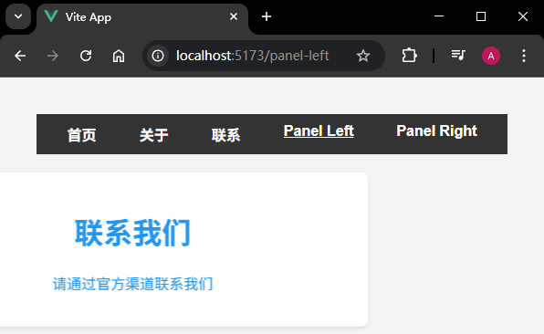
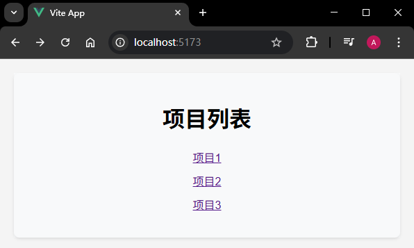
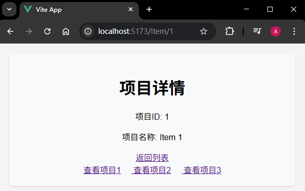

# P4S18L72：在 Vue3 路由中设置过渡特效

---


## 1 快速上手

为路由切换添加过渡效果，其实就是使用 `Transition` 内置组件，没有其他新知识：

```vue
<router-view v-slot="{ Component }">
  <Transition name="fade" mode="out-in">
    <component :is="Component" />
  </Transition>
</router-view>
```

实测效果：




## 2 用法细节

### 2.1 单个路由的过渡

- 如果要求对不同的路由设置不同的过渡特效，则可以通过以下途径实现：
  - `meta`：设置元数据，上面记录过渡的方式；
  - `RouterView` 插槽，通过插槽拿到 `route`，从而拿到元数据里面的过渡方式；
  - `<Transition>` 组件设置不同的 `name` 值从而应用不同的过渡方式。

核心逻辑：

```vue
<template>
  <div id="app">
    <nav>
      <router-link to="/">首页</router-link>
      <router-link to="/about">关于</router-link>
      <router-link to="/contact">联系</router-link>
      <router-link to="/panel-left">Panel Left</router-link>
      <router-link to="/panel-right">Panel Right</router-link>
    </nav>
    <router-view v-slot="{ Component, route }">
      <Transition :name="route.meta.transition || 'fade'" mode="out-in">
        <component :is="Component" />
      </Transition>
    </router-view>
  </div>
</template>
```

实测效果：




### 2.2 基于路由动态过渡

这里可以使用导航守卫（全局后置守卫）来添加过渡效果：

```js
router.afterEach((to) => {
  switch (to.path) {
    case '/panel-left':
      to.meta.transition = 'slide-left'
      break
    case '/panel-right':
      to.meta.transition = 'slide-right'
      break
    default:
      to.meta.transition = 'fade'
  }
})
```


### 2.3 使用 Key

`Vue` 可能会 **自动复用看起来相似的组件**，从而忽略了任何过渡，可以 **添加一个 key 属性** 来强制过渡。

核心逻辑：

```vue
<!-- App.vue -->
<template>
  <div id="app">
    <router-view v-slot="{ Component, route }">
      <transition name="fade" mode="out-in">
        <component :is="Component" :key="route.path" />
      </transition>
    </router-view>
  </div>
</template>
```

实测效果：



