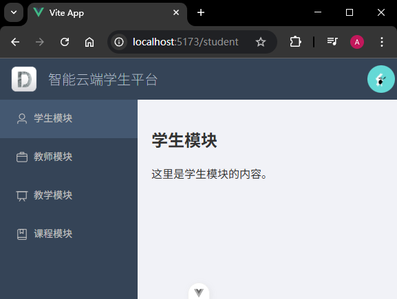

# P4S20L74：Vue3 动态路由的实现

---


## 1 动态路由辨析

- 动态参数路由：
  - `/stu/:id`：匹配 `/stu/1`、`/stu/2`
- 动态的添加/删除路由表中的路由：
  - 角色A：`route1`、`route2`、`route3`、`route4`、`route5`
  - 角色B：`route1`、`route2`、`route4`


## 2 基础知识

这里的 `router` 就是通过 `createRouter` 方法创建的路由实例。

:one: `router.addRoute()`：动态的添加路由，只注册一个新的路由，如果要跳转到新路由需要手动 `push` 或者 `replace`；

:two: `router.removeRoute(name)`：动态的移除路由，除了此方法移除路由，还有几种方式——

- 通过添加一个 **名称冲突** 的路由。如果添加与现有路由名称相同的路由，会先删除旧路由，再添加新路由：

```js
router.addRoute({ path: '/about', name: 'about', component: About })
// 这将会删除之前已经添加的路由，因为他们具有相同的 name
router.addRoute({ path: '/other', name: 'about', component: Other })
```

- 通过调用 `router.addRoute()` 返回的 **回调函数**，调用该函数后可以删除添加的路由。当路由没有名称时，这很有用。

  ```js
  const removeRoute = router.addRoute(routeRecord)
  removeRoute() // 删除路由如果存在的话
  ```

如果要添加嵌套的路由，可以将路由的 `name` 作为 **第一个参数** 传递给 `router.addRoute()`：

```js
router.addRoute({ name: 'admin', path: '/admin', component: Admin })
router.addRoute('admin', { path: 'settings', component: AdminSettings })
```

这等价于：

```js
router.addRoute({
  name: 'admin',
  path: '/admin',
  component: Admin,
  children: [{ path: 'settings', component: AdminSettings }],
})
```

另外还有两个常用 `API`：

:three: `router.hasRoute(name)`：检查路由是否存在。

:four: `router.getRoutes()`：获取一个包含所有路由记录的数组。


## 3 实战案例

实现一个后台管理系统（基于 `vue-element-admin` 改造），该系统根据用户登录的不同角色，显示不同的导航栏。

权限分为三种：

- 管理员：能够访问所有模块（教学、教师、课程、学生）
- 教师：能够访问教学、课程、学生模块
- 学生：能够访问课程模块

核心逻辑：

```js
/**
 * 根据角色动态的添加路由
 * @param {*} role string （admin、teacher、student）
 */
export function setRoutesbyRole(role) {
  // 1. 先清空已有的路由
  clearRoutes()
  // 2. 根据角色将对应的路由取出来
  const roleRoutes = routesMap[role] || []
  // 3. 动态的给 dashboard 添加子路由
  roleRoutes.forEach((route) => {
    router.addRoute(dashboardRoute.name, route)
  })
}
```

实测截图：

