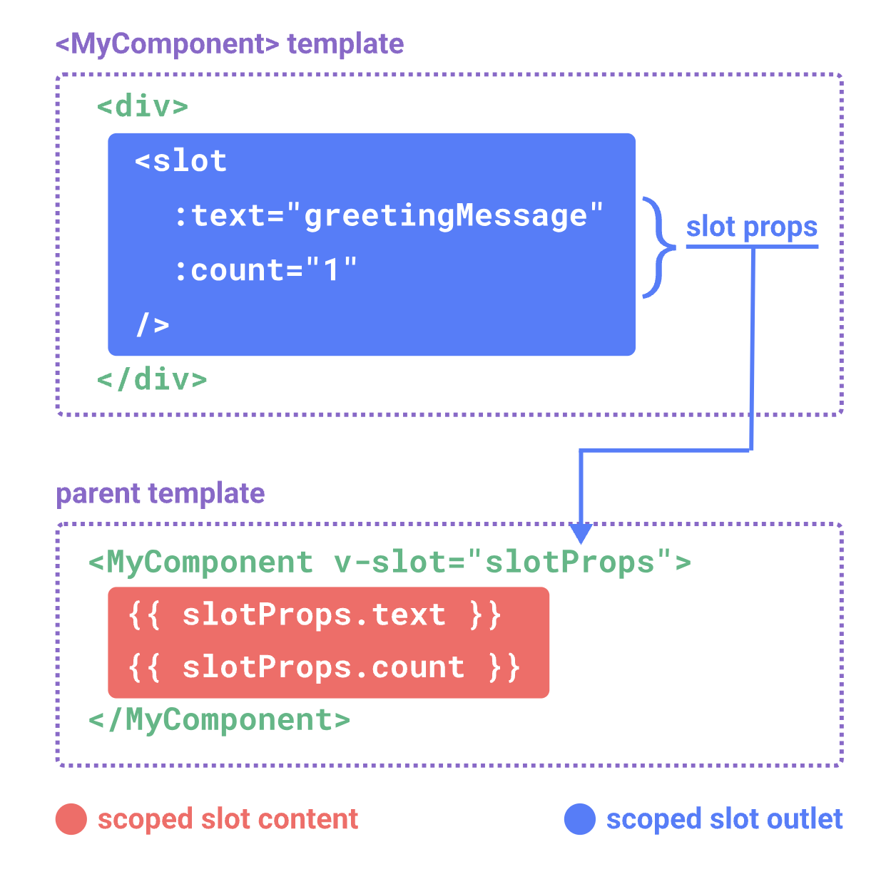
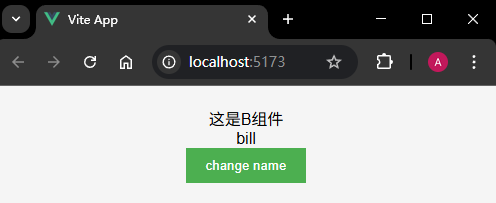
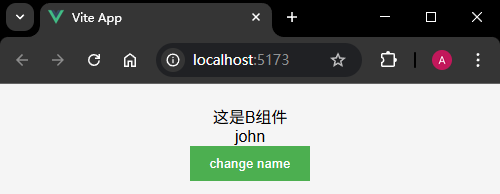

# P4S21L75：Vue3 数据通信方式总结

---


通信方式整体来讲能够分为两大类：

1. 父子组件通信
2. 跨层级组件通信


## 1 父子组件通信

1. `Props`：通过 `Props` 可以实现父组件向子组件传递数据；

2. `Event`：又被称之为 **自定义事件**，原理是父组件通过 `Props` 向子组件传递一个自定义事件；子组件通过 `emit` 来触发自定义事件；触发自定义事件的过程中会传递一些数据给父组件；

3. 属性透传：一些没有被组件声明为 `props`、`emits` 或自定义事件的属性，但依然能传递给子组件，例如常见的 `class`、`style` 和 `id`；

4. `ref` 引用：`ref` 除了创建响应式数据以外，还可以拿来作为引用；

5. 作用域插槽：子组件在设置 `slot` 插槽时，可以绑定一些属性，以便父组件通过 `v-slot` 来获取这些属性；

   


## 2 跨层级组件通信

主要有四种：

1. 依赖注入；
2. 事件总线（自定义或借助第三方库 `mitt`）；
3. 自定义全局状态管理；
4. 使用 `Pinia`。


### 2.1 依赖注入

通过 `provide`（提供数据方）和 `inject`（注入数据方）来实现的。


### 2.2 事件总线

从 `Vue2` 时期就支持的一种通信方式。从 `Vue3` 开始更加推荐 **依赖注入** 或者 **Pinia** 来进行组件通信。不过事件总线这种方式仍然保留了下来。

- 原理：本质上是设计模式里面的观察者模式，有一个对象（事件总线）维护一组依赖于它的对象（事件监听器），当自身状态发生变化的时候会通过所有的事件监听器。

- 核心操作：

  1. 发布事件：发布通知，通知所有的依赖自己去执行监听器方法；
  2. 订阅事件：其他对象可以订阅某个事件，当事件发生时，就会触发相应的回调函数；
  3. 取消订阅；

- 事件总线的核心代码如下：

  ```js
  class EventBus {
    constructor() {
      // 维护一个事件列表
      this.events = {}
    }
  
    /**
     * 订阅事件
     * @param {*} event 你要订阅哪个事件
     * @param {*} listener 对应的回调函数
     */
    on(event, listener) {
      if (!this.events[event]) {
        // 说明当前没有这个类型
        this.events[event] = []
      }
      this.events[event].push(listener)
    }
  
    /**
     * 发布事件
     * @param {*} event 什么类型
     * @param {*} data 传递给回调函数的数据
     */
    emit(event, data) {
      if (this.events[event]) {
        // 首先有这个类型
        // 通知这个类型下面的所有的订阅者（listener）执行一遍
        this.events[event].forEach((listener) => {
          listener(data)
        })
      }
    }
  
    /**
     * 取消订阅
     * @param {*} event 对应的事件类型
     * @param {*} listener 要取消的回调函数
     */
    off(event, listener) {
      if (this.events[event]) {
        // 说明有这个类型
        this.events[event] = this.events[event].filter((item) => {
          return item !== listener
        })
      }
    }
  }
  
  const eventBus = new EventBus()
  export default eventBus
  ```

- 除了像上面一样自己来实现事件总线以外，还可以使用现成的第三方库 `mitt`（详见 [NPM 官网](https://npmjs.org/package/mitt)）：

  ```js
  import mitt from 'mitt'
  const eventBus = mitt()
  export default eventBus
  ```


### 2.3 自定义数据仓库

其实就是简易版的 `Pinia`；


### 2.4 使用 Pinia

官网：

详见 `P2S28L30_state_management` 和 `P2S29L31_pinia_in_action` 笔记。


## 3 实操备忘

:one: 除了通过 `ref` 获取 `DOM` 元素外，还能通过 `defineExpose` 宏调用手动暴露数据和方法：

```vue
<!-- A.vue -->
<template>
  <div>
    <B ref="childRef" />
    <button @click="clickhandle">change name</button>
  </div>
</template>

<script setup>
import { ref } from 'vue'
import B from './B.vue'

// 这里的 ref 是拿来做引用的
const childRef = ref(null)
function clickhandle() {
  if (childRef.value) {
    // 当前存在组件的引用
    console.log(childRef.value.name)
    childRef.value.changeName()
  }
}
</script>

<!-- B.vue -->
<template>
  <div>这是B组件</div>
  <div>{{ name }}</div>
</template>

<script setup>
import { ref } from 'vue'
const name = ref('bill')
function changeName() {
  name.value = 'john'
}

// 需要将数据和方法进行暴露
defineExpose({
  name,
  changeName
})
</script>
```

实测效果：



点击后：


