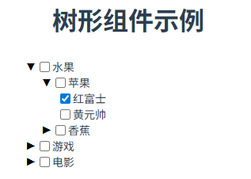
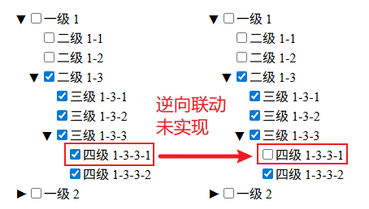
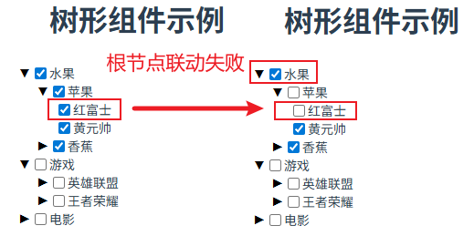
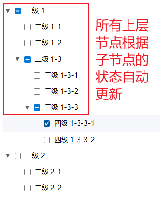

# P4S23L77：封装树形组件

---


## 1 需求描述

用学到的 `Vue3` 的知识自行实现一版树形组件 `<Tree />`，效果如下：




### 1.1 组件 prop 属性

:one: `data`：树形结果的数据，例如：

```js
const data = ref([
  {
    label: '水果',
    checked: false, // 添加初始勾选状态
    children: [
      {
        label: '苹果',
        checked: false,
        children: [
          {
            label: '红富士',
            checked: false
          },
          {
            label: '黄元帅',
            checked: false
          }
        ]
      },
    ]
  },
])
```

:two: `show-checkbox`：是否显示复选框

:three: `transition`：是否应用过渡效果

:four: 支持事件 `@update:child-check`，可以获取最新的状态


### 1.2 用法示例

```vue
<Tree
  :data="data"
  :show-checkbox="true"
  :transition="true"
  @update:child-check="handleChildCheck"
/>
```


### 1.3 要点提示

关于复选框需要处理一些细节：

1. 父节点 `选中/取消` 会控制所有的子节点 `选中/取消` 状态；
2. 子节点的 `选中/取消` 状态也会影响父节点。


## 2 实测备忘

:one: 实测利用 `CSS3` 变换中的 `transform: rotate(90deg)` 实现图标的转向效果；

:two: 利用父子节点的递归赋值实现了子组件与父组件勾选状态的单向同步（子到父的联动未实现）：



:three: 原课件中的逆向同步逻辑：利用了 `provide/inject` 透传机制，但也仅解决了往上一层的联动；更上层的联动未能实现（让自行修改完善）：



另外，树形节点的数据源未能提供 `id` 来标识唯一性，也是一大败笔。

:four: `DeepSeek` 专家模式给出了最终版本（自带中间状态）：



核心逻辑：由于原需求描述缺少很多中间状态，`DeepSeek` 自行实现了一个递归组件 `TreeNode`，让最终交付的 `Tree` 组件引用 `TreeNode` 组件，从而只暴露题目要求的组件属性。
