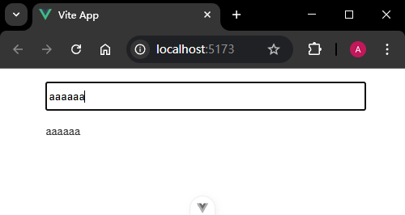

# P4S24L78：利用 customRef 自定义防抖 ref

---


## 1 要点梳理

先来实现一个防抖的响应式数据：

```vue
<template>
  <div class="container">
    <input @input="debounceInputHandler" type="text" />
    <p class="result">{{ text }}</p>
  </div>
</template>

<script setup>
import { ref } from 'vue'
import { debounce } from 'lodash'
const text = ref('')

function inputHandler(e) {
  text.value = e.target.value
}

const debounceInputHandler = debounce(inputHandler, 1000)
</script>

<style scoped>
.container {
  width: 80%;
  margin: 1em auto;
}
.result {
  color: #333;
}
.container input {
  width: 100%;
  height: 30px;
}
</style>
```

假设 `Vue` 内置了一个防抖的 `ref`：

```vue
<template>
  <div class="container">
    <input v-model="text" type="text" />
    <p class="result">{{ text }}</p>
  </div>
</template>

<script setup>
import { debounceRef } from 'vue'
const text = debounceRef('', 1000)
</script>
```

可惜 `Vue` 并没有内置 `debounceRef`，需要自行实现。

思路：利用 `Vue` 的内置 `API`：`customRef`（详见官方文档 [customRef()](https://vuejs.org/api/reactivity-advanced.html#customref)）

`customRef` 的类型声明：

```js
function customRef<T>(factory: CustomRefFactory<T>): Ref<T>

type CustomRefFactory<T> = (
  track: () => void,
  trigger: () => void
) => {
  get: () => T
  set: (value: T) => void
}
```

下面是基于 `customRef` 的简易 `ref` 实现：

```js
import { customRef } from 'vue'
let value = ''
const text = customRef(() => {
  return {
    get() {
      console.log('get')
      return value
    },
    set(val) {
      value = val
      console.log('set')
    }
  }
})
console.log(text)
console.log(text.value)
text.value = 'test'
```

通过 `customRef` 实现 `ref` 原有的功能：

```vue
<template>
  <div class="container">
    <input v-model="text" type="text" />
    <p class="result">{{ text }}</p>
  </div>
</template>

<script setup>
import { customRef } from 'vue'
let value = '111'
const text = customRef((track, trigger) => {
  return {
    get() {
      track()
      console.log('get方法被调用')
      return value
    },
    set(val) {
      trigger()
      console.log('set方法被调用')
      value = val
    }
  }
})
</script>

<style scoped>
.container {
  width: 80%;
  margin: 1em auto;
}
.result {
  color: #333;
}
.container input {
  width: 100%;
  height: 30px;
}
</style>
```

下面是通过自定义 `ref` 来实现防抖：

```js
import { customRef } from 'vue'
import { debounce } from 'lodash'
export function debounceRef(value, delay = 1000) {
  return customRef((track, trigger) => {
    let _value = value

    const _debounce = debounce((val) => {
      _value = val
      trigger() // 派发更新
    }, delay)

    return {
      get() {
        track() // 收集依赖
        return _value
      },
      set(val) {
        _debounce(val)
      }
    }
  })
}
```


## 2 实测备忘

实测时自定义 `debounce` 防抖逻辑：

```js
// ./src/tools/dbcRef.js:
import { customRef } from 'vue'

const debounce = (fn, duration) => {
  let timer
  return (...args) => {
    clearTimeout(timer)
    timer = setTimeout(() => fn.apply(null, args), duration)
  }
}

export function debouncedRef(value, duration = 1000) {
  let _val = value
  return customRef((track, trigger) => ({
    get() {
      track()
      return _val
    },
    set: debounce((val) => {
      trigger()
      _val = val
    }, duration)
  }))
}

```

实测效果：

