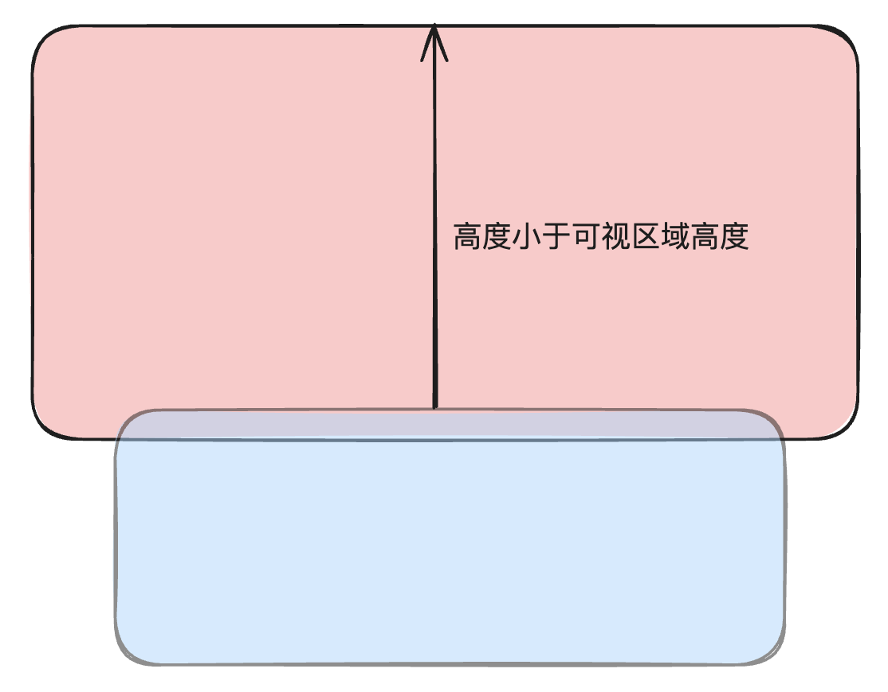
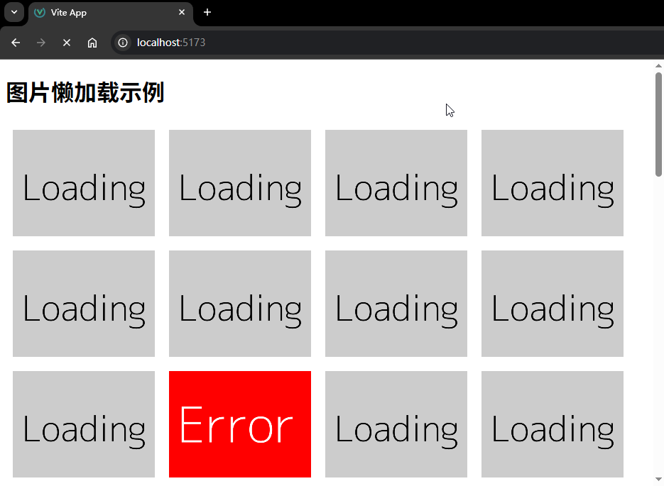
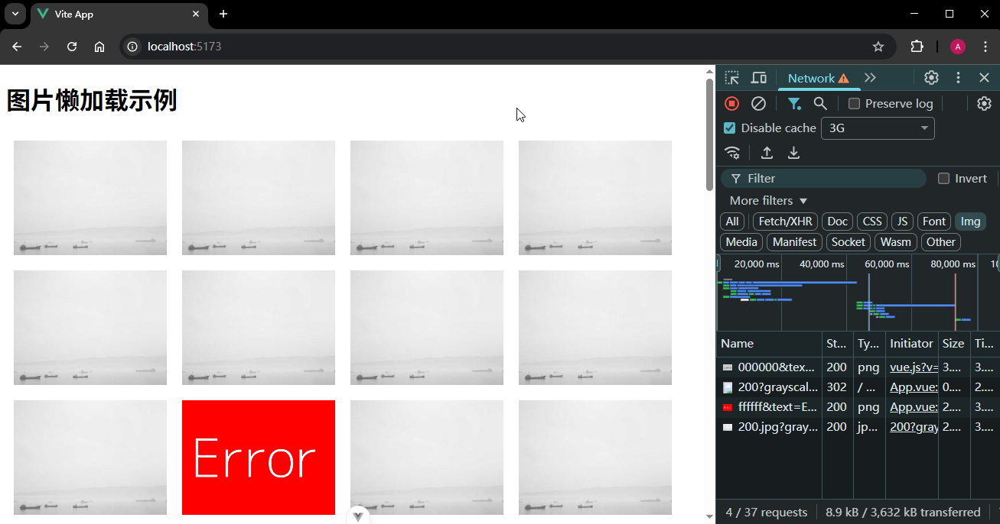
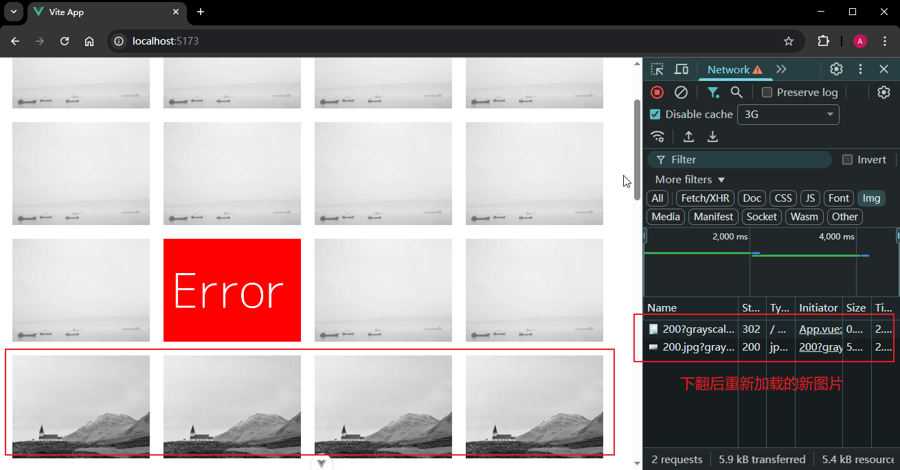

# P4S25L79：Vue3 应用场景之：懒加载

---


> [!tip]
>
> **内容提要**
>
> 本节介绍了一个新的浏览器 `API` —— `IntersectionObserver`，并基于该 `API` 安装了 `Vue3` 的第三方工具包 `vue3-observe-visibility` 实现图片懒加载，最后通过一个练手项目巩固所学。


## 1 检查元素可见性

`IntersectionObserver` 是一个 **现代浏览器 API**，用于检测一个元素（或其子元素）相对于视口或某个祖先元素的可见性变化。

### 1.1 基本用法

```js
const ob = new IntersectionObserver(callback, options);
```

1. `callback`：**当被观察元素的可见性变化时调用的回调函数**，`callback` **一开始会触发一次，确认当前的可视状态**（无论当前是可见还是不可见）；之后在每次可视状态发生改变时会触发。回调函数里按先后顺序接收如下两个参数：
   - `entries`：这是一个数组，包含所有被观察元素的 `IntersectionObserverEntry` 对象，每个对象又包含以下属性：
     - `boundingClientRect`：被观察元素的矩形区域信息。
     - `intersectionRatio`：被观察元素的可见部分与整个元素的比例。
     - `intersectionRect`：可见部分的矩形区域信息。
     - `isIntersecting`：布尔值，表示元素是否与根元素相交。
     - `rootBounds`：根元素的矩形区域信息。
     - `target`：被观察的目标元素。
     - `time`：触发回调的时间戳。
   - `observer`：`IntersectionObserver` 实例本身。

2. `options`：配置对象，用于 **定制观察行为**——
   - `root`：指定用作视口的元素。默认值为 null，表示使用浏览器视口作为根元素。

   - `rootMargin`：类似于 `CSS` 的 `margin` 属性，**定义根元素的外边距**，用于扩展或缩小根元素的判定区域。可以用像素或百分比表示，例如 `'10px'` 或 `'10%'`。
   - `threshold`：是一个 `0～1` 之间的值，用于设置被观察元素进入到根元素的百分比，表示一个触发的阈值——
     - 如果是 `0`，只要目标元素一碰到 `root` 元素就会触发；
     - 如果是 `1`，表示目标元素完全进入 `root` 元素范围，才会触发。

有了 `observer` 实例对象后，要观察哪个元素，直接通过 `observe()` 方法来进行观察即可，取消观察通过 `unobserve` 方法：

```js
// 开始观察
ob.observe(elementA);
ob.observe(elementB);

// 停止观察
ob.unobserve(element);
```


## 2 懒加载

懒加载的含义：当（图片）出现的时候再加载。

核心原理：`img` 元素在 `src` 属性有值时，才会请求对应的图片地址，于是可以先给图片一张默认的占位图：

```html

```

再设置一个自定义属性 `data-src`，对应的值为真实的图片地址：

```html

```

之后 **判断该 img 元素有没有进入可视区域**：如果进入了，就把 `data-src` 的值赋给 `src`，让真实的图片显示出来。这就是图片懒加载的基本原理。


### 2.1 判定进入可视范围的两种方案

对于判断 `img` 元素有没有进入可视区域，有着新旧两套方案。

:one: 旧方案

早期的方案是 **监听页面的滚动**：

```js
window.addEventListener("scroll", callback)
```

当 `img` 标签的顶部到可视区域顶部的距离，小于可视区域高度的时候，我们就认为图片进入了可视区域，画张图表示：



示例代码：

```js
window.addEventListener("scroll", () => {
  const img = document.querySelectorAll('img')
  img.forEach(img => {
    const rect = img.getBoundingClientRect();
    if (rect.top < document.body.clientHeight) {
      // 当前这张图片进入到可视区域
      // 则替换 src 的值
      img.src = img.dataset.src
    }
  })
})
```

:two: 新方案

利用 `IntersectionObserver` 来实现：

```js
let observer = new IntersectionObserver(
  (entries, observer) => {
    for(const entry of entries){
      if(entry.isIntersection){
        // 进入此分支，说明当前的图片和根元素产生了交叉
        const img = entry.target;
        img.src = img.dataset.src;
        observer.unobserve(img);
      }
    }
  },
  {
    root: null,
    rootMargin: "0px 0px 0px 0px",
    threshold: 0.5
  }
);
// 先拿到所有的图片元素
const imgs = document.querySelectorAll("img");
imgs.forEach((img) => {
  //观察所有的图片元素
  observer.observe(img);
});
```


## 3 基于 IntersectionObserver API 的 Vue3 工具库

官方文档：

- `NPM`：https://www.npmjs.com/package/vue3-observe-visibility
- `GitHub`：https://github.com/ManukMinasyan/vue3-observe-visibility

:one: 安装 `NPM` 包：

```bash
npm install --save vue3-observe-visibility
```

:two: 注册为 `Vue` 指令：

```js
import { createApp } from 'vue';
import App from './App.vue';
// 引入该第三方库
import { ObserveVisibility } from 'vue3-observe-visibility';

const app = createApp(App);

// 将其注册成为一个全局的指令 v-observe-visibility
app.directive('observe-visibility', ObserveVisibility);

app.mount('#app');
```

:three: 在组件模板中使用指令：

```vue
<template>
  <div>
    <h1>Vue Observe Visibility Example</h1>
    <div
      v-observe-visibility="{
        callback: visibilityChanged,
        intersection: {
          root: null,
          rootMargin: '0px',
          threshold: 0.5
        }
      }"
      class="observed-element"
    >
      观察这个元素的可见性
    </div>
  </div>
</template>

<script setup>
function visibilityChanged(isVisible) {
  console.log('元素可见性变化:', isVisible)
}
</script>

<style scoped>
.observed-element {
  height: 200px;
  margin-top: 1000px;
  background-color: lightcoral;
}
</style>
```


## 4 实战演练：基于 vue3-observe-visibility 实现图片懒加载

核心逻辑：

```vue
<template>
  <div>
    <h1>图片懒加载示例</h1>
    <div class="image-grid">
      <!-- 一定要配置 once 配置项 -->
      <!-- 否则会在可视状态发生变化时反复加载 -->
      
    </div>
  </div>
</template>

<script setup>
import { ref } from 'vue'

// 加载图片的 url
const loadingImage = 'https://dummyimage.com/600x400/cccccc/000000&text=Loading'
// 错误图片的 url
const errorImage = 'https://dummyimage.com/600x400/ff0000/ffffff&text=Error'
// 随机图片的 url
const randomImage = 'https://picsum.photos/300/200?grayscale&random=1'
// 生成一些图片URL
const imageUrls = ref([])
// 往 imageUrls 中添加 50 个图片 URL
for (let i = 1; i <= 50; i++) {
  imageUrls.value.push(Math.random() > 0.9 ? errorImage : randomImage)
}

function visibilityChanged(visible, entry) {
  if (visible) {
    const img = entry.target
    img.src = img.dataset.src
  }
}

// 图片加载失败时的处理函数
function handleError(event) {
  const img = event.target
  img.src = errorImage
}
</script>

<style scoped>
.image-grid {
  display: flex;
  flex-wrap: wrap;
}

.image-grid img {
  display: block;
  margin: 10px;
  width: 200px;
  height: 150px;
  object-fit: cover;
}
</style>
```

注意：除了以全局指令导入外，`vue3-observe-visibility` 还能以插件的形式引入：

```js
// 按插件导入
import VueObserveVisibility from "vue3-observe-visibility";
app.use(VueObserveVisibility);

// 按全局指令导入
import { ObserveVisibility } from 'vue3-observe-visibility';
app.directive('observe-visibility', ObserveVisibility);
```

实测效果：

:one: 加载中：



:two: 懒加载后：



:three: 下翻后重新加载新的图片：



