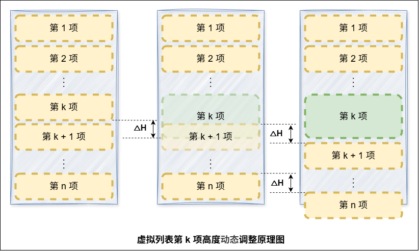
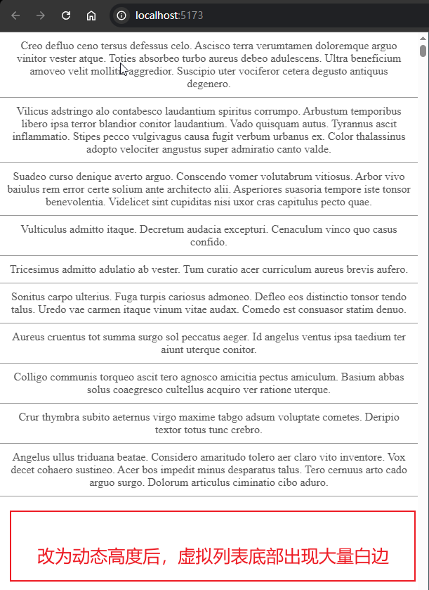
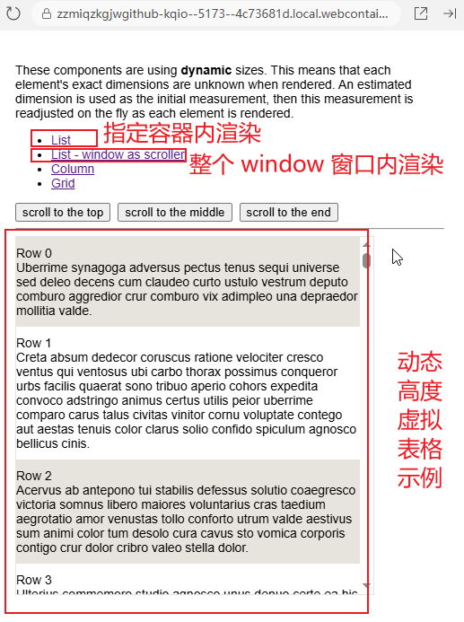
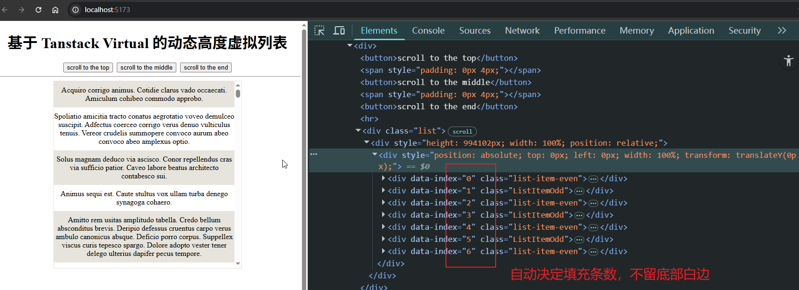

# P4S27L81：Vue3 应用场景之：虚拟列表优化——动态高度

---


> [!tip]
>
> 上节遗留问题：
>
> - 动态高度（:star: 本节重点​）
> - 白屏问题（待下节）
> - 滚动事件触发频率过高（待下节）


## 1 关于动态高度问题

在实际应用中，列表项里可能包含一些可变内容，导致列表项高度并不相同。例如新浪微博：


不固定的高度就会导致所有涉及定宽计算的变量全部失效，包括：

- 列表总高度：`listHeight = listData.length * itemSize`；
- 偏移量的确定：`startOffset = scrollTop - (scrollTop % itemSize)`；
- 数据的起始索引：`startIndex = Math.floor(scrollTop / itemSize)`；

此时面临一系列新问题：

1. 如何获取真实高度？
2. 相关属性该如何计算？
3. 列表渲染的项目有何改变？


## 2 基本原理

解决动态高度问题需要对每一项的高度进行二次修正：



具体地，对于一个总共包含 `n` 项的虚拟列表：

- 当修正完第 `k` 项的高度后，后续各项都要同步修正第 `k` 项的高度差 `δh(k)`；
- 当修正完第 `k + 1` 项的高度后，后续各项都要同步修正第 `k` 项、第 `k + 1` 项的高度差的总和：`δh(k) + δh(k + 1)`；
- ……
- 当修正完第 `n` 项的高度后，由于没有后续列表项，修正过程结束。但在最后一项的修正前，需要累加从第 `k` 项到第 `n - 1` 项的高差的总和 `δh(k) + δh(k + 1) + ... + δh(n - 1) + δh(n)`；

因此可以得到第 `k` 项实际需要调整的高度差的通用形式：

```math
△_k = \sum_{i=1}^{k-1} (H^{act}_i - H^{est}_i)
```

其中——

- $△_k$ 表示第 `k` 项起始位置的修正值；
- $H^{act}_i$ 表示第 `i` 项的真实高度；
- $H^{est}_i$ 表示第 `i` 项预设的估算高度；


## 3 具体实现

1. 如何获取真实高度？
   - 若能获得列表项高度的数组，真实高度问题就迎刃而解了；但在实际渲染前是 **很难获取到每一项的真实高度** 的。因此需要先 **预估一个高度** 来渲染出真实 `DOM`，再根据 `DOM` 的实际情况去修正真实高度。
   - 创建一个 **缓存列表**，其中列表项字段为 **索引**、**高度** 与 **定位信息**，并将 **预估的列表项高度** 用于 **初始化缓存列表**。在渲染后根据 `DOM` 实际情况 **更新缓存列表**。

2. 相关的属性该如何计算？
   - 显然以前的计算方式都无法使用了，因为那都是针对固定值设计的。
   - 于是我们需要 **根据缓存列表重写计算属性、滚动回调函数**，例如列表总高度的计算可以使用缓存列表最后一项的 `bottom` 值。

3. 列表渲染的项目有何改变？
   - 因为用于渲染页面元素的数据是根据 **开始/结束索引** 在 **数据列表** 中筛选出来的，所以只要保证索引的正确计算，那么 **渲染方式是无需变化** 的。
   - 对于开始索引，计算公式改为：在 **缓存列表** 中搜索第一个底部定位大于 **列表垂直偏移量** 的项并返回它的索引
   - 对于结束索引，它是根据开始索引生成的，无需修改。

实测效果（出现底部白边）：




## 4 实测备忘

:one: 由于虚拟列表的可见条数是根据预估高度计算的，实际修正过程中既可能溢出视口，也可能让视口底部留白。这就需要提前准备上下缓存数据（下节详述）。

:two: `VueUse` 未能提供变化高度的虚拟列表实现方案，但推荐了配置项更加丰富的 [`@tanstack/vue-virtual`](https://tanstack.com/virtual/v3/docs/framework/vue/vue-virtual)。`tanstack` 官方给出了动态高度的 [虚拟列表示例](https://tanstack.com/virtual/v3/docs/framework/vue/examples/dynamic)，并且支持横向虚拟列表与纵横双向虚拟列表：



按照官方示例改造的本地版（详见 `code/diy/v2_tanstack_virtual`）：



:three: `Tanstack` 版核心结构：

```html
<div ref="parentRef" class="list">
  <div
    :style="{
      height: `${totalSize}px`,
      width: '100%',
      position: 'relative'
    }"
  >
    <div
      :style="{
        position: 'absolute',
        top: 0,
        left: 0,
        width: '100%',
        transform: `translateY(${virtualRows[0]?.start ?? 0}px)`
      }"
    >
      <div
        v-for="virtualRow in virtualRows"
        :key="virtualRow.key"
        :data-index="virtualRow.index"
        ref="virtualItemEls"
        :class="virtualRow.index % 2 ? 'list-item-odd' : 'list-item-even'"
      >
        <div style="padding: 10px 0">
          <div>{{ sentences[virtualRow.index].value }}</div>
        </div>
      </div>
    </div>
  </div>
</div>
```

解读：共四层——

- 外层容器：确定宽高（`parentRef`）；
- 包裹层1：设定相对定位；
- 包裹层2：设定绝对定位（用 `transform` 控制偏移量）；
- 虚拟列表层：执行 `v-for` 指令（`virtualItemEls`）。

:four: `Tanstack` 版核心 `JS` 逻辑：

```js
const virtualizer = useVirtualizer({
  count: sentences.value.length,
  getScrollElement: () => parentRef.value,
  estimateSize: () => props.estimatedItemSize
})

const virtualRows = computed(() => virtualizer.value.getVirtualItems())
const totalSize = computed(() => virtualizer.value.getTotalSize())

const virtualItemEls = shallowRef([])
function measureAll() {
  virtualizer.value.measureElement(null)
  virtualItemEls.value
    .filter((el) => el)
    .map((el) => virtualizer.value.measureElement(el))
}

onMounted(measureAll)
onUpdated(measureAll)
```

解读：和视频思路一样，也是通过修正预估高度实现，但核心计算已经全部封装，代码量大幅缩减。

每个列表项的高度修正是通过 `useVirtualizer(options)` 返回的 `virtualizer` 实例方法 `virtualizer.value.measureElement(el)` 实现的。

用于渲染的可见列表是通过 `virtualizer.value.getVirtualItems()` 返回的。

可见列表的总高度是通过 `virtualizer.value.getTotalSize()` 确定的。

传入 `useVirtualizer()` 构造函数的配置项极其丰富，详见官方文档：https://tanstack.com/virtual/v3/docs/api/virtualizer。

本例只用到三个必填字段：

- `count`：要虚拟化的列表项总数；
- `getScrollElement`：一个返回虚拟列表可滚动元素（即 `parentRef`）的函数。如果该元素暂不可用，则返回 `null`。
- `estimateSize`：列表项的预估高度。
